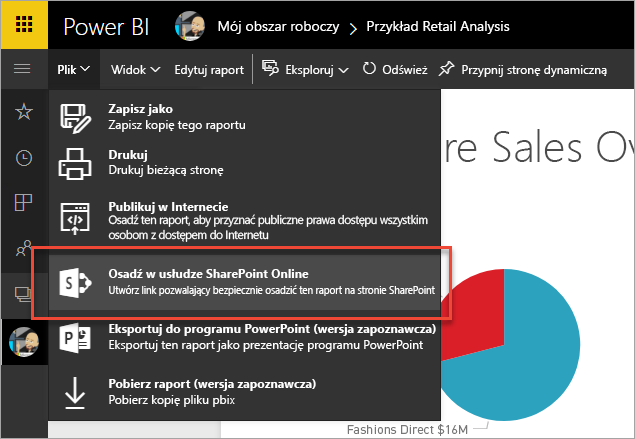
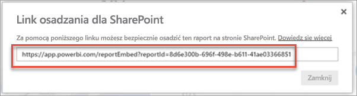
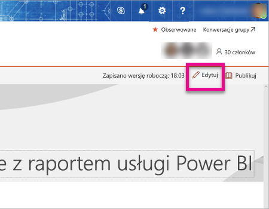
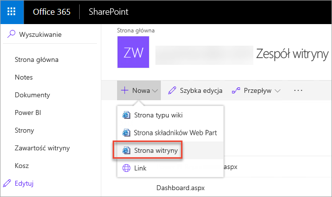
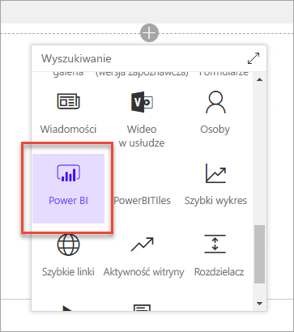
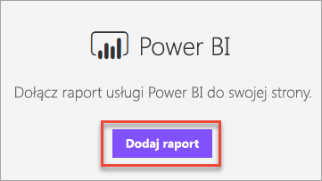
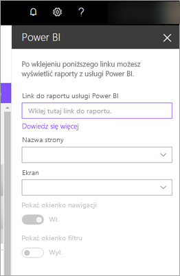
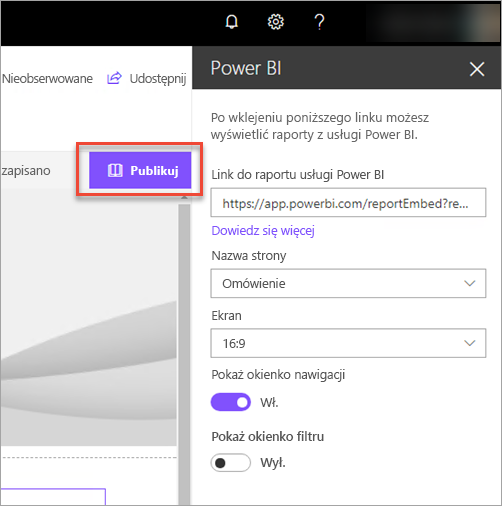
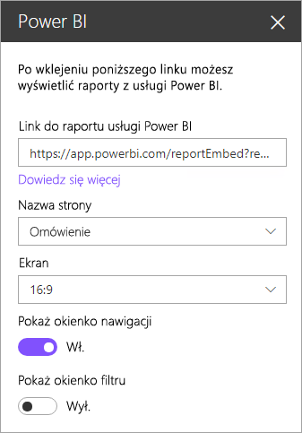
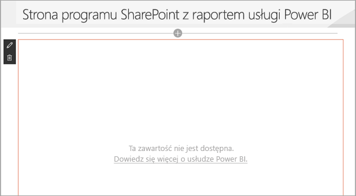

# Osadzanie za pomocą składnika Web Part raportu w usłudze SharePoint Online

Za pomocą nowego składnika Web Part raportu usługi Power BI dla usługi SharePoint Online można łatwo osadzić interaktywne raporty usługi Power BI na stronach usługi SharePoint Online.

W przypadku korzystania z nowej opcji **Osadź w usłudze SharePoint Online** osadzone raporty są całkowicie bezpieczne, dzięki czemu możesz łatwo tworzyć bezpieczne portale wewnętrzne.

## Wymagania

Istnieje kilka wymagań, które muszą zostać spełnione, aby raporty **osadzane w usłudze SharePoint Online** działały.

* Składnik Web Part usługi Power BI dla usługi SharePoint Online wymaga [nowoczesnych stron](https://support.office.com/article/Allow-or-prevent-creation-of-modern-site-pages-by-end-users-c41d9cc8-c5c0-46b4-8b87-ea66abc6e63b).

## Osadzanie raportu

Aby osadzić raport w usłudze SharePoint Online, należy najpierw uzyskać adres URL raportu, a następnie użyć tego adresu URL z nowym składnikiem Web Part usługi Power BI w usłudze SharePoint Online.

### Pobieranie adresu URL do raportu

1. Wyświetl raport w usłudze Power BI.

2. Wybierz element menu **Plik**.

3. Wybierz opcję **Osadź w usłudze SharePoint Online**.
   
    

4. Skopiuj adres URL z okna dialogowego.

    

   > [!NOTE]
   > Możesz również użyć adresu URL, który jest wyświetlany na pasku adresu przeglądarki internetowej podczas wyświetlania raportu. Ten adres URL będzie zawierał aktualnie wyświetlaną stronę raportu. Należy usunąć sekcję raportu z adresu URL, jeśli chcesz użyć innej strony.

### Dodawanie raportu usługi Power BI do strony usługi SharePoint Online

1. Otwórz wymaganą stronę w usłudze SharePoint Online i wybierz pozycję **Edytuj**.

    

    Lub utwórz nową nowoczesną stronę witryny, wybierając przycisk **+ Nowy** w usłudze SharePoint Online.

    

2. Wybierz przycisk **+** i wybierz składnik Web Part **Usługa Power BI**.

    

3. Wybierz przycisk **Dodaj raport**.

    

4. Wklej adres URL raportu w okienku właściwości. Jest to adres URL skopiowany z kroków powyżej. Raport zostanie załadowany automatycznie.

    

5. Wybierz pozycję **Publikuj**, aby zmiana stała się widoczna dla użytkowników usługi SharePoint Online.

    

## Udzielanie dostępu do raportów

Osadzenie raportu w usłudze SharePoint Online nie daje automatycznie użytkownikom uprawnienia do wyświetlania raportu. Uprawnienia do wyświetlania raportu są ustawiane w usłudze Power BI.

> [!IMPORTANT]
> Sprawdź, kto może wyświetlać raport w usłudze Power BI, i udziel dostępu użytkownikom niewymienionym na liście.

Istnieją dwa sposoby zapewnienia dostępu do raportu w usłudze Power BI. Jeśli używasz grupy usługi Office 365 do kompilowania witryny zespołu w usłudze SharePoint Online, uwzględnij użytkownika jako członka obszaru roboczego aplikacji w usłudze Power BI. Daje to pewność, że uwzględnieni użytkownicy będą mogli wyświetlać zawartość tej grupy. Aby uzyskać więcej informacji, zobacz [Tworzenie i rozpowszechnianie aplikacji w usłudze Power BI](service-create-distribute-apps.md).

Ewentualnie możesz udzielić użytkownikom dostępu do raportu, wykonując następujące czynności.

1. Dodaj kafelek z raportu do pulpitu nawigacyjnego.

2. Udostępnij pulpit nawigacyjny użytkownikom, którzy potrzebują dostępu do raportu. Aby uzyskać więcej informacji, zobacz [Udostępnianie pulpitu nawigacyjnego współpracownikom i innym osobom](service-share-dashboards.md).

## Ustawienia składnika Web Part

Poniżej znajduje się opis ustawień, które można dostosować dla składnika Web Part usługi Power BI dla usługi SharePoint Online.

| Właściwość | Opis |
| --- | --- |
| Nazwa strony |Ustawia domyślną stronę wyświetlaną przez składnik Web Part. Wybierz wartość z listy rozwijanej. Jeśli nie są wyświetlane żadne strony, raport ma jedną stronę lub wklejony adres URL zawiera nazwę strony. Usuń sekcję raportu z adresu URL, aby wybrać konkretną stronę. |
| Wyświetlanie |Opcja umożliwiająca dostosowanie dopasowania raportu na stronie usługi SharePoint Online. |
| Pokaż okienko nawigacji |Wyświetla lub ukrywa okienko nawigacji strony. |
| Pokaż okienko filtru |Wyświetla lub ukrywa okienko filtru. |

## Uwierzytelnianie wieloskładnikowe

Jeśli środowisko usługi Power BI wymaga logowania przy użyciu uwierzytelniania wieloskładnikowego, użytkownik może zostać poproszony o zalogowanie się za pomocą urządzenia zabezpieczeń w celu zweryfikowania swojej tożsamości. Będzie to miało miejsce, jeśli użytkownik nie zalogował się do usługi SharePoint Online przy użyciu uwierzytelniania wieloskładnikowego, a środowisko usługi Power BI wymaga konta zweryfikowanego przez urządzenie zabezpieczeń.

> [!NOTE]
> Uwierzytelnianie wieloskładnikowe nie jest jeszcze obsługiwane w usłudze Azure Active Directory 2.0. Użytkownicy będą otrzymywać komunikat informujący o *błędzie*. Jeśli użytkownik zaloguje się ponownie do usługi SharePoint Online przy użyciu swojego urządzenia zabezpieczeń, może być w stanie wyświetlić raport.

## Raporty, które nie są ładowane

Raport nie jest ładowany w składniku Web Part usługi Power BI i wyświetlany jest następujący komunikat:

*This content isn't available* (Ta zawartość nie jest dostępna).

Istnieją dwie typowe przyczyny tego komunikatu:

1. Nie masz dostępu do raportu.
2. Raport został usunięty.

Należy skontaktować się z właścicielem strony usługi SharePoint Online, aby uzyskać pomoc w rozwiązaniu tego problemu.

## Znane problemy i ograniczenia

* **Błąd: „An error occurred, please try logging out and back in and then revisiting this page. Correlation id: undefined, http response status: 400, server error code 10001, message: Missing refresh token”** (Wystąpił błąd. Spróbuj się wylogować i zalogować ponownie, a następnie ponownie odwiedzić tę stronę. Identyfikator korelacji: niezdefiniowany, stan odpowiedzi http: 400, kod błędu serwera: 10001, komunikat: Brak tokenu odświeżania)
  
  Jeśli wyświetlany jest ten błąd, wypróbuj jedną z następujących metod.
  
  1. Wyloguj się z programu SharePoint, a następnie zaloguj się ponownie. Należy zamknąć wszystkie okna przeglądarki przed ponownym zalogowaniem.

  2. Jeśli Twoje konto użytkownika wymaga uwierzytelniania wieloskładnikowego (MFA), musisz zalogować się do programu SharePoint przy użyciu urządzenia z usługą Multi-Factor Authentication (aplikacji na telefon, karty inteligentnej itp.).

* Usługa Power BI nie obsługuje tych samych zlokalizowanych języków co usługa SharePoint Online. W rezultacie w osadzonym raporcie może nie być wyświetlana właściwa lokalizacja.

* Mogą wystąpić problemy w przypadku korzystania z programu Internet Explorer 10. Możesz sprawdzić [obsługę przeglądarek dla usługi Power BI](service-browser-support.md) i [usługi Office 365](https://products.office.com/office-system-requirements#Browsers-section).

## Następne kroki

[Umożliwianie lub uniemożliwianie tworzenia nowoczesnych stron witryny przez użytkowników końcowych](https://support.office.com/article/Allow-or-prevent-creation-of-modern-site-pages-by-end-users-c41d9cc8-c5c0-46b4-8b87-ea66abc6e63b)  
[Tworzenie i rozpowszechnianie aplikacji w usłudze Power BI](service-create-distribute-apps.md)  
[Udostępnianie pulpitu nawigacyjnego współpracownikom i innym osobom](service-share-dashboards.md)  
[Power BI Premium — co to jest?](service-premium.md)  

Masz więcej pytań? [Zadaj pytanie społeczności usługi Power BI](http://community.powerbi.com/) 

