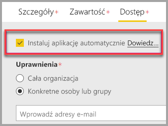

# Osadzanie za pomocą składnika Web Part raportu w usłudze SharePoint Online

Za pomocą nowego składnika Web Part raportu usługi Power BI dla usługi SharePoint Online można łatwo osadzić interaktywne raporty usługi Power BI na stronach usługi SharePoint Online.

W przypadku korzystania z nowej opcji **Osadź w usłudze SharePoint Online** osadzone raporty są całkowicie bezpieczne, dzięki czemu możesz łatwo tworzyć bezpieczne portale wewnętrzne.

## Wymagania

Istnieje kilka wymagań, które muszą zostać spełnione, aby raporty **osadzane w usłudze SharePoint Online** działały.

* Wymagana jest licencja usługi Power BI Pro lub [pojemność usługi Power BI Premium (jednostka SKU EM lub P)](service-premium.md#premium-capacity-nodes) z licencją usługi Power BI.
* Składnik Web Part usługi Power BI dla usługi SharePoint Online wymaga [nowoczesnych stron](https://support.office.com/article/Allow-or-prevent-creation-of-modern-site-pages-by-end-users-c41d9cc8-c5c0-46b4-8b87-ea66abc6e63b).

## Osadzanie raportu

Aby osadzić raport w usłudze SharePoint Online, należy najpierw uzyskać adres URL raportu, a następnie użyć tego adresu URL z nowym składnikiem Web Part usługi Power BI w usłudze SharePoint Online.

### Pobieranie adresu URL do raportu

1. Wyświetl raport w usłudze Power BI.

2. Wybierz element menu **Plik**.

3. Wybierz opcję **Osadź w usłudze SharePoint Online**.

    

4. Skopiuj adres URL z okna dialogowego.

    

### Dodawanie raportu usługi Power BI do strony usługi SharePoint Online

1. Otwórz wymaganą stronę w usłudze SharePoint Online i wybierz pozycję **Edytuj**.

    

    Lub utwórz nową nowoczesną stronę witryny, wybierając przycisk **+ Nowy** w usłudze SharePoint Online.

    

2. Wybierz przycisk **+** i wybierz składnik Web Part **Usługa Power BI**.

    

3. Wybierz przycisk **Dodaj raport**.

    

4. Wklej adres URL raportu w okienku właściwości. Ten adres URL raportu to adres URL skopiowany z kroków powyżej. Raport zostanie załadowany automatycznie.

    

5. Wybierz pozycję **Publikuj**, aby zmiana stała się widoczna dla użytkowników usługi SharePoint Online.

    

## Udzielanie dostępu do raportów

Osadzenie raportu w usłudze SharePoint Online nie daje automatycznie użytkownikom uprawnienia do wyświetlania raportu. Uprawnienia do wyświetlania raportu są ustawiane w usłudze Power BI.

> [!IMPORTANT]
> Sprawdź, kto może wyświetlać raport w usłudze Power BI, i udziel dostępu użytkownikom niewymienionym na liście.

Istnieją dwa sposoby zapewnienia dostępu do raportu w usłudze Power BI. Jeśli używasz grupy usługi Office 365 do tworzenia witryny zespołu w usłudze SharePoint Online, uwzględnij użytkownika jako członka **obszaru roboczego aplikacji w usłudze Power BI** oraz **strony programu SharePoint**. Aby uzyskać więcej informacji, zobacz instrukcje dotyczące [zarządzania obszarem roboczym aplikacji](service-manage-app-workspace-in-power-bi-and-office-365.md).

Alternatywnie możesz bezpośrednio udostępnić raport użytkownikom, osadzając go w aplikacji. Istnieje kilka kroków, które należy wykonać, aby osadzić raport w aplikacji.  

1. Autor aplikacji jest użytkownikiem wersji Pro.

2. Autor tworzy raport w obszarze roboczym aplikacji. *Aby udostępnić raport **użytkownikom bezpłatnej wersji usługi Power BI**, obszar roboczy aplikacji należy ustawić jako **obszar roboczy Premium**.*

3. Autor publikuje aplikację, a następnie ją instaluje. *Autor sekcji musi zainstalować aplikację, aby mieć dostęp do adresu URL raportu używanego do osadzania w usłudze SharePoint Online.*

4. Teraz wszyscy użytkownicy końcowi muszą również zainstalować aplikację. Można ustawić wstępne instalowanie aplikacji dla użytkowników końcowych za pomocą funkcji **Instaluj aplikację automatycznie**. Jest ona włączana w [portalu administracyjnym usługi Power BI](service-admin-portal.md).

   

5. Autor otwiera aplikację i przechodzi do raportu.

6. Autor kopiuje adres URL osadzania raportu z raportu zainstalowanego przez aplikację. *Nie należy używać adresu URL oryginalnego raportu z obszaru roboczego aplikacji.*

7. Utwórz nową witrynę zespołu w usłudze SharePoint Online.

8. Dodaj adres URL raportu skopiowany z kroku 6 do składnika Web Part usługi Power BI.

9. Dodaj wszystkich użytkowników końcowych i/lub grupy, które będą korzystać z danych na stronie usługi SharePoint Online i w utworzonej przez Ciebie aplikacji usługi Power BI.

    > [!NOTE]
    > **Użytkownicy lub grupy muszą mieć dostęp do strony usługi SharePoint Online i raportu w aplikacji Power BI, aby wyświetlać raport na stronie programu SharePoint.**

10. Teraz użytkownik końcowy może przejść do witryny zespołu w usłudze SharePoint Online i przeglądać raporty na stronie.

## Uwierzytelnianie wieloskładnikowe

Jeśli środowisko usługi Power BI wymaga logowania przy użyciu uwierzytelniania wieloskładnikowego, użytkownik może zostać poproszony o zalogowanie się za pomocą urządzenia zabezpieczeń w celu zweryfikowania swojej tożsamości. Ma to miejsce, jeśli użytkownik nie zalogował się do usługi SharePoint Online przy użyciu uwierzytelniania wieloskładnikowego, a środowisko usługi Power BI wymaga konta zweryfikowanego przez urządzenie zabezpieczeń.

> [!NOTE]
> Uwierzytelnianie wieloskładnikowe nie jest jeszcze obsługiwane w usłudze Azure Active Directory 2.0. Użytkownicy otrzymują komunikat informujący o *błędzie*. Jeśli użytkownik zaloguje się ponownie do usługi SharePoint Online przy użyciu swojego urządzenia zabezpieczeń, może być w stanie wyświetlić raport.

## Ustawienia składnika Web Part

Poniżej znajduje się opis ustawień, które można dostosować dla składnika Web Part usługi Power BI dla usługi SharePoint Online.

| Właściwość | Opis |
| --- | --- |
| Nazwa strony |Ustawia domyślną stronę wyświetlaną przez składnik Web Part. Wybierz wartość z listy rozwijanej. Jeśli nie są wyświetlane żadne strony, raport ma jedną stronę lub wklejony adres URL zawiera nazwę strony. Usuń sekcję raportu z adresu URL, aby wybrać konkretną stronę. |
| Wyświetlanie |Opcja umożliwiająca dostosowanie dopasowania raportu na stronie usługi SharePoint Online. |
| Pokaż okienko nawigacji |Wyświetla lub ukrywa okienko nawigacji strony. |
| Pokaż okienko filtru |Wyświetla lub ukrywa okienko filtru. |

## Raporty, które nie są ładowane

Raport nie jest ładowany w składniku Web Part usługi Power BI i wyświetlany jest następujący komunikat:

*This content isn't available* (Ta zawartość nie jest dostępna).

Istnieją dwie typowe przyczyny tego komunikatu:

1. Nie masz dostępu do raportu.
2. Raport został usunięty.

Skontaktuj się z właścicielem strony usługi SharePoint Online, aby uzyskać pomoc w rozwiązaniu tego problemu.

## Licencjonowanie

Użytkownicy wyświetlający raport w programie SharePoint potrzebują **licencji usługi Power BI Pro** lub zawartość musi zostać zapisana w obszarze roboczym w **[pojemności usługi Power BI Premium (jednostka SKU EM lub P)](service-admin-premium-purchase.md)**.

## Znane problemy i ograniczenia

* Błąd: „An error occurred, please try logging out and back in and then revisiting this page. Correlation ID: undefined, http response status: 400, server error code 10001, message: Missing refresh token” (Wystąpił błąd. Spróbuj się wylogować i zalogować ponownie, a następnie ponownie odwiedzić tę stronę. Identyfikator korelacji: niezdefiniowany, stan odpowiedzi http: 400, kod błędu serwera: 10001, komunikat: Brak tokenu odświeżania)
  
  Jeśli zostanie wyświetlony ten błąd, wypróbuj poniższe kroki rozwiązywania problemów.
  
  1. Wyloguj się z programu SharePoint, a następnie zaloguj się ponownie. Należy zamknąć wszystkie okna przeglądarki przed ponownym zalogowaniem.

  2. Jeśli Twoje konto użytkownika wymaga uwierzytelniania wieloskładnikowego, musisz zalogować się do programu SharePoint przy użyciu urządzenia używanego do uwierzytelniania wieloskładnikowego (aplikacji na telefon, karty inteligentnej itp.).
  
  3. Konta gości usługi Azure B2B nie są obsługiwane. Dla użytkowników jest widoczne logo usługi Power BI przedstawiające ładowanie składnika Web Part, ale raport nie jest wyświetlany.

* Usługa Power BI nie obsługuje tych samych zlokalizowanych języków co usługa SharePoint Online. W rezultacie w osadzonym raporcie może nie być wyświetlana właściwa lokalizacja.

* Mogą wystąpić problemy w przypadku korzystania z programu Internet Explorer 10. Możesz sprawdzić [obsługę przeglądarek dla usługi Power BI](consumer/end-user-browsers.md) i [usługi Office 365](https://products.office.com/office-system-requirements#Browsers-section).

* Składnik Web Part usługi Power BI nie jest dostępny w [suwerennych chmurach](https://powerbi.microsoft.com/en-us/clouds/).

* Klasyczny program SharePoint Server nie jest obsługiwany w tym składniku Web Part.

* [Filtry adresów URL](service-url-filters.md) nie są obsługiwane za pomocą składnika Web Part usługi SPO.

## Następne kroki

[Umożliwianie lub uniemożliwianie tworzenia nowoczesnych stron witryny przez użytkowników końcowych](https://support.office.com/article/Allow-or-prevent-creation-of-modern-site-pages-by-end-users-c41d9cc8-c5c0-46b4-8b87-ea66abc6e63b)  
[Tworzenie i rozpowszechnianie aplikacji w usłudze Power BI](service-create-distribute-apps.md)  
[Udostępnianie pulpitu nawigacyjnego współpracownikom i innym osobom](service-share-dashboards.md)  
[Power BI Premium — co to jest?](service-premium.md)  

Masz więcej pytań? [Zadaj pytanie społeczności usługi Power BI](http://community.powerbi.com/)