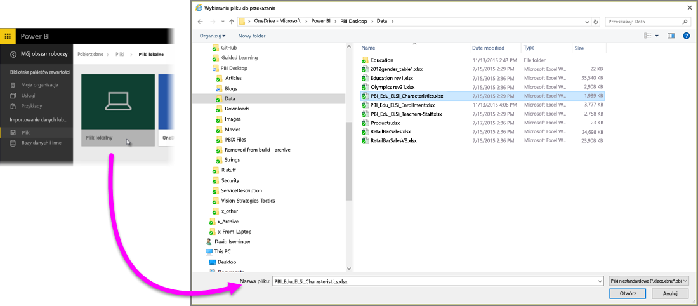
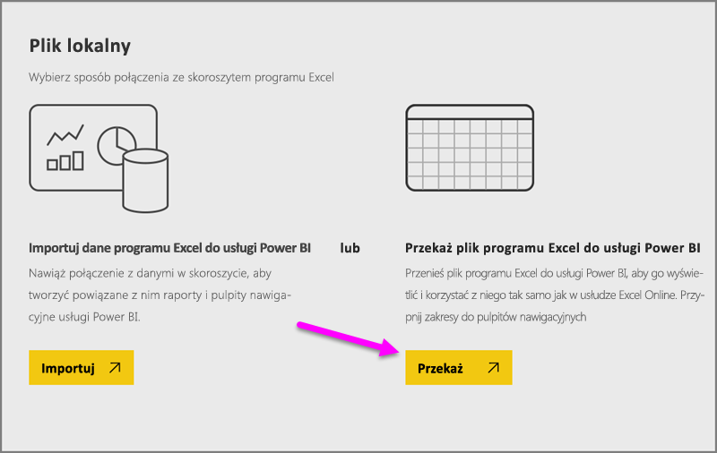
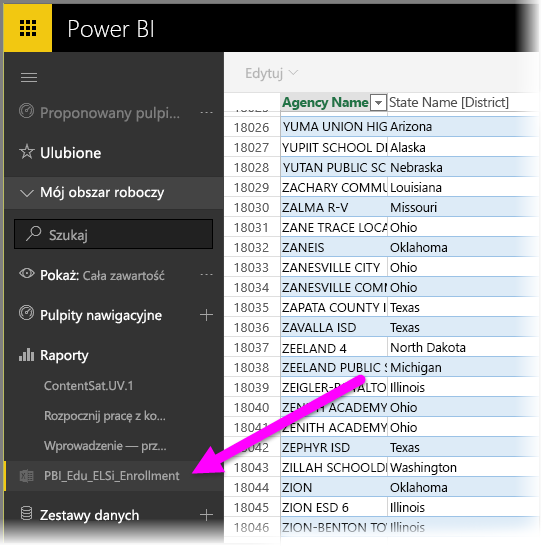

# Pobieranie danych z plików skoroszytów programu Excel

Program Microsoft Excel jest jedną z najczęściej używanych aplikacji biznesowych. Stanowi również jedną z najczęstszych metod pobierania danych do usługi Power BI.

## Jakie rodzaje skoroszytów obsługuje usługa Power BI?
Usługa Power BI obsługuje importowanie i nawiązywanie połączenia ze skoroszytami utworzonymi w programie Excel 2007 i nowszych wersjach. Skoroszyty muszą być zapisane jako pliki xlsx lub xlsm i mogą mieć maksymalny rozmiar 1 GB. Niektóre funkcje opisane w tym artykule są dostępne wyłącznie w nowszych wersjach programu Excel.

### Skoroszyty z zakresami lub tabelami danych
Jeśli skoroszyt zawiera proste arkusze z zakresami danych, należy sformatować te zakresy jako tabele, aby uzyskać najlepsze rezultaty w usłudze Power BI. W ten sposób podczas tworzenia raportów w usłudze Power BI zobaczysz nazwane tabele i kolumny w okienku Pola, co znacznie ułatwia wizualizowanie danych.

### Skoroszyty z modelami danych
Skoroszyty mogą zawierać model danych z co najmniej jedną tabelą danych załadowaną do modelu przy użyciu tabel połączonych, funkcji Power Query (Pobierz i transformuj w programie Excel 2016) lub narzędzia Power Pivot. Usługa Power BI obsługuje wszystkie właściwości modelu danych, np. relacje, miary, hierarchie i kluczowe wskaźniki wydajności.

> [!NOTE]
> Skoroszyty z modelami danych nie mogą być udostępniane w różnych dzierżawach usługi Power BI. Na przykład użytkownik logujący się w usłudze Power BI przy użyciu konta *contoso.com* nie może udostępnić skoroszytu programu Excel użytkownikowi logującemu się w usłudze Power BI przy użyciu konta *woodgrovebank.com*.
> 
> 

### Skoroszyty z połączeniami z zewnętrznymi źródłami danych
Jeśli używasz programu Excel do nawiązywania połączenia z zewnętrznym źródłem danych, po pobraniu skoroszytu do usługi Power BI możesz utworzyć raporty i pulpity nawigacyjne w oparciu o dane pochodzące z tego połączonego źródła danych. Możesz też skonfigurować zaplanowane odświeżanie, aby automatycznie łączyć się bezpośrednio ze źródłem danych i pobierać aktualizacje. Nie musisz już odświeżać ręcznie z poziomu wstążki danych w programie Excel. Wszelkie wizualizacje w raportach i kafelki na pulpitach nawigacyjnych oparte na danych z tego źródła danych będą aktualizowane automatycznie. Aby dowiedzieć się więcej, zobacz [Odświeżanie danych w usłudze Power BI](refresh-data.md).

### Skoroszyty z arkuszami Power View, tabelami PivotTables i wykresami
Sposób wyświetlania (lub brak wyświetlania) arkuszy PowerView, tabel przestawnych oraz wykresów w usłudze Power BI zależy od miejsca zapisu pliku skoroszytu oraz sposobu pobrania go do usługi Power BI. Bardziej szczegółowe informacje przedstawimy poniżej.

## Typy danych
Usługa Power BI obsługuje następujące typy danych: Liczbowy całkowity, Liczbowy dziesiętny, Waluta, Data, Prawda/Fałsz, Tekst. Oznaczenie danych w formie konkretnych typów danych w programie Excel poprawi działanie usługi Power BI.

## Przygotowanie skoroszytu dla usługi Power BI
Obejrzyj ten pomocny film wideo, aby dowiedzieć się więcej o tym, jak upewnić się, że skoroszyty programu Excel są gotowe do obsługi w usłudze Power BI.

<iframe width="500" height="281" src="https://www.youtube.com/embed/l2wy4XgQIu0" frameborder="0" allowfullscreen></iframe>

## Lokalizacja zapisu pliku skoroszytu jest istotna
**Lokalnie** — jeśli zapiszesz plik skoroszytu na dysku lokalnym na komputerze lub w innej lokalizacji w organizacji, będzie można załadować plik do usługi Power BI z jej poziomu. Plik pozostanie na dysku lokalnym, więc tak naprawdę nie jest w całości importowany do usługi Power BI. Właściwie nowy zestaw danych jest tworzony w usłudze Power BI, a dane oraz model danych (jeśli jest zastosowany) ze skoroszytu są ładowane do zestawu danych. Jeśli skoroszyt zawiera jakiekolwiek arkusze Power View, zostaną one wyświetlone w witrynie usługi Power BI w sekcji Raporty. Ponadto program Excel 2016 ma również funkcję **Publikuj** (w menu **Plik**). Użycie funkcji **Publikuj** daje te same efekty co użycie opcji **Pobierz dane > Pliki > Plik lokalny** z poziomu usługi Power BI, ale często łatwiej jest w ten sposób zaktualizować zestaw danych w usłudze Power BI, jeśli regularnie wprowadzasz zmiany w skoroszycie.

**OneDrive — firmowe** — jeśli masz usługę OneDrive dla Firm i zalogujesz się do niej przy użyciu tego samego konta, z którego korzystasz do logowania się w usłudze Power BI, zapewnisz najwydajniejszy sposób na utrzymanie synchronizacji pracy w programie Excel i zestawie danych, raportach oraz pulpitach nawigacyjnych w usłudze Power BI. Ponieważ usługi Power BI i OneDrive działają w chmurze, usługa Power BI *łączy* się z plikiem skoroszytu w usłudze OneDrive mniej więcej co godzinę. W przypadku wykrycia jakichkolwiek zmian zestaw danych, raporty i pulpity nawigacyjne są automatycznie aktualizowane w usłudze Power BI. Podobnie w przypadku zapisania skoroszytu na dysku lokalnym można również użyć funkcji Publikuj, aby natychmiastowo zaktualizować zestaw danych i raporty w usłudze Power BI; w przeciwnym razie usługa Power BI zapewni automatyczną synchronizację, zazwyczaj w ciągu godziny.

**OneDrive — dla osób prywatnych** — w przypadku zapisywania plików skoroszytu na własnym koncie w usłudze OneDrive zapewnisz sobie wiele takich samych korzyści jak w przypadku usługi OneDrive dla Firm. Największa różnica dotyczy pierwszego połączenia z plikiem (przy użyciu opcji Pobierz dane > Pliki > OneDrive — dla osób prywatnych), ponieważ trzeba zalogować się do usługi OneDrive przy użyciu konta Microsoft, które zazwyczaj różni się od konta używanego do logowania w usłudze Power BI. Podczas logowania do usługi OneDrive przy użyciu konta Microsoft należy wybrać opcję Nie wylogowuj mnie. Dzięki temu usługa Power BI będzie w stanie nawiązać połączenie z plikiem skoroszytu co godzinę i zapewnić synchronizację zestawu danych oraz raportów w usłudze Power BI.

**Witryny zespołu programu SharePoint** — zapisywanie plików programu Power BI Desktop w witrynach zespołu programu SharePoint jest bardzo podobne do zapisywania plików w usłudze OneDrive dla Firm. Największa różnica polega na sposobie nawiązywania połączenia z plikiem z poziomu usługi Power BI. Możesz określić adres URL lub połączyć się z folderem głównym.

## Jeden skoroszyt programu Excel — dwa sposoby użycia
Jeśli zapiszesz pliki skoroszytu w usłudze **OneDrive**, możesz eksplorować dane w usłudze Power BI na kilka sposobów

### Importowanie danych programu Excel do usługi Power BI
Po wybraniu opcji **Importuj** wszelkie obsługiwane dane w tabelach i/lub model danych są importowane do nowego zestawu danych w usłudze Power BI. Wszelkie arkusze Power View zostaną utworzone na nowo w usłudze Power BI jako raporty.

Możesz kontynuować edytowanie skoroszytu. Po zapisaniu zmian zostaną one zsynchronizowane z zestawem danych w usłudze Power BI, zwykle w ciągu około godziny. Jeśli potrzebujesz więcej natychmiastowej gratyfikacji, wystarczy, że klikniesz pozycję Publikuj ponownie, a zmiany zostaną od razu wyeksportowane. Wszystkie wizualizacje znajdujące się w raportach i na pulpitach nawigacyjnych również zostaną zaktualizowane.

Wybierz tę opcję, jeśli używana była opcja Pobierz i przekształć dane lub dodatek Power Pivot w celu przekazywania danych do modelu danych lub jeśli w skoroszycie znajdują się arkusze Power View z wizualizacjami, które mają być wyświetlane w usłudze Power BI.

W programie Excel 2016 możesz też użyć opcji Publikuj > Eksportuj. Jest to praktycznie ta sama funkcja. Aby dowiedzieć się więcej, zobacz [Publikowanie w usłudze Power BI z programu Excel 2016](service-publish-from-excel.md).

### Łączenie z programem Excel, zarządzanie nim i wyświetlanie go w usłudze Power BI
Po wybraniu pozycji **Połącz** skoroszyt pojawi się w usłudze Power BI, podobnie jak w programie Excel Online. Jednak, w przeciwieństwie do programu Excel Online, będziesz mieć dostęp do pewnych doskonałych funkcji ułatwiających przypinanie elementów z arkuszy bezpośrednio do pulpitów nawigacyjnych.

W usłudze Power BI nie możesz edytować swojego skoroszytu. Niemniej jeśli musisz wprowadzić zmiany, możesz kliknąć pozycję Edytuj, a następnie wprowadzić zmiany do swojego skoroszytu w aplikacji Excel Online lub otworzyć go w programie Excel na komputerze. Wszelkie wprowadzone zmiany są zapisywane w skoroszycie w usłudze OneDrive.

W przypadku tej metody w usłudze Power BI nie zostanie utworzony zestaw danych. Skoroszyt pojawi się w okienku nawigacji obszaru roboczego usługi Power BI w sekcji Raporty. Połączone skoroszyty mają specjalną ikonę programu Excel.

Wybierz tę opcję, jeśli w arkuszach masz tylko dane lub masz zakresy, tabele przestawne i wykresy, które chcesz przypiąć do pulpitów nawigacyjnych.

W programie Excel 2016 możesz też użyć opcji Publikuj > Przekaż. Jest to praktycznie ta sama funkcja. Aby dowiedzieć się więcej, zobacz [Publikowanie w usłudze Power BI z programu Excel 2016](service-publish-from-excel.md).

## Importowanie skoroszytu programu Excel lub nawiązywanie z nim połączenia z poziomu usługi Power BI
1. W usłudze Power BI w okienku nawigacji kliknij polecenie **Pobierz dane**.
   
   
2. W sekcji Pliki kliknij polecenie **Pobierz**.
   
   
3. Znajdź plik.
   
   
4. Jeśli plik skoroszytu znajduje się w usłudze OneDrive lub witrynach zespołu programu SharePoint, wybierz opcję **Importuj** lub **Połącz**.

## Lokalne skoroszyty programu Excel
Możesz też użyć lokalnego pliku programu Excel i przekazać go do usługi Power BI. Po prostu wybierz opcję **Plik lokalny** w poprzednim menu, a następnie przejdź do miejsca, w którym zapisano skoroszyty programu Excel.

Po zaznaczeniu wybierz opcję przekazania pliku do usługi Power BI.

Po przekazaniu skoroszytu otrzymasz powiadomienie, że skoroszyt jest gotowy.

Jeśli skoroszyt jest już gotowy, możesz znaleźć go w sekcji **Raporty** w usłudze Power BI.

## Publikowanie z poziomu programu Excel 2016 w witrynie usługi Power BI
Użycie opcji **Publikuj w usłudze Power BI** w programie Excel 2016 zapewnia praktycznie takie same efekty jak opcja **Pobierz dane** w usłudze Power BI w zakresie importowania pliku lub nawiązywania z nim połączenia. Tutaj nie będziemy szczegółowo omawiać tej funkcji, ale w artykule [Publikowanie w usłudze Power BI z programu Excel 2016](service-publish-from-excel.md) znajdziesz więcej informacji.

## Rozwiązywanie problemów
Zbyt duży plik skoroszytu? Sprawdź [Zmniejszanie rozmiaru skoroszytu programu Excel w celu wyświetlenia go w usłudze Power BI](reduce-the-size-of-an-excel-workbook.md).

Obecnie w przypadku wybrania opcji Importuj usługa importuje tylko dane stanowiące część nazwanej tabeli lub modelu danych. W związku z tym, jeśli skoroszyt nie zawiera nazwanych tabel, arkuszy Power View lub modeli danych programu Excel, możesz zobaczyć następujący błąd: **„Nie można znaleźć żadnych danych w skoroszycie programu Excel”**. W [tym artykule](service-admin-troubleshoot-excel-workbook-data.md) wyjaśniono sposób naprawienia skoroszytu i jego ponownego zaimportowania.

## Następne kroki
**Eksploracja danych** — po pobraniu danych i raportów z pliku do usługi Power BI nadszedł czas na ich eksplorowanie. Po prostu kliknij nowy zestaw danych prawym przyciskiem myszy, a następnie kliknij polecenie Eksploruj. Jeśli w kroku 4. podjęto decyzję o połączeniu z plikiem skoroszytu w usłudze OneDrive, skoroszyt zostanie wyświetlony w sekcji Raporty. Po kliknięciu skoroszytu zostanie on otwarty w usłudze Power BI, tak jak w przypadku usługi Excel Online.

**Planowanie odświeżania** — jeśli plik skoroszytu programu Excel łączy się z zewnętrznymi źródłami danych lub został zaimportowany z dysku lokalnego, możesz skonfigurować zaplanowane odświeżanie, aby upewnić się, że zestaw danych lub raport zawsze będzie aktualny. W większości przypadków skonfigurowanie zaplanowanego odświeżania jest całkiem proste, ale szczegółowe informacje wykraczają poza zakres tego artykułu. Aby dowiedzieć się więcej, zobacz [Odświeżanie danych w usłudze Power BI](refresh-data.md).

[Publikowanie w usłudze Power BI z programu Excel 2016](service-publish-from-excel.md)

[Power BI Publisher dla programu Excel](publisher-for-excel.md)

[Odświeżanie danych w usłudze Power BI](refresh-data.md)

