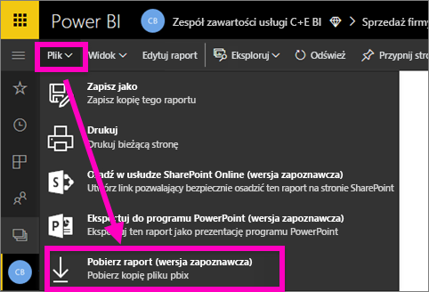
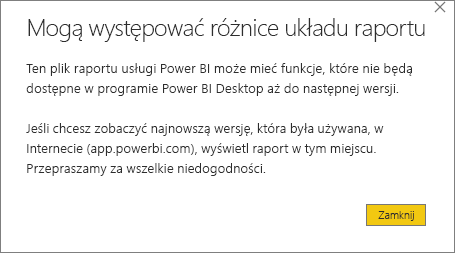
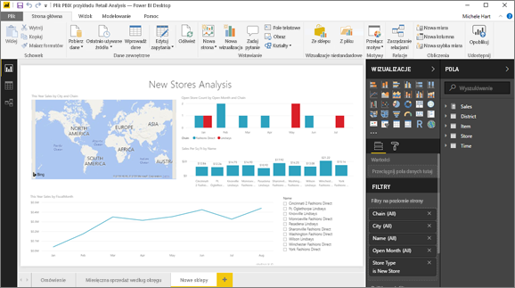

# Eksportowanie raportu z usługi Power BI do wersji Desktop (wersja zapoznawcza)
W programie Power BI Desktop możesz wyeksportować (inaczej mówiąc *pobrać*) raport do usługi Power BI, zapisując raport i wybierając pozycję **Publikuj**. Możesz też wyeksportować w drugim kierunku i pobrać raport z usługi Power BI na pulpit. Rozszerzenie dla plików eksportowanych w dowolnym kierunku to *pbix*.

Istnieje kilka ograniczeń i zagadnień, które należy wziąć pod uwagę i które zostały omówione w dalszej części tego artykułu.

## Pobieranie raportu jako pliku pbix
Aby pobrać plik pbix, wykonaj następujące kroki:

1. W **usłudze Power BI** otwórz raport, który chcesz pobrać, w [widoku do edycji](service-reading-view-and-editing-view.md).
2. Na pasku menu wybierz pozycje **Plik > Pobierz raport**.
   
   > [!NOTE]
   > Raport musiał zostać [utworzony za pomocą programu Power BI Desktop](guided-learning/publishingandsharing.yml#step-2) po 23 listopada 2016 r. — lub zaktualizowany po tej dacie — aby można było pobrać raport. Jeśli nie, opcja menu *Pobierz raport* w usłudze Power BI będzie szara.
   > 
   > 
3. Gdy plik pbix jest tworzony, transparent stanu pokazuje postęp operacji. Gdy plik jest gotowy, zostanie wyświetlone pytanie o to, czy otworzyć, czy też zapisać plik pbix. Nazwa pliku odpowiada tytułowi raportu.
   
    
   
    Masz teraz możliwość otwarcia pliku pbix w usłudze Power BI (app.powerbi.com) albo w programie Power BI Desktop.     
4. Aby natychmiast otworzyć raport na pulpicie, wybierz pozycję **Otwórz**. Aby zapisać plik w określonej lokalizacji, wybierz pozycję **Zapisz > Zapisz jako**. Jeśli jeszcze nie zostało to zrobione, [zainstaluj program Power BI Desktop](desktop-get-the-desktop.md).
   
    Po otwarciu raportu na pulpicie możesz zobaczyć komunikat ostrzegawczy informujący o tym, że niektóre funkcje dostępne w raporcie usługi Power BI mogą nie być dostępne na pulpicie.
   
    

5. Edytor raportów w programie Power BI Desktop wygląda bardzo podobnie do edytora raportów w usłudze Power BI.  
   
    

## Istotne zagadnienia i rozwiązywanie problemów
Istnieje kilka istotnych kwestii i ograniczeń związanych z pobieraniem (eksportowaniem) pliku *pbix* z usługi Power BI.

* Aby pobrać plik, musisz mieć dostęp do edycji do raportu
* Raport musi pochodzić z programu **Power BI Desktop** i zostać *opublikowany* do **usługi Power BI** lub plik pbix musi zostać *przekazany* do usługi.
* Raporty muszą być opublikowane lub zaktualizowane po 23 listopada 2016 r. Raportów opublikowanych przed tą datą nie można pobrać.
* Ta funkcja nie będzie działać z raportami początkowo utworzonymi w **usłudze Power BI** łącznie z pakietami zawartości.
* Podczas otwierania pobranych plików należy zawsze używać najnowszej wersji programu **Power BI Desktop**. Pobrane pliki *pbix* mogą nie zostać otwarte w innej niż bieżąca wersji programu **Power BI Desktop**.
* Jeśli administrator wyłączył możliwość eksportowania danych, ta funkcja nie będzie widoczna w **usłudze Power BI**.

## Następne kroki
Obejrzyj trwający minutę film **Guy in a Cube** na temat tej funkcji:

<iframe width="560" height="315" src="https://www.youtube.com/embed/ymWqU5jiUl0" frameborder="0" allowfullscreen></iframe>

Ponadto poniżej przedstawiono niektóre dodatkowe artykuły, które mogą pomóc Ci w nauce używania **usługi Power BI**:

* [Raporty w usłudze Power BI](service-reports.md)
* [Power BI — podstawowe pojęcia](service-basic-concepts.md)

Po zainstalowaniu programu **Power BI Desktop** następująca zawartość może pomóc Ci szybko zacząć z niego korzystać:

* [Wprowadzenie do programu Power BI Desktop](desktop-getting-started.md)

Masz więcej pytań? [Odwiedź społeczność usługi Power BI](http://community.powerbi.com/)   

