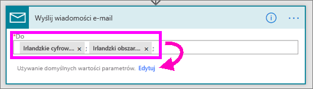

# Microsoft Flow i Power BI

[Microsoft Flow](https://flow.microsoft.com/en-us/documentation/getting-started) to oferta SaaS umożliwiająca automatyzację przepływów pracy między coraz liczniejszymi aplikacjami i usługami SaaS, z których korzystają użytkownicy biznesowi. Usługa Flow umożliwia automatyzowanie zadań dzięki integracji ulubionych aplikacji i usług (w tym usługi Power BI), co pozwala otrzymywać powiadomienia, synchronizować pliki, zbierać dane i wykonywać inne działania. Automatyzacja przepływów pracy ułatwia obsługę powtarzalnych zadań.

[Już dziś zacznij korzystać z usługi Flow.](https://flow.microsoft.com/documentation/getting-started)

Zobacz, jak Sirui tworzy przepływ, który po wyzwoleniu alertu usługi Power BI wysyła do współpracowników szczegółowe informacje w wiadomości e-mail. Następnie postępuj zgodnie ze szczegółowymi instrukcjami poniżej wideo, aby wypróbować to samodzielnie.

<iframe width="560" height="315" src="https://www.youtube.com/embed/YhmNstC39Mw" frameborder="0" allowfullscreen></iframe>

## Tworzenie przepływu wyzwalanego przez alert dotyczący danych w usłudze Power BI

### Wymagania wstępne
Ten samouczek przedstawia tworzenie dwóch różnych przepływów: na podstawie szablonu i od podstaw. Aby kontynuować, [utwórz alert dotyczący danych w usłudze Power BI](service-set-data-alerts.md), utwórz konto usługi Slack i [załóż bezpłatne konto w usłudze Microsoft Flow](https://flow.microsoft.com/en-us/#home-signup).

## Tworzenie przepływu korzystającego z usługi Power BI na podstawie szablonu
W tym zadaniu za pomocą szablonu utworzymy prosty przepływ, który jest wyzwalany przez alert dotyczący danych w usłudze Power BI (powiadomienie).

1. Zaloguj się do usługi Microsoft Flow (flow.microsoft.com).
2. Wybierz pozycję **Moje przepływy**.
   
   
3. Wybierz pozycję **Utwórz z szablonu**.
   
    
4. Znajdź szablony usługi Power BI przy użyciu pola wyszukiwania i wybierz pozycję **Wyślij wiadomość e-mail do wybranych odbiorców po wyzwoleniu alertu danych dotyczących danych usługi Power BI > Kontynuuj**.
   
    

### Tworzenie przepływu
Ten szablon zawiera jeden wyzwalacz (alert usługi Power BI dotyczący danych o nowych medalach olimpijskich zdobytych przez Irlandię) i jedną akcję (wysłanie wiadomości e-mail). Po wybraniu pola usługa Flow wyświetla zawartość dynamiczną, która można dodać.  W tym przykładzie dołączymy wartość i adres URL kafelka do treści wiadomości.

1. Z listy rozwijanej wyzwalacza wybierz alert dotyczący danych w usłudze Power BI. Wybierz pozycję **New medal for Ireland**. Aby dowiedzieć się, jak utworzyć alert, zobacz [Alerty dotyczące danych w usłudze Power BI](service-set-data-alerts.md).
   
   
2. Wprowadź co najmniej jeden prawidłowy adres e-mail, a następnie wybierz opcję **Edytuj** (pokazana poniżej) lub **Dodaj zawartość dynamiczną**. 
   
   

3. Przepływ tworzy tytuł i komunikat, który można zachować lub zmodyfikować. Wszystkie wartości ustawione podczas tworzenia alertu w usłudze Power BI są dostępne do użycia — po prostu umieść kursor w miejscu, a następnie wybierz w obszarze wyróżnionym na szaro. 

   

1.  Na przykład, jeśli utworzono tytuł alertu w usłudze Power BI o treści **Zdobyliśmy kolejny medal**, można wybrać opcję **Tytuł alertu**, aby ten tekst dodać do pola Temat wiadomości e-mail.

    

    Możesz zaakceptować domyślną treść wiadomości e-mail lub utworzyć własną. Powyższy przykład obejmuje kilka zmian wiadomości.

1. Gdy wszystko będzie gotowe, wybierz pozycję **Utwórz przepływ** lub **Zapisz przepływ**.  Przepływ zostanie utworzony i oceniony.  Usługa Flow poinformuje Cię w przypadku znalezienia błędów.
2. Jeśli pojawią się błędy, wybierz pozycję **Edytuj przepływ**, aby rozwiązać problemy. W przeciwnym razie wybierz pozycję **Gotowe**, aby uruchomić nowy przepływ.
   
   
5. Po wyzwoleniu alertu dotyczącego danych wiadomości e-mail zostaną wysłane na wskazane przez Ciebie adresy.  
   
   

## Tworzenie przepływu korzystającego z usługi Power BI od podstaw (pustego)
W tym zadaniu utworzymy od podstaw prosty przepływ, który jest wyzwalany przez alert dotyczący danych w usłudze Power BI (powiadomienie).

1. Zaloguj się do usługi Microsoft Flow.
2. Wybierz pozycję **Moje przepływy** > **Utwórz z pustego**.
   
   
3. Znajdź wyzwalacz usługi Power BI przy użyciu pola wyszukiwania i wybierz pozycję **Power BI - when a data driven alert is triggered** (Power BI — gdy alert sterowany danymi jest wyzwalany).

### Tworzenie przepływu
1. Z listy rozwijanej wybierz nazwę alertu.  Aby dowiedzieć się, jak utworzyć alert, zobacz [Alerty dotyczące danych w usłudze Power BI](service-set-data-alerts.md).
   
    
2. Wybierz pozycję **Nowy krok** > **Dodaj akcję**.
   
   
3. Poszukaj pozycji **Outlook** i wybierz pozycję **Utwórz zdarzenie**.
   
   
4. Wypełnij pola zdarzenia. Po wybraniu pola usługa Flow wyświetla zawartość dynamiczną, która można dodać.
   
   
5. Gdy skończysz, wybierz pozycję **Utwórz przepływ**.  Usługa Flow zapisze i oceni przepływ. Jeśli nie ma żadnych błędów, wybierz pozycję **Gotowe**, aby uruchomić przepływ.  Nowy przepływ zostanie dodany do strony **Moje przepływy**.
   
   
6. Po wyzwoleniu przepływu przez alert dotyczący danych w usłudze Power BI w programie Outlook otrzymasz powiadomienie o zdarzeniu, które wygląda mniej więcej tak.
   
    

## Następne kroki
* [Rozpoczynanie pracy z usługą Microsoft Flow](https://flow.microsoft.com/en-us/documentation/getting-started/)
* [Ustawianie alertów dotyczących danych w usłudze Power BI](service-set-data-alerts.md)
* [Ustawianie alertów dotyczących danych na telefonie iPhone](consumer/mobile/mobile-set-data-alerts-in-the-mobile-apps.md)
* [Ustawianie alertów dotyczących danych w aplikacji Power BI dla urządzeń przenośnych w systemie Windows 10](consumer/mobile/mobile-set-data-alerts-in-the-mobile-apps.md)
* Masz więcej pytań? [Odwiedź społeczność usługi Power BI](http://community.powerbi.com/)

