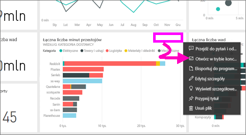
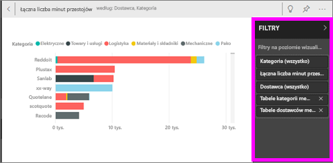
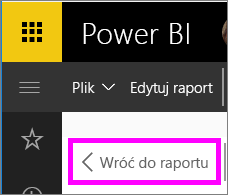

# Wyświetlanie kafelka pulpitu nawigacyjnego lub wizualizacji raportu w trybie koncentracji uwagi

<iframe width="560" height="315" src="https://www.youtube.com/embed/dtdLul6otYE" frameborder="0" allowfullscreen></iframe>

## Co to jest tryb koncentracji uwagi?

Tryb ***koncentracji uwagi*** umożliwia rozwijanie (otwieranie w okienku wyskakującym) zawartości w celu wyświetlenia większej liczby szczegółów.  W trybie koncentracji uwagi można wyświetlać i modyfikować filtry, które zostały zastosowane podczas tworzenia danej wizualizacji.  W usłudze Power BI można użyć trybu koncentracji uwagi w obrębie kafelka pulpitu nawigacyjnego lub wizualizacji raportu. W programie Power BI Desktop można użyć trybu koncentracji uwagi w obrębie [wizualizacji raportu](desktop-report-view.md).

> [!NOTE]
> Tryb koncentracji uwagi różni się od [trybu pełnoekranowego](service-fullscreen-mode.md).
> 

## Tryb koncentracji uwagi dla kafelków pulpitu nawigacyjnego

1. Zatrzymaj wskaźnik myszy nad wizualizacją kafelka, wybierz wielokropek (...) i wybierz pozycję **Otwórz w trybie koncentracji uwagi**. 

    .

2. Spowoduje to otwarcie kafelka, który wypełni całą kanwę raportu. 

   

3. Rozwiń okienko Filtry, aby zobaczyć wszystkie filtry zastosowane do danej wizualizacji.
   
   

4. Możesz bardziej szczegółowo badać dane, modyfikując filtry i, jeśli odkryjesz coś interesującego, przypiąć wizualizację do pulpitu nawigacyjnego.

5. Aby opuścić tryb koncentracji uwagi i wrócić do pulpitu nawigacyjnego, wybierz pozycję **< Wyjdź z trybu koncentracji uwagi** (w lewym górnym rogu wizualizacji).
   
        

## Tryb koncentracji uwagi dla wizualizacji raportu

1. Zatrzymaj wskaźnik myszy na wizualizacji raportu i wybierz ikonę **trybu koncentracji uwagi** .  
   
   
2. Spowoduje to otwarcie wizualizacji i wypełnienie nią całej kanwy. 

   
3. Rozwiń okienko Filtry, aby zobaczyć wszystkie filtry zastosowane do danej wizualizacji.
   
   
4. Możesz bardziej szczegółowo badać dane, modyfikując filtry i, jeśli odkryjesz coś interesującego, przypiąć wizualizację do pulpitu nawigacyjnego.   
5. Aby opuścić tryb koncentracji uwagi i wrócić do raportu, wybierz pozycję **Powrót do raportu** (w lewym górnym rogu wizualizacji). 
   
      

## Przechodzenie z trybu koncentracji uwagi do trybu pełnoekranowego
Gdy kafelek lub wizualizacja są otwarte w trybie koncentracji uwagi, można je [wyświetlić w trybie pełnoekranowym (tryb TV).](service-fullscreen-mode.md) W trybie pełnoekranowym zawartość jest wyświetlana bez rozpraszających menu i przycisków nawigacji.

## Istotne zagadnienia i rozwiązywanie problemów
* Podczas korzystania z trybu koncentracji uwagi dla wizualizacji w raporcie możesz wyświetlać i modyfikować wszystkie filtry: na poziomie wizualizacji, na poziomie strony, przeglądania szczegółowego i na poziomie raportu.    
* Podczas korzystania z trybu koncentracji uwagi dla wizualizacji na pulpicie nawigacyjnym możesz wyświetlać i modyfikować jedynie filtry na poziomie wizualizacji.

Masz więcej pytań? [Odwiedź społeczność usługi Power BI](http://community.powerbi.com/)

