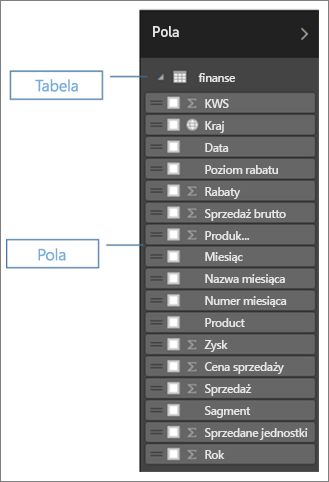

# Błyskawiczne doskonałe raporty na podstawie skoroszytów programu Excel
Twój kierownik chce zobaczyć raport o najnowszych wynikach sprzedaży połączony z wrażeniami z ostatniej kampanii do końca dnia. Ale najnowsze dane znajdują się w różnych systemach innych firm i w plikach na Twoim laptopie. W przeszłości trzeba było poświęcić godziny na tworzenie elementów wizualnych i formatowanie raportu. Zaczynasz się niepokoić.

Bez obaw. Usługa Power BI pozwala od ręki utworzyć doskonały raport.

W tym przykładzie przekażemy plik programu Excel z systemu lokalnego, utworzymy nowy raport i udostępnimy go współpracownikom — wszystko z poziomu usługi Power BI.

## Przygotowywanie danych
Jako przykład weźmy prosty plik programu Excel. Przed załadowaniem pliku programu Excel do usługi Power BI musisz uporządkować dane w postaci płaskiej tabeli. Oznacza to, że każda kolumna zawiera ten sam typ danych — na przykład tekst, datę, liczbę lub walutę. Musisz mieć wiersz nagłówka, ale nie powinno być żadnej kolumny ani wiersza, które zawierają sumy.

Następnie sformatuj swoje dane jako tabelę. W programie Excel na karcie Narzędzia główne w grupie Style wybierz pozycję **Formatuj jako tabelę**. Wybierz styl tabeli, który ma być zastosowany do arkusza. Arkuszu programu Excel jest teraz gotowy do załadowania do usługi Power BI.

## Przekazywanie pliku programu Excel do usługi Power BI
Usługa Power BI łączy wiele źródeł danych, w tym pliki programu Excel znajdujące się na Twoim komputerze. Aby rozpocząć, zaloguj się do usługi Power BI. Jeżeli jeszcze nie została przeprowadzona rejestracja, [możesz to zrobić za darmo](https://powerbi.com).

Chcesz utworzyć nowy pulpit nawigacyjny. Otwórz pozycję **Mój obszar roboczy** i wybierz ikonę **+ Utwórz**.

Wybierz pozycję **Pulpit nawigacyjny**, wprowadź nazwę i wybierz pozycję **Utwórz**. Zostanie wyświetlony nowy pulpit nawigacyjny — bez danych.

Wybierz pozycję **Pobierz dane** w dolnej części okienka nawigacji po lewej stronie. Na stronie Pobierz dane w obszarze Import lub Połącz z danymi w polu Pliki wybierz **Pobierz**.

Na stronie Pliki wybierz **plik lokalny**. Przejdź do pliku skoroszytu programu Excel na swoim komputerze i zaznacz go do załadowania do usługi Power BI. Wybierz pozycję **Import**.

> **UWAGA**: Aby skorzystać z pozostałej części tego samouczka, należy użyć [Przykładowego skoroszytu finansowego](sample-financial-download.md).
> 
> 

## Tworzenie raportu
Gdy usługa Power BI zaimportuje plik programu Excel, zacznij tworzyć raport. Gdy pojawi się komunikat **Zestaw danych jest gotowy**, wybierz pozycję **Widok zestawu danych**.  Usługa Power BI otworzy się w widoku do edycji i wyświetl kanwę raportu. Po prawej stronie znajdują się okienka Wizualizacje, Filtry i Pola.

Należy zauważyć, że Twoje dane tabeli skoroszytu programu Excel zostaną wyświetlone w okienku Pola. W obszarze nazwy tabeli usługa Power BI wyświetla nagłówki kolumn jako oddzielne pola.

Teraz możesz rozpocząć tworzenie wizualizacji. Twój kierownik chce zobaczyć zysk w funkcji czasu. W okienku Pola przeciągnij pozycję **Zysk** na kanwę raportu. Domyślnie usługa Power BI wyświetla wykres słupkowy. Następnie przeciągnij pozycję **Data** na kanwę raportu. Usługa Power BI aktualizuje wykres słupkowy, aby pokazać zysk według daty.

> **PORADA**: Jeśli wykres nie wygląda jak oczekiwano, sprawdź swoje agregacje. Na przykład w źródle **Wartość** kliknij prawym przyciskiem myszy właśnie dodane pole i upewnij się, że dane są agregowane w należyty sposób.  W tym przykładzie używamy pozycji **Suma**.
> 
> 

Twój kierownik chce wiedzieć, które kraje są najbardziej dochodowe. Zrób na nim wrażenie wizualizacją mapy. Wybierz pusty obszar na kanwie, a następnie z okienka Pola przeciągnij pola **Kraj**, a następnie **Zysk**. Usługa Power BI tworzy element wizualny mapy z dymkami reprezentującymi względny zysk w każdej lokalizacji.

A co z wyświetlaniem elementu wizualnego pokazującego sprzedaż według produktu i segmentu rynku? Łatwe. W okienku Pola zaznacz pola wyboru obok pól Sprzedaż, Produkt i Segment. Usługa Power BI natychmiast utworzy wykres słupkowy. Zmień typ wykresu, wybierając jedną z ikon w menu Wizualizacje. Na przykład zmień go na skumulowany wykres słupkowy.  Aby posortować wykres, wybierz wielokropek (...) > **Sortuj według**.

Przypnij wszystkie swoje elementy wizualne do pulpitu nawigacyjnego. Możesz już udostępnić go współpracownikom.

## Udostępnianie pulpitu nawigacyjnego
Chcesz udostępnić pulpit nawigacyjny swojej kierowniczce Pauli. Możesz udostępnić pulpit nawigacyjny i źródłowy raport wszelkim współpracownikom, którzy mają konto usługi Power BI. Mogą oni wchodzić w interakcje z Twoim raportem, ale nie mogą zapisać zmian.

Aby udostępnić raport, w górnej części pulpitu nawigacyjnego wybierz pozycję **Udostępnij**.

Usługa Power BI wyświetli stronę Udostępnianie pulpitu nawigacyjnego. W górnym obszarze wprowadź adresy e-mail adresatów. Dodaj komunikat w polu poniżej. Aby umożliwić odbiorcom udostępnianie Twojego pulpitu nawigacyjnego innym osobom, wybierz pozycję **Zezwalaj adresatom na udostępnianie pulpitu nawigacyjnego**. Wybierz pozycję **Udostępnij**.

Następne kroki

* [Wprowadzenie do usługi Power BI](service-get-started.md)
* [Wprowadzenie do programu Power BI Desktop](desktop-getting-started.md)
* [Power BI — podstawowe pojęcia](service-basic-concepts.md)
* Masz więcej pytań? [Odwiedź społeczność usługi Power BI](http://community.powerbi.com/)

