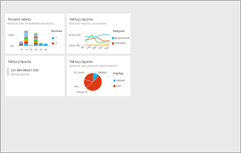
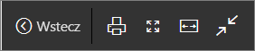
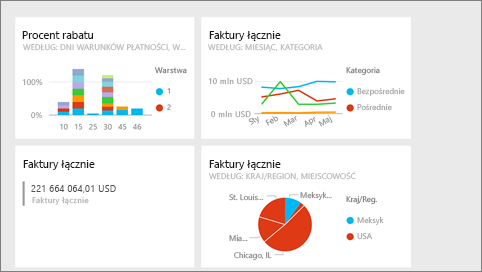
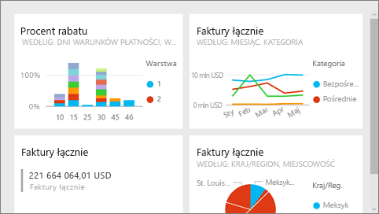
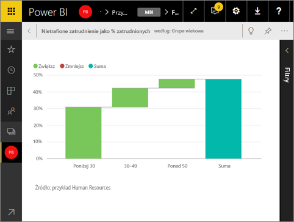

# Tryb pełnoekranowy w usłudze Power BI
## Co to jest tryb pełnoekranowy?

Wyświetlaj swoją zawartość usługi Power BI (pulpity nawigacyjne, strony raportu, kafelki i wizualizacje) bez naruszania menu i pasków nawigacji.  Możesz wyświetlać nieskażony, pełny widok Twojej zawartości jak na dłoni przez cały czas. Jest to czasami określane jako tryb TV (telewizyjny). Funkcje dostępne w trybie pełnoekranowym zależą od zawartości. 

Jeśli używasz usługi Power BI dla urządzeń przenośnych, [tryb pełnoekranowy jest dostępny w przypadku aplikacji mobilnych systemu Windows 10](consumer/mobile/mobile-windows-10-app-presentation-mode.md). Program Power BI Desktop nie oferuje trybu pełnoekranowego dla raportów lub wizualizacji, ale ma funkcję Dopasuj do strony dla [widoku relacji i widoku raportu](desktop-report-view.md) oraz [tryb koncentracji uwagi dla wizualizacji raportu](consumer/end-user-focus.md).

 

Do niektórych zastosowań trybu pełnoekranowego należą:

* prezentowanie pulpitu nawigacyjnego, kafelka, elementu wizualnego lub raportu podczas spotkania lub konferencji
* wyświetlanie w biurze na dedykowanym dużym ekranie lub projektorze
* wyświetlanie na małym ekranie
* sprawdzanie w trybie zablokowanym — możesz dotknąć ekranu lub ustawić kursor myszy nad kafelkiem bez otwierania raportu źródłowego lub pulpitu nawigacyjnego

> **UWAGA**: Tryb pełnoekranowy różni się od [trybu koncentracji uwagi (wyskakiwania)](consumer/end-user-focus.md).
> 
> 

Obejrzyj, jak Amanda otwiera swój pulpit nawigacyjny i porusza się po nim w trybie pełnoekranowym, a następnie stosuje niektóre parametry adresu URL do sterowania domyślnym wyświetlaniem. Następnie postępuj zgodnie ze szczegółowymi instrukcjami poniżej wideo, aby wypróbować to samodzielnie.

<iframe width="560" height="315" src="https://www.youtube.com/embed/c31gZkyvC54" frameborder="0" allowfullscreen></iframe>

## Pulpity nawigacyjne i strony raportów w trybie pełnoekranowym
1. Na pasku menu usługi Power BI nad pulpitem nawigacyjnym lub raportem wybierz ikonę **Pełnoekranowy** . Twoja kanwa pulpitu nawigacyjnego lub strona raportu wypełnia cały ekran. W poniższym przykładzie przedstawiono pulpit nawigacyjny.
   
      
2. W trybie pełnoekranowym masz kilka opcji menu.  Aby ujawnić menu, po prostu przesuń mysz lub kursor. 
   
     Menu dla pulpitów nawigacyjnych    
         
   
     Menu dla stron raportu    
        
   
        
    Użyj przycisku **Wstecz**, aby przejść do poprzedniej strony w przeglądarce. Jeśli poprzednią stroną była strona usługi Power BI, ona też zostanie wyświetlona w trybie pełnoekranowym.  Tryb pełnoekranowy zostanie utrzymany do chwili zamknięcia.
   
        
    Ten przycisk służy do drukowania pulpitu nawigacyjnego lub strony raportu w trybie pełnoekranowym. 
   
        
    Użyj przycisku **Dopasuj do ekranu**, aby wyświetlić swój pulpit nawigacyjny w największym możliwym rozmiarze bez używania pasków przewijania.     
   
    
   
           
    Czasami nie interesują Cię paski przewijania, ale chcesz, aby pulpit nawigacyjny wypełnił całe dostępne miejsce. Wybierz przycisk **Dopasuj do szerokości**.    
   
    
   
           
    W raportach pełnoekranowych użyj tych strzałek do przechodzenia między stronami w raporcie.    
3. Aby wyjść z trybu pełnoekranowego, wybierz ikonę **Zakończ tryb pełnoekranowy**.
   
      

## Wizualizacje i kafelki pulpitu nawigacyjnego w trybie pełnoekranowym
1. Aby wyświetlić kafelki pulpitu nawigacyjnego i wizualizacje raportu w trybie pełnoekranowym, musisz rozpocząć od tego kafelka lub wizualizacji, który już jest w [trybie koncentracji uwagi](consumer/end-user-focus.md). 
   
    
2. Następnie wybierz ikonę pełnego ekranu   dla tego kafelka lub elementu wizualnego. Kafelek lub element wizualny wyświetli pełny ekran bez menu i pasków nawigacji.
   
    

## Następne kroki
[Pulpity nawigacyjne w usłudze Power BI](consumer/end-user-dashboards.md)  
[Tryb koncentracji uwagi](consumer/end-user-focus.md)    

Masz więcej pytań? [Odwiedź społeczność usługi Power BI](http://community.powerbi.com/)

