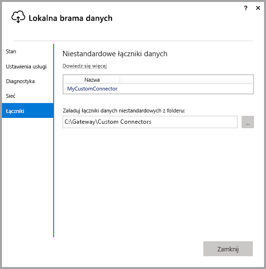
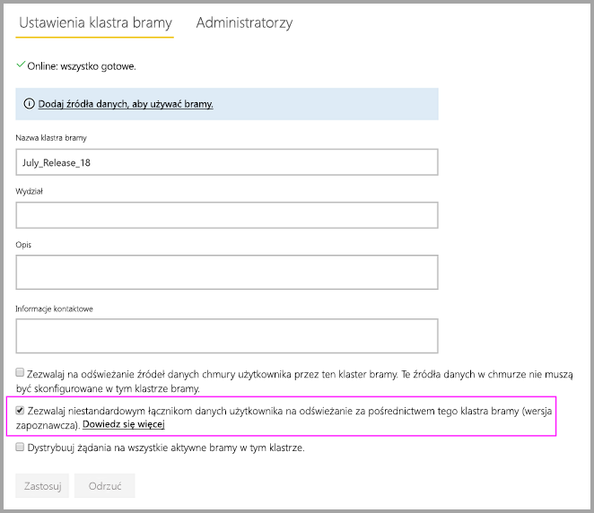
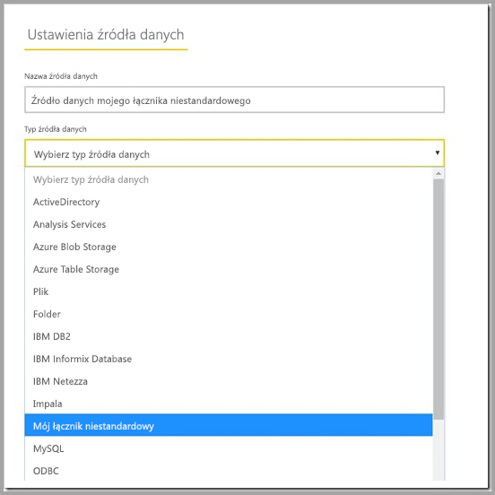

# Używanie niestandardowych łączników danych z lokalną bramą danych

Łączniki danych dla usługi Power BI umożliwiają nawiązywanie połączenia z danymi i uzyskiwanie do nich dostępu z aplikacji, usługi lub źródła danych. Możesz tworzyć niestandardowe łączniki danych i używać ich w programie Power BI Desktop.

Aby dowiedzieć się więcej na temat sposobu tworzenia niestandardowych łączników danych dla usługi Power BI, zapoznaj się z naszą dokumentacją [tutaj](http://aka.ms/dataconnectors).

Podczas tworzenia raportów w programie Power BI Desktop, które korzystają z niestandardowych łączników danych, można użyć lokalnej bramy danych, aby odświeżyć te raporty z usługi Power BI.

## Poniżej przedstawiono wskazówki dotyczące włączania i używania tej funkcji

Po zainstalowaniu lokalnej bramy danych w wersji z lipca 2018 r. lub nowszej w konfiguratorze zostanie wyświetlona karta „Łączniki” z możliwością wybrania folderu, z którego mają być ładowane niestandardowe łączniki. Upewnij się, że wybrano folder dostępny dla użytkownika korzystającego z usługi bramy (domyślnie jest to folder „NT SERVICE\PBIEgwService”). Brama automatycznie ładuje pliki łączników niestandardowych znajdujące się w tym folderze — powinny one być wyświetlane na liście łączników danych.

Jeśli używasz lokalnej bramy danych w wersji osobistej, możesz na tym etapie przekazać raport usługi Power BI do usługi Power BI i odświeżyć go za pomocą bramy.

W przypadku bramy w wersji dla przedsiębiorstw nadal należy utworzyć źródło danych dla łącznika niestandardowego. Na stronie ustawień bramy w usłudze Power BI po wybraniu klastra bramy powinna być widoczna nowa opcja umożliwiająca używanie łączników niestandardowych z tym klastrem. Aby ta opcja była dostępna, wszystkie bramy w klastrze muszą być w wersji z aktualizacją z lipca 2018 r. lub nowszej. Wybierz tę opcję, aby umożliwić używanie łączników niestandardowych z tym klastrem.

Gdy ta opcja jest włączona, łączniki niestandardowe są wyświetlane jako dostępne źródła danych, które można utworzyć w tym klastrze bramy. Po utworzeniu źródła danych przy użyciu nowego łącznika niestandardowego można odświeżyć raporty usługi Power BI za pomocą tego łącznika niestandardowego w usłudze Power BI.

## Istotne zagadnienia i ograniczenia

* Upewnij się, że utworzony folder jest dostępny dla usługi bramy w tle. Zazwyczaj foldery w folderze systemu Windows użytkownika i foldery systemowe nie są dostępne. Jeśli folder jest niedostępny, w konfiguratorze bramy zostanie wyświetlany komunikat (nie dotyczy to bramy w wersji osobistej)
* Aby łączniki niestandardowe mogły współdziałać z lokalną bramą danych, muszą zawierać implementację sekcji „TestConnection” w kodzie łącznika niestandardowego. Nie jest to wymagane w przypadku używania łączników niestandardowych w programie Power BI Desktop. Możesz mieć łącznik, który współdziała z programem Desktop, ale nie współdziała z tego powodu z bramą. Zapoznaj się z [tą dokumentacją](https://github.com/Microsoft/DataConnectors/blob/master/docs/m-extensions.md#implementing-testconnection-for-gateway-support), aby dowiedzieć się, jak zaimplementować sekcję TestConnection.

## Następne kroki

* [Zarządzanie źródłami danych — Analysis Services](service-gateway-enterprise-manage-ssas.md)  
* [Zarządzanie źródłem danych — SAP HANA](service-gateway-enterprise-manage-sap.md)  
* [Zarządzanie źródłami danych — SQL Server](service-gateway-enterprise-manage-sql.md)  
* [Zarządzanie źródłami danych — Oracle](service-gateway-onprem-manage-oracle.md)  
* [Zarządzanie źródłami danych — importowanie/zaplanowane odświeżanie](service-gateway-enterprise-manage-scheduled-refresh.md)  
* [Lokalna brama danych — szczegóły](service-gateway-onprem-indepth.md)  
* [Lokalna brama danych (tryb osobisty)](service-gateway-personal-mode.md)
* [Konfigurowanie ustawień serwera proxy dla lokalnej bramy danych](service-gateway-proxy.md)  
* [Używanie protokołu Kerberos na potrzeby logowania jednokrotnego (SSO) z usługi Power BI do lokalnych źródeł danych](service-gateway-sso-kerberos.md)  

Masz więcej pytań? [Odwiedź społeczność usługi Power BI](http://community.powerbi.com/)
