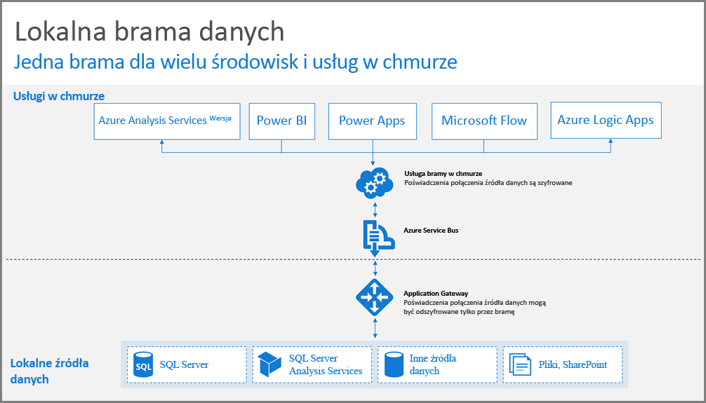
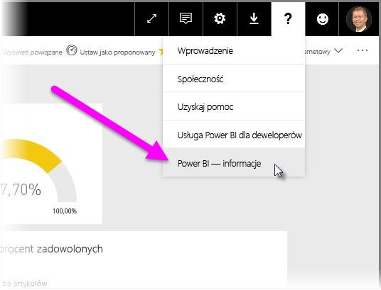
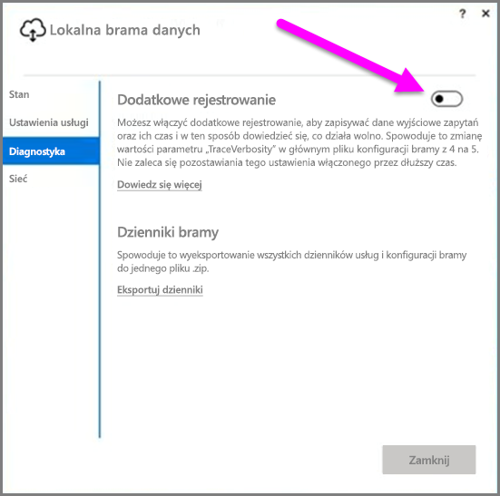
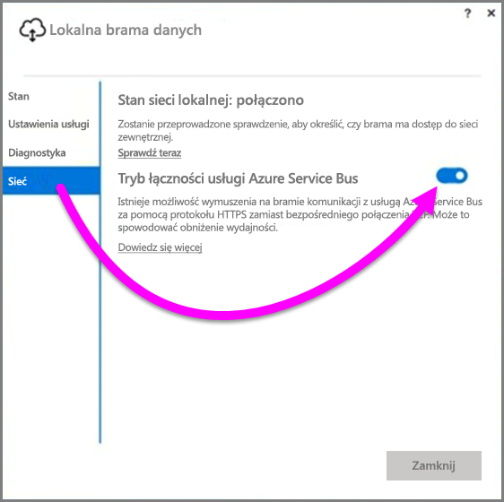
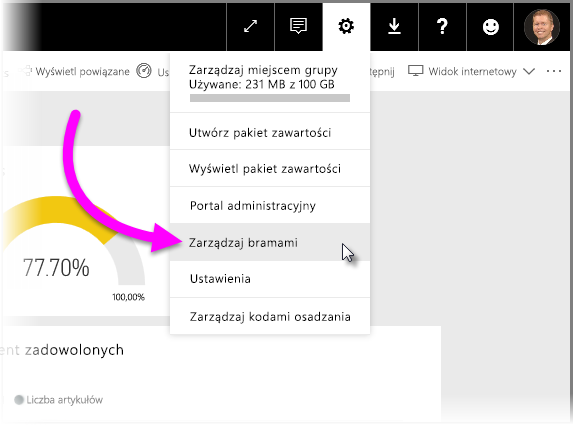

# Wskazówki dotyczące wdrażania bramy danych usługi Power BI
Ten artykuł zawiera wskazówki i uwagi dotyczące wdrażania bramy danych w środowisku sieciowym. **Brama** to oprogramowanie, które ułatwia dostęp do danych znajdujących się w prywatnej sieci lokalnej na potrzeby ich użycia w usłudze w chmurze, takiej jak Power BI. W tym artykule przedstawiono procedurę wdrażania oraz wskazówki dotyczące konfigurowania **lokalnej bramy danych**.

Aby uzyskać więcej informacji na temat **lokalnej bramy danych**, w tym link do jej instalacji, zapoznaj się z [wpisem w blogu](https://powerbi.microsoft.com/blog/power-bi-gateways-march-update/).

## Zagadnienia dotyczące instalacji lokalnej bramy danych
Przed przejściem do szczegółów instalacji i wdrażania chcemy przedstawić kilka uwag, które należy mieć na uwadze. W poniższych sekcjach opisano ważne rzeczy, które należy wziąć pod uwagę.

### Liczba użytkowników
Liczba użytkowników korzystających z raportu używającego bramy jest ważną metryką przy podejmowaniu decyzji o lokalizacji instalacji bramy. Oto kilka pytań do rozważenia:

* Czy użytkownicy korzystają z tych raportów o różnych porach dnia?
* Jakich typów połączeń używają (zapytań bezpośrednich czy importowania)?
* Czy wszyscy użytkownicy korzystają z tego samego raportu?

Jeśli wszyscy użytkownicy uzyskują dostęp do raportu codziennie o tej samej porze, chcesz mieć pewność, że brama jest zainstalowana na maszynie, która może obsłużyć wszystkie żądania (zobacz informacje o licznikach wydajności i minimalnych wymaganiach w poniższych sekcjach zawierających pomocne informacje).

W usłudze **Power BI** istnieje ograniczenie, które umożliwia stosowanie tylko *jednej* bramy dla *raportu*, więc nawet jeśli raport jest oparty na wielu źródłach danych, wszystkie te źródła danych muszą przechodzić przez pojedynczą bramę. Jednak jeśli pulpit nawigacyjny jest oparty na *wielu* raportach, możesz użyć dedykowanej bramy dla każdego raportu składowego i tym samym rozłożyć obciążenie bramy na wiele raportów składających się na pojedynczy pulpit nawigacyjny.

### Typ połączenia
Usługa **Power BI** oferuje dwa typy połączeń: **zapytanie bezpośrednie** i **połączenie importu**. Nie wszystkie źródła danych obsługują oba typy połączeń, a wybór jednego z nich zależy od wielu czynników, takich jak wymagania dotyczące zabezpieczeń, wydajność, limity danych i rozmiary modelu danych. Dodatkowe informacje na temat typu połączenia i obsługiwanych źródeł danych znajdują się w sekcji *listy dostępnych typów źródeł danych* artykułu [Lokalna brama danych](service-gateway-onprem.md).

W zależności od używanego typu połączenia użycie bramy może być inne. Na przykład należy w miarę możliwości oddzielić źródła danych z **zapytaniami bezpośrednimi** od źródeł danych z **zaplanowanym odświeżaniem** (zakładając, że znajdują się w innych raportach i można je oddzielić). W ten sposób można uniknąć sytuacji, w której kolejka w bramie zawiera tysiące żądań zapytań bezpośrednich w czasie porannego zaplanowanego odświeżania dużego modelu danych używanego na potrzeby głównego pulpitu nawigacyjnego firmy. Weź pod uwagę następujące informacje:

* Dla **odświeżania zaplanowanego**: w zależności od rozmiaru zapytania i liczby odświeżeń w ciągu dnia możesz wybrać pozostanie przy zalecanych minimalnych wymaganiach sprzętowych lub podwyższenie wydajności maszyny. Jeśli dane zapytanie nie jest składane, transformacje są wykonywane na maszynie bramy i dlatego w takiej sytuacji maszyna bramy korzysta ze zwiększonej ilości pamięci RAM.
* Dla **zapytania bezpośredniego**: zapytanie jest wysyłane za każdym razem, gdy użytkownik otworzy raport lub spojrzy na dane. Więc jeśli oczekujesz, że ponad 1000 użytkowników będzie jednocześnie uzyskiwać dostęp do danych, upewnij się, że komputer jest wydajny i ma odpowiednie składniki sprzętowe. Większa liczba rdzeni procesora daje większą przepustowość połączenia **zapytań bezpośrednich**.

Wymagania dotyczące maszyny, na której jest instalowana **lokalna brama danych**, są następujące:

**Minimalne:**

* .NET Framework 4.5
* 64-bitowa wersja systemu Windows 7 lub Windows Server 2008 R2 (lub nowszego)

**Zalecane:**

* 8-rdzeniowy procesor CPU
* 8 GB pamięci
* 64-bitowa wersja systemu Windows 2012 R2 (lub nowszego)

### Lokalizacja
Lokalizacja instalacji bramy może mieć znaczący wpływ na wydajność zapytań, dlatego upewnij się, że brama, lokalizacje źródeł danych i dzierżawy usługi Power BI są możliwie blisko siebie, aby zminimalizować opóźnienie sieci. Aby określić lokalizację dzierżawy usługi Power BI, wybierz ikonę **?** w prawym górnym rogu ekranu usługi Power BI, a następnie wybierz pozycję **Informacje o usłudze Power BI**.

### Monitorowania bram
Jest dostępnych kilka narzędzi, których możesz użyć do monitorowania użycia i wydajności zainstalowanych bram.

#### Liczniki wydajności
Jest dostępnych wiele liczników, których możesz użyć do oceny działań mających miejsce w ramach bramy. Liczniki ułatwiają zrozumienie, czy występuje duża liczba działań określonego typu, co może być wskazówką do wdrożenia nowej bramy.

> [!NOTE]
> Te liczniki nie przechwytują czasu trwania poszczególnych zadań.
> 
> 

*Licznik bramy*, w dodatku do liczników maszyny, daje pojęcie o wielkości obciążenia obsługiwanego przez maszynę i może stanowić wskazówkę co do tego, czy możliwości zasobów serwera są wyczerpywane lub przekraczane.

Te liczniki są dostępne z **Monitora wydajności systemu Windows** i mogą ich używać dowolne narzędzia do raportowania. Szczegółowe omówienie sposobu używania monitora wydajności bramy z usługą Power BI zawiera następujący wpis w blogu utworzony przez społeczność.

* [Monitorowanie lokalnych bram danych](https://insightsquest.com/2016/08/08/monitor-on-premises-data-gateways/)

#### Dzienniki
Dzienniki konfiguracji i usługi dają kolejną perspektywę dla zdarzeń mających miejsce w ramach bramy. Zawsze sprawdzaj dzienniki bramy, jeśli połączenie nie działa zgodnie z oczekiwaniami, ponieważ nie wszystkie komunikaty o błędach są udostępniane przez usługę Power BI.

Prosty sposób wyświetlenia wszystkich plików dziennika na maszynie lokalnej to użycie przycisku *Eksportuj dzienniki* dla **lokalnej bramy danych** przy ponownym otwarciu bramy po zakończeniu początkowej instalacji, a następnie wybranie pozycji **Diagnostyka > Eksportuj dzienniki**.

#### Dodatkowe rejestrowanie
Domyślnie brama wykonuje rejestrowanie podstawowe. Jeśli badasz problemy dotyczące bramy i potrzebujesz uzyskać więcej informacji o szczegółach połączenia dla zapytania, możesz tymczasowo włączyć *pełne rejestrowanie*, aby zgromadzić w dzienniku dodatkowe informacje. W tym celu w zainstalowanej bramie wybierz pozycję **Diagnostyka > Dodatkowe rejestrowanie**.

Włączenie tego ustawienia prawdopodobnie spowoduje znaczne zwiększenie rozmiaru dziennika zależnie od użycia bramy. Zalecamy, aby po przeglądnięciu dzienników wyłączyć ustawienie **Dodatkowe rejestrowanie**. Nie zalecamy pozostawiania tego ustawienia włączonego podczas normalnego korzystania z bramy.

#### Konfiguracja sieci
Brama tworzy połączenie wychodzące do usługi **Azure Service Bus**. Brama komunikuje się za pomocą następujących portów wychodzących:

* TCP 443 (domyślny)
* 5671
* 5672
* 9350 do 9354

Brama *nie* wymaga portów przychodzących. Wszystkie wymagane porty są wymienione na powyższej liście.

Zalecamy dodanie adresów IP dla używanego regionu danych do listy dozwolonych adresów zapory. Możesz pobrać listę adresów IP z [listy adresów IP centrów danych platformy Microsoft Azure](https://www.microsoft.com/download/details.aspx?id=41653). Ta lista jest aktualizowana co tydzień. Brama komunikuje się z usługą **Azure Service Bus** przy użyciu określonego adresu IP wraz z w pełni kwalifikowaną nazwą domeny (FQDN). Jeśli dla bramy wymuszono komunikację przy użyciu protokołu HTTPS, brama będzie używać wyłącznie nazwy FQDN i nie będzie w ogóle komunikować się przy użyciu adresów IP.

#### Wymuszanie komunikacji HTTPS z usługą Azure Service Bus
Istnieje możliwość wymuszenia na bramie komunikacji z usługą **Azure Service Bus** za pomocą protokołu HTTPS zamiast bezpośredniego połączenia TCP. Spowoduje to niewielkie obniżenie wydajności. Komunikację bramy do z usługą **Azure Service Bus** przy użyciu protokołu HTTPS można też wymusić za pomocą interfejsu użytkownika bramy (począwszy od wersji bramy z marca 2017).

W tym celu w bramie wybierz pozycję **Sieć**, a następnie ustaw dla pozycji **Tryb łączności usługi Azure Service Bus** wartość **Włączone**.

### Dodatkowe wskazówki
Ta sekcja zawiera dodatkowe wskazówki dotyczące wdrażania bram i zarządzania nimi.

* Unikaj wdrożeń z pojedynczym punktem awarii. W miarę możliwości rozprosz lokalne źródła danych na kilka bram. Niedostępność jednej maszyny w takiej konfiguracji wciąż umożliwia odświeżanie części danych,a funkcjonalność nie zostanie całkowicie utracona.
* Bramy nie można zainstalować na kontrolerze domeny, więc nie planuj ani nie wykonuj takiej instalacji.
* Nie instaluj bramy na komputerze, który może zostać wyłączony, uśpiony lub odłączony od Internetu (na przykład na laptopie), ponieważ brama nie może działać w żadnej z tych sytuacji.
* Unikaj instalowania bramy w sieci bezprzewodowej, ponieważ wydajność w sieci bezprzewodowej może być obniżona.

#### Odzyskiwanie bramy
Istniejącą bramę można odzyskać lub przenieść na nową maszynę przy użyciu **klucza odzyskiwania**. Klucz odzyskiwania jest udostępniany użytkownikowi instalującemu bramę i *nie można* go zmienić później. Klucz odzyskiwania służy do szyfrowania danych i odzyskiwania bramy.

Aby odzyskać bramę, upewnij się, że jesteś jej administratorem, znasz nazwę bramy, masz poprawny klucz odzyskiwania i że jest dostępna nowa maszyna o podobnej wydajności.

Po zalogowaniu się wybierz opcję **Migruj istniejącą bramę**. Następnie wybierz bramę do odzyskania lub migracji, a na koniec podaj klucz odzyskiwania i wybierz pozycję konfigurowania. Po wykonaniu tego kroku stara brama zostanie zastąpiona przez nową bramę, która odziedziczy jej nazwę i wszystkie skonfigurowane uprzednio źródła danych. Wszystkie źródła danych będą teraz przechodzić przez nową maszynę bez konieczności ponownego publikowania. Automatyczne przechodzenie do trybu failover nie jest jeszcze obsługiwane, ale zespół bramy aktywnie rozważa dodanie tej funkcji.

#### Administratorzy
Lista administratorów bramy jest dostępna w usłudze **Power BI**. Po zalogowaniu się do usługi **Power BI** wybierz pozycję **Ustawienia** (ikona koła zębatego) **> Zarządzanie bramami > Interfejs użytkownika bramy**.  

Tu możesz wybrać bramę i zapoznać się z listą administratorów bramy. Administratorzy na liście mają dostęp do bramy oraz mogą ją odzyskać i usunąć. Mogą także dodawać źródła danych do bramy i usuwać je. Aby upewnić się, że wszyscy administratorzy w organizacji mają dostęp do wszystkich bram w swoich grupach, zalecamy wykonanie następujących czynności:

* Utwórz grupę zabezpieczeń usługi **AAD** i dodaj do niej innych użytkowników, a następnie dodaj tę grupę zabezpieczeń do odpowiedniej listy administratorów bramy. Dzięki temu więcej niż jedna osoba ma dostęp do bramy w przypadku awarii albo potrzeby odzyskania lub zmigrowania bramy. W ten sposób inni administratorzy uzyskują także przegląd bram używanych w ich grupach oraz źródeł danych w każdej z bram.

## Następne kroki
[Konfigurowanie ustawień serwera proxy](service-gateway-proxy.md)  
[Rozwiązywanie problemów z lokalną bramą danych](service-gateway-onprem-tshoot.md)  
[Lokalna brama danych — często zadawane pytania](service-gateway-onprem-faq.md)  

Masz więcej pytań? [Odwiedź społeczność usługi Power BI](http://community.powerbi.com/)

