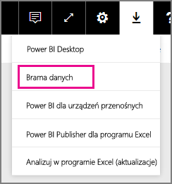
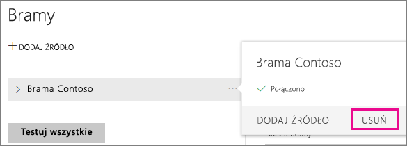
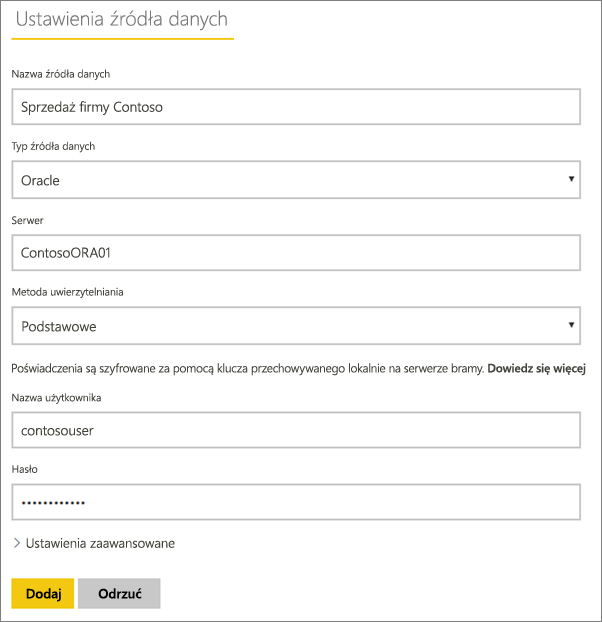
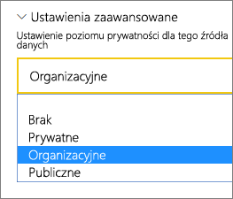
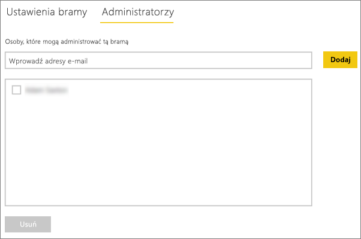
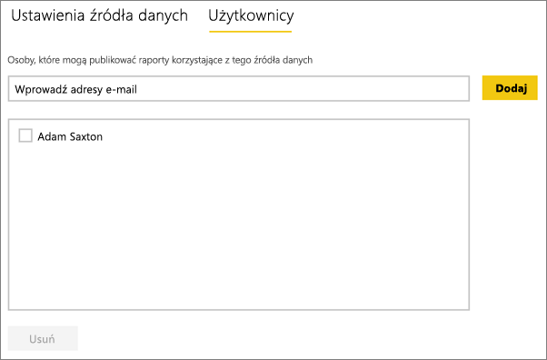
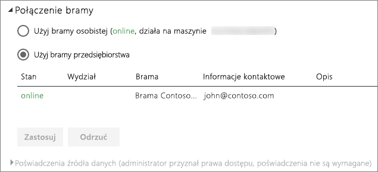

# Zarządzanie źródłami danych — importowanie/zaplanowane odświeżanie
Po zainstalowaniu lokalnej bramy danych musisz dodać źródła danych, które mogą być używane z tą bramą. Ten artykuł dotyczy pracy z bramami oraz źródłami danych, które są używane do zaplanowanego odświeżania — w przeciwieństwie do zapytania bezpośredniego lub połączenia na żywo.

## Pobieranie i instalowanie bramy
Bramę można pobrać z poziomu usługi Power BI. Wybierz pozycję **Pliki do pobrania** > **Brama danych** lub przejdź na [stronę pobierania bramy](https://go.microsoft.com/fwlink/?LinkId=698861).

## Dodawanie bramy
Aby dodać bramę, po prostu [pobierz](https://go.microsoft.com/fwlink/?LinkId=698863) i zainstaluj bramę przedsiębiorstwa na serwerze w swoim środowisku. Po zainstalowaniu bramy zostanie ona wyświetlona na liście bram w obszarze **Zarządzanie bramami**.

> [!NOTE]
> Obszar **Zarządzanie bramami** nie zostanie wyświetlony, dopóki użytkownik nie będzie administratorem co najmniej jednej bramy. Może to nastąpić po dodaniu użytkownika jako administratora lub przez zainstalowanie i skonfigurowanie bramy.
> 
> 

## Usuwanie bramy
Usunięcie bramy spowoduje także usunięcie wszystkich źródeł danych w ramach tej bramy.  Spowoduje to również uszkodzenie wszystkich pulpitów nawigacyjnych i raportów, które są zależne od tych źródeł danych.

1. Wybierz ikonę koła zębatego  w prawym górnym rogu, a następnie wybierz pozycję **Zarządzaj bramami**.
2. Wybierz pozycję Brama, a następnie pozycję **Usuń**
   
   

## Dodawanie źródła danych
Źródło danych możesz dodać, wybierając bramę i klikając pozycję **Dodaj źródło danych** lub przechodząc do obszaru Brama i wybierając pozycję **Dodaj źródło danych**.

Następnie możesz wybrać z listy **typ źródła danych**. Wszystkie wymienione źródła danych mogą być używane do zaplanowanego odświeżania z bramą przedsiębiorstwa. Usługi Analysis Services, SQL Server oraz SAP HANA mogą być używane do zaplanowanego odświeżania oraz zapytania bezpośredniego i połączeń na żywo.

Następnie należy uzupełnić informacje dotyczące źródła danych, w tym informacje dotyczące źródła oraz poświadczenia używane do uzyskania dostępu do źródła danych.

> [!NOTE]
> Wszystkie zapytania w tym źródle danych będą wykonywane z użyciem tych poświadczeń. Aby uzyskać dodatkowe informacje, zobacz główny artykuł na temat lokalnej bramy danych, z którego możesz dowiedzieć się więcej na temat przechowywania [poświadczeń](service-gateway-onprem.md#credentials).
> 
> 

Po wprowadzeniu wszystkich wymaganych informacji możesz kliknąć pozycję **Dodaj**.  Można teraz używać tego źródła danych na potrzeby zaplanowanego odświeżania przy użyciu danych lokalnych. W przypadku powodzenia zostanie wyświetlony komunikat *Łączenie przebiegło pomyślnie*.

<!-- Shared Install steps Include -->
[!INCLUDE [gateway-onprem-datasources-include](./includes/gateway-onprem-datasources-include.md)]

### Ustawienia zaawansowane
Dla źródła danych można skonfigurować poziom prywatności. Służy on do określania sposobu łączenia danych. Jest to używane tylko w przypadku zaplanowanego odświeżania. [Dowiedz się więcej](https://support.office.com/article/Privacy-levels-Power-Query-CC3EDE4D-359E-4B28-BC72-9BEE7900B540)

## Usuwanie źródła danych
Usunięcie źródła danych spowoduje uszkodzenie wszystkich pulpitów nawigacyjnych lub raportów, które są zależne od tego źródła danych.  

Aby usunąć źródło danych, przejdź do obszaru Źródło danych, a następnie wybierz pozycję **Usuń**.

## Zarządzanie administratorami
Na karcie Administratorzy w ustawieniach bramy możesz dodawać i usuwać użytkowników, którzy mogą administrować bramą. Obecnie można dodawać tylko użytkowników. Nie można dodawać grup zabezpieczeń.

## Zarządzanie użytkownikami
Na karcie Użytkownicy dla źródła danych można dodawać i usuwać użytkowników (lub grupy zabezpieczeń), którzy mogą używać tego źródła danych.

> [!NOTE]
> Lista użytkowników służy jedynie do kontrolowania, którzy użytkownicy mogą publikować raporty. Właściciele raportów mogą tworzyć pulpity nawigacyjne lub pakiety zawartości i udostępniać je innym użytkownikom.
> 
> 

## Używanie źródła danych do zaplanowanego odświeżania
Po utworzeniu źródło danych będzie dostępne do użycia z połączeniami zapytań bezpośrednich lub za pośrednictwem zaplanowanego odświeżania.

> [!NOTE]
> W ramach lokalnej bramy danych nazwy serwera i bazy danych w programie Power BI Desktop oraz źródle danych muszą być takie same!
> 
> 

Połączenie między zestawem danych i źródłem danych w obrębie bramy jest oparte na nazwie serwera i nazwie bazy danych. Muszą one być zgodne. Na przykład jeśli podasz adres IP jako nazwę serwera w programie Power BI Desktop, konieczne będzie użycie adresu IP dla źródła danych w ramach konfiguracji bramy. Jeśli używasz nazwy *SERWER\WYSTĄPIENIE* w programie Power BI Desktop, konieczne będzie użycie tej samej nazwy w źródle danych skonfigurowanym dla bramy.

Jeśli znajdujesz się na liście na karcie **Użytkownicy** źródła danych skonfigurowanego w obrębie bramy, a nazwy serwera i bazy danych są zgodne, brama zostanie wyświetlona jako opcja, która może zostać użyta z zaplanowanym odświeżaniem.

> [!WARNING]
> Jeśli zestaw danych zawiera wiele źródeł danych, każde źródło danych musi być dodane w bramie. Jeśli co najmniej jedno źródło nie zostało dodane w bramie, brama nie zostanie wyświetlona jako dostępna do zaplanowanego odświeżania.
> 
> 

## Ograniczenia
* Schemat uwierzytelniania OAuth nie jest obsługiwany w przypadku lokalnej bramy danych. Nie można dodawać źródeł danych, które wymagają uwierzytelniania OAuth. Jeśli zestaw danych zawiera źródło danych wymagające uwierzytelniania OAuth, nie będzie można użyć bramy do zaplanowanego odświeżania.

## Następne kroki
[Lokalna brama danych](service-gateway-onprem.md)  
[Lokalna brama danych — szczegóły](service-gateway-onprem-indepth.md)  
[Rozwiązywanie problemów z lokalną bramą danych](service-gateway-onprem-tshoot.md)  
Więcej pytań? [Odwiedź społeczność usługi Power BI](http://community.powerbi.com/)

