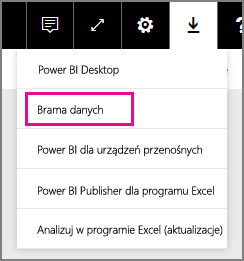

# Zarządzanie źródłem danych — SQL Server
Po zainstalowaniu lokalnej bramy danych możliwe jest dodawanie źródeł danych, które mogą być używane z tą bramą. W tym artykule opisano sposób pracy z bramami i źródłami danych. Źródła danych programu SQL Server można użyć na potrzeby zaplanowanego odświeżania lub zapytania bezpośredniego.

## Pobieranie i instalowanie bramy
Bramę można pobrać z poziomu usługi Power BI. Wybierz pozycję **Pliki do pobrania** > **Brama danych** lub przejdź na [stronę pobierania bramy](https://go.microsoft.com/fwlink/?LinkId=698861).

## Dodawanie bramy
Aby dodać bramę, po prostu [pobierz](https://go.microsoft.com/fwlink/?LinkId=698861) i zainstaluj ją na serwerze w swoim środowisku. Po zainstalowaniu bramy zostanie ona wyświetlona na liście bram w obszarze **Zarządzanie bramami**.

> [!NOTE]
> Obszar **Zarządzanie bramami** nie zostanie wyświetlony, dopóki użytkownik nie będzie administratorem co najmniej jednej bramy. Będzie miało to miejsce, gdy użytkownik zostanie dodany jako administrator do bramy, lub brama zostanie przez niego samodzielnie zainstalowana i skonfigurowana.
> 
> 

## Usuwanie bramy
Usunięcie bramy spowoduje także usunięcie wszystkich źródeł danych w ramach tej bramy.  Spowoduje to również uszkodzenie wszystkich pulpitów nawigacyjnych i raportów, które są zależne od tych źródeł danych.

1. Wybierz ikonę koła zębatego  w prawym górnym rogu, a następnie wybierz pozycję **Zarządzaj bramami**.
2. Wybierz pozycję Brama, a następnie pozycję **Usuń**
   
   

## Dodawanie źródła danych
Źródło danych możesz dodać, wybierając bramę i klikając pozycję **Dodaj źródło danych** lub przechodząc do obszaru Brama i wybierając pozycję **Dodaj źródło danych**.

Następnie możesz wybrać z listy **typ źródła danych**.

> [!NOTE]
> W przypadku korzystania z zapytania bezpośredniego brama obsługuje tylko program **SQL Server 2012 z dodatkiem SP1** i kolejne jego wersje.
> 
> 

Następnie można podać informacje dla źródła danych, które obejmują **serwer** i **bazę danych**.  

Konieczne będzie również wybranie **metody uwierzytelniania**.  Może ona mieć dwie wartości: **Windows** lub **Podstawowe**.  Uwierzytelnianie **podstawowe** należy wybrać, jeśli zamierzasz używać uwierzytelniania SQL zamiast uwierzytelniania systemu Windows. Następnie wprowadź poświadczenia, które będą używane dla tego źródła danych.

> [!NOTE]
> Wszystkie zapytania względem źródła danych będą uruchamiane przy użyciu tych poświadczeń, chyba że logowanie jednokrotne (SSO) protokołu Kerberos zostało skonfigurowane i włączone dla źródła danych. W przypadku logowania jednokrotnego zestawy danych importowania używają przechowywanych poświadczeń, ale zestawy danych zapytania bezpośredniego używają bieżącego użytkownika usługi Power BI do wykonywania zapytań przy użyciu logowania jednokrotnego. Aby dowiedzieć się więcej, zobacz podstawowy artykuł dotyczący lokalnej bramy danych, zawierający informacje na temat sposobu przechowywania [poświadczeń](service-gateway-onprem.md#credentials), lub artykuł opisujący sposób [używania protokołu Kerberos na potrzeby logowania jednokrotnego (SSO) z usługi Power BI do lokalnych źródeł danych](service-gateway-kerberos-for-sso-pbi-to-on-premises-data.md).
> 
> 

Po wprowadzeniu wszystkich wymaganych informacji możesz kliknąć pozycję **Dodaj**.  Możesz teraz używać tego źródła danych na potrzeby zaplanowanego odświeżania lub zapytania bezpośredniego względem programu SQL Server działającego lokalnie. W przypadku powodzenia zostanie wyświetlony komunikat *Łączenie przebiegło pomyślnie*.

### Ustawienia zaawansowane
Dla źródła danych można skonfigurować poziom prywatności. Służy on do określania sposobu łączenia danych. Jest to używane tylko w przypadku zaplanowanego odświeżania. Nie ma zastosowania względem zapytania bezpośredniego. [Dowiedz się więcej](https://support.office.com/article/Privacy-levels-Power-Query-CC3EDE4D-359E-4B28-BC72-9BEE7900B540)

## Usuwanie źródła danych
Usunięcie źródła danych spowoduje uszkodzenie wszystkich pulpitów nawigacyjnych lub raportów, które są zależne od tego źródła danych.  

Aby usunąć źródło danych, przejdź do obszaru Źródło danych, a następnie wybierz pozycję **Usuń**.

## Zarządzanie administratorami
Na karcie Administratorzy bramy możesz dodawać i usuwać użytkowników (lub grupy zabezpieczeń), którzy mogą administrować bramą.

## Zarządzanie użytkownikami
Na karcie Użytkownicy dla źródła danych można dodawać i usuwać użytkowników (lub grupy zabezpieczeń), którzy mogą używać tego źródła danych.

> [!NOTE]
> Lista użytkowników służy jedynie do kontrolowania, którzy użytkownicy mogą publikować raporty. Właściciele raportów mogą tworzyć pulpity nawigacyjne lub pakiety zawartości i udostępniać je innym użytkownikom.
> 
> 

## Używanie źródła danych
Po utworzeniu źródło danych będzie dostępne do użycia z połączeniami zapytań bezpośrednich lub za pośrednictwem zaplanowanego odświeżania.

> [!NOTE]
> W ramach lokalnej bramy danych nazwy serwera i bazy danych w programie Power BI Desktop oraz źródle danych muszą być takie same!
> 
> 

Połączenie między zestawem danych i źródłem danych w obrębie bramy jest oparte na nazwie serwera i nazwie bazy danych. Muszą one być zgodne. Na przykład po podaniu adresu IP jako nazwy serwera w ramach programu **Power BI Desktop** konieczne będzie użycie adresu IP dla źródła danych w ramach konfiguracji bramy. Jeśli używasz nazwy *SERWER\WYSTĄPIENIE* w programie Power BI Desktop, konieczne będzie użycie tej samej nazwy w źródle danych skonfigurowanym dla bramy.

Dotyczy to zarówno zapytania bezpośredniego, jak i zaplanowanego odświeżania.

### Używanie źródeł danych z połączeniami zapytań bezpośrednich
Należy sprawdzić, czy nazwy serwera i bazy danych są zgodne między programem **Power BI Desktop** i skonfigurowanym źródłem danych dla bramy. Ponadto do publikowania zestawów danych zapytania bezpośredniego wymagane jest, aby użytkownik znajdował się na liście na karcie **Użytkownicy** źródła danych. Wybór na potrzeby zapytania bezpośredniego ma miejsce w programie Power BI Desktop podczas pierwszego importu danych. [Dowiedz się więcej](desktop-use-directquery.md)

Po opublikowaniu zestawu danych w programie Power BI Desktop lub za pomocą funkcji **Pobierz dane** raporty powinny działać. Po utworzeniu źródła danych w obrębie bramy może upłynąć kilka minut, zanim będzie można używać połączenia.

### Używanie źródła danych z zaplanowanym odświeżaniem
Jeśli znajdujesz się na liście na karcie **Użytkownicy** źródła danych skonfigurowanego w obrębie bramy, a nazwy serwera i bazy danych są zgodne, brama zostanie wyświetlona jako opcja, która może zostać użyta z zaplanowanym odświeżaniem.

## Następne kroki
* [Lokalna brama danych](service-gateway-onprem.md)  
* [Lokalna brama danych — szczegóły](service-gateway-onprem-indepth.md)  
* [Rozwiązywanie problemów z lokalną bramą danych](service-gateway-onprem-tshoot.md)
* [Używanie protokołu Kerberos na potrzeby logowania jednokrotnego (SSO) z usługi Power BI do lokalnych źródeł danych](service-gateway-kerberos-for-sso-pbi-to-on-premises-data.md) 
* Masz więcej pytań? [Odwiedź społeczność usługi Power BI](http://community.powerbi.com/)

