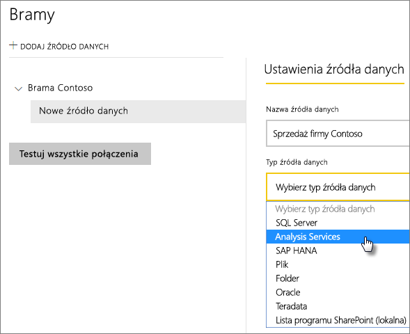
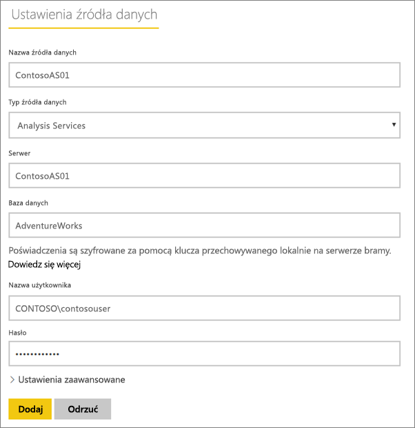
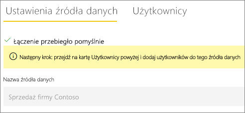
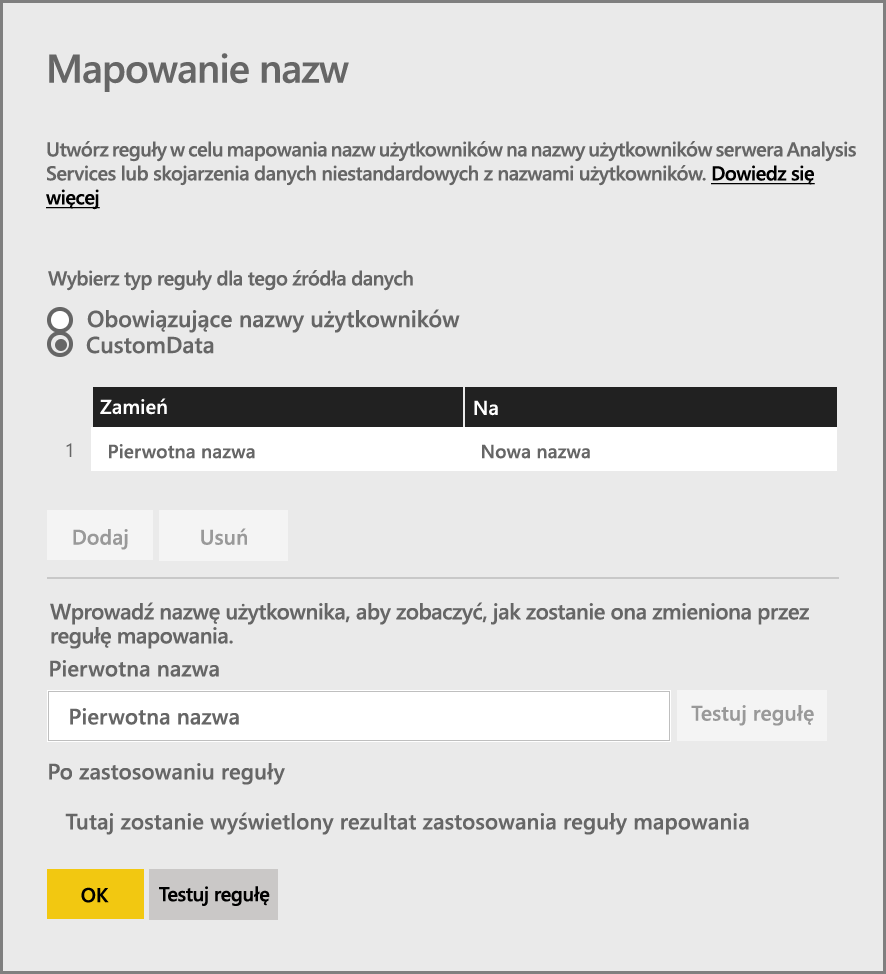
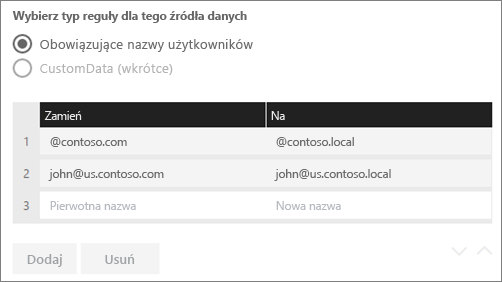
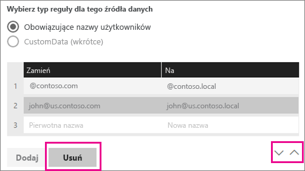
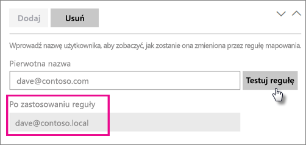
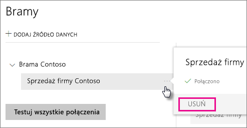
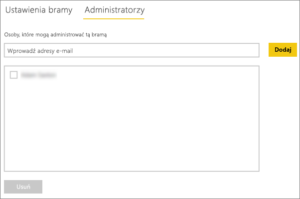
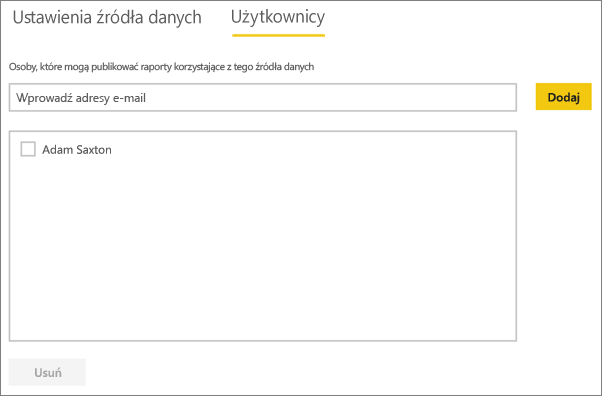

# Zarządzanie źródłami danych — Analysis Services
Po zainstalowaniu lokalnej bramy danych musisz dodać źródła danych, które mogą być używane z tą bramą. W tym artykule opisano sposób pracy z bramami i źródłami danych. Do zaplanowanego odświeżania lub połączeń na żywo możesz użyć źródła danych usług Analysis Services.

<iframe width="560" height="315" src="https://www.youtube.com/embed/ownIGbcRAAU" frameborder="0" allowfullscreen></iframe>

## Pobieranie i instalowanie bramy
Bramę można pobrać z poziomu usługi Power BI. Wybierz pozycję **Pliki do pobrania** > **Brama danych** lub przejdź na [stronę pobierania bramy](https://go.microsoft.com/fwlink/?LinkId=698861).

## Ograniczenia połączeń na żywo usług Analysis Services
W przypadku wystąpień tabelarycznych lub wielowymiarowych można używać połączenia na żywo.

| **Wersja serwera** | **Wymagana jednostka SKU** |
| --- | --- |
| 2012 SP1 CU4 lub nowsza |Jednostka SKU w wersji Business Intelligence i Enterprise |
| 2014 |Jednostka SKU w wersji Business Intelligence i Enterprise |
| 2016 |Jednostka SKU w wersji Standard lub wyższej |

* Formatowanie na poziomie komórki i funkcje tłumaczenia nie są obsługiwane.
* Akcje i nazwane zestawy nie są widoczne w usłudze Power BI, ale można łączyć się z wielowymiarowymi modułami zawierającymi akcje lub nazwane zestawy i tworzyć wizualizacje oraz raporty.

## Dodawanie bramy
Aby dodać bramę, po prostu [pobierz](https://go.microsoft.com/fwlink/?LinkId=698861) i zainstaluj ją na serwerze w swoim środowisku. Po zainstalowaniu bramy zostanie ona wyświetlona na liście bram w obszarze **Zarządzanie bramami**.

> [!NOTE]
> Obszar **Zarządzanie bramami** nie zostanie wyświetlony, dopóki użytkownik nie będzie administratorem co najmniej jednej bramy. Może to nastąpić po dodaniu użytkownika jako administratora lub przez zainstalowanie i skonfigurowanie bramy.
> 
> 

## Usuwanie bramy
Usunięcie bramy spowoduje także usunięcie wszystkich źródeł danych w ramach tej bramy.  Spowoduje to również uszkodzenie wszystkich pulpitów nawigacyjnych i raportów, które są zależne od tych źródeł danych.

1. Wybierz ikonę koła zębatego  w prawym górnym rogu, a następnie wybierz pozycję **Zarządzaj bramami**.
2. Wybierz pozycję Brama, a następnie pozycję **Usuń**
   
   

## Dodawanie źródła danych
Źródło danych możesz dodać, wybierając bramę i klikając pozycję **Dodaj źródło danych** lub przechodząc do obszaru Brama i wybierając pozycję **Dodaj źródło danych**.

Następnie możesz wybrać z listy **typ źródła danych**. Wybierz usługi Analysis Services, jeśli łączysz się z serwerem wielowymiarowym lub tabelarycznym.

Następnie możesz podać informacje dla źródła danych, które obejmują **serwer** i **bazę danych**.  

Wprowadzone wartości **Nazwa użytkownika** i **Hasło** zostaną użyte przez bramę do nawiązania połączenia z wystąpieniem usług Analysis Services.

> [!NOTE]
> Wprowadzone konto systemu Windows musi mieć uprawnienia administratora serwera dla wystąpienia, z którym jest nawiązywane połączenie. Jeśli hasło tego konta ma ustawioną datę ważności, użytkownicy mogą otrzymać błąd połączenia, jeśli hasło nie zostało zaktualizowane dla źródła danych. Aby uzyskać dodatkowe informacje, zobacz główny artykuł na temat lokalnej bramy danych, z którego możesz dowiedzieć się więcej na temat przechowywania [poświadczeń](service-gateway-onprem.md#credentials).
> 
> 

Po wprowadzeniu wszystkich wymaganych informacji możesz kliknąć pozycję **Dodaj**.  Teraz możesz używać tego źródła danych do zaplanowanego odświeżania lub połączeń na żywo dla wystąpienia lokalnych usług Analysis Services.  W przypadku powodzenia zostanie wyświetlony komunikat *Łączenie przebiegło pomyślnie*.

### Ustawienia zaawansowane
Dla źródła danych można skonfigurować poziom prywatności. Służy on do określania sposobu łączenia danych. Jest to używane tylko w przypadku zaplanowanego odświeżania. Nie ma zastosowania do połączeń na żywo. [Dowiedz się więcej](https://support.office.com/article/Privacy-levels-Power-Query-CC3EDE4D-359E-4B28-BC72-9BEE7900B540)

## Nazwy użytkowników na poziomie usług Analysis Services
Za każdym razem, gdy użytkownik wchodzi w interakcję z raportem połączonym z usługami Analysis Services, obowiązująca nazwa użytkownika jest przekazywana do bramy, a następnie do lokalnego serwera usług Analysis Services. Adres e-mail używany do logowania w usłudze Power BI będzie przekazywany do usług Analysis Services jako obowiązująca nazwa użytkownika. Te informacje są przekazywane we właściwości [EffectiveUserName](https://msdn.microsoft.com/library/dn140245.aspx#bkmk_auth) połączenia. Ten adres e-mail powinien być zgodny ze zdefiniowaną nazwą UPN w domenie lokalnej usługi Active Directory. Nazwa UPN jest właściwością konta usługi Active Directory. To konto systemu Windows musi być obecne w roli usługi Analysis Services. Logowanie nie powiedzie się, jeśli w usłudze Active Directory nie zostanie znalezione dopasowanie. [Dowiedz się więcej](https://msdn.microsoft.com/library/ms677605.aspx)

Możesz również mapować nazwę logowania usługi Power BI przy użyciu nazwy UPN z katalogu lokalnego. [Dowiedz się więcej](service-gateway-enterprise-manage-ssas.md#map-user-names)

<iframe width="560" height="315" src="https://www.youtube.com/embed/Qb5EEjkHoLg" frameborder="0" allowfullscreen></iframe>

### Jak mogę sprawdzić swoją nazwę UPN?
Możesz nie znać swojej nazwy UPN i nie być administratorem domeny. Aby sprawdzić nazwę UPN dla swojego konta, możesz użyć następującego polecenia z poziomu swojej stacji roboczej.

    whoami /upn

Wynik będzie wyglądał podobnie do adresu e-mail, ale jest to nazwa UPN przechowywana na koncie domeny. Jeśli do połączeń na żywo używasz źródła danych usług Analysis Services i jeśli nie pasuje ono do adresu e-mail używanego do logowania w usłudze Power BI, może zajść potrzeba zapoznania się z [mapowaniem nazw użytkowników](#map-user-names).

## Mapowanie nazw użytkowników
<iframe width="560" height="315" src="https://www.youtube.com/embed/eATPS-c7YRU" frameborder="0" allowfullscreen></iframe>

Nazwy użytkowników dla usług Analysis Services można mapować na dwa sposoby:

1. Ponowne ręczne mapowanie użytkownika 
2. Lokalne wyszukiwanie właściwości w usłudze Active Directory w celu ponownego mapowania nazw UPN usługi AAD na użytkowników usługi Active Directory (mapowanie wyszukiwania w usłudze AD)

Chociaż jest możliwe przeprowadzenie ręcznego mapowania przy użyciu drugiej metody, byłoby to czasochłonne i trudne w konserwacji. Jest to szczególnie trudne, gdy dopasowanie wzorca nie wystarcza — tak jak wtedy, kiedy nazwy domen są inne w usłudze AAD i w lokalnej usłudze AD lub gdy nazwy kont użytkowników różnią się między usługą AAD i usługą AD. W efekcie mapowanie ręczne za pomocą drugiego podejścia nie jest zalecane.

Te dwie metody zostaną kolejno opisane w poniższych sekcjach

### Ponowne ręczne mapowanie nazwy użytkownika
Dla źródeł danych usług Analysis Services możesz skonfigurować niestandardowe reguły głównej nazwy użytkownika (UPN, User Principal Name). Pomoże to, jeśli nazwy logowania usługi Power BI są niezgodne z nazwą UPN w katalogu lokalnym. Jeśli na przykład zalogujesz się do usługi Power BI jako john@contoso.com, ale nazwa UPN w katalogu lokalnym to john@contoso.local, możesz skonfigurować regułę mapowania, aby przekazała nazwę john@contoso.local do usług Analysis Services.

Aby przejść do ekranu mapowania nazwy UPN, wykonaj następujące czynności.

1. Wybierz **ikonę koła zębatego** i pozycję **Zarządzaj bramami**.
2. Rozwiń węzeł bramy, która zawiera źródło danych usług Analysis Services. Alternatywnie, jeśli nie utworzono źródła danych usług Analysis Services, możesz to zrobić w tym momencie.
3. Wybierz źródło danych, a następnie wybierz kartę **Użytkownicy**.
4. Wybierz pozycję **Mapuj nazwy użytkowników**.
   
    

Zobaczysz wtedy wyświetlone opcje dodawania reguły oraz testu dla danego użytkownika.

> [!NOTE]
> Możesz spowodować niezamierzoną zmianę użytkownika, której nie było w planie. Jeśli na przykład pozycja **Zastąp (oryginalna nazwa)** ma wartość *@contoso.com* i pozycja **Przez (nowa nazwa)** ma wartość *@contoso.local*, ciąg *@contoso.com* w danych logowania wszystkich użytkowników zostanie zastąpiony przez ciąg *@contoso.local*. Ponadto jeśli pozycja **Zastąp (oryginalna nazwa)** ma wartość *dave@contoso.com* i pozycja **Przez (nowa nazwa)** ma wartość *dave@contoso.local*, użytkownik mający dane logowania v-dave@contoso.com zostanie wysłany jako v-dave*@contoso.local*.
> 
> 

### Mapowanie wyszukiwania w usłudze AD
W celu wykonania lokalnego wyszukiwania właściwości usługi AD, aby ponownie mapować nazwy UPN usługi AAD na użytkowników usługi Active Directory, wykonaj kroki opisane w tej sekcji. Na początek sprawdźmy, jak to działa.

W **usłudze Power BI** wystąpią następujące zdarzenia:

- Dla każdego zapytania użytkownika usługi Power BI usługi AAD do lokalnego serwera usługi SSAS jest przekazywany ciąg nazwy UPN, taki jak: firstName.lastName@contoso.com

> [!NOTE]
> Wszelkie ręczne mapowania użytkownika nazwy UPN zdefiniowane w konfiguracji źródła danych usługi Power BI nadal są stosowane *przed* wysłaniem ciągu nazwy użytkownika do lokalnej bramy danych.
> 
> 

W lokalnej bramie danych z mapowaniem użytkownika niestandardowego z możliwością konfiguracji wykonaj następujące czynności:

1. Znajdowanie usługi Active Directory do wyszukiwania (automatycznego lub z możliwością konfiguracji)
2. Wyszukaj atrybut osoby usługi AD (taki jak *Adres e-mail*) na podstawie przychodzącego ciągu nazwy UPN („firstName.lastName@contoso.com”) z **usługi Power BI**.
3. W przypadku niepowodzenia wyszukiwania w usłudze AD próbuje ona użyć nazwy UPN przekazanej jako EffectiveUser do usług SSAS.
4. Jeśli wyszukiwanie w usłudze AD zakończy się powodzeniem, pobiera ono nazwę *UserPrincipalName* tej osoby usługi AD. 
5. Przekazuje ono adres e-mail *UserPrincipalName* jako *EffectiveUser* do usług SSAS, np.: *Alias@corp.on-prem.contoso*

Jak skonfigurować bramę do przeprowadzania wyszukiwania w usłudze AD:

1. Pobieranie i instalowanie najnowszej bramy
2. W bramie musisz zmienić **usługę lokalnej bramy danych** tak, aby była uruchamiana wraz z kontem domeny (zamiast z kontem usługi lokalnej — w przeciwnym razie wyszukiwanie w usłudze AD nie będzie działać poprawnie w środowisku uruchomieniowym). Musisz ponownie uruchomić usługę bramy, aby zmiana zaczęła obowiązywać.  Przejdź do aplikacji bramy na swoim komputerze (wyszukaj frazę „lokalna brama danych”). Aby to zrobić, wybierz pozycję **Ustawienia usługi > Zmień konto usługi**. Upewnij się, że masz klucz odzyskiwania dla tej bramy, ponieważ musisz przywrócić ją na tym samym komputerze, chyba że chcesz zamiast tego utworzyć nową bramę. 
3. Przejdź do folderu instalacyjnego bramy, *C:\Program Files\On-premises data gateway*, jako administrator, aby upewnić się, że masz uprawnienia do zapisu, i zmodyfikuj następujący plik:
   
       Microsoft.PowerBI.DataMovement.Pipeline.GatewayCore.dll.config 
4. Zmodyfikuj następujące dwie wartości konfiguracji zgodnie z *Twoimi* konfiguracjami atrybutów usługi Active Directory Twoich użytkowników usługi AD. Przedstawione poniżej wartości konfiguracji są tylko przykładowe — musisz je określić na podstawie własnej konfiguracji usługi Active Directory. 
   
   
5. Uruchom ponownie usługę **lokalnej bramy danych**, aby zmiany konfiguracji zostały wprowadzone.

### Praca z regułami mapowania
Aby utworzyć regułę mapowania, wprowadź wartość dla pozycji **Oryginalna nazwa** i **Nowa nazwa**, a następnie wybierz pozycję **Dodaj**.

| Pole | Opis |
| --- | --- |
| Zastąp (oryginalna nazwa) |Adres e-mail, za pomocą którego nastąpiło logowanie do usługi Power BI. |
| Przez (nowa nazwa) |Wartość, którą chcesz ją zastąpić. Wynik zastąpienia zostanie przekazany do właściwości *EffectiveUserName* połączenia usług Analysis Services. |

Po wybraniu elementu na liście możesz zmienić kolejność przy użyciu **ikon strzałek** lub **usunąć** wpis.

### Używanie symbolu wieloznacznego (\*)
W swoim ciągu **Zastąp (oryginalna nazwa)** możesz użyć symbolu wieloznacznego. Może on być używany tylko samodzielnie, a nie jako część jakiegokolwiek innego ciągu. Pozwoli to na pobranie wszystkich użytkowników, a następnie przekazanie pojedynczej wartości do źródła danych. Jest to przydatne, gdy chcesz, aby wszyscy użytkownicy w Twojej organizacji używali tej samej nazwy użytkownika w środowisku lokalnym.

### Testowanie reguły mapowania
Aby zweryfikować, czym zostanie zastąpiona oryginalna nazwa, możesz wprowadzić wartość dla pozycji **Oryginalna nazwa** i wybrać pozycję **Testuj regułę**.

> [!NOTE]
> Musi upłynąć kilka minut, zanim usługa zacznie korzystać z zapisanych reguł. W przeglądarce reguła będzie działać natychmiast.
> 
> 

### Ograniczenia dotyczące reguł mapowania
* Mapowanie dotyczy określonego źródła danych, które jest konfigurowane. Nie ma ustawień globalnych. Jeśli masz wiele źródeł danych usług Analysis Services, konieczne będzie mapowanie użytkowników dla każdego źródła danych.

## Usuwanie źródła danych
Usunięcie źródła danych spowoduje uszkodzenie wszystkich pulpitów nawigacyjnych lub raportów, które są zależne od tego źródła danych.  

Aby usunąć źródło danych, przejdź do obszaru Źródło danych, a następnie wybierz pozycję **Usuń**.

## Zarządzanie administratorami
Na karcie Administratorzy bramy możesz dodawać i usuwać użytkowników (lub grupy zabezpieczeń), którzy mogą administrować bramą.

## Zarządzanie użytkownikami
Na karcie Użytkownicy dla źródła danych można dodawać i usuwać użytkowników (lub grupy zabezpieczeń), którzy mogą używać tego źródła danych.

> [!NOTE]
> Lista użytkowników służy jedynie do kontrolowania, którzy użytkownicy mogą publikować raporty. Właściciele raportów mogą tworzyć pulpity nawigacyjne lub pakiety zawartości i udostępniać je innym użytkownikom.
> 
> 

## Używanie źródła danych
Po utworzeniu źródło danych będzie dostępne do użycia z połączeniami na żywo lub za pośrednictwem zaplanowanego odświeżania.

> [!NOTE]
> W ramach lokalnej bramy danych nazwy serwera i bazy danych w programie Power BI Desktop oraz źródle danych muszą być takie same!
> 
> 

Połączenie między zestawem danych i źródłem danych w obrębie bramy jest oparte na nazwie serwera i nazwie bazy danych. Muszą one być zgodne. Na przykład jeśli podasz adres IP jako nazwę serwera w programie Power BI Desktop, konieczne będzie użycie adresu IP dla źródła danych w ramach konfiguracji bramy. Jeśli używasz nazwy *SERWER\WYSTĄPIENIE* w programie Power BI Desktop, konieczne będzie użycie tej samej nazwy w źródle danych skonfigurowanym dla bramy.

Dotyczy to zarówno połączeń na żywo, jak i zaplanowanego odświeżania.

### Używanie źródeł danych z połączeniami na żywo
Musisz się upewnić, że nazwy serwera i bazy danych są takie same w programie Power BI Desktop i źródle danych skonfigurowanym dla bramy. Musisz również sprawdzić, czy użytkownik znajduje się na liście na karcie **Użytkownicy** źródła danych, aby opublikować zestawy danych połączenia na żywo. Wybór na potrzeby połączenia na żywo ma miejsce w programie Power BI Desktop, gdy pierwszy raz importujesz dane.

Gdy opublikujesz z poziomu programu Power BI Desktop lub za pomocą funkcji **Pobierz dane** raporty powinny zostać uruchomione. Po utworzeniu źródła danych w obrębie bramy może upłynąć kilka minut, zanim będzie można używać połączenia.

### Używanie źródła danych z zaplanowanym odświeżaniem
Jeśli znajdujesz się na liście na karcie **Użytkownicy** źródła danych skonfigurowanego w obrębie bramy, a nazwy serwera i bazy danych są zgodne, brama zostanie wyświetlona jako opcja, która może zostać użyta z zaplanowanym odświeżaniem.

## Następne kroki
[Lokalna brama danych](service-gateway-onprem.md)  
[Lokalna brama danych — szczegóły](service-gateway-onprem-indepth.md)  
[Rozwiązywanie problemów z lokalną bramą danych](service-gateway-onprem-tshoot.md)  
Masz więcej pytań? [Odwiedź społeczność usługi Power BI](http://community.powerbi.com/)

