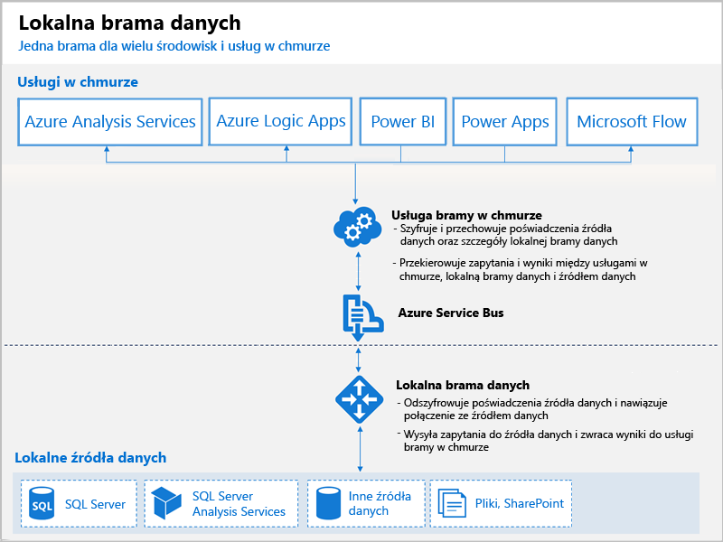

# Co to są bramy usługi Power BI?

Brama usługi Power BI to oprogramowanie instalowane w sieci lokalnej. Ułatwia ono dostęp do danych w tej sieci. Ten program przypomina strażnika, który wyłapuje żądania dotyczące połączeń i pozwala na ich wykonanie tylko w przypadku, gdy żądania użytkowników spełniają określone kryteria. Umożliwia to organizacjom zachowanie baz danych i innych źródeł danych w sieciach lokalnych oraz bezpieczniejsze używanie danych lokalnych danych w raportach i na pulpitach nawigacyjnych usługi Power BI.

Poniższy diagram przedstawia podstawowy widok bramy obsługującej żądania z chmury na trzech komputerach lokalnych. Szczegółowe informacje na ten temat znajdują się w dalszej części artykułu.

## Typy bram

Usługa Power BI oferuje dwie bramy, każdą dla innego scenariusza:

* **Lokalna brama danych (tryb osobisty)** — umożliwia jednemu użytkownikowi łączenie się ze źródłami, ale nie może być udostępniania innym. Można z niej korzystać tylko w ramach usługi Power BI. Ta brama jest dobrym rozwiązaniem w przypadku scenariuszy, w których jesteś jedyną osobą tworzącą raporty i nie musisz udostępniać innym użytkownikom źródeł danych.

* **Lokalna brama danych** — umożliwia wielu użytkownikom łączenie się z wieloma lokalnymi źródłami danych. Ta brama może być używana przez aplikacje usług Power BI, PowerApps, Flow, Azure Analysis Services i Azure Logic, a wszystko to w ramach pojedynczej instalacji bramy. Ta brama jest dobrym rozwiązaniem w przypadku bardziej złożonych scenariuszy, w których wiele osób uzyskuje dostęp do wielu źródeł danych. 

## Używanie bramy

Proces używania bramy składa się z czterech głównych kroków:

1. **Instalowanie bramy** na komputerze lokalnym przy użyciu odpowiedniego trybu
2. **Dodawanie użytkowników do bramy**, aby mogli oni uzyskiwać dostęp do lokalnych źródeł danych
3. **Łączenie ze źródłami danych**, aby można było ich używać w raportach i pulpitach nawigacyjnych
4. **Odświeżanie danych lokalnych**, aby raporty usługi Power BI były aktualne

Można zainstalować bramę autonomiczną lub dodać bramę do *klastra*. Takie rozwiązanie jest zalecane w przypadku wysokiej dostępności.

## Jak działają bramy

Instalowana brama działa jako usługa systemu Windows, **lokalna brama danych**. Ta usługa lokalna jest rejestrowana w usłudze w chmurze dla bramy za pośrednictwem usługi Azure Service Bus. Na poniższym diagramie przedstawiono przepływ między danymi lokalnymi i usługami w chmurze korzystającymi z bramy.

Zapytania i przepływ danych:

1. Zapytanie jest tworzone przez usługę w chmurze przy użyciu zaszyfrowanych poświadczeń dla lokalnego źródła danych. Następnie jest wysyłane do kolejki dla bramy do przetworzenia.
2. Usługa bramy w chmurze analizuje zapytanie i wypycha żądanie do usługi Azure Service Bus.
3. Brama danych lokalnych sonduje usługę Azure Service Bus pod kątem żądań oczekujących.
4. Brama pobiera zapytanie, odszyfrowuje poświadczenia i nawiązuje połączenie ze źródłami danych, używając tych poświadczeń.
5. Brama wysyła zapytanie do źródła danych w celu wykonania.
6. Wyniki są odsyłane ze źródła danych do bramy, z powrotem do bramy, a następnie do usługi w chmurze i na serwer.

## Następne kroki
[Instalowanie lokalnej bramy danych](service-gateway-install.md)

Masz więcej pytań? [Odwiedź społeczność usługi Power BI](http://community.powerbi.com/)

