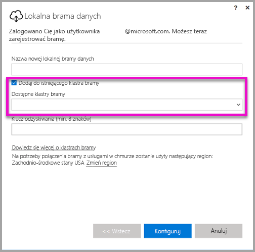

# <a name="high-availability-clusters-for-on-premises-data-gateway"></a>Klastry wysokiej dostępności dla lokalnej bramy danych
Można utworzyć **klastry wysokiej dostępności** z poziomu instalacji **lokalnej bramy danych**, aby zapewnić, że organizacja będzie mogła uzyskiwać dostęp do zasobów danych lokalnych używanych w raportach i na pulpicie nawigacyjnym usługi Power BI. Dzięki takim klastrom administratorzy bram mogą grupować bramy w celu uniknięcia punktów SPOF (single point of failure) w przypadku uzyskiwania dostępu do zasobów danych lokalnych. W tym artykule opisano kroki, które można wykonać w celu utworzenia klastra o wysokiej dostępności z poziomu lokalnych bram danych. Przedstawiono również najlepsze rozwiązania do stosowania w procesie konfigurowania. Klastry bramy o wysokiej dostępności wymagają aktualizacji z listopada 2017 r. (lub nowszej) dla lokalnej bramy danych.


## <a name="setting-up-high-availability-clusters-of-gateways"></a>Konfigurowanie klastrów bram o wysokiej dostępności

Podczas procesu instalacji **lokalnej bramy danych** możesz określić, czy bramę należy dodać do istniejącego klastra bramy. 



Aby dodać bramę do istniejącego klastra, musisz podać *klucz odzyskiwania* odpowiadający wystąpieniu bramy podstawowej dla klastra, do którego chcesz dołączyć nową bramę. W bramie podstawowej dla klastra musi być uruchomiona aktualizacja bramy z listopada 2017 r. lub nowsza. 


## <a name="managing-a-gateway-cluster"></a>Zarządzanie klastrem bramy

Gdy klaster bramy składa się z co najmniej dwóch bram, wszystkie operacje zarządzania bramą, takie jak dodawanie źródła danych lub przyznawanie uprawnień administracyjnych do bramy, mają zastosowanie do wszystkich bram, które są częścią klastra. 

Gdy administratorzy użyją elementu menu **Zarządzaj bramami** dostępnego za pośrednictwem ikony koła zębatego w **usłudze Power BI**, zostanie wyświetlona lista zarejestrowanych klastrów lub poszczególnych bram, ale wystąpienia poszczególnych bram będące elementami członkowskimi klastra nie będą widoczne.

Wszystkie nowe żądania typu **Zaplanowane odświeżanie** i operacje zapytania bezpośredniego są automatycznie kierowane do podstawowego wystąpienia danego klastra bramy. Jeśli wystąpienie bramy podstawowej nie działa w trybie online, żądanie jest kierowane do innego wystąpienia bramy w klastrze.

## <a name="powershell-support-for-gateway-clusters"></a>Obsługa programu PowerShell dla klastrów bramy

Skrypty programu PowerShell są dostępne w folderze instalacyjnym lokalnej bramy danych. Domyślnie ten folder to *C:\Program Files\On-premises data gateway*. Aby skrypty działały prawidłowo, wymagany jest program PowerShell w wersji 5 lub nowszej. Skrypty programu PowerShell umożliwiają użytkownikom wykonywanie następujących operacji:

-   Pobieranie listy klastrów bramy dostępnych dla użytkownika
-   Pobieranie listy wystąpień bramy zarejestrowanych w klastrze, a także ich stanu online lub offline
-   Modyfikowanie stanu włączenia/wyłączenia wystąpienia bramy w klastrze, a także innych właściwości bramy
-   Usuwanie bramy

Aby można było uruchamiać polecenia programu PowerShell z tabeli, najpierw wykonaj następujące czynności:

1. Otwórz okno polecenia programu PowerShell jako administrator.
2. Następnie uruchom następujące jednorazowe polecenie programu PowerShell (przy założeniu, że na bieżącej maszynie nigdy nie uruchamiano poleceń programu PowerShell):

    ```
    Set-ExecutionPolicy -ExecutionPolicy Unrestricted -Force
    ```

3. Następnie przejdź do folderu instalacji lokalnej bramy danych w oknie programu PowerShell i zaimportuj niezbędny moduł przy użyciu następującego polecenia:

    ```
    Import-Module .\OnPremisesDataGatewayHAMgmt.psm1
    ```

Po wykonaniu powyższych kroków możesz używać poleceń z poniższej tabeli do zarządzania klastrami bramy.

| **Polecenie** | **Opis** | **Parametry** |
| --- | --- | --- |
| *Login-OnPremisesDataGateway* |To polecenie umożliwia użytkownikowi logowanie się w celu zarządzania własnymi klastrami lokalnej bramy danych.  Musisz uruchomić to polecenie i zalogować się, *zanim* inne polecenia wysokiej dostępności zaczną działać prawidłowo. Uwaga: token uwierzytelniania usługi AAD uzyskany w ramach połączenia logowania obowiązuje tylko przez 1 godzinę, po czym wygasa. Możesz ponownie uruchomić polecenie logowania, aby uzyskać nowy token.| Nazwa użytkownika i hasło usługi AAD (udostępnione w ramach wykonywania polecenia, a nie początkowego wywołania)|
| *Get-OnPremisesDataGatewayClusters* | Pobiera listę klastrów bramy dla zalogowanego użytkownika. | Opcjonalnie w celu zwiększenia czytelności do tego polecenia można przekazać parametry formatowania, takie jak: *Format-Table -AutoSize -Wrap* |
| *Get-OnPremisesDataClusterGateways* | Pobiera listę bram w określonym klastrze, a także dodatkowe informacje dotyczące każdej bramy (stan online/offline, nazwa maszyny itd.) | *-ClusterObjectID xyz* (gdzie ciąg *xyz* jest zastępowany rzeczywistą wartością identyfikatora obiektu klastra, którą można pobrać przy użyciu polecenia *Get-OnPremisesDataGatewayClusters*)|
| *Set-OnPremisesDataGateway* | Umożliwia ustawienie wartości właściwości dla danej bramy w klastrze, w tym możliwości włączenia/wyłączenia określonego wystąpienia bramy  | *-ClusterObjectID xyz* (gdzie ciąg *xyz* należy zastąpić rzeczywistą wartością identyfikatora obiektu klastra, którą można pobrać przy użyciu polecenia *Get-OnPremisesDataGatewayClusters*) *-GatewayObjectID abc* (gdzie ciąg *abc* należy zastąpić rzeczywistą wartością identyfikatora obiektu bramy, którą można pobrać przy użyciu polecenia *Get-OnPremisesDataClusterGateways* z danym identyfikatorem obiektu klastra) |
| *Get-OnPremisesDataGatewayStatus* | Umożliwia pobranie stanu danego wystąpienia bramy w ramach klastra  | *-ClusterObjectID xyz* (gdzie ciąg *xyz* należy zastąpić rzeczywistą wartością identyfikatora obiektu klastra, którą można pobrać przy użyciu polecenia *Get-OnPremisesDataGatewayClusters*) *-GatewayObjectID abc* (gdzie ciąg *abc* należy zastąpić rzeczywistą wartością identyfikatora obiektu bramy, którą można pobrać przy użyciu polecenia *Get-OnPremisesDataClusterGateways* z danym identyfikatorem obiektu klastra) |
| *Remove-OnPremisesDataGateway*  | Umożliwia usunięcie wystąpienia bramy z klastra — należy pamiętać, że nie można usunąć głównej bramy w klastrze, dopóki zostaną usunięte wszystkie inne bramy klastra.| *-ClusterObjectID xyz* (gdzie ciąg *xyz* należy zastąpić rzeczywistą wartością identyfikatora obiektu klastra, którą można pobrać przy użyciu polecenia *Get-OnPremisesDataGatewayClusters*) *-GatewayObjectID abc* (gdzie ciąg *abc* należy zastąpić rzeczywistą wartością identyfikatora obiektu bramy, którą można pobrać przy użyciu polecenia *Get-OnPremisesDataClusterGateways* z danym identyfikatorem obiektu klastra) |


## <a name="next-steps"></a>Następne kroki

-   [Zarządzanie źródłami danych — Analysis Services](service-gateway-enterprise-manage-ssas.md)  
-   [Zarządzanie źródłem danych — SAP HANA](service-gateway-enterprise-manage-sap.md)  
-   [Zarządzanie źródłami danych — SQL Server](service-gateway-enterprise-manage-sql.md)  
-   [Zarządzanie źródłami danych — Oracle](service-gateway-onprem-manage-oracle.md)  
-   [Zarządzanie źródłami danych — importowanie/zaplanowane odświeżanie](service-gateway-enterprise-manage-scheduled-refresh.md)  
-   [Lokalna brama danych — szczegóły](service-gateway-onprem-indepth.md)  
-   [Lokalna brama danych (tryb osobisty)](service-gateway-personal-mode.md)
-   [Konfigurowanie ustawień serwera proxy dla lokalnej bramy danych](service-gateway-proxy.md)  
-   [Używanie protokołu Kerberos na potrzeby logowania jednokrotnego (SSO) z usługi Power BI do lokalnych źródeł danych](service-gateway-kerberos-for-sso-pbi-to-on-premises-data.md)  

Więcej pytań? [Odwiedź społeczność usługi Power BI](http://community.powerbi.com/)
