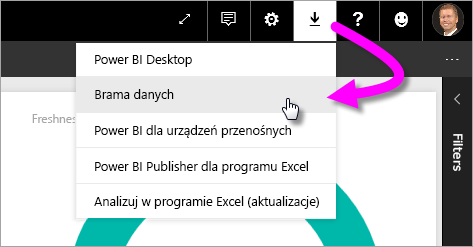
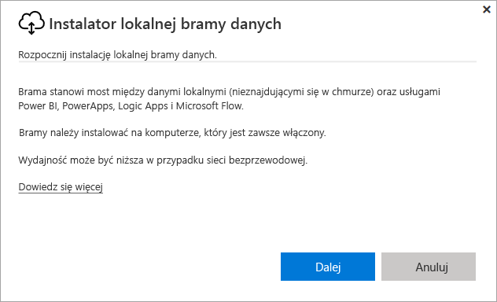
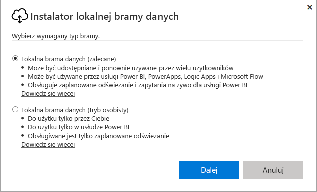
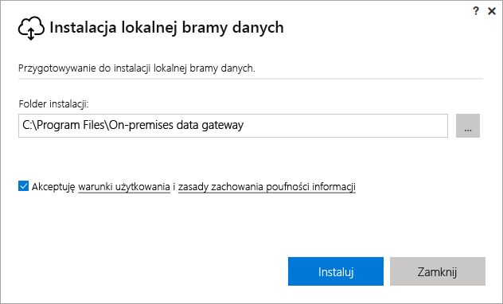
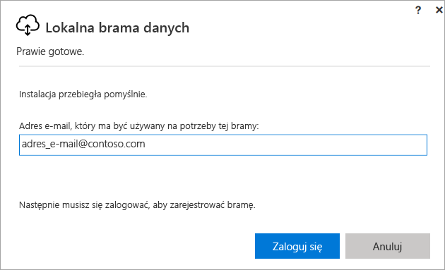
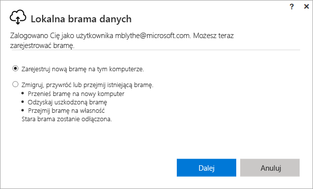
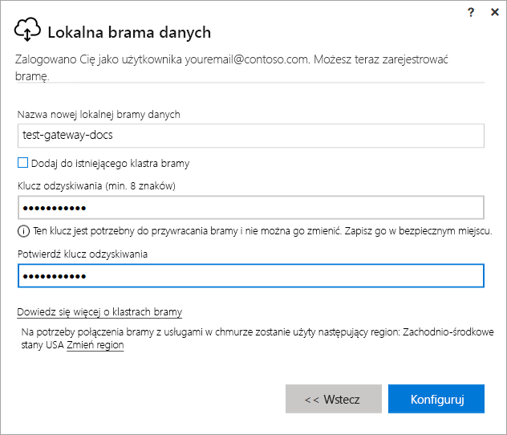
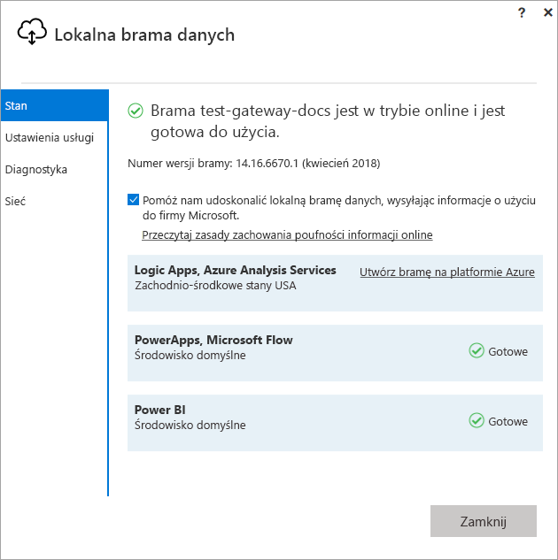
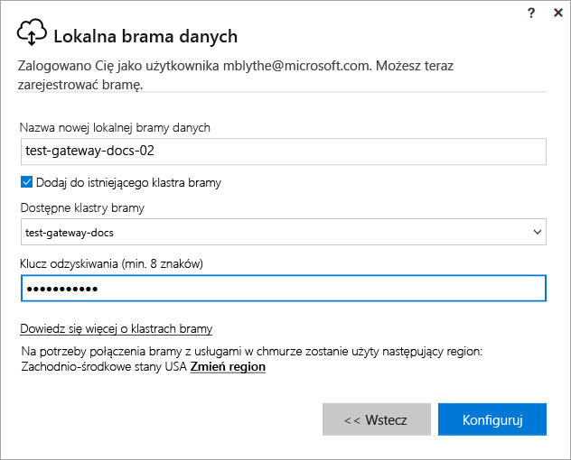

# Instalowanie bramy usługi Power BI

Brama usługi Power BI to oprogramowanie instalowane w sieci lokalnej. Ułatwia ono dostęp do danych w tej sieci. Jak opisano w [omówieniu](service-gateway-getting-started.md), bramę można zainstalować w trybie osobistym lub trybie standardowym (opcja zalecana). W trybie standardowym można zainstalować bramę autonomiczną lub dodać bramę do *klastra*. Takie rozwiązanie jest zalecane w przypadku wysokiej dostępności. W tym artykule opisano, jak zainstalować bramę standardową, a następnie dodać inną bramę, aby utworzyć klaster.

Jeśli nie masz konta usługi Power BI, na początku [zacznij korzystać z bezpłatnej wersji próbnej](https://app.powerbi.com/signupredirect?pbi_source=web).

## Pobieranie i instalowanie bramy

Brama działa na komputerze, na którym ją zainstalowano, jest więc istotne, aby zainstalować ją na zawsze włączonym komputerze. W celu uzyskania lepszej wydajności i niezawodności zalecamy, aby komputer znajdował się w sieci przewodowej, a nie w sieci bezprzewodowej.

1. W usłudze Power BI w prawym górnym rogu wybierz **ikonę pobierania**  > **Brama danych**.

    

2. Na stronie pobierania wybierz przycisk **POBIERZ BRAMĘ**.

3. Wybierz pozycję **Dalej**.     

    

4. Wybierz pozycję **Lokalna brama danych (zalecane)** > **Dalej**.

    

5. Zachowaj domyślną ścieżkę instalacji i zaakceptuj postanowienia > **Zainstaluj**.

    

6. Wprowadź konto używane do logowania do usługi Power BI > **Zaloguj**.

    

    Brama jest kojarzona z indywidualnym kontem usługi Power BI, a zarządzanie bramami odbywa się w obrębie usługi Power BI. Obecnie użytkownik jest zalogowany do swojego konta.

7. Wybierz pozycję **Zarejestruj nową bramę na tym komputerze** > **Dalej**.

    

8. Wprowadź nazwę bramy (musi być unikatowa w dzierżawie) i klucz odzyskiwania. Klucz ten jest wymagany, gdy zajdzie potrzeba przeniesienia lub odzyskania bramy. Wybierz pozycję **Skonfiguruj**.

    

    Zwróć uwagę na opcję **Dodaj do istniejącego klastra bramy**. Użyjemy tej opcji w następnej sekcji tego artykułu.

9. Przejrzyj informacje w oknie końcowym. Zwróć uwagę, że brama jest dostępna dla usługi Power BI, a także usług PowerApps i Flow, ponieważ użyto tego samego konta dla wszystkich trzech rozwiązań. Wybierz pozycję **Zamknij**.

    

Po pomyślnym zainstalowaniu bramy można dodać inną bramę, aby utworzyć klaster.

## Dodawanie innej bramy w celu utworzenia klastra

Klaster umożliwia administratorom bramy uniknąć pojedynczego punktu awarii podczas dostępu do danych lokalnych. Jeśli brama podstawowa jest niedostępna, można dodać kolejną bramę, do której kierowane są żądania danych itd. Na danym komputerze można zainstalować tylko jedną bramę standardową, dlatego drugą bramę dla klastra należy zainstalować na innym komputerze. Takie rozwiązanie ma sens, ponieważ potrzebujesz nadmiarowości w klastrze.

Klastry bramy o wysokiej dostępności wymagają aktualizacji z listopada 2017 r. (lub nowszej) dla lokalnej bramy danych.

1. Pobierz bramę na inny komputer i zainstaluj ją.

2. Po zalogowaniu do konta usługi Power BI zarejestruj bramę. Wybierz pozycję **Dodaj do istniejącego klastra**. W obszarze **Dostępne klastry bramy** wybierz pierwszą zainstalowaną bramę (*bramę główną*) i wprowadź klucz odzyskiwania dla tej bramy. Wybierz pozycję **Skonfiguruj**.

    

## Następne kroki

[Zarządzanie bramą usługi Power BI](service-gateway-manage.md)

Masz więcej pytań? [Odwiedź społeczność usługi Power BI](http://community.powerbi.com/)