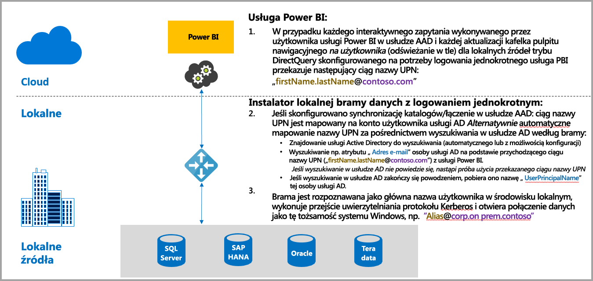
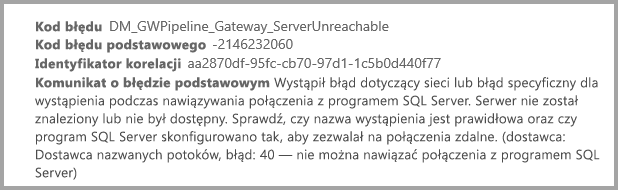
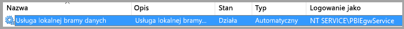
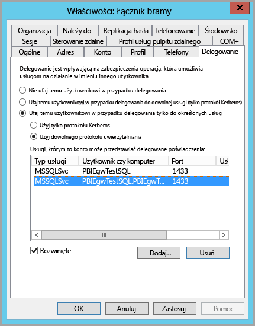
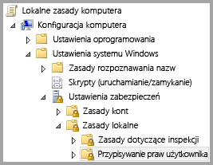
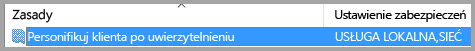
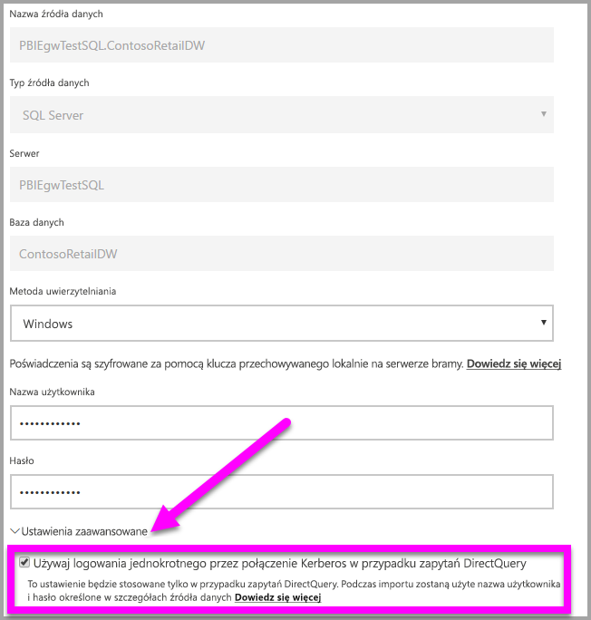
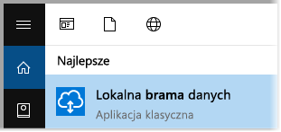
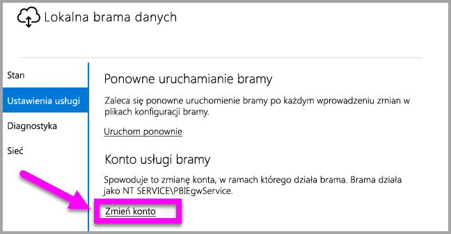

# Używanie protokołu Kerberos na potrzeby logowania jednokrotnego (SSO) z usługi Power BI do lokalnych źródeł danych
Możesz uzyskać bezproblemową łączność przy użyciu funkcji logowania jednokrotnego, aby umożliwić aktualizowanie raportów i pulpitów nawigacyjnych usługi Power BI na podstawie lokalnych danych, konfigurując lokalną bramę danych przy użyciu protokołu Kerberos. Lokalna brama danych ułatwia logowanie jednokrotne przez użycie zapytania bezpośredniego do połączenia z lokalnymi źródłami danych.

Obecnie obsługiwane są następujące źródła danych: SQL Server, SAP HANA i Teradata, wszystkie w oparciu o [ograniczone delegowanie protokołu Kerberos](https://technet.microsoft.com/library/jj553400.aspx).

* SQL Server
* SAP HANA
* Teradata

Gdy użytkownik korzysta z raportu zapytania bezpośredniego w usłudze Power BI, każda operacja filtrowania krzyżowego, wycinania, sortowania i edytowania raportu może spowodować dynamiczne wykonywanie zapytań kierowanych do lokalnego źródła danych.  W przypadku skonfigurowania logowania jednokrotnego dla źródła danych zapytania są wykonywane przy użyciu tożsamości użytkownika korzystającego z usługi Power BI, czyli za pośrednictwem środowiska internetowego lub aplikacji mobilnych usługi Power BI. Dzięki temu każdy użytkownik będzie widział te dane, do których ma uprawnienia w bazowym źródle danych — skonfigurowanie logowania jednokrotnego oznacza, że dane są buforowane osobno dla każdego użytkownika.

## Uruchamianie zapytania przy użyciu logowania jednokrotnego — wykonywane kroki
Uruchamianie zapytania przy użyciu logowania jednokrotnego obejmuje trzy kroki, jak pokazano na poniższym diagramie.

> [!NOTE]
> Logowanie jednokrotne dla bazy danych Oracle nie jest jeszcze dostępne, ale jest opracowywane i zostanie wkrótce udostępnione.
> 
> 

Dodatkowe informacje dotyczące omawianych kroków:

1. W przypadku każdego zapytania **usługa Power BI** dołącza *główną nazwę użytkownika* (nazwę UPN) podczas wysyłania żądania zapytania do skonfigurowanej bramy.
2. Brama mapuje nazwę UPN z usługi Azure Active Directory na lokalną tożsamość usługi Active Directory.
   
   a.  Jeśli skonfigurowano narzędzie AAD DirSync (znane także jako *AAD Connect*), mapowanie odbywa się automatycznie w bramie.
   
   b.  Jeśli nie, brama może wyszukać nazwę UPN z usługi Azure AD i mapować ją na użytkownika lokalnego, wykonując wyszukiwanie w domenie lokalnej usługi Active Directory.
3. Proces usługi bramy personifikuje mapowanego użytkownika lokalnego, otwiera połączenie z podstawową bazą danych i wysyła zapytanie. Brama nie musi być zainstalowana na tej samej maszynie co baza danych.
   
   - Personifikacja użytkownika i połączenie z bazą danych powiedzie się pod warunkiem, że konto usługi bramy jest kontem domeny (lub identyfikatorem SID usługi), a ograniczone delegowanie protokołu Kerberos zostało skonfigurowane tak, aby baza danych akceptowała bilety protokołu Kerberos z konta usługi bramy.  
   
   > [!NOTE]
   > W odniesieniu do identyfikatora SID usługi, jeśli skonfigurowano narzędzie AAD DirSync/Connect, a konta użytkowników są synchronizowane, usługa bramy nie musi wykonywać wyszukiwania w lokalnej usłudze AD w czasie wykonywania i można użyć lokalnego identyfikatora SID usługi (zamiast wymagać konta domeny) na potrzeby usługi bramy.  Czynności konfiguracji ograniczonego delegowania protokołu Kerberos opisane w tym dokumencie są takie same (z tą różnicą, że stosowany jest identyfikator SID usługi, a nie konto domeny).
   > 
   > 

> [!NOTE]
> Aby włączyć logowanie jednokrotne dla serwera SAP HANA:
>
> - Upewnij się, że serwer SAP HANA jest uruchomiony w wymaganej wersji minimalnej, która zależy od poziomu platformy serwera SAP Hana:
>     - [HANA 2 SPS 01 wer. 012.03](https://launchpad.support.sap.com/#/notes/2557386)
>     - [HANA 2 SPS 02 wer. 22](https://launchpad.support.sap.com/#/notes/2547324)
>     - [HANA 1 SP 12 wer. 122.13](https://launchpad.support.sap.com/#/notes/2528439)
>
> - Na maszynie bramy zainstaluj najnowszy sterownik HANA ODBC firmy SAP.  Minimalna wymagana wersja to HANA ODBC 2.00.020.00 z sierpnia 2017 r.
>
> Aby uzyskać więcej informacji na temat ustawiania i konfigurowania logowania jednokrotnego dla serwera SAP HANA przy użyciu protokołu Kerberos, zobacz temat [Single Sign-on Using Kerberos](https://help.sap.com/viewer/b3ee5778bc2e4a089d3299b82ec762a7/2.0.03/en-US/1885fad82df943c2a1974f5da0eed66d.html) (Logowanie jednokrotne przy użyciu protokołu Kerberos) w przewodniku dotyczącym bezpieczeństwa serwera SAP HANA oraz linki na tej stronie, w szczególności do uwagi SAP 1837331 – HOWTO HANA DBSSO Kerberos/Active Directory. 
>
>

## Błędy wynikające z niewłaściwej konfiguracji protokołu Kerberos
Jeśli podstawowy serwer bazy danych oraz brama nie zostały skonfigurowane poprawnie na potrzeby **ograniczonego delegowania protokołu Kerberos**, może zostać wyświetlony następujący komunikat o błędzie:

Szczegółowe informacje techniczne związane z komunikatem o błędzie mogą wyglądać następująco:

W wyniku niewłaściwej konfiguracji protokołu Kerberos brama nie mogła poprawnie personifikować użytkownika źródłowego i próba połączenia z bazą danych nie powiodła się.

## Przygotowanie do ograniczonego delegowania protokołu Kerberos
Aby ograniczone delegowanie protokołu Kerberos działało poprawnie, należy skonfigurować kilka elementów, między innymi *główne nazwy usług* (nazwy SPN) oraz ustawienia delegowania na kontach usług.

### Wymaganie wstępne 1: zainstalowanie i skonfigurowanie lokalnej bramy danych
Ta wersja lokalnej bramy danych obsługuje uaktualnienie w miejscu, a także przejmowanie ustawień istniejących bram.

### Wymaganie wstępne 2: uruchomienie usługi bramy systemu Windows jako konta domeny
W standardowej instalacji brama działa jako konto usługi maszyny lokalnej (dokładnie: *NT Service\PBIEgwService*), jak pokazano na poniższej ilustracji:

Aby włączyć **ograniczone delegowanie protokołu Kerberos**, brama musi działać jako konto domeny, chyba że usługa AAD została już zsynchronizowana z lokalną usługą Active Directory przy użyciu narzędzia AAD DirSync/Connect. Aby ta zmiana konta działała prawidłowo, dostępne są dwie opcje:

* Jeśli rozpoczęto za pomocą poprzedniej wersji lokalnej bramy danych, wykonaj dokładnie wszystkie 5 kroków (w tym uruchomienie konfiguratora bramy w kroku 3) opisanych w następującym artykule:
  
  * [Changing the gateway service account to a domain user](https://powerbi.microsoft.com/documentation/powerbi-gateway-proxy/#changing-the-gateway-service-account-to-a-domain-user) (Zmiana konta usługi bramy na użytkownika domeny)
  * Jeśli zainstalowano już wersję zapoznawczą lokalnej bramy danych, istnieje nowa metoda umożliwiająca przełączanie kont usługi przy użyciu interfejsu użytkownika bezpośrednio z poziomu konfiguratora bramy. Zapoznaj się z sekcją **Przełączanie bramy na konto domeny** w końcowej części tego artykułu.

> [!NOTE]
> Jeśli skonfigurowano narzędzie AAD DirSync/Connect, a konta użytkowników są synchronizowane, usługa bramy nie musi wykonywać wyszukiwania w lokalnej usłudze AD w czasie wykonywania i można użyć lokalnego identyfikatora SID usługi (zamiast wymagać konta domeny) na potrzeby usługi bramy. Czynności konfiguracji ograniczonego delegowania protokołu Kerberos opisane w tym artykule są takie same, jak w przypadku tej konfiguracji (z tą różnicą, że stosowany jest identyfikator SID usługi, a nie konto domeny).
> 
> 

### Wymaganie wstępne 3: uprawnienia administratora domeny do konfigurowania ustawień ograniczonego delegowania protokołu Kerberos i nazw SPN (SetSPN)
Mimo że jest technicznie możliwe, aby administrator domeny tymczasowo lub trwale przypisał innej osobie uprawnienia do konfigurowania nazw SPN i delegowania protokołu Kerberos bez konieczności uzyskania przez tę osobę uprawnień administratora domeny, nie jest to zalecane rozwiązanie. W poniższej sekcji opisano szczegółowo kroki konfiguracji niezbędne do spełnienia **wymagania wstępnego 3**.

## Konfigurowanie ograniczonego delegowania protokołu Kerberos dla bramy i źródła danych
Aby poprawnie skonfigurować system, należy skonfigurować lub zweryfikować następujące dwa elementy:

1. W razie potrzeby skonfiguruj nazwę SPN w ramach konta domeny usługi bramy (jeśli jeszcze jej nie utworzono).
2. Skonfiguruj ustawienia delegowania na koncie domeny usługi bramy.

Należy pamiętać, że użytkownik musi być administratorem domeny, aby wykonać te dwie czynności konfiguracji.

W poniższych sekcjach opisano kolejno te kroki.

### Konfigurowanie nazwy SPN dla konta usługi bramy
Po pierwsze należy ustalić, czy nazwa SPN została już utworzona dla konta domeny używanego jako konto usługi bramy, wykonując następujące kroki:

1. Jako administrator domeny uruchom narzędzie **Użytkownicy i komputery usługi Active Directory**
2. Kliknij prawym przyciskiem myszy domenę, wybierz pozycję **Znajdź** i wpisz nazwę konta usługi bramy
3. W wynikach wyszukiwania kliknij prawym przyciskiem myszy konto usługi bramy, a następnie wybierz pozycję **Właściwości**.
   
   * Jeśli karta **Delegowanie** jest widoczna w oknie dialogowym **Właściwości**, oznacza to, że nazwa SPN została już utworzona i można przejść do kolejnej podsekcji dotyczącej konfigurowania ustawień delegowania.

Jeśli karta **Delegowanie** nie jest widoczna w oknie dialogowym **Właściwości**, można ręcznie utworzyć nazwę SPN dla tego konta, co spowoduje dodanie karty **Delegowanie** (jest to najprostszy sposób konfigurowania ustawień delegowania). Nazwę SPN można utworzyć przy użyciu [narzędzia setspn](https://technet.microsoft.com/library/cc731241.aspx) w systemie Windows (aby utworzyć nazwę SPN, są wymagane uprawnienia administratora domeny).

Załóżmy na przykład, że konto usługi bramy to „PBIEgwTest\GatewaySvc”, a nazwa maszyny, na której działa usługa bramy, to **Machine1**. Aby ustawić nazwę SPN konta usługi bramy dla maszyny w tym przykładzie, należy uruchomić następujące polecenie:

Po wykonaniu tej czynności można przystąpić do konfigurowania ustawień delegowania.

### Konfigurowanie ustawień delegowania na koncie domeny usługi bramy
Drugie wymaganie w procesie konfiguracji dotyczy ustawień delegowania na koncie domeny usługi bramy. Istnieje wiele narzędzi, których można użyć do wykonania tych kroków. W tym artykule użyjemy narzędzia**Użytkownicy i komputery usługi Active Directory**, które jest przystawką programu Microsoft Management Console (MMC), używaną do administrowania informacjami i publikowania ich w katalogu, dostępną domyślnie na kontrolerach domeny. Można również włączyć te ustawienia przy użyciu konfiguracji **funkcji systemu Windows** na innych maszynach.

Należy skonfigurować **ograniczone delegowanie protokołu Kerberos** z użyciem przejścia protokołu. W przypadku delegowania ograniczonego należy wprost określić usługi, dla których ma działać delegowanie — na przykład tylko program SQL Server lub serwer SAP HANA będzie akceptować wywołania delegowania z konta usługi bramy.

W tej sekcji założono, że nazwy SPN bazowych źródeł danych (takich jak SQL Server, SAP HANA, Teradata itp.) zostały już skonfigurowane. Aby dowiedzieć się, jak skonfigurować nazwy SPN serwera źródła danych, zapoznaj się z dokumentacją techniczną odpowiedniego serwera bazy danych. Możesz również zapoznać się z wpisem w blogu, który opisuje, [*jakich nazw SPN wymaga Twoja aplikacja*](https://blogs.msdn.microsoft.com/psssql/2010/06/23/my-kerberos-checklist/).

W poniższych krokach założono, że środowisko lokalne składa się z dwóch urządzeń: maszyny bramy i serwera bazy danych (serwera bazy danych programu SQL Server) oraz przyjęto również następujące przykładowe ustawienia i nazwy:

* Nazwa maszyny bramy: **PBIEgwTestGW**
* Konto usługi bramy: **PBIEgwTest\GatewaySvc** (wyświetlana nazwa konta: Łącznik bramy)
* Nazwa maszyny źródła danych programu SQL Server: **PBIEgwTestSQL**
* Nazwa konta usługi źródła danych programu SQL Server: **PBIEgwTest\SQLService**

Biorąc pod uwagę te przykładowe nazwy i ustawienia, czynności konfiguracyjne są następujące:

1. Uruchom narzędzie **Użytkownicy i komputery usługi Active Directory** z uprawnieniami administratora domeny.
2. Kliknij prawym przyciskiem myszy konto usługi bramy (**PBIEgwTest\GatewaySvc**) i wybierz pozycję **Właściwości**.
3. Wybierz kartę **Delegowanie**.
4. Zaznacz opcję **Ufaj temu komputerowi w delegowaniu tylko do określonych usług.**
5. Wybierz opcję **Użyj dowolnego protokołu uwierzytelniania.**
6. W obszarze **Usługi, którym to konto może przedstawiać delegowane poświadczenia:** wybierz polecenie **Dodaj**.
7. W nowym oknie dialogowym wybierz pozycję **Użytkownicy lub komputery**.
8. Wprowadź nazwę konta usługi bazy danych programu SQL Server (**PBIEgwTest\SQLService**) i wybierz przycisk **OK**.
9. Wybierz nazwę SPN utworzoną dla serwera bazy danych. W naszym przykładzie ta nazwa SPN rozpoczyna się od **MSSQLSvc**. Jeśli dodano dla usługi bazy danych zarówno nazwę FQDN, jak i nazwę SPN NetBIOS, wybierz obie. Może być widoczna tylko jedna.
10. Wybierz przycisk **OK**. Teraz nazwa SPN powinna być widoczna na liście.
11. Opcjonalnie można zaznaczyć opcję **Rozwinięte**, aby wyświetlać zarówno nazwę FQDN, jak i nazwę SPN NetBIOS w
12. Jeśli zaznaczono opcję **Rozwinięte**, okno dialogowe będzie wyglądać podobnie do poniższego.
    
    
13. Wybierz przycisk **OK**.
    
    Na koniec na maszynie z uruchomioną usługą bramy (**PBIEgwTestGW** w naszym przykładzie) należy przydzielić zasady lokalne „Personifikuj klienta po uwierzytelnieniu” do konta usługi bramy. Można to zrobić lub sprawdzić za pomocą Edytora lokalnych zasad grupy (**gpedit**).
14. Na maszynie bramy uruchom polecenie *gpedit.msc*
15. Wybierz kolejno pozycje **Lokalne zasady komputera > Konfiguracja komputera > Ustawienia systemu Windows > Ustawienia zabezpieczeń > Zasady lokalne > Przypisywanie praw użytkownika**, jak pokazano na poniższej ilustracji.
    
    
16. Na liście zasad w obszarze **Przypisywanie praw użytkownika** wybierz pozycję **Personifikuj klienta po uwierzytelnieniu**.
    
    
    
    Kliknij prawym przyciskiem myszy pozycję **Personifikuj klienta po uwierzytelnieniu**, otwórz okno **Właściwości** i sprawdź listę kont. Musi zawierać konto usługi bramy (**PBIEgwTest\GatewaySvc**).
17. Na liście zasad w obszarze **Przypisywanie praw użytkownika** wybierz pozycję **Działanie jako część systemu operacyjnego (SeTcbPrivilege)**. Upewnij się, że konto usługi bramy również znajduje się na liście kont.
18. Uruchom ponownie proces usługi **lokalnej bramy danych**.

## Uruchamianie raportu usługi Power BI
Po zakończeniu wszystkich kroków konfiguracji opisanych w tym artykule można skonfigurować źródło danych na stronie **Zarządzanie bramą** w usłudze Power BI, włączyć funkcję logowania jednokrotnego w obszarze **Ustawienia zaawansowane**, a następnie publikować raporty i zestawy danych powiązane z tym źródłem danych.

Ta konfiguracja będzie działać w większości przypadków. Jednak w przypadku użycia protokołu Kerberos możliwe są inne konfiguracje w zależności od środowiska. Jeśli nadal nie można załadować raportu, należy skontaktować się z administratorem domeny, aby dokładniej zbadał problem.

## Przełączanie bramy na konto domeny
Wcześniej w tym artykule omówiono przełączanie bramy z konta usługi lokalnej na uruchamianie jako konto domeny przy użyciu interfejsu użytkownika **lokalnej bramy danych** . Oto czynności, które należy wykonać.

1. Uruchom narzędzie konfiguracji **lokalnej bramy danych**.
   
   
2. Wybierz przycisk **Zaloguj** na stronie głównej i zaloguj się przy użyciu konta usługi Power BI.
3. Po zalogowaniu wybierz kartę **Ustawienia usługi**.
4. Kliknij opcję **Zmień konto**, aby rozpocząć proces zmiany konta z instrukcjami, jak pokazano na poniższej ilustracji.
   
   

## Następne kroki
Aby uzyskać więcej informacji na temat **lokalnej bramy danych** i **zapytania bezpośredniego**, zapoznaj się z następującymi zasobami:

* [Lokalna brama danych](service-gateway-onprem.md)
* [Zapytanie bezpośrednie w usłudze Power BI](desktop-directquery-about.md)
* [Źródła danych obsługiwane przez zapytanie bezpośrednie](desktop-directquery-data-sources.md)
* [Zapytanie bezpośrednie i system SAP BW](desktop-directquery-sap-bw.md)
* [Zapytanie bezpośrednie i platforma SAP HANA](desktop-directquery-sap-hana.md)

