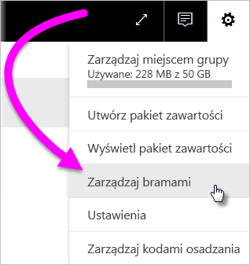
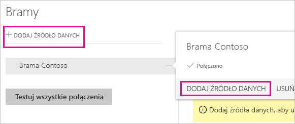
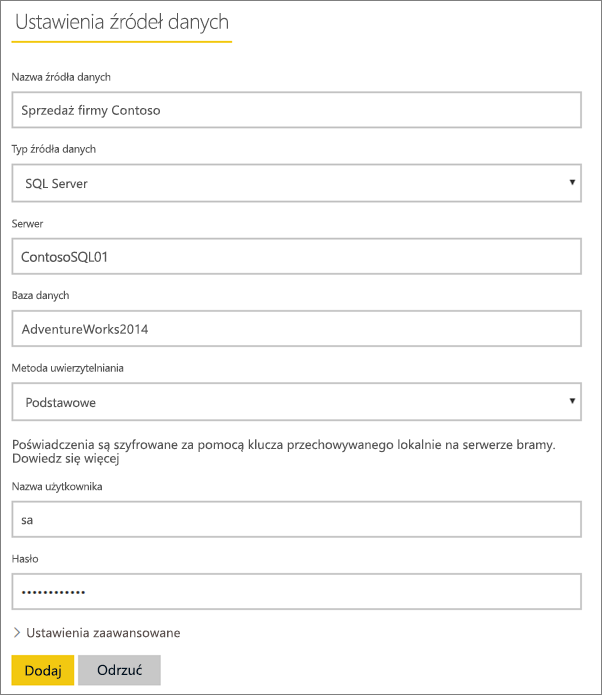
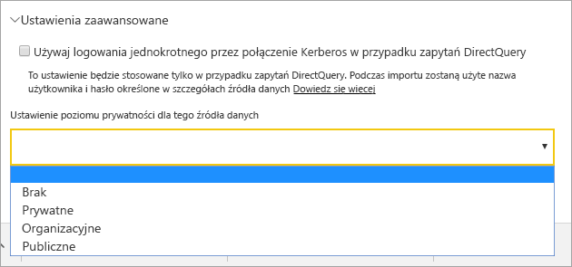
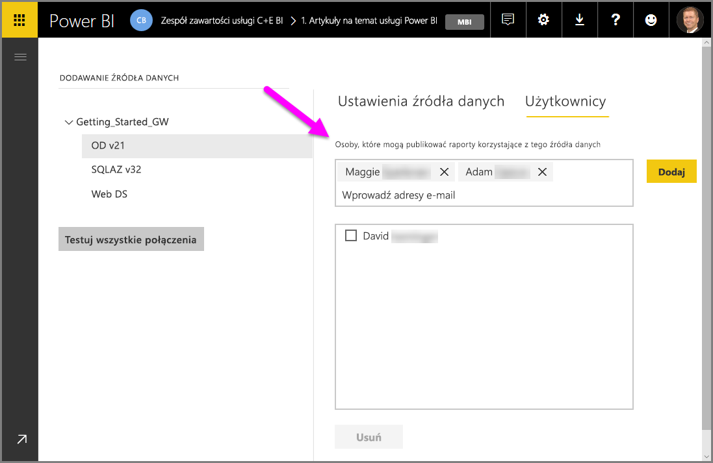
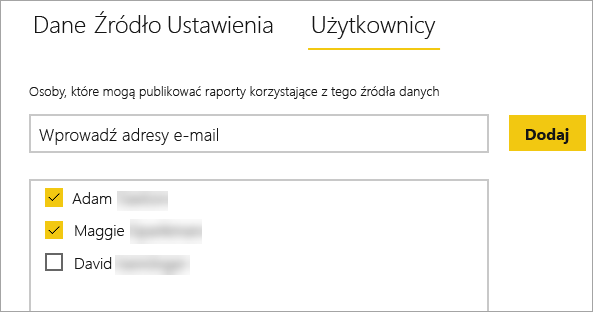
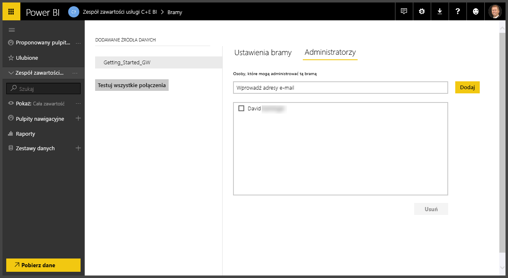
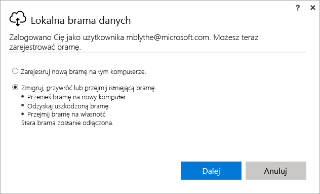
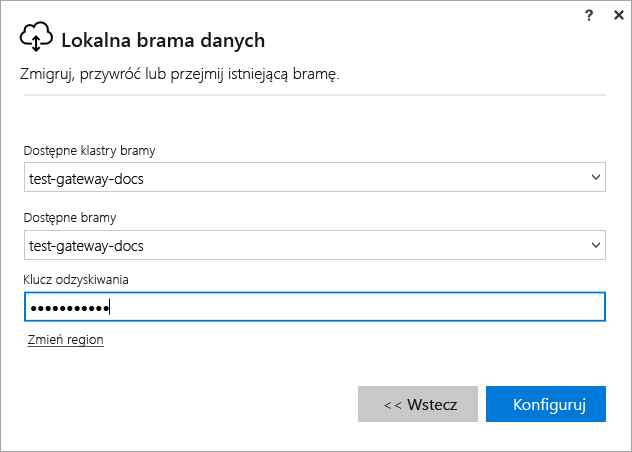

# Zarządzanie bramą usługi Power BI

Po [zainstalowaniu bramy danych usługi Power BI](service-gateway-install.md) można nią zarządzać zgodnie z wymaganiami. W tym temacie omówiono sposób wykonywania następujących czynności: dodawanie i usuwanie źródeł danych oraz użytkowników, ponowne uruchamianie bramy oraz migrowanie, przywracanie, przejmowanie i usuwanie bramy. 

Bramą można zarządzać w obszarze **Zarządzanie bramami** w usłudze Power BI, w aplikacji bramy na komputerze lokalnym oraz za pomocą skryptów programu PowerShell. Ten artykuł koncentruje się na usłudze Power BI. 

Jeśli brama została właśnie zainstalowana, zalecamy [dodanie źródła danych](#add-a-data-source), a następnie [dodanie użytkowników](#add-users-to-a-data-source), aby mogli uzyskiwać dostęp do źródła danych.

## Zarządzanie źródłami danych

Usługa Power BI obsługuje wiele lokalnych źródeł danych, z których każde ma własne wymagania. Bramy można użyć z pojedynczym źródłem danych lub z wieloma źródłami danych. W tym przykładzie pokażemy Ci sposób dodawania serwera SQL Server jako źródła danych, ale te kroki są podobne w przypadku innych źródeł danych.

### Dodawanie źródła danych

1. W prawym górnym rogu ekranu usługi Power BI wybierz ikonę koła zębatego  > **Zarządzaj bramami**.

    

2. Wybierz bramę > **Dodaj źródło danych** lub przejdź do obszaru Bramy > **Dodaj źródło danych**.

    

3. Wybierz **Typ źródła danych**.

    

4. Wprowadź informacje dotyczące źródła danych. W tym przykładzie jest to **Serwer**, **Baza danych** oraz inne informacje.  

    

5. W przypadku programu SQL Server należy wybrać w polu **Metoda uwierzytelniania** wartość **Windows** lub **Podstawowe** (uwierzytelnianie SQL).  W przypadku wybrania wartości **Podstawowe** wprowadź poświadczenia źródła danych.

6. W obszarze **Zaawansowane ustawienia** opcjonalnie skonfiguruj [poziom prywatności](https://support.office.com/article/Privacy-levels-Power-Query-CC3EDE4D-359E-4B28-BC72-9BEE7900B540) źródła danych (nie dotyczy trybu [DirectQuery](desktop-directquery-about.md)).

    

7. Wybierz pozycję **Dodaj**. W przypadku powodzenia procesu jest wyświetlany komunikat *Łączenie przebiegło pomyślnie*.

    

Teraz możesz używać tego źródła danych, aby uwzględniać dane z programu SQL Server na pulpitach nawigacyjnych i w raportach usługi Power BI.

### Usuwanie źródła danych

Źródło danych, które nie jest już używane, można usunąć. Pamiętaj, że usunięcie źródła danych spowoduje zatrzymanie działania wszystkich pulpitów nawigacyjnych lub raportów, które są zależne od tego źródła danych.

Aby usunąć źródło danych, przejdź do źródła danych, a następnie wybierz pozycję **Usuń**.

## Zarządzanie rolami i administratorami

Po dodaniu źródła danych do bramy można nadać użytkownikom i grupom zabezpieczeń prawa dostępu do określonego źródła danych (nie całej bramy). Lista użytkowników źródła danych umożliwia kontrolowanie tylko użytkowników, którzy mogą publikować raporty uwzględniające dane ze źródła danych. Właściciele raportów mogą tworzyć pulpity nawigacyjne, pakiety zawartości i aplikacje, a następnie udostępniać je innym użytkownikom.

Można również przyznać użytkownikom i grupom zabezpieczeń administracyjne prawa dostępu do bramy.

### Dodawanie użytkowników do źródła danych

1. W prawym górnym rogu ekranu usługi Power BI wybierz ikonę koła zębatego  > **Zarządzaj bramami**.

2. Wybierz źródło danych, do którego chcesz dodać użytkowników.

3. Wybierz pozycję **Użytkownicy**, a następnie z organizacji wybierz użytkownika, któremu przyznać prawa dostępu do wybranego źródła danych. Na poniższym ekranie widać, że dodawanymi użytkownikami są Maggie i Adam.

    

4. Wybierz pozycję **Dodaj**. Dodany członek zostanie wyświetlony w polu.

    

To wszystko. Pamiętaj, że użytkowników należy dodać do każdego źródła danych, do którego chcesz przyznać dostęp. Każde źródło danych ma osobną listę użytkowników, dlatego należy dodawać ich do poszczególnych źródeł danych oddzielnie.

### Usuwanie użytkowników ze źródła danych

Na karcie **Użytkownicy** dla źródła danych można usuwać użytkowników lub grupy zabezpieczeń korzystające z tego źródła danych.

### Dodawanie i usuwanie administratorów

Na karcie **Administratorzy** bramy możesz dodawać i usuwać użytkowników (lub grupy zabezpieczeń), którzy mogą administrować bramą.

## Zarządzanie klastrem bramy

Po utworzeniu klastra składającego się z co najmniej dwóch bram wszystkie operacje zarządzania bramą, takie jak dodawanie źródła danych lub przyznawanie uprawnień administracyjnych do bramy, mają zastosowanie do wszystkich bram, które są częścią klastra. 

Gdy administratorzy użyją elementu menu **Zarządzaj bramami** dostępnego za pośrednictwem ikony koła zębatego w **usłudze Power BI**, zostanie wyświetlona lista zarejestrowanych klastrów lub poszczególnych bram, ale wystąpienia poszczególnych bram będące elementami członkowskimi klastra nie będą widoczne.

Wszystkie nowe żądania typu **Zaplanowane odświeżanie** i operacje DirectQuery są automatycznie kierowane do podstawowego wystąpienia danego klastra bramy. Jeśli wystąpienie bramy podstawowej nie działa w trybie online, żądanie jest kierowane do innego wystąpienia bramy w klastrze.

## Udostępnianie bramy

Bramy nie można *udostępniać* bezpośrednio, ale można dodać administratorów do bramy oraz użytkowników do źródeł danych bramy. 

Użytkownik, który zainstalował bramę, staje się domyślnie jej administratorem. Jak pokazano wcześniej, administratorzy mogą dodawać inne osoby. Administratorzy mogą również dodawać źródła danych do bramy, skonfigurować oraz usunąć bramę.

Użytkowników można również przypisywać do źródeł danych utworzonych w obrębie poszczególnych bram. Użytkownicy mogą później korzystać z tych źródeł danych w celu odświeżenia raportów usługi Power BI. Nie mogą oni jednak zmienić żadnych źródeł danych ani ustawień bramy.

## Migrowanie, przywracanie lub przejmowanie bramy

Uruchom instalatora bramy na komputerze, na którym chcesz migrować, przywracać lub przejmować bramę.

1. Pobierz i zainstaluj bramę.

2. Po zalogowaniu do konta usługi Power BI zarejestruj bramę. Wybierz pozycję **Migruj, przywróć lub przejmij istniejącą bramę** > **Dalej**.

    

3. Wybierz klaster i bramę spośród dostępnych elementów, a następnie wprowadź klucz odzyskiwania dla wybranej bramy. Wybierz pozycję **Skonfiguruj**.

    

## Ponownie uruchamianie bramy

Brama jest uruchamiana jako usługa systemu Windows. Podobnie jak w przypadku innych usług systemu Windows, istnieje wiele sposobów jej uruchamiania i zatrzymywania. Oto jak to zrobić z poziomu wiersza polecenia.

1. Na maszynie, na której uruchomiono bramę, uruchom wiersz polecenia z uprawnieniami administratora

2. Wprowadź `net stop PBIEgwService` w celu zatrzymania usługi.

3. Wprowadź `net start PBIEgwService` w celu ponownego uruchomienia usługi.

## Usuwanie bramy

Bramę, która nie jest już używana, można usunąć. Należy jednak pamiętać, że usunięcie bramy powoduje usunięcie wszystkich powiązanych z nią źródeł danych. W konsekwencji powoduje to również uszkodzenie wszystkich pulpitów nawigacyjnych i raportów, które są zależne od tych źródeł danych.

1. W prawym górnym rogu ekranu usługi Power BI wybierz ikonę koła zębatego  > **Zarządzaj bramami**.

2. Wybierz bramę > **Usuń**
   
   

## Następne kroki

[Wskazówki dotyczące wdrażania bramy danych](service-gateway-deployment-guidance.md)

Masz więcej pytań? [Odwiedź społeczność usługi Power BI](http://community.powerbi.com/)
