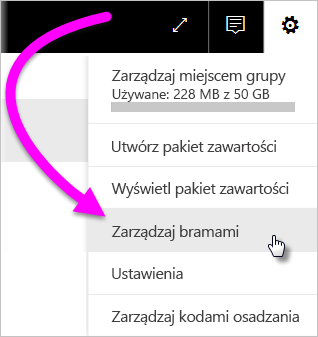
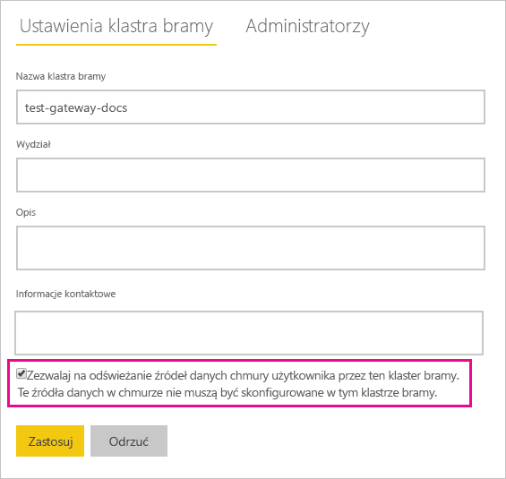
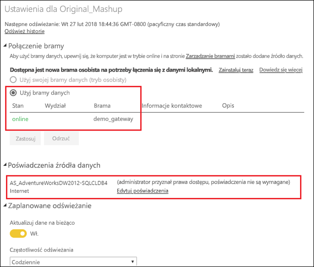

# Scalanie lub dołączanie lokalnych źródeł danych i źródeł danych w chmurze

Lokalna brama danych umożliwia scalanie lub dołączanie lokalnych źródeł danych i źródeł danych w chmurze w jednym zapytaniu. Jest to przydatne, gdy chcesz łączyć dane z wielu źródeł bez konieczności używania oddzielnych zapytań.

## Wymagania wstępne

- [Brama zainstalowana](service-gateway-install.md) na komputerze lokalnym.
- Plik programu Power BI Desktop z zapytaniami, które łączą lokalne źródła danych i źródła danych w chmurze.

1. W prawym górnym rogu ekranu usługi Power BI wybierz ikonę koła zębatego  > **Zarządzaj bramami**.

    

2. Wybierz bramę, którą chcesz skonfigurować.

3. W obszarze **Ustawienia klastra bramy** wybierz pozycję **Zezwalaj na odświeżanie źródeł danych chmury użytkownika przez ten klaster bramy** > **Zastosuj**.

    

4. W tym klastrze bramy dodaj wszelkie [lokalne źródła danych](service-gateway-enterprise-manage-scheduled-refresh.md#add-a-data-source) używane w zapytaniach. Nie trzeba dodawać tutaj źródeł danych w chmurze.

5. Przekaż do usługi Power BI plik programu Power BI Desktop z zapytaniami, które łączą lokalne źródła danych i źródła danych w chmurze.

6. Na stronie **Ustawienia zestawu danych** dla nowego zestawu danych:

   - W przypadku źródła lokalnego wybierz bramę skojarzoną z tym źródłem danych.

   - W obszarze **Poświadczenia źródła danych** edytuj poświadczenia źródła danych w chmurze stosownie do potrzeb.

     

7. Po ustawieniu poświadczeń w chmurze możesz odświeżyć zestaw danych za pomocą opcji **Odśwież teraz** lub zaplanować jego okresowe odświeżanie.

## Następne kroki

Aby dowiedzieć się więcej na temat odświeżania danych dla bram, zobacz [Używanie źródła danych do zaplanowanego odświeżania](service-gateway-enterprise-manage-scheduled-refresh.md#using-the-data-source-for-scheduled-refresh).