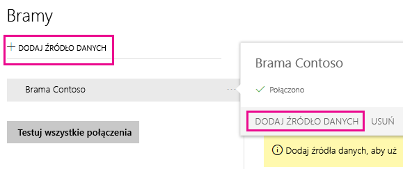
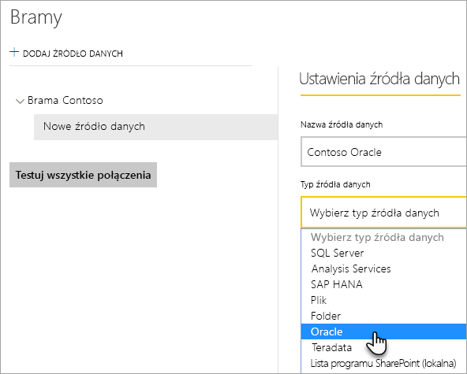
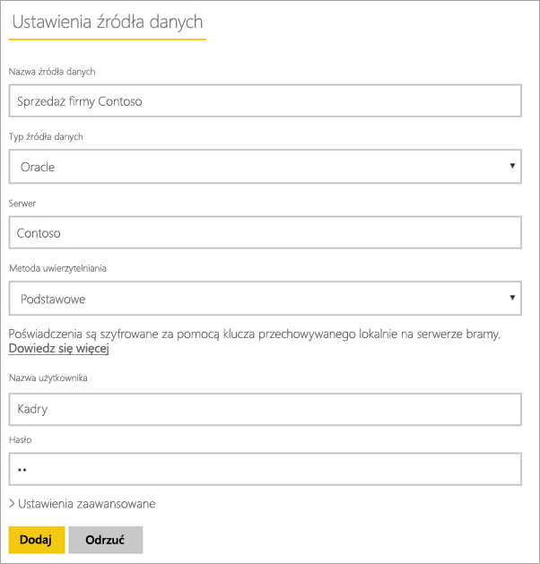
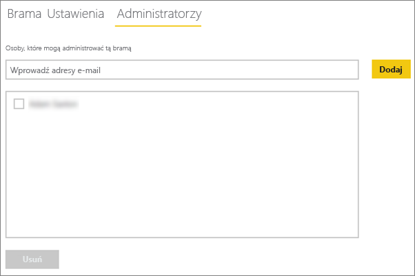
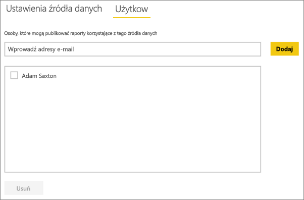

# <a name="manage-your-data-source---oracle"></a>Zarządzanie źródłami danych — Oracle
Po zainstalowaniu lokalnej bramy danych musisz dodać źródła danych, które mogą być używane z tą bramą. W tym artykule opisano sposób pracy z bramami i źródłami danych. Źródła danych Oracle można użyć na potrzeby zaplanowanego odświeżania lub zapytania bezpośredniego.

## <a name="download-and-install-the-gateway"></a>Pobieranie i instalowanie bramy
Bramę można pobrać z poziomu usługi Power BI. Wybierz pozycję **Pliki do pobrania** > **Brama danych** lub przejdź na [stronę pobierania bramy](https://go.microsoft.com/fwlink/?LinkId=698861).


> [!WARNING]
> Aby umożliwić bramie danych połączenie z serwerem Oracle, należy zainstalować i skonfigurować dostawcę danych programu Oracle dla programu .NET (ODP.NET). Jest to część programu Oracle Data Access Components (ODAC). Aby uzyskać więcej informacji na temat pobierania dostawcy Oracle, zapoznaj się z sekcją [Instalowanie klienta Oracle](#installing-the-oracle-client) poniżej.
> 
> 

## <a name="installing-the-oracle-client"></a>Instalowanie klienta Oracle
W przypadku **32-bitowych** wersji programu Power BI Desktop użyj następującego linku, aby pobrać i zainstalować **32-bitową** wersję klienta Oracle:

* [32-bitowa wersja programu Oracle Data Access Components (ODAC) z programem Oracle Developer Tools dla programu Visual Studio (12.1.0.2.4)](http://www.oracle.com/technetwork/topics/dotnet/utilsoft-086879.html)

W przypadku **64-bitowej** wersji programu Power BI Desktop lub lokalnej bramy danych użyj następującego linku, aby pobrać i zainstalować **64-bitową** wersję klienta Oracle:

* [64-bitowa wersja programu ODAC 12.2c w wersji 1 (12.2.0.1.0) dla systemu Windows x64](http://www.oracle.com/technetwork/database/windows/downloads/index-090165.html)

Po zainstalowaniu klienta konieczne będzie skonfigurowanie pliku tnsnames.ora przy użyciu odpowiednich informacji o bazie danych. Program Power BI Desktop oraz brama korzystają z nazwy net_service_name zdefiniowanej w pliku tnsnames.ora. Jeśli plik nie zostanie skonfigurowany, nie będzie można nawiązać połączenia. Ścieżka domyślna pliku tnsnames.ora jest następująca: `[Oracle Home Directory]\Network\Admin\tnsnames.ora`. Aby uzyskać więcej informacji na temat konfigurowania plików tnsnames.ora, zapoznaj się z artykułem [Oracle: Local Naming Parameters (tnsnames.ora) (Oracle: lokalne parametry nazywania — tnsnames.ora)](https://docs.oracle.com/cd/B28359_01/network.111/b28317/tnsnames.htm).

### <a name="example-tnsnamesora-file-entry"></a>Przykładowy wpis w pliku tnsnames.ora
Podstawowy format wpisu w pliku tnsname.ora jest następujący.

```
net_service_name=
 (DESCRIPTION=
   (ADDRESS=(protocol_address_information))
   (CONNECT_DATA=
     (SERVICE_NAME=service_name)))
```

Oto przykład wprowadzonych informacji na temat serwera oraz portu.

```
CONTOSO =
  (DESCRIPTION =
    (ADDRESS = (PROTOCOL = TCP)(HOST = oracleserver.contoso.com)(PORT = 1521))
    (CONNECT_DATA =
      (SERVER = DEDICATED)
      (SERVICE_NAME = CONTOSO)
    )
  )
```

## <a name="add-a-gateway"></a>Dodawanie bramy
Aby dodać bramę, po prostu [pobierz](https://go.microsoft.com/fwlink/?LinkId=698861) i zainstaluj ją na serwerze w swoim środowisku. Po zainstalowaniu bramy zostanie ona wyświetlona na liście bram w obszarze **Zarządzanie bramami**.

> [!NOTE]
> Obszar **Zarządzanie bramami** nie zostanie wyświetlony, dopóki użytkownik nie będzie administratorem co najmniej jednej bramy. Może to nastąpić po dodaniu użytkownika jako administratora lub przez zainstalowanie i skonfigurowanie bramy.
> 
> 

## <a name="remove-a-gateway"></a>Usuwanie bramy
Usunięcie bramy spowoduje także usunięcie wszystkich źródeł danych w ramach tej bramy.  Spowoduje to również uszkodzenie wszystkich pulpitów nawigacyjnych i raportów, które są zależne od tych źródeł danych.

1. Wybierz ikonę koła zębatego  w prawym górnym rogu, a następnie wybierz pozycję **Zarządzaj bramami**.
2. Wybierz pozycję Brama, a następnie pozycję **Usuń**
   
   

## <a name="add-a-data-source"></a>Dodawanie źródła danych
Źródło danych możesz dodać, wybierając bramę i klikając pozycję **Dodaj źródło danych** lub przechodząc do obszaru Brama i wybierając pozycję **Dodaj źródło danych**.



Następnie możesz wybrać z listy **typ źródła danych**.



Następnie możesz podać informacje dla źródła danych, które obejmują **serwer** i **bazę danych**.  

Konieczne będzie również wybranie **metody uwierzytelniania**.  Może ona mieć dwie wartości: **Windows** lub **Podstawowe**.  Jeśli zamierzasz użyć konta utworzonego w programie Oracle, lepiej wybrać opcję **Podstawowe** zamiast uwierzytelniania systemu Windows. Następnie wprowadź poświadczenia, które będą używane dla tego źródła danych.

> [!NOTE]
> Wszystkie zapytania w tym źródle danych będą wykonywane z użyciem tych poświadczeń. Aby uzyskać dodatkowe informacje, zobacz główny artykuł na temat lokalnej bramy danych, z którego możesz dowiedzieć się więcej na temat przechowywania [poświadczeń](service-gateway-onprem.md#credentials).
> 
> 



Po wprowadzeniu wszystkich wymaganych informacji możesz kliknąć pozycję **Dodaj**.  Możesz teraz używać tego źródła danych na potrzeby zaplanowanego odświeżania lub zapytania bezpośredniego względem serwera Oracle działającego lokalnie. W przypadku powodzenia zostanie wyświetlony komunikat *Łączenie przebiegło pomyślnie*.


### <a name="advanced-settings"></a>Ustawienia zaawansowane
Dla źródła danych można skonfigurować poziom prywatności. Służy on do określania sposobu łączenia danych. Jest to używane tylko w przypadku zaplanowanego odświeżania. Nie ma zastosowania względem zapytania bezpośredniego. [Dowiedz się więcej](https://support.office.com/article/Privacy-levels-Power-Query-CC3EDE4D-359E-4B28-BC72-9BEE7900B540)


## <a name="remove-a-data-source"></a>Usuwanie źródła danych
Usunięcie źródła danych spowoduje uszkodzenie wszystkich pulpitów nawigacyjnych lub raportów, które są zależne od tego źródła danych.  

Aby usunąć źródło danych, przejdź do obszaru Źródło danych, a następnie wybierz pozycję **Usuń**.


## <a name="manage-administrators"></a>Zarządzanie administratorami
Na karcie Administratorzy bramy możesz dodawać i usuwać użytkowników (lub grupy zabezpieczeń), którzy mogą administrować bramą.



## <a name="manage-users"></a>Zarządzanie użytkownikami
Na karcie Użytkownicy dla źródła danych można dodawać i usuwać użytkowników (lub grupy zabezpieczeń), którzy mogą używać tego źródła danych.

> [!NOTE]
> Lista użytkowników służy jedynie do kontrolowania, którzy użytkownicy mogą publikować raporty. Właściciele raportów mogą tworzyć pulpity nawigacyjne lub pakiety zawartości i udostępniać je innym użytkownikom. Użytkownicy korzystający z raportu lub pulpitu nawigacyjnego nie muszą znajdować się liście użytkowników.
> 
> 



## <a name="using-the-data-source"></a>Używanie źródła danych
Po utworzeniu źródło danych będzie dostępne do użycia z połączeniami zapytań bezpośrednich lub za pośrednictwem zaplanowanego odświeżania.

> [!WARNING]
> Nazwy serwera i bazy danych muszą być zgodne między programem Power BI Desktop i źródłem danych w ramach lokalnej bramy danych.
> 
> 

Połączenie między zestawem danych i źródłem danych w obrębie bramy jest oparte na nazwie serwera i nazwie bazy danych. Muszą one być zgodne. Na przykład jeśli podasz adres IP jako nazwę serwera w programie Power BI Desktop, konieczne będzie użycie adresu IP dla źródła danych w ramach konfiguracji bramy. Nazwa również musi być zgodna z aliasem zdefiniowanym w pliku tnsnames.ora. Aby uzyskać więcej informacji na temat pliku tnsnames.ora, zapoznaj się z sekcją [Instalowanie klienta Oracle](#installing-the-oracle-client).

Dotyczy to zarówno zapytania bezpośredniego, jak i zaplanowanego odświeżania.

### <a name="using-the-data-source-with-directquery-connections"></a>Używanie źródeł danych z połączeniami zapytań bezpośrednich
Musisz sprawdzić, czy nazwa serwera i nazwa bazy danych w programie Power BI Desktop i skonfigurowanym źródle danych dla bramy są zgodne. Ponadto do publikowania zestawów danych zapytania bezpośredniego wymagane jest, aby użytkownik znajdował się na liście na karcie **Użytkownicy** źródła danych. Wybór na potrzeby zapytania bezpośredniego ma miejsce w programie Power BI Desktop podczas pierwszego importu danych. [Dowiedz się więcej](desktop-use-directquery.md)

Po opublikowaniu zestawu danych w programie Power BI Desktop lub za pomocą funkcji **Pobierz dane** raporty powinny działać. Po utworzeniu źródła danych w obrębie bramy może upłynąć kilka minut, zanim będzie można używać połączenia.

### <a name="using-the-data-source-with-scheduled-refresh"></a>Używanie źródła danych z zaplanowanym odświeżaniem
Jeśli znajdujesz się na liście na karcie **Użytkownicy** źródła danych skonfigurowanego w obrębie bramy, a nazwy serwera i bazy danych są zgodne, brama zostanie wyświetlona jako opcja, która może zostać użyta z zaplanowanym odświeżaniem.


## <a name="troubleshooting"></a>Rozwiązywanie problemów
Jeśli składnia nazwy jest nieprawidłowa lub niewłaściwie skonfigurowana, w programie Oracle może wystąpić kilka błędów.

* ORA-12154: TNS: could not resolve the connect identifier specified (TNS: nie można rozpoznać podanego identyfikatora połączenia)  
* ORA-12514: TNS listener does not currently know of service requested in connect descriptor (Odbiornik TNS nie może obecnie określić usługi żądanej w deskryptorze połączenia)  
* ORA-12541: TNS: no listener (TNS: brak odbiornika)  
* ORA-12170: TNS: Connect timeout occurred (TNS: przekroczono limit czasu połączenia)  
* ORA-12504: TNS listener was not given the SERVICE_NAME in CONNECT_DATA (Odbiornik TNS nie otrzymał parametru SERVICE_NAME w CONNECT_DATA)  

Te błędy mogą występować, jeśli klient Oracle nie został zainstalowany lub nie został poprawnie skonfigurowany. Jeśli został zainstalowany, warto sprawdzić, czy plik tnsnames.ora został poprawnie skonfigurowany, i czy używana jest właściwa nazwa net_service_name. Należy również upewnić się, że nazwa net_service_name jest taka sama dla maszyny, na której jest używany program Power BI Desktop, oraz maszyny, na której uruchomiono bramę. Aby uzyskać więcej informacji, zobacz [Instalowanie klienta Oracle](#installing-the-oracle-client).

> [!NOTE]
> Problem może również spowodować niezgodność wersji serwera Oracle i wersji klienta Oracle. Zwykle powinny one być zgodne.
> 
> 

Aby uzyskać dodatkowe informacje na temat rozwiązywania problemów z bramą, zapoznaj się z artykułem [Rozwiązywanie problemów z lokalną bramą danych](service-gateway-onprem-tshoot.md).

## <a name="next-steps"></a>Następne kroki
[Lokalna brama danych](service-gateway-onprem.md)  
[Lokalna brama danych — szczegóły](service-gateway-onprem-indepth.md)  
[Rozwiązywanie problemów z lokalną bramą danych](service-gateway-onprem-tshoot.md)  
[Power BI Premium](service-premium.md)

Masz więcej pytań? [Zadaj pytanie społeczności usługi Power BI](http://community.powerbi.com/)

