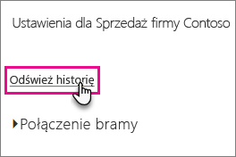

# <a name="troubleshooting-the-on-premises-data-gateway"></a>Rozwiązywanie problemów z lokalną bramą danych

W tym artykule omówiono niektóre typowe problemy, które mogą wystąpić podczas używania **lokalnej bramy danych**.

<!-- Shared Community & support links Include -->
[!INCLUDE [gateway-onprem-tshoot-support-links-include](./includes/gateway-onprem-tshoot-support-links-include.md)]

<!-- Shared Troubleshooting Install Include -->
[!INCLUDE [gateway-onprem-tshoot-install-include](./includes/gateway-onprem-tshoot-install-include.md)]

## <a name="configuration"></a>Konfiguracja

### <a name="how-to-restart-the-gateway"></a>Jak ponownie uruchomić bramę

Brama działa jako usługa systemu Windows, więc można ją uruchamiać i zatrzymywać na kilka sposobów. Na przykład można otworzyć wiersz polecenia z podwyższonym poziomem uprawnień na maszynie, na której brama jest uruchomiona, a następnie uruchomić dowolne z następujących poleceń:

* Aby zatrzymać usługę, uruchom następujące polecenie:

    '''   net stop PBIEgwService   '''

* Aby uruchomić usługę, uruchom następujące polecenie:

    '''   net start PBIEgwService   '''

### <a name="log-file-configuration"></a>Konfiguracja pliku dziennika

Dzienniki usługi bramy są podzielone na trzy kategorie: informacje, błąd i sieć. Taki podział zapewnia środowisko skuteczniejszego rozwiązywania problemów, które pozwala skoncentrować się na konkretnym obszarze, w zależności od błędu lub problemu. Trzy kategorie są widoczne w następującym fragmencie kodu w pliku konfiguracji bramy: `GatewayInfo.log,GatewayErrors.log,GatewayNetwork.log`.

```xml
  <system.diagnostics>
    <trace autoflush="true" indentsize="4">
      <listeners>
        <remove name="Default" />
        <add name="ApplicationFileTraceListener"
             type="Microsoft.PowerBI.DataMovement.Pipeline.Common.Diagnostics.RotatableFilesManagerTraceListener, Microsoft.PowerBI.DataMovement.Pipeline.Common"
             initializeData="%LOCALAPPDATA%\Microsoft\On-premises data gateway\,GatewayInfo.log,GatewayErrors.log,GatewayNetwork.log,20,50" />
      </listeners>
    </trace>
  </system.diagnostics>
```

Domyślnie ten plik znajduje się tutaj: *\Program Files\On-premises data gateway\Microsoft.PowerBI.EnterpriseGateway.exe.config*. Aby skonfigurować liczbę plików dziennika do zachowania, należy zmienić pierwszy numer (w tym przykładzie 20): `GatewayInfo.log,GatewayErrors.log,GatewayNetwork.log,20,50`.

### <a name="error-failed-to-create-a-gateway-try-again"></a>Błąd: Nie można utworzyć bramy. Spróbuj ponownie

Wszystkie szczegóły są dostępne, ale wywołanie usługi Power BI zwróciło błąd. Zostanie wyświetlony błąd oraz identyfikator działania. Przyczyn może być kilka. Aby uzyskać więcej informacji, możesz zebrać i przejrzeć dzienniki zgodnie z poniższymi informacjami.

Ponadto przyczyną mogą być problemy z konfiguracją serwera proxy. Interfejs użytkownika umożliwia teraz konfigurowanie serwera proxy. Dowiedz się więcej na temat wprowadzania [zmian w konfiguracji serwera proxy](service-gateway-proxy.md)

### <a name="error-failed-to-update-gateway-details-please-try-again"></a>Błąd: Nie można zaktualizować szczegółów bramy. Spróbuj ponownie

Odebrano informacje z usługi Power BI do bramy. Informacje zostały przekazane do lokalnej usługi systemu Windows, ale nie zostały zwrócone. Ewentualnie nie powiodło się generowanie klucza zawartości. Wyjątek wewnętrzny jest wyświetlany w obszarze **Pokaż szczegóły**. Aby uzyskać więcej informacji, możesz zebrać i przejrzeć dzienniki wymienione poniżej.

### <a name="error-power-bi-service-reported-local-gateway-as-unreachable-restart-the-gateway-and-try-again"></a>Błąd: Usługa Power BI poinformowała o niedostępności bramy lokalnej. Uruchom ponownie bramę i ponów próbę

Podczas kończenia konfiguracji usługa Power BI jest ponownie wywoływana, aby przeprowadzić walidację bramy. Usługa Power BI nie zgłasza bramy jako *aktywnej*. Ponowne uruchomienie usługi systemu Windows może pozwolić na pomyślne nawiązanie komunikacji. Aby uzyskać więcej informacji, możesz zebrać i przejrzeć dzienniki zgodnie z poniższymi informacjami.

### <a name="script-error-during-sign-into-power-bi"></a>Błąd skryptu podczas logowania się do usługi Power BI

Podczas logowania się do usługi Power BI w ramach konfiguracji lokalnej bramy danych może wystąpić błąd skryptu. Zainstalowanie poniższej aktualizacji zabezpieczeń rozwiązuje ten problem. Można ją zainstalować za pomocą usługi Windows Update.

[MS16-051: Aktualizacja zabezpieczeń programu Internet Explorer: 10 maja 2016 r. (KB 3154070)](https://support.microsoft.com/kb/3154070)

### <a name="gateway-configuration-failed-with-a-null-reference-exception"></a>Konfiguracja bramy nie powiodła się z powodu wyjątku pustej referencji

Wystąpić może błąd podobny do poniższego.

        Failed to update gateway details.  Please try again.
        Error updating gateway configuration.

Obejmuje on ślad stosu, który może zawierać następujący komunikat.

        Microsoft.PowerBI.DataMovement.Pipeline.Diagnostics.CouldNotUpdateGatewayConfigurationException: Error updating gateway configuration. ----> System.ArgumentNullException: Value cannot be null.
        Parameter name: serviceSection

W przypadku uaktualniania starszej bramy plik konfiguracji jest zachowywany. W tym pliku może brakować jakiejś sekcji. Gdy brama podejmie próbę odczytu tego pliku, może wystąpić wspomniany powyżej wyjątek pustej referencji.

Aby rozwiązać ten problem, wykonaj następujące czynności.

1. Odinstaluj bramę.
2. Usuń następujący folder.

        c:\Program Files\On-premises data gateway
3. Ponownie zainstaluj bramę.
4. Opcjonalnie zastosuj klucz odzyskiwania, aby przywrócić istniejącą bramę.

### <a name="support-for-tls-1112"></a>Obsługa protokołu TLS 1.1/1.2

Począwszy od aktualizacji z sierpnia 2017 roku, lokalna brama danych domyślnie używa protokołu Transport Layer Security (TLS) 1.1 lub 1.2 w celu komunikowania się z usługą **Power BI**. Poprzednie wersje lokalnej bramy danych domyślnie używają protokołu TLS 1.0. Musisz uaktualnić instalacje lokalnej bramy danych do wersji z sierpnia 2017 roku lub nowszej, aby zapewnić dalsze działanie bram.

>[!NOTE]
>Obsługa protokołu TLS 1.0 została zakończona 1 listopada 2017 r.

Warto pamiętać, że do 1 listopada 2017 r. protokół TLS 1.0 będzie w dalszym ciągu obsługiwany przez lokalną bramę danych i używany przez nią jako mechanizm rezerwowy. Aby upewnić się, że cały ruch w bramie używa protokołu TLS 1.1 lub 1.2 (i zapobiec używaniu protokołu TLS 1.0), należy dodać lub zmodyfikować następujące klucze rejestru na maszynie, na której działa usługa bramy:

        [HKEY_LOCAL_MACHINE\SOFTWARE\Microsoft\.NETFramework\v4.0.30319]"SchUseStrongCrypto"=dword:00000001
        [HKEY_LOCAL_MACHINE\SOFTWARE\Wow6432Node\Microsoft\.NETFramework\v4.0.30319]"SchUseStrongCrypto"=dword:00000001

> [!NOTE]
> Dodanie lub zmodyfikowanie tych kluczy rejestru powoduje zastosowanie zmiany do wszystkich aplikacji .NET. Informacje na temat zmian rejestru, które mają wpływ na użycie protokołu TLS przez inne aplikacje, są zawarte w artykule [Ustawienia rejestru dla protokołu Transport Layer Security (TLS)](https://docs.microsoft.com/windows-server/security/tls/tls-registry-settings).

## <a name="data-sources"></a>Źródła danych

### <a name="error-unable-to-connect-details-invalid-connection-credentials"></a>Błąd: Nie można nawiązać połączenia. Szczegóły: „Nieprawidłowe poświadczenia połączenia”

W obszarze **Pokaż szczegóły** zostanie wyświetlony komunikat o błędzie otrzymany ze źródła danych. W przypadku programu SQL Server komunikat będzie podobny do poniższego.

    Login failed for user 'username'.

Sprawdź, czy masz prawidłową nazwę użytkownika i hasło. Sprawdź również, czy te poświadczenia pozwalają na pomyślne nawiązanie połączenia ze źródłem danych. Upewnij się, że używane konto jest zgodne z **Metodą uwierzytelniania**.

### <a name="error-unable-to-connect-details-cannot-connect-to-the-database"></a>Błąd: Nie można nawiązać połączenia. Szczegóły: „Nie można połączyć się z bazą danych”

Powiodło się nawiązanie połączenia z serwerem, ale nie z podaną bazą danych. Sprawdź nazwę bazy danych oraz zweryfikuj, czy poświadczenia użytkownika zapewniają prawidłowe uprawnienie dostępu do tej bazy danych.

W obszarze **Pokaż szczegóły** zostanie wyświetlony komunikat o błędzie otrzymany ze źródła danych. W przypadku programu SQL Server komunikat będzie podobny do poniższego.

    Cannot open database "AdventureWorks" requested by the login. The login failed. Login failed for user 'username'.

### <a name="error-unable-to-connect-details-unknown-error-in-data-gateway"></a>Błąd: Nie można nawiązać połączenia. Szczegóły: „Nieznany błąd bramy danych”

Przyczyny wystąpienia tego błędu mogą być różne. Sprawdź, czy możesz nawiązać połączenie ze źródłem danych z maszyny, na której jest hostowana brama. Ten błąd może być spowodowany tym, że serwer jest niedostępny.

W obszarze **Pokaż szczegóły** będzie widoczny kod błędu **DM_GWPipeline_UnknownError**.

Więcej informacji można również uzyskać, wybierając pozycję Dzienniki zdarzeń > **Dzienniki aplikacji i usług** > **Usługa lokalnej bramy danych**.

### <a name="error-we-encountered-an-error-while-trying-to-connect-to-server-details-we-reached-the-data-gateway-but-the-gateway-cant-access-the-on-premises-data-source"></a>Błąd: Napotkano błąd podczas próby nawiązania połączenia z elementem <server>. Szczegóły: „Nawiązaliśmy połączenie z bramą data gateway, ale nie może ona uzyskać dostępu do lokalnego źródła danych”.

Nie możemy nawiązać połączenia z podanym źródłem danych. Pamiętaj, aby weryfikować informacje udostępnione dla tego źródła danych.

W obszarze **Pokaż szczegóły** będzie widoczny kod błędu **DM_GWPipeline_Gateway_DataSourceAccessError**.

Jeśli komunikat o błędzie podstawowym jest podobny do poniższego, oznacza to, że konto używane dla źródła danych nie jest administratorem serwera dla tego wystąpienia usług Analysis Services. [Dowiedz się więcej](https://docs.microsoft.com/sql/analysis-services/instances/grant-server-admin-rights-to-an-analysis-services-instance)

    The 'CONTOSO\account' value of the 'EffectiveUserName' XML for Analysis property is not valid.

Jeśli komunikat o błędzie podstawowym jest podobny do poniższego, może to oznaczać, że konto usługi dla usług Analysis Services nie ma atrybutu katalogu [token-groups-global-and-universal](https://msdn.microsoft.com/library/windows/desktop/ms680300.aspx) (TGGAU).

    The username or password is incorrect.

Domeny z dostępem zapewniającym zgodność z systemami wcześniejszymi niż Windows 2000 mają włączony atrybut TGGAU. Jednak w przypadku większości nowo tworzonych domen ten atrybut nie jest domyślnie włączony. Więcej informacji na temat tego zagadnienia znajdziesz [tutaj](https://support.microsoft.com/kb/331951).

Aby to sprawdzić, wykonaj następujące czynności.

1. Nawiąż połączenie z maszyną usług Analysis Services w programie SQL Server Management Studio. Do właściwości zaawansowanych połączenia dołącz właściwość EffectiveUserName dla użytkownika, którego konto jest sprawdzane, a następnie sprawdź, czy błąd się powtórzy.
2. Aby sprawdzić, czy wspomniany atrybut jest podany, możesz użyć narzędzia dsacls usługi Active Directory. To narzędzie znajduje się na kontrolerze domeny. Musisz dowiedzieć się, jaka jest nazwa wyróżniająca domeny dla tego konta i przekazać ją do tego narzędzia.

        dsacls "CN=John Doe,CN=UserAccounts,DC=contoso,DC=com"

    W wynikach powinien pojawić się komunikat podobny do poniższego.

            Allow BUILTIN\Windows Authorization Access Group
                                          SPECIAL ACCESS for tokenGroupsGlobalAndUniversal
                                          READ PROPERTY

Aby rozwiązać ten problem, musisz włączyć atrybut TGGAU w ramach konta używanego dla usługi systemu Windows usług Analysis Services.

#### <a name="another-possibility-for-username-or-password-incorrect"></a>Inna możliwość, gdy nazwa użytkownika lub hasło są niepoprawne

Ten błąd może się pojawić także wtedy, gdy serwer usług Analysis Services znajduje się w innej domenie niż użytkownicy i nie została ustanowiona dwukierunkowa relacja zaufania.

W takim przypadku konieczna jest współpraca z administratorami domeny w celu zweryfikowania relacji zaufania między domenami.

#### <a name="unable-to-see-the-data-gateway-data-sources-in-the-get-data-experience-for-analysis-services-from-the-power-bi-service"></a>Źródła danych bramy danych nie są widoczne w środowisku pobierania danych dla usług Analysis Services w usłudze Power BI

Upewnij się, że Twoje konto jest widoczne na karcie **Użytkownicy** źródła danych w konfiguracji bramy. Jeśli nie masz dostępu do bramy, skontaktuj się z administratorem bramy i poproś o sprawdzenie. Źródło danych jest widoczne na liście usług Analysis Services tylko w przypadku kont znajdujących się na liście **Użytkownicy**.

### <a name="error-you-dont-have-any-gateway-installed-or-configured-for-the-data-sources-in-this-dataset"></a>Błąd: nie masz zainstalowanej lub skonfigurowanej żadnej bramy na potrzeby źródeł danych w tym zestawie danych

Upewnij się, że dodano co najmniej jedno źródło danych do bramy zgodnie z opisem w sekcji [Dodawanie źródła danych](service-gateway-manage.md#add-a-data-source). Jeśli brama nie jest wyświetlana w portalu administracyjnym w obszarze **Zarządzanie bramami**, spróbuj wyczyścić pamięć podręczną przeglądarki lub wyloguj się z usługi, a następnie zaloguj się do niej ponownie.

## <a name="datasets"></a>Zestawy danych

### <a name="error-there-is-not-enough-space-for-this-row"></a>Błąd: Za mało miejsca dla tego wiersza

Ten błąd występuje, jeśli rozmiar pojedynczego wiersza będzie większy niż 4 MB. Należy określić wiersz powodujący problem w źródle danych i spróbować go odfiltrować lub zmniejszyć jego rozmiar.

### <a name="error-the-server-name-provided-doesnt-match-the-server-name-on-the-sql-server-ssl-certificate"></a>Błąd: Podana nazwa serwera nie jest zgodna z nazwą serwera w certyfikacie SSL programu SQL Server

Ten błąd może wystąpić, gdy nazwa pospolita w certyfikacie dotyczy w pełni kwalifikowanej nazwy domeny (FQDN) serwera, a użytkownik podał tylko nazwę NetBIOS dla serwera. Powoduje to niezgodność certyfikatu. Aby rozwiązać ten problem, należy zmienić nazwę serwera w źródle danych bramy oraz w pliku PBIX tak, aby była używana nazwa FQDN serwera.

### <a name="i-dont-see-the-on-premises-data-gateway-present-when-configuring-scheduled-refresh"></a>Gdy konfiguruję zaplanowane odświeżanie, nie widzę lokalnej bramy danych

Może to być spowodowane kilkoma różnymi scenariuszami.

1. Nazwy serwera i bazy danych wprowadzone w programie Power BI Desktop oraz w źródle danych skonfigurowanym dla bramy są niezgodne. Te wartości muszą być takie same. Wielkość liter nie jest w nich uwzględniana.
2. Twoje konto nie znajduje się na karcie **Użytkownicy** źródła danych w konfiguracji bramy. Musisz skontaktować się z administratorem bramy i poprosić o dodanie Twojego konta do listy.
3. Twój plik programu Power BI Desktop zawiera wiele źródeł danych, a nie wszystkie z nich są skonfigurowane w bramie. Brama będzie widoczna w obszarze Zaplanowane odświeżanie, jeśli każde źródło danych zostanie zdefiniowane w bramie.

### <a name="error-the-received-uncompressed-data-on-the-gateway-client-has-exceeded-the-limit"></a>Błąd: Nieskompresowane dane odebrane na kliencie bramy przekroczyły limit

Dokładne ograniczenie wynosi 10 GB nieskompresowanych danych na tabelę. Jeśli ten problem występuje, istnieją pewne dobre rozwiązania, które pozwalają na optymalizację i uniknięcie tego problemu. W szczególności pomocne jest ograniczenie użycia rzadko zmienianych, długich wartości ciągów, a zamiast nich używanie znormalizowanego klucza lub usunięcie kolumny (jeśli nie jest używana).

## <a name="reports"></a>Raporty

### <a name="report-could-not-access-the-data-source-because-you-do-not-have-access-to-our-data-source-via-an-on-premises-data-gateway"></a>Raport nie mógł uzyskać dostępu do źródła danych, ponieważ nie masz dostępu do naszego źródła danych za pośrednictwem lokalnej bramy danych

Ten problem jest zazwyczaj spowodowany jedną z następujących przyczyn.

1. Informacje o źródle danych są niezgodne z zawartością podstawowego zestawu danych. Nazwa serwera i nazwa bazy danych w źródle danych zdefiniowanym dla lokalnej bramy danych muszą być zgodne z wartościami podanymi w programie Power BI Desktop. Jeśli używasz adresu IP w programie Power BI Desktop, to źródło danych dla lokalnej bramy danych również musi używać adresu IP.
2. Dla żadnej bramy w Twojej organizacji nie jest dostępne żadne źródło danych. Źródło danych możesz skonfigurować w nowej lub istniejącej lokalnej bramie danych.

### <a name="error-data-source-access-error-please-contact-the-gateway-administrator"></a>Błąd: Błąd dostępu do źródła danych. Skontaktuj się z administratorem bramy

Jeśli dany raport używa aktywnego połączenia usług Analysis Services, może wystąpić błąd związany z wartością przekazywaną do właściwości EffectiveUserName, która jest nieprawidłowa lub nie ma uprawnień na maszynie, na której działają usługi Analysis Services. Zazwyczaj problem dotyczący uwierzytelniania wynika z faktu, że wartość przekazywana do właściwości EffectiveUserName nie odpowiada lokalnej głównej nazwie użytkownika (UPN, user principal name).

Aby sprawdzić, czy tak jest, wykonaj poniższą procedurę.

1. Znajdź obowiązującą nazwę użytkownika w [dziennikach bramy](#logs).
2. Gdy ustalisz, jaka wartość jest przekazywana, sprawdź, czy jest poprawna. Jeśli jest to Twoja nazwa użytkownika, możesz wydać poniższe polecenie w wierszu polecenia, aby sprawdzić nazwę UPN. Nazwa UPN wygląda jak adres e-mail.

        whoami /upn

Opcjonalnie możesz sprawdzić, jakie dane usługa Power BI otrzymuje z usługi Azure Active Directory.

1. Przejdź do [https://developer.microsoft.com/graph/graph-explorer](https://developer.microsoft.com/graph/graph-explorer).
2. W prawym górnym roku wybierz pozycję **Sign in** (Zaloguj się).
3. Uruchom następujące zapytanie. Zostanie wyświetlona dosyć duża odpowiedź JSON.

        https://graph.windows.net/me?api-version=1.5
4. Poszukaj właściwości **userPrincipalName**.

Jeśli Twoja nazwa UPN w usłudze Azure Active Directory nie jest zgodna z Twoją nazwą UPN w lokalnej usłudze Active Directory, możesz skorzystać z funkcji [Mapowanie nazw użytkowników](service-gateway-enterprise-manage-ssas.md#map-user-names), aby zastąpić ją poprawną wartością. Alternatywnie możesz skontaktować się z administratorem Twojej dzierżawy albo administratorem lokalnej usługi Active Directory i poprosić o zmianę nazwy UPN.

<!-- Shared Troubleshooting Firewall/Proxy Include -->
[!INCLUDE [gateway-onprem-tshoot-firewall-include](./includes/gateway-onprem-tshoot-firewall-include.md)]

Aby ustalić obszar centrum danych, do którego należysz, wykonaj poniższą procedurę:

1. Wybierz ikonę **?** w prawym górnym rogu usługi Power BI.
2. Wybierz pozycję **Power BI — informacje**.
3. Twój obszar danych jest wyświetlany w obszarze **Dane są przechowywane w lokalizacji**.

    

Jeśli nadal nie udało się przybliżyć do rozwiązania tego problemu, możesz spróbować uzyskać ślad sieci za pomocą narzędzia [fiddler](#fiddler) lub netsh, ale są to zaawansowane metody zbierania i możesz potrzebować pomocy w przeanalizowaniu zebranych danych. W celu uzyskania pomocy możesz skontaktować się z [pomocą techniczną](https://support.microsoft.com).

## <a name="performance"></a>Wydajność

<iframe width="560" height="315" src="https://www.youtube.com/embed/IJ_DJ30VNk4?showinfo=0" frameborder="0" allowfullscreen></iframe>

### <a name="performance-counters"></a>Liczniki wydajności

Istnieje szereg liczników wydajności, które mogą posłużyć do pomiaru działań bramy. Dzięki nim łatwiej jest zrozumieć, czy obciążenie działaniami jest duże i czy konieczne jest utworzenie nowej bramy. Te liczniki nie odzwierciedlają czasu trwania poszczególnych działań.

Dostęp do tych liczników można uzyskiwać z Monitora wydajności systemu Windows.


Liczniki są podzielone na grupy ogólne.

| Typ licznika | Opis |
| --- | --- |
| ADO.NET |Używany w przypadku dowolnego połączenia zapytania bezpośredniego. |
| ADOMD |Używany w przypadku usług Analysis Services 2014 i wcześniejszych wersji. |
| OLEDB |Używany przez niektóre źródła danych. Dotyczy to m.in. rozwiązania SAP HANA oraz usług Analysis Service 2016 i nowszych wersji. |
| Mashup |Obejmuje dowolne zaimportowane źródło danych. Jeśli planujesz odświeżanie lub wykonujesz odświeżanie na żądanie, ta operacja przechodzi przez aparat mashupów. |

Poniżej znajduje się lista dostępnych liczników wydajności.

| Licznik | Opis |
| --- | --- |
| Liczba wykonanych otwarć połączenia ADO.NET na sekundę |Liczba wykonanych w ciągu sekundy akcji otwarcia połączenia ADO.NET (zakończonych powodzeniem lub niepowodzeniem). |
| Liczba zakończonych niepowodzeniem otwarć połączenia ADO.NET na sekundę |Liczba wykonanych w ciągu sekundy akcji otwarcia połączenia ADO.NET, które zakończyły się niepowodzeniem. |
| Liczba wykonanych zapytań ADO.NET na sekundę |Liczba wykonanych w ciągu sekundy zapytań ADO.NET (zakończonych powodzeniem lub niepowodzeniem). |
| Liczba zakończonych niepowodzeniem zapytań ADO.NET na sekundę |Liczba wykonanych w ciągu sekundy zapytań ADO.NET, które zakończyły się niepowodzeniem. |
| Liczba wykonanych otwarć połączenia ADOMD na sekundę |Liczba wykonanych w ciągu sekundy akcji otwarcia połączenia ADOMD (zakończonych powodzeniem lub niepowodzeniem). |
| Liczba zakończonych niepowodzeniem otwarć połączenia ADOMD na sekundę |Liczba wykonanych w ciągu sekundy akcji otwarcia połączenia ADOMD, które zakończyły się niepowodzeniem. |
| Liczba wykonanych zapytań ADOMD na sekundę |Liczba wykonanych w ciągu sekundy zapytań ADOMD (zakończonych powodzeniem lub niepowodzeniem). |
| Liczba zakończonych niepowodzeniem zapytań ADOMD na sekundę |Liczba wykonanych w ciągu sekundy zapytań ADOMD, które zakończyły się niepowodzeniem. |
| Liczba wykonanych otwarć wszystkich połączeń na sekundę |Liczba wykonanych w ciągu sekundy akcji otwarcia połączenia (zakończonych powodzeniem lub niepowodzeniem). |
| Liczba zakończonych niepowodzeniem otwarć wszystkich połączeń na sekundę |Liczba wykonanych w ciągu sekundy akcji otwarcia połączenia, które zakończyły się niepowodzeniem. |
| Liczba wykonanych wszystkich zapytań na sekundę |Liczba wykonanych w ciągu sekundy zapytań (zakończonych powodzeniem lub niepowodzeniem). |
| Liczba elementów w puli połączeń ADO.NET |Liczba elementów w puli połączeń ADO.NET. |
| Liczba elementów w puli połączeń OLEDB |Liczba elementów w puli połączeń OLEDB. |
| Liczba elementów w puli usługi Service Bus |Liczba elementów w puli usługi Service Bus. |
| Liczba wykonanych otwarć połączenia Mashup na sekundę |Liczba wykonanych w ciągu sekundy akcji otwarcia połączenia Mashup (zakończonych powodzeniem lub niepowodzeniem). |
| Liczba zakończonych niepowodzeniem otwarć połączenia Mashup na sekundę |Liczba wykonanych w ciągu sekundy akcji otwarcia połączenia Mashup, które zakończyły się niepowodzeniem. |
| Liczba wykonanych zapytań Mashup na sekundę |Liczba wykonanych w ciągu sekundy zapytań Mashup (zakończonych powodzeniem lub niepowodzeniem). |
| Liczba zakończonych niepowodzeniem zapytań Mashup na sekundę |Liczba wykonanych w ciągu sekundy zapytań Mashup, które zakończyły się niepowodzeniem. |
| Liczba zakończonych niepowodzeniem zapytań z wieloma zestawami wyników OLEDB na sekundę |Liczba zestawów wielu wyników zakończonych niepowodzeniem zapytań OLEDB wykonanych w ciągu sekundy. |
| Liczba zestawów wielu wyników OLEDB dla wykonanych zapytań na sekundę |Liczba zestawów wielu wyników OLEDB dla wykonanych zapytań na sekundę (zakończonych powodzeniem lub niepowodzeniem). |
| Liczba wykonanych otwarć połączenia OLEDB na sekundę |Liczba wykonanych w ciągu sekundy akcji otwarcia połączenia OLEDB (zakończonych powodzeniem lub niepowodzeniem). |
| Liczba zakończonych niepowodzeniem otwarć połączenia OLEDB na sekundę |Liczba wykonanych w ciągu sekundy akcji otwarcia połączenia OLEDB, które zakończyły się niepowodzeniem. |
| Liczba wykonanych zapytań OLEDB na sekundę |Liczba zestawów wielu wyników OLEDB dla wykonanych zapytań na sekundę (zakończonych powodzeniem lub niepowodzeniem). |
| Liczba zakończonych niepowodzeniem zapytań OLEDB na sekundę |Liczba zestawów wielu wyników OLEDB zakończonych niepowodzeniem zapytań wykonanych w ciągu sekundy. |
| Liczba wykonanych zapytań OLEDB z pojedynczym zestawem wyników na sekundę |Liczba wykonanych w ciągu sekundy zapytań OLEDB z pojedynczym zestawem wyników (zakończonych powodzeniem lub niepowodzeniem). |
| Liczba zakończonych niepowodzeniem zapytań na sekundę |Liczba wykonanych w ciągu sekundy zapytań, które zakończyły się niepowodzeniem. |
| Liczba zakończonych niepowodzeniem zapytań OLEDB z pojedynczym zestawem wyników na sekundę |Liczba wykonanych w ciągu sekundy zapytań OLEDB z pojedynczym zestawem wyników, które zakończyły się niepowodzeniem. |

## <a name="reviewing-slow-performing-queries"></a>Przeglądanie wolno działających zapytań

Odpowiedzi za pośrednictwem bramy mogą być zwracane z opóźnieniem. Może to dotyczyć zapytań bezpośrednich lub występować podczas odświeżania zaimportowanego zestawu danych. Możesz włączyć dodatkowe rejestrowanie, aby zapisywać dane wyjściowe zapytań oraz ich czas i w ten sposób dowiedzieć się, co działa wolno. Gdy znajdziesz wolno działające zapytanie, konieczne może być wprowadzenie dodatkowych modyfikacji w Twoim źródle danych celem poprawy wydajności zapytań. Na przykład skorygowanie indeksów dla zapytań programu SQL Server.

W celu ustalenia czasu trwania zapytania musisz zmodyfikować dwa pliki konfiguracji.

### <a name="microsoftpowerbidatamovementpipelinegatewaycoredllconfig"></a>Microsoft.PowerBI.DataMovement.Pipeline.GatewayCore.dll.config

W pliku *Microsoft.PowerBI.DataMovement.Pipeline.GatewayCore.dll.config* zmień wartość właściwości `EmitQueryTraces` z `False` na `True`. Domyślna lokalizacja tego pliku to *C:\Program Files\On-premises data gateway*. Włączenie właściwości `EmitQueryTraces` powoduje rozpoczęcie rejestrowania zapytań wysyłanych z bramy do źródła danych.

> [!IMPORTANT]
> Włączenie właściwości EmitQueryTraces może — w zależności od użycia bramy — znacznie zwiększyć rozmiar dziennika. Gdy skończysz przeglądać dzienniki, ustaw właściwość EmitQueryTraces na wartość False. Nie zaleca się pozostawiania tego ustawienia włączonego przez dłuższy czas.

```
<setting name="EmitQueryTraces" serializeAs="String">
    <value>True</value>
</setting>
```

**Przykładowy wpis zapytania**

```
DM.EnterpriseGateway Information: 0 : 2016-09-15T16:09:27.2664967Z DM.EnterpriseGateway    4af2c279-1f91-4c33-ae5e-b3c863946c41    d1c77e9e-3858-4b21-3e62-1b6eaf28b176    MGEQ    c32f15e3-699c-4360-9e61-2cc03e8c8f4c    FF59BC20 [DM.GatewayCore] Executing query (timeout=224) "<pi>
SELECT
TOP (1000001) [t0].[ProductCategoryName],[t0].[FiscalYear],SUM([t0].[Amount])
 AS [a0]
FROM
(
(select [$Table].[ProductCategoryName] as [ProductCategoryName],
    [$Table].[ProductSubcategory] as [ProductSubcategory],
    [$Table].[Product] as [Product],
    [$Table].[CustomerKey] as [CustomerKey],
    [$Table].[Region] as [Region],
    [$Table].[Age] as [Age],
    [$Table].[IncomeGroup] as [IncomeGroup],
    [$Table].[CalendarYear] as [CalendarYear],
    [$Table].[FiscalYear] as [FiscalYear],
    [$Table].[Month] as [Month],
    [$Table].[OrderNumber] as [OrderNumber],
    [$Table].[LineNumber] as [LineNumber],
    [$Table].[Quantity] as [Quantity],
    [$Table].[Amount] as [Amount]
from [dbo].[V_CustomerOrders] as [$Table])
)
 AS [t0]
GROUP BY [t0].[ProductCategoryName],[t0].[FiscalYear] </pi>"
```

### <a name="microsoftpowerbidatamovementpipelinediagnosticsdllconfig"></a>Microsoft.PowerBI.DataMovement.Pipeline.Diagnostics.dll.config

W pliku *Microsoft.PowerBI.DataMovement.Pipeline.Diagnostics.dll.config* zmień wartość właściwości `TracingVerbosity` z `4` na `5`. Domyślna lokalizacja tego pliku to *C:\Program Files\On-premises data gateway*. Zmiana tego ustawienia powoduje rozpoczęcie rejestrowania pełnych wpisów w dzienniku bramy. Dotyczy to także wpisów obejmujących czas trwania. Pełne wpisy możesz również włączyć przez włączenie przycisku „Dodatkowe rejestrowanie” w aplikacji lokalnej bramy danych.

   

> [!IMPORTANT]
> Zmiana wartości właściwości TraceVerbosity na `5` może w zależności od użycia bramy znacznie zwiększyć rozmiar dziennika. Gdy skończysz przeglądać dzienniki, ustaw właściwość TraceVerbosity na wartość `4`. Nie zaleca się pozostawiania tego ustawienia włączonego przez dłuższy czas.

```
<setting name="TracingVerbosity" serializeAs="String">
    <value>5</value>
</setting>
```

<a name="activities"></a>

### <a name="activity-types"></a>Typy działań

| Typ działania | Opis |
| --- | --- |
| MGEQ |Zapytania wykonywane za pośrednictwem platformy ADO.NET. Dotyczy to m.in. źródła danych zapytania bezpośredniego. |
| MGEO |Zapytania wykonywane za pośrednictwem interfejsu OLEDB. Dotyczy to m.in. rozwiązania SAP HANA oraz usług Analysis Service 2016. |
| MGEM |Zapytania wykonywane w aparacie mashupów. Ten typ działania jest używany dla zaimportowanych zestawów danych, które używają zaplanowanego odświeżania lub odświeżania na żądanie. |

### <a name="determine-the-duration-of-a-query"></a>Określanie czasu trwania zapytania
Aby ustalić czas, przez jaki zapytanie względem źródła danych było przetwarzane, możesz wykonać następujące czynności.

1. Otwórz dziennik bramy.
2. Wyszukaj [Typ działania](#activities), aby znaleźć zapytanie. Na przykład może to być typ MGEQ.
3. Zanotuj drugi identyfikator GUID, ponieważ jest to identyfikator żądania.
4. Kontynuuj wyszukiwanie typu działania MGEQ, aż znajdziesz wpis FireActivityCompletedSuccessfullyEvent z czasem trwania. Możesz sprawdzić, czy wpis ma ten sam identyfikator żądania. Czas trwania jest podany w milisekundach.

        DM.EnterpriseGateway Verbose: 0 : 2016-09-26T23:08:56.7940067Z DM.EnterpriseGateway    baf40f21-2eb4-4af1-9c59-0950ef11ec4a    5f99f566-106d-c8ac-c864-c0808c41a606    MGEQ    21f96cc4-7496-bfdd-748c-b4915cb4b70c    B8DFCF12 [DM.Pipeline.Common.TracingTelemetryService] Event: FireActivityCompletedSuccessfullyEvent (duration=5004)

   > [!NOTE]
   > FireActivityCompletedSuccessfullyEvent jest wpisem pełnym. Ten wpis nie jest rejestrowany, chyba że właściwość TraceVerbosity jest ustawiona na poziom 5.

## <a name="firewall-or-proxy"></a>Zapora czy serwer proxy

Więcej informacji na temat podawania danych dotyczących serwera proxy dla bramy zawiera artykuł [Konfigurowanie ustawień serwera proxy dla bram Power BI Gateway](service-gateway-proxy.md).

Możesz sprawdzić, czy zapora lub serwer proxy blokuje połączenia, uruchamiając polecenie [Test-NetConnection](https://docs.microsoft.com/powershell/module/nettcpip/test-netconnection) z poziomu wiersza polecenia programu PowerShell. Powoduje to przetestowanie łączności z usługą Azure Service Bus. Obejmuje to tylko testowanie połączenia sieciowego i nie ma nic wspólnego z usługą serwera w chmurze ani z bramą. Pomaga ono ustalić, czy komputer może łączyć się z Internetem.

    Test-NetConnection -ComputerName watchdog.servicebus.windows.net -Port 9350

> [!NOTE]
> Polecenie Test-NetConnection jest dostępne tylko w systemie Windows Server 2012 R2 i nowszych wersjach. Istnieje również dostępne w systemie Windows 8.1 i nowszych wersjach. We wcześniejszych wersjach tego systemu operacyjnego można używać programu Telnet w celu testowania połączeń przez porty.

Wyniki wyglądają mniej więcej tak, jak poniżej. Różnica jest widoczna w elemencie TcpTestSucceeded. Jeśli **TcpTestSucceeded** nie ma wartości *true*, możliwe, że połączenie jest blokowane przez zaporę.

    ComputerName           : watchdog.servicebus.windows.net
    RemoteAddress          : 70.37.104.240
    RemotePort             : 5672
    InterfaceAlias         : vEthernet (Broadcom NetXtreme Gigabit Ethernet - Virtual Switch)
    SourceAddress          : 10.120.60.105
    PingSucceeded          : False
    PingReplyDetails (RTT) : 0 ms
    TcpTestSucceeded       : True

Jeśli chcesz sprawdzić to dokładnie, zastąp wartości **ComputerName** i **Port** wartościami podanymi dla [portów](https://docs.microsoft.com/power-bi/service-gateway-onprem#ports).

Zapora może także blokować połączenia, które usługa Azure Service Bus nawiązuje z centrami danych platformy Azure. Jeśli tak jest, musisz dodać do listy dozwolonych adresów IP adresy IP tych centrów danych w Twoim regionie, co spowoduje odblokowanie ich adresów IP. Listę adresów IP platformy Azure można uzyskać [tutaj](https://www.microsoft.com/download/details.aspx?id=41653).

### <a name="network-ports-test"></a>Test portów sieciowych

Test portów sieciowych to narzędzie do sprawdzania, czy brama może uzyskiwać dostęp do właściwych portów dla wszystkich serwerów zdalnych, które są wymagane przez bramę na potrzeby przesyłania danych. Jeśli test portów sieciowych nie będzie mógł nawiązać połączenia z żadnym portem, Twoja brama może napotykać problemy z siecią. Jeśli obecnie brama ma problemy z siecią, uruchom test portów sieciowych, aby upewnić się, że masz optymalne środowisko sieciowe.  

#### <a name="start-a-new-test"></a>Rozpoczynanie nowego testu

Nowy test portów sieciowych możesz uruchomić w interfejsie użytkownika lokalnej bramy danych.


Podczas wykonywania testu portów sieciowych brama pobiera listę portów i serwerów z usługi Azure Service Bus, a następnie próbuje połączyć się z wszystkimi serwerami i portami. Gdy link Rozpocznij nowy test zostanie ponownie wyświetlony, wykonywanie testu portów sieciowych zostało zakończone.  

#### <a name="test-results"></a>Wyniki testu

Podsumowanie testu jest widoczne poniżej linku Rozpocznij nowy test w obszarze Ostatnie wyniki testu. Dwa wyniki to Zakończone (powodzenie) i Zakończone (niepowodzenie, zobacz ostatnie wyniki testów). Jeśli test zakończył się powodzeniem, brama pomyślnie nawiązała połączenie ze wszystkimi wymaganymi portami. W przypadku niepowodzenia testu środowisko sieciowe może blokować te wymagane porty i serwery. 


Aby wyświetlić wyniki ostatniego ukończonego testu, wybierz link Otwórz wyniki ostatniego ukończonego testu, jak pokazano poniżej. Wyniki testu zostaną otworzone w domyślnym edytorze tekstu systemu Windows.  

Wyniki testu zawierają listę wszystkich serwerów, portów i adresów IP, które są wymagane przez bramę. Jeśli dla dowolnego portu w wynikach testu jest wyświetlana wartość Zamknięty, jak pokazano poniżej, upewnij się, że środowisko sieciowe nie blokuje połączenia. Może być konieczne skontaktowanie się z administratorem sieci, aby otworzyć wymagane porty.


## <a name="kerberos"></a>Kerberos

Jeśli podstawowy serwer bazy danych i lokalna brama danych nie są prawidłowo skonfigurowane dla [ograniczonego delegowania protokołu Kerberos](service-gateway-sso-kerberos.md), włącz [pełne rejestrowanie](#microsoftpowerbidatamovementpipelinediagnosticsdllconfig) na bramie i jako punkt wyjścia do rozwiązywania problemów zbadaj błędy/ślady w plikach dziennika bramy.

### <a name="impersonationlevel"></a>ImpersonationLevel

Wartość ImpersonationLevel jest powiązana z konfiguracją głównej nazwy usługi (SPN) lub ustawieniem zasad lokalnych.

```
[DataMovement.PipeLine.GatewayDataAccess] About to impersonate user DOMAIN\User (IsAuthenticated: True, ImpersonationLevel: Identification)
```

**Rozwiązanie**

Wykonaj poniższe kroki w celu rozwiązania problemu:
1. Skonfiguruj główną nazwę usługi dla bramy lokalnej
2. Skonfiguruj ograniczone delegowanie w usłudze Active Directory (AD)

### <a name="failedtoimpersonateuserexception-failed-to-create-windows-identity-for-user-userid"></a>FailedToImpersonateUserException: Nie można utworzyć tożsamości systemu Windows dla użytkownika userid

Zostanie zwrócony wyjątek FailedToImpersonateUserException, jeśli nie możesz dokonać personifikacji w imieniu innego użytkownika. Taka sytuacja może wystąpić również w przypadku próby personifikacji konta z innej domeny niż domena, w której znajduje się usługa bramy (jest to ograniczenie).

**Rozwiązanie**

* Sprawdź, czy konfiguracja jest prawidłowa, wykonując kroki opisane w sekcji ImpersonationLevel powyżej
* Sprawdź, czy identyfikator użytkownika, który podejmuje próbę personifikacji, jest prawidłowym kontem usługi AD

### <a name="general-error-1033-error-while-parsing-the-protocol"></a>Błąd ogólny; błąd 1033 podczas analizowania protokołu

Błąd 1033 występuje w sytuacji, gdy identyfikator zewnętrzny skonfigurowany w rozwiązaniu SAP HANA nie jest zgodny z identyfikatorem logowania, jeśli użytkownik jest personifikowany za pomocą nazwy UPN (alias@domain.com). W dziennikach zobaczysz zapis „Oryginalna nazwa UPN »alias@domain.com« została zastąpiona przez nową nazwę UPN »alias@domain.com« w górnej części dzienników błędów, jak pokazano poniżej”.

```
[DM.GatewayCore] SingleSignOn Required. Original UPN 'alias@domain.com' replaced with new UPN 'alias@domain.com.'
```

**Rozwiązanie**

* Rozwiązanie SAP HANA wymaga od personifikowanego użytkownika używania atrybutu sAMAccountName w usłudze AD (alias użytkownika). Jeśli ta wartość jest niepoprawna, zostanie wyświetlony błąd 1033.

    

* W dziennikach zostanie wyświetlona nazwa sAMAccountName (alias), a nie nazwa UPN, która jest aliasem, za którym występuje nazwa domeny (alias@doimain.com)

    

```
      <setting name="ADUserNameReplacementProperty" serializeAs="String">
        <value>sAMAccount</value>
      </setting>
      <setting name="ADServerPath" serializeAs="String">
        <value />
      </setting>
      <setting name="CustomASDataSource" serializeAs="String">
        <value />
      </setting>
      <setting name="ADUserNameLookupProperty" serializeAs="String">
        <value>AADEmail</value>
```

### <a name="sap-aglibodbchdb-dllhdbodbc-communication-link-failure-10709-connection-failed-rte-1-kerberos-error-major-miscellaneous-failure-851968-minor-no-credentials-are-available-in-the-security-package"></a>[SAP AG][LIBODBCHDB DLL][HDBODBC] Błąd łącza komunikacyjnego;-10709 Połączenie nie powiodło się (RTE:[-1] Błąd protokołu Kerberos. Główny: „Inny błąd [851968]”, pomocniczy: „W pakiecie zabezpieczeń nie są dostępne żadne poświadczenia

Jeśli delegowanie nie zostało poprawnie skonfigurowane w usłudze AD, wystąpi błąd -10709 Połączenie nie powiodło się.

**Rozwiązanie**

* Upewnij się, że na karcie delegowania w usłudze AD dla konta usługi bramy znajduje się serwer SAP Hana

   

<!-- Shared Troubleshooting tools Include -->
[!INCLUDE [gateway-onprem-tshoot-tools-include](./includes/gateway-onprem-tshoot-tools-include.md)]

### <a name="refresh-history"></a>Historia odświeżania

Gdy brama jest używana do zaplanowanego odświeżania, **Historia odświeżania** może pomóc w zidentyfikowaniu błędów, które wystąpiły, a także w uzyskaniu przydatnych danych, jeśli musisz utworzyć żądanie obsługi. Przeglądać można zarówno odświeżenia zaplanowane, jak i przeprowadzone na żądanie. Oto sposób uzyskiwania dostępu do **historii odświeżania**.

1. W okienku nawigacji usługi Power BI w obszarze **Zestawy danych** wybierz zestaw danych &gt; otwórz menu &gt; **Zaplanuj odświeżanie**.

    
2. W obszarze **Ustawienia dla...** &gt; **Zaplanuj odświeżanie** wybierz pozycję **Historia odświeżania**.

    

    

Aby uzyskać dodatkowe informacje o rozwiązywaniu problemów ze scenariuszami odświeżania, zapoznaj się z artykułem [Rozwiązywanie problemów ze scenariuszami odświeżania](refresh-troubleshooting-refresh-scenarios.md).

## <a name="next-steps"></a>Następne kroki
[Konfigurowanie ustawień serwera proxy dla bram Power BI Gateway](service-gateway-proxy.md)  
[Lokalna brama danych](service-gateway-onprem.md)  
[Lokalna brama danych — szczegóły](service-gateway-onprem-indepth.md)  
[Zarządzanie źródłem danych — Analysis Services](service-gateway-enterprise-manage-ssas.md)  
[Zarządzanie źródłem danych — SAP HANA](service-gateway-enterprise-manage-sap.md)  
[Zarządzanie źródłem danych — SQL Server](service-gateway-enterprise-manage-sql.md)  
[Zarządzanie źródłem danych — importowanie/zaplanowane odświeżanie](service-gateway-enterprise-manage-scheduled-refresh.md)  
Masz więcej pytań? [Odwiedź społeczność usługi Power BI](http://community.powerbi.com/)
