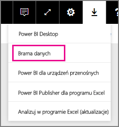
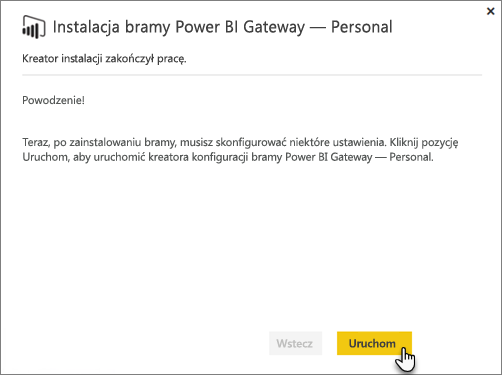
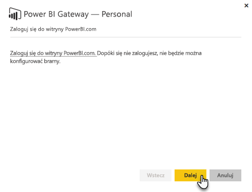
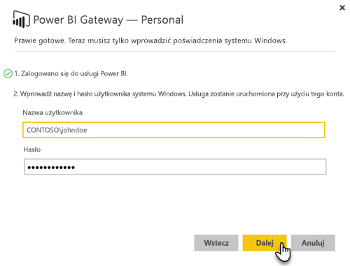

# Lokalna brama danych

Lokalna brama danych działa jak most, zapewniając szybki i bezpieczny transfer danych między lokalnymi danymi (danymi, które nie są w chmurze) a usługami Power BI, Microsoft Flow, Logic Apps i PowerApps.

Brama może być używana z różnymi usługami. Jeśli korzystasz zarówno z usługi Power BI, jak i PowerApps, możesz używać jednej bramy. Zależy to od konta, na które się logujesz.

> [!NOTE]
> We wszystkich trybach pracy lokalnej bramy danych zaimplementowano kompresję danych i szyfrowanie transportu.
> 
> 

<!-- Shared Requirements Include -->
[!INCLUDE [gateway-onprem-requirements-include](./includes/gateway-onprem-requirements-include.md)]

### Ograniczenia połączeń na żywo usług Analysis Services
W przypadku wystąpień tabelarycznych lub wielowymiarowych można używać połączenia na żywo.

| **Wersja serwera** | **Wymagana jednostka SKU** |
| --- | --- |
| 2012 SP1 CU4 lub nowsza |Jednostka SKU w wersji Business Intelligence i Enterprise |
| 2014 |Jednostka SKU w wersji Business Intelligence i Enterprise |
| 2016 |Jednostka SKU w wersji Standard lub wyższej |

* Formatowanie na poziomie komórki i funkcje tłumaczenia nie są obsługiwane.
* Akcje i nazwane zestawy nie są widoczne w usłudze Power BI, ale można łączyć się z wielowymiarowymi modułami zawierającymi akcje lub nazwane zestawy i tworzyć wizualizacje oraz raporty.

<!-- Shared Install steps Include -->
[!INCLUDE [gateway-onprem-datasources-include](./includes/gateway-onprem-datasources-include.md)]

## Pobieranie i instalowanie lokalnej bramy danych
Aby pobrać bramę, wybierz pozycję **Brama danych** w menu Pliki do pobrania. Pobierz [lokalną bramę danych](http://go.microsoft.com/fwlink/?LinkID=820925). 

Należy pamiętać, że zaktualizowanie lokalnej bramy danych odbywa się przez ponowne zainstalowanie bramy, zgodnie z opisem w tej sekcji. Podczas aktualizowania bramy (przez ponowne zainstalowanie) istniejące ustawienia bramy są zachowywane.

<!-- Shared Install steps Include -->
[!INCLUDE [gateway-onprem-install-include](./includes/gateway-onprem-install-include.md)]

## Instalowanie bramy w trybie osobistym
> [!NOTE]
> Wersja Osobista bramy działa tylko z usługą Power BI.

Po zainstalowaniu bramy osobistej musisz uruchomić **Kreatora konfiguracji bramy Power BI Gateway – Personal**.

Następnie zaloguj się do usługi Power BI, aby zarejestrować bramę w usłudze w chmurze.

Musisz również podać nazwę użytkownika i hasło do systemu Windows na potrzeby uruchamiania usługi systemu Windows. Nie musisz wskazywać własnego konta systemu Windows. Usługa bramy zostanie uruchomiona przy użyciu tego konta.

Po zakończeniu instalacji przejdź do zestawów danych w usłudze Power BI i upewnij się, że wprowadzono poświadczenia dla lokalnych źródeł danych.

## Przechowywanie zaszyfrowanych poświadczeń w chmurze
Po dodaniu źródła danych do bramy musisz podać poświadczenia dla tego źródła danych. Wszystkie zapytania w tym źródle danych będą wykonywane z użyciem tych poświadczeń. Przed zapisaniem poświadczeń w chmurze są one bezpiecznie szyfrowane za pomocą asymetrycznych algorytmów, uniemożliwiających odszyfrowanie poświadczeń w chmurze. W przypadku próby dostępu do źródeł danych poświadczenia są wysyłane do maszyny z uruchomioną bramą i odszyfrowywane lokalnie.

<!-- Account and Port information -->
[!INCLUDE [gateway-onprem-accounts-ports-more](./includes/gateway-onprem-accounts-ports-more.md)]

<!-- How the gateway works -->
[!INCLUDE [gateway-onprem-how-it-works-include](./includes/gateway-onprem-how-it-works-include.md)]

## Ograniczenia i istotne zagadnienia
* Usługa [Azure Information Protection](https://docs.microsoft.com/en-us/microsoft-365/enterprise/protect-files-with-aip
) nie jest obecnie obsługiwana
* Usługa [Access Online](https://products.office.com/en-us/access) nie jest obecnie obsługiwana

## Administracja na poziomie dzierżawy 

W tej chwili nie ma jednej lokalizacji, w której administratorzy dzierżaw mogą zarządzać wszystkimi bramami zainstalowanymi i skonfigurowanymi przez innych użytkowników.  Jeśli jesteś administratorem dzierżawy, zalecamy poproszenie użytkowników w Twojej organizacji, aby dodawali Ciebie jako administratora do każdej bramy, którą instalują. Pozwoli Ci to zarządzać wszystkimi bramami w Twojej organizacji z poziomu strony Ustawienia bramy lub za pomocą [poleceń programu PowerShell](https://docs.microsoft.com/power-bi/service-gateway-high-availability-clusters#powershell-support-for-gateway-clusters). 

## Włączanie połączeń wychodzących platformy Azure 
W celu zapewnienia łączności z chmurą lokalna brama danych polega na usłudze Azure Service Bus i odpowiednio ustanawia połączenia wychodzące do skojarzonego regionu świadczenia usługi Azure. Domyślnie jest to lokalizacja dzierżawy usługi Power BI. Dowiedz się, gdzie [znajduje się Twoja dzierżawa usługi Power BI?](https://powerbi.microsoft.com/en-us/documentation/powerbi-admin-where-is-my-tenant-located/)
Jeśli zapora blokuje połączenia wychodzące, należy ją skonfigurować w sposób zezwalający na połączenia wychodzące z lokalnej bramy danych do skojarzonego regionu świadczenia usługi Azure. Szczegółowe informacje dotyczące zakresów adresów IP dla poszczególnych centrów danych platformy Azure można znaleźć w temacie [Microsoft Azure Datacenter IP Ranges (Zakresy adresów IP centrów danych platformy Microsoft Azure)](https://www.microsoft.com/en-us/download/details.aspx?id=41653).
> [!NOTE]
> Zakresy adresów IP mogą z czasem ulec zmianie, dlatego upewnij się, że na bieżąco pobierasz najnowsze informacje. 

## Rozwiązywanie problemów
Jeśli masz problemy z instalacją i konfiguracją bramy, zobacz artykuł [Rozwiązywanie problemów z lokalną bramą danych](service-gateway-onprem-tshoot.md). Jeśli uważasz, że występuje problem z zaporą, zobacz sekcję dotyczącą [zapory lub serwera proxy](service-gateway-onprem-tshoot.md#firewall-or-proxy) w artykule na temat rozwiązywania problemów.

Jeśli sądzisz, że problemy z bramą dotyczą serwera proxy, zobacz [Konfigurowanie ustawień serwera proxy dla bram Power BI Gateway](service-gateway-proxy.md).

## Następne kroki
[Zarządzanie źródłami danych — Analysis Services](service-gateway-enterprise-manage-ssas.md)  
[Zarządzanie źródłem danych — SAP HANA](service-gateway-enterprise-manage-sap.md)  
[Zarządzanie źródłami danych — SQL Server](service-gateway-enterprise-manage-sql.md)  
[Zarządzanie źródłami danych — Oracle](service-gateway-onprem-manage-oracle.md)  
[Zarządzanie źródłami danych — importowanie/zaplanowane odświeżanie](service-gateway-enterprise-manage-scheduled-refresh.md)  
[Lokalna brama danych — szczegóły](service-gateway-onprem-indepth.md)  
[Lokalna brama danych (tryb osobisty) — nowa wersja bramy osobistej](service-gateway-personal-mode.md)
[Konfigurowanie ustawień serwera proxy dla lokalnej bramy danych](service-gateway-proxy.md)  
Masz więcej pytań? [Odwiedź społeczność usługi Power BI](http://community.powerbi.com/)

