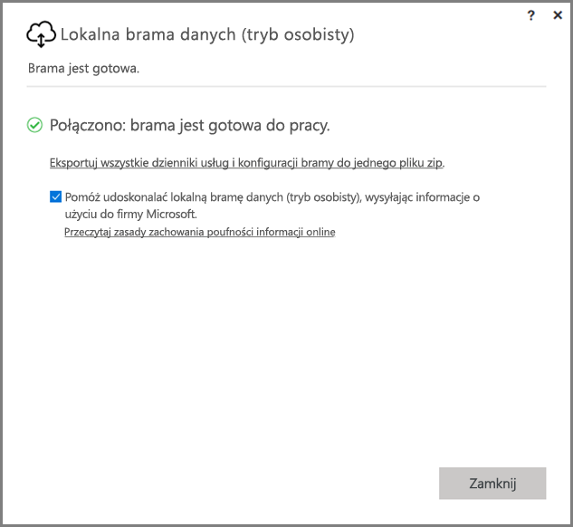
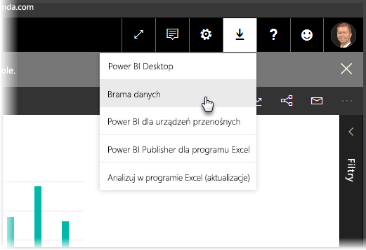
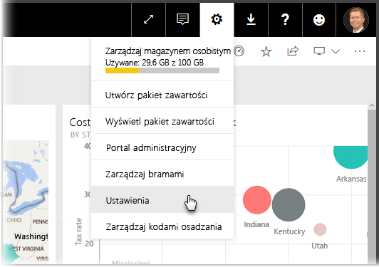
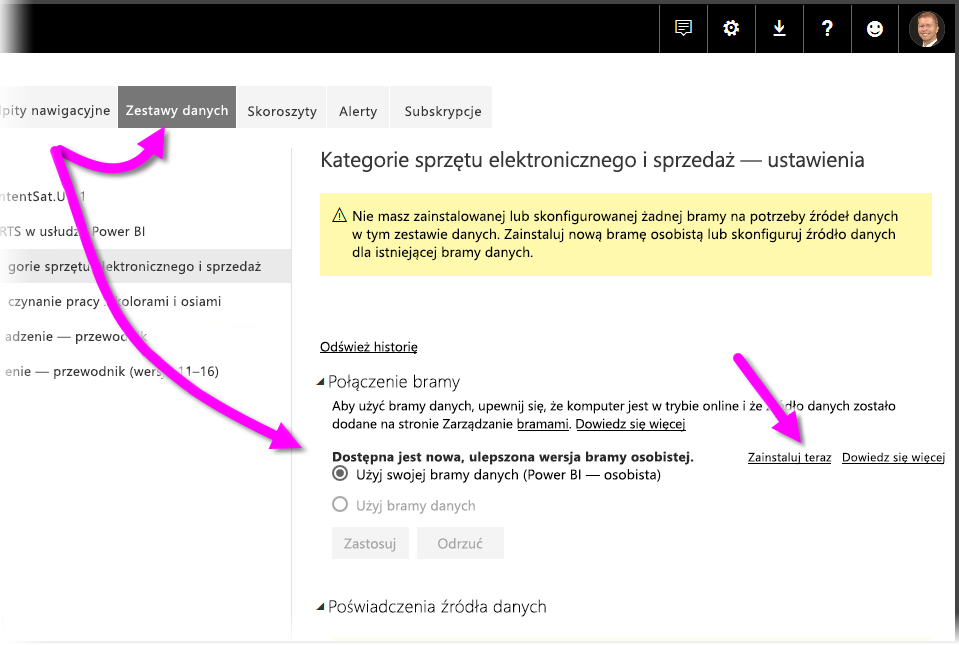
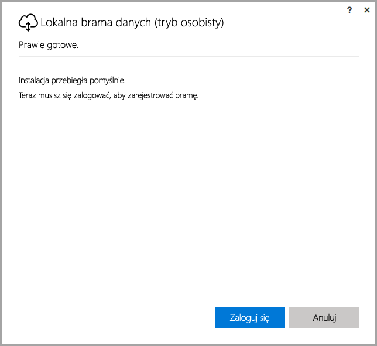
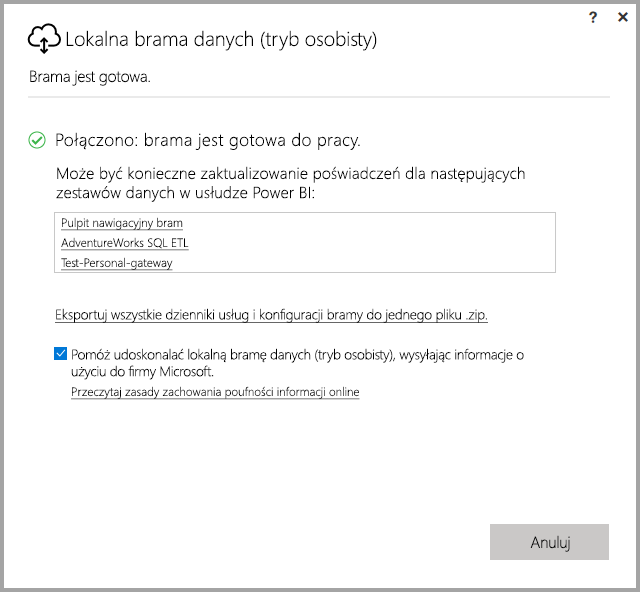

# <a name="on-premises-data-gateway-personal-mode"></a>Lokalna brama danych (tryb osobisty)
Przy użyciu bramy można korzystać z lokalnych źródeł danych oraz tworzyć raporty i pulpity nawigacyjne usługi Power BI. **Brama** to oprogramowanie ułatwiające dostęp do danych przechowywanych w prywatnej sieci lokalnej i umożliwiające użycie tych danych w usługach online, takich jak usługa **Power BI**. **Lokalna brama danych (tryb osobisty)** to udostępniona niedawno aktualizacja bramy usługi Power BI, umożliwiająca użytkownikom indywidualnym zainstalowanie bramy na własnym komputerze w celu uzyskania dostępu do danych lokalnych.



> [!NOTE]
> **Lokalna brama danych (tryb osobisty)** zastępuje poprzednią obsługiwaną wersję bramy osobistej o nazwie **Power BI Gateway — Personal**. Poprzednia wersja bramy osobistej będzie działała do 31 lipca 2017 r. W poniższych sekcjach znajdziesz informacje o sposobie aktualizowania do nowej wersji.
> 
> 

## <a name="features-of-the-on-premises-data-gateway-personal-mode"></a>Funkcje lokalnej bramy danych (tryb osobisty)
Wraz z udostępnieniem **lokalnej bramy danych (tryb osobisty)** wprowadzono szereg usprawnień i nowych funkcji. Wdrożenie poprzedniej wersji bramy osobistej (o nazwie **Power BI Gateway — Personal**) wiązało się z pewnymi ograniczeniami. Tak, jak w przypadku innych produktów Power BI, zwróciliśmy uwagę na potrzeby i życzenia naszych klientów oraz ich sposób korzystania z produktu. Dlatego **lokalna brama danych (tryb osobisty)** została zaprojektowana całkowicie od nowa i zawiera następujące funkcje i ulepszenia:

* **Większa niezawodność** — nowa wersja bramy osobistej jest bardziej niezawodna niż poprzednia dzięki usprawnieniom kodu i struktury oprogramowania.
* **Większa rozszerzalność** — usprawnienia struktury oprogramowania umożliwiają łatwe dodawanie nowo udostępnianych funkcji do bramy osobistej.
* **Usuwanie bramy osobistej z poziomu usługi Power BI** — nowa wersja bramy osobistej może zostać usunięta z poziomu usługi **Power BI**.
* **Dzienniki konfiguracji i usługi** — nowa wersja umożliwia łatwe eksportowanie dzienników konfiguracji i usługi do pliku zip za pomocą jednego kliknięcia.

## <a name="installing-on-premises-data-gateway-personal-mode"></a>Instalowanie lokalnej bramy danych (tryb osobisty)
Aby zainstalować **lokalną bramę danych (tryb osobisty)** bez zainstalowanej poprzedniej wersji bramy, wybierz ikonę koła zębatego w usłudze **Power BI**, a następnie wybierz pozycję **Brama danych**.



Możesz również pobrać bramę z [tej lokalizacji](https://go.microsoft.com/fwlink/?LinkId=820925&clcid=0x409). Postępuj zgodnie z instrukcjami instalacji. W procesie instalacji możesz zainstalować dowolną wersję bramy (bramę standardową, którą można udostępniać innym osobom, lub bramę w trybie osobistym), pamiętaj więc o wybraniu opcji **Lokalna brama danych (tryb osobisty)**, gdy zostanie wyświetlony monit o wybranie wersji bramy do zainstalowania.

### <a name="updating-from-the-previous-personal-gateway"></a>Aktualizowanie z poprzedniej wersji bramy osobistej
Jeśli masz już zainstalowaną bramę **Power BI Gateway — Personal**, monit o zainstalowanie nowej, ulepszonej wersji bramy osobistej będzie wyświetlany w sekcji **Zestawy danych** w obszarze **Ustawienia** w usłudze **Power BI**.



Gdy wybierzesz zestaw danych, a następnie wybierzesz pozycję **Połączenie bramy**, zostanie wyświetlone powiadomienie o dostępności nowej, ulepszonej wersji bramy. W takim przypadku wybierz pozycję **Zainstaluj teraz**.



> [!NOTE]
> Jeśli korzystasz z poprzedniej wersji bramy **Power BI Gateway — Personal** jako procesu o podwyższonym poziomie uprawnień, upewnij się, że proces instalacji nowej bramy również zostanie uruchomiony z podwyższonym poziom uprawnień, dzięki czemu poświadczenia zestawu danych zostaną automatycznie zaktualizowane. W przeciwnym razie konieczne będzie ręczne zaktualizowanie poświadczeń zestawu danych.
> 
> 

Po przejściu przez proces aktualizacji zobaczysz komunikat o powodzeniu instalacji. Nie zamykaj jeszcze wszystkiego, ponieważ pozostała jedna czynność do wykonania.



Oto, co należy zrobić. Po zainstalowaniu nowej bramy osobistej (gdy ostatni ekran instalatora jest jeszcze widoczny) zaloguj się do usługi **Power BI** i zaczekaj na wyświetlenie informacji, że brama działa w trybie online, jak pokazano na poniższej ilustracji.



Jeśli zaktualizowano bramę osobistą na tej samej maszynie, na której była zainstalowana poprzednia wersja bramy, poświadczenia zostaną zaktualizowane automatycznie, a wszystkie czynności odświeżania będą obsługiwane przez nową bramę. Jeśli poprzednia wersja bramy była zainstalowana na innej maszynie, niektóre zestawy danych będą wymagały zaktualizowania poświadczeń. Zwróć uwagę na listę zestawów danych w oknie na poprzedniej ilustracji — na tej liście będą widoczne zestawy danych, które mogą wymagać zaktualizowanych poświadczeń. Każdy zestaw danych na liście to bezpośredni link, który możesz kliknąć, aby łatwo zaktualizować poświadczenia.

To już prawie koniec. Po zainstalowaniu nowej bramy nie potrzebujesz już poprzedniej wersji, więc należy odinstalować ją z maszyny. W tym celu możesz wyszukać bramę **Power BI Gateway — personal** na maszynie i odinstalować ją.

### <a name="determining-which-version-of-the-personal-gateway-you-have-installed"></a>Określanie zainstalowanej wersji bramy osobistej
Aby określić, która wersja bramy osobistej jest aktualnie zainstalowana, możesz wykonać następujące czynności:

* Poprzednia wersja bramy osobistej nosi nazwę **Power BI Gateway — Personal**, a w oknie dialogowym jej instalatora jest używana ikona usługi Power BI.
* Nowa wersja bramy osobistej nosi nazwę **Lokalna brama danych (tryb osobisty)** i ma ikonę bramy (jest to chmura ze strzałką w górę i w dół w dolnej części).

Możesz przejść do apletu **Dodaj/Usuń programy** i sprawdzić, czy brama **Power BI Gateway — Personal** jest widoczna na liście. Jeśli tak, oznacza to, że masz zainstalowaną poprzednią wersję bramy osobistej.

## <a name="using-fast-combine-with-the-personal-gateway"></a>Używanie funkcji szybkiego łączenia z bramą osobistą
Jeśli używano funkcji **szybkiego łączenia** z poprzednią wersją bramy, należy wykonać następujące czynności, aby ponownie włączyć **szybkie łączenie** dla **lokalnej bramy danych (tryb osobisty)**:

1. W Eksploratorze plików otwórz następujący plik:
   
   ```
   %localappdata%\Microsoft\on-premises data gateway (personal mode)\Microsoft.PowerBI.DataMovement.Pipeline.GatewayCore.dll.config
   ```
2. Na końcu pliku dodaj następujący tekst:
   
       ```
       <setting name="EnableFastCombine" serializeAs="String">```
       <value>true</value>
       </setting>
       ```
3. Po skonfigurowaniu to ustawienie zacznie działać po upływie około minuty. Aby sprawdzić, czy **szybkie łączenie** działa prawidłowo, spróbuj przeprowadzić odświeżenie na żądanie w usłudze **Power BI**.

## <a name="limitations-and-considerations"></a>Ograniczenia i istotne zagadnienia
Podczas korzystania z **lokalnej bramy danych (tryb osobisty)** należy mieć na uwadze pewne zagadnienia, opisane poniżej.

* Jeśli do logowania w systemie Windows używasz funkcji **Windows Hello** lub numeru PIN, może wystąpić następujący błąd: 
  * *Wybrane konto użytkownika nie pasuje do wymagań aplikacji. Użyj innego konta.*
  * Aby rozwiązać ten problem, wybierz pozycję *Użyj innego konta* i zaloguj się ponownie. 

**Lokalna brama danych (tryb osobisty)** aktualnie nie obsługuje następujących źródeł danych:

* ADO.NET 
* CurrentWorkbook
* FTP
* HDFS
* SAP BusinessObjects         
* Spark

Wprowadzenie obsługi źródeł danych Spark jest planowane w drugiej połowie roku 2017.

## <a name="frequently-asked-questions-faq"></a>Często zadawane pytania
* Czy można używać **lokalnej bramy danych (tryb osobisty)** jednocześnie z **lokalną bramą danych** (dawniej: bramą przedsiębiorstwa)?
  
  * **Odpowiedź**: Tak, w przypadku nowej wersji można używać obu wariantów jednocześnie.
* Czy można używać **lokalnej bramy danych (tryb osobisty)** jako usługi?
  
  * **Odpowiedź:** Nie. **Lokalna brama danych (tryb osobisty)** może być używana tylko jako aplikacja. Jeśli chcesz używać bramy jako usługi i/lub w trybie administratora, rozważ użycie [**lokalnej bramy danych**](service-gateway-onprem.md) (dawniej: bramy przedsiębiorstwa).
* Jak często jest aktualizowana **lokalna brama danych (tryb osobisty)**?
  
  * **Odpowiedź**: Planujemy comiesięczne aktualizowanie bramy osobistej.
* Dlaczego muszę zaktualizować poświadczenia?
  
  * **Odpowiedź**: Żądanie poświadczeń może występować w wielu sytuacjach. Najczęściej jest to spowodowane zainstalowaniem **lokalnej bramy danych (tryb osobisty)** na innej maszynie niż ta, na której zainstalowano bramę **Power BI Gateway — Personal**. Może to również być spowodowane problemem w źródle danych i niepowodzeniem połączenia testowego w usłudze Power BI, przekroczeniem czasu lub błędem systemu. Możesz zaktualizować poświadczenia w usłudze **Power BI**. W tym celu wybierz **ikonę koła zębatego**, wybierz kolejno pozycje **Ustawienia** i **Zestawy danych**, a następnie znajdź odpowiedni zestaw danych i kliknij pozycję *Zaktualizuj poświadczenia*.
* Jak długo poprzednia wersja bramy osobistej będzie pozostawała w trybie offline podczas uaktualnienia?
  
  * **Odpowiedź**: Uaktualnienie bramy osobistej do nowej wersji powinno potrwać tylko kilka minut. 
* Co się stanie, jeśli nie przeprowadzę migracji do nowej wersji bramy osobistej przed 31 lipca 2017 r.?
  
  * **Odpowiedź**: Jeśli odświeżasz raporty przy użyciu bieżącej bramy, odświeżanie zostanie zatrzymane. Jedynym sposobem na skonfigurowanie nowego harmonogramu odświeżania będzie zainstalowanie i skonfigurowanie nowej bramy.
* Korzystam ze skryptów języka R. Czy są one obsługiwane?
  
  * **Odpowiedź**: Planujemy dodanie obsługi skryptów języka R wkrótce.
* Dlaczego nie widzę monitu o zaktualizowanie bramy w usłudze **Power BI**?
  
  * **Odpowiedź**: Prawdopodobnie dlatego, że co najmniej jeden zestaw danych zawiera źródło danych, które nie jest jeszcze obsługiwane.

## <a name="next-steps"></a>Następne kroki
[Konfigurowanie ustawień serwera proxy dla bram Power BI Gateway](service-gateway-proxy.md)  
Masz więcej pytań? [Odwiedź społeczność usługi Power BI](http://community.powerbi.com/)

