# <a name="tutorial-connect-to-on-premises-data-in-sql-server"></a>Samouczek: łączenie z danymi lokalnymi w programie SQL Server

Lokalna brama danych to oprogramowanie instalowane w sieci lokalnej. Ułatwia ono dostęp do danych w tej sieci. W tym samouczku skompilujesz raport w programie Power BI Desktop w oparciu o dane importowane z programu SQL Server. Następnie opublikujesz raport w usłudze Power BI i skonfigurujesz bramę, aby usługa mogła uzyskiwać dostęp do danych lokalnych. Ten dostęp oznacza, że usługa może odświeżać dane w celu zachowania ich aktualności.

Z tego samouczka dowiesz się, jak wykonywać następujące czynności:
> [!div class="checklist"]
> * Tworzenie raportu na podstawie danych w programie SQL Server
> * Publikowanie raportu w usłudze Power BI
> * Dodawanie programu SQL Server jako źródła danych bramy
> * Odświeżanie danych w raporcie

Jeśli nie masz konta usługi Power BI, na początku [zacznij korzystać z bezpłatnej wersji próbnej](https://app.powerbi.com/signupredirect?pbi_source=web).


## <a name="prerequisites"></a>Wymagania wstępne

* [Zainstalowanie programu Power BI Desktop](https://powerbi.microsoft.com/desktop/)
* [Zainstalowanie programu SQL Server](https://docs.microsoft.com/sql/database-engine/install-windows/install-sql-server) na komputerze lokalnym 
* [Zainstalowanie lokalnej bramy danych](service-gateway-install.md) na tym samym komputerze lokalnym (w środowisku produkcyjnym przeważnie byłby to inny komputer)


## <a name="set-up-sample-data"></a>Kopiowanie przykładowych danych

Rozpocznij od dodania przykładowych danych do programu SQL Server, aby można było używać tych danych w pozostałej części samouczka.

1. W programie SQL Server Management Studio (SSMS) nawiąż połączenie z wystąpieniem programu SQL Server i utwórz testową bazę danych.

    ```sql
    CREATE DATABASE TestGatewayDocs
    ```

2. W utworzonej bazie danych dodaj tabelę i wstaw dane.

    ```sql
    USE TestGatewayDocs

    CREATE TABLE Product (
        SalesDate DATE,
        Category  VARCHAR(100),
        Product VARCHAR(100),
        Sales MONEY,
        Quantity INT
    )

    INSERT INTO Product VALUES('2018-05-05','Accessories','Carrying Case',9924.60,68)
    INSERT INTO Product VALUES('2018-05-06','Accessories','Tripod',1350.00,18)
    INSERT INTO Product VALUES('2018-05-11','Accessories','Lens Adapter',1147.50,17)
    INSERT INTO Product VALUES('2018-05-05','Accessories','Mini Battery Charger',1056.00,44)
    INSERT INTO Product VALUES('2018-05-06','Accessories','Telephoto Conversion Lens',1380.00,18)
    INSERT INTO Product VALUES('2018-05-06','Accessories','USB Cable',780.00,26)
    INSERT INTO Product VALUES('2018-05-08','Accessories','Budget Movie-Maker',3798.00,9)
    INSERT INTO Product VALUES('2018-05-09','Digital video recorder','Business Videographer',10400.00,13)
    INSERT INTO Product VALUES('2018-05-10','Digital video recorder','Social Videographer',3000.00,60)
    INSERT INTO Product VALUES('2018-05-11','Digital','Advanced Digital',7234.50,39)
    INSERT INTO Product VALUES('2018-05-07','Digital','Compact Digital',10836.00,84)
    INSERT INTO Product VALUES('2018-05-08','Digital','Consumer Digital',2550.00,17)
    INSERT INTO Product VALUES('2018-05-05','Digital','Slim Digital',8357.80,44)
    INSERT INTO Product VALUES('2018-05-09','Digital SLR','SLR Camera 35mm',18530.00,34)
    INSERT INTO Product VALUES('2018-05-07','Digital SLR','SLR Camera',26576.00,88)
    ```

3. W tabeli wybierz dane do zweryfikowania.

    ```sql
    SELECT * FROM Product
    ```

    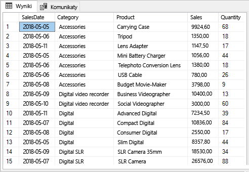


## <a name="build-and-publish-a-report"></a>Kompilowanie i publikowanie raportu

Teraz, gdy masz już przykładowe dane, połączysz się z programem SQL Server w programie Power BI Desktop i skompilujesz raport na podstawie tych danych. Następnie opublikujesz raport w usłudze Power BI.

1. W programie Power BI Desktop na karcie **Narzędzia główne** wybierz pozycję **Pobierz dane** > **SQL Server**.

2. W obszarze **Serwer** wprowadź nazwę serwera, a następnie w obszarze **Baza danych** wprowadź ciąg „TestGatewayDocs”. Wybierz przycisk **OK**. 

    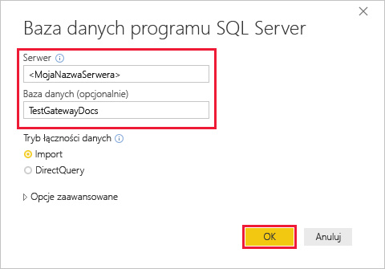

3. Sprawdź poświadczenia, a następnie wybierz pozycję **Połącz**.

4. W obszarze **Nawigator** wybierz tabelę **Product** (Produkt), a następnie wybierz pozycję **Załaduj**.

    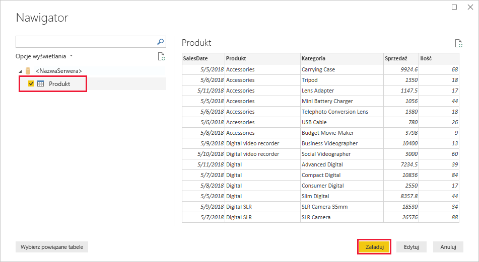

5. W widoku **Raport** programu Power BI Desktop w okienku **Wizualizacje** wybierz pozycję **Skumulowany wykres kolumnowy**.

    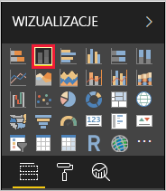    

6. Z wykresem kolumnowym wybranym na kanwie raportu w okienku **Pola** wybierz pola **Category** (Kategoria) i **Sales** (Sprzedaż).  

    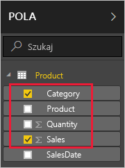

    Wykres powinien teraz wyglądać tak, jak na poniższej ilustracji.

    

    Zwróć uwagę, że bieżący lider sprzedaży to produkt **SLR Camera**. Zmieni się to po zaktualizowaniu danych i odświeżeniu raportu w dalszej części tego samouczka.

7. Zapisz raport o nazwie „TestGatewayDocs.pbix”.

8. Na karcie **Narzędzia główne** wybierz pozycję **Publikuj** > **Mój obszar roboczy** > **Wybierz**. Zaloguj się do usługi Power BI, jeśli zostanie wyświetlony odpowiedni monit. 

    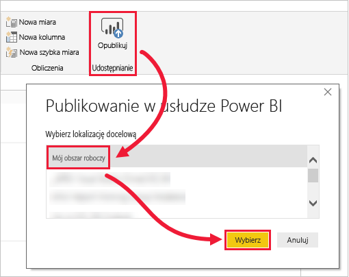

9. Na ekranie **Powodzenie** wybierz pozycję **Open „TestGatewayDocs.pbix” in Power BI** (Otwórz plik „TestGatewayDocs.pbix” w usłudze Power BI).


## <a name="add-sql-server-as-a-gateway-data-source"></a>Dodawanie programu SQL Server jako źródła danych bramy

W programie Power BI Desktop łączysz się bezpośrednio z programem SQL Server, ale usługa Power BI wymaga, aby brama działa jak mostek. Teraz dodasz wystąpienie programu SQL Server jako źródło danych dla bramy utworzonej w poprzednim artykule (czynność z listy w sekcji [Wymagania wstępne](#prereqisites)). 

1. W prawym górnym rogu ekranu usługi Power BI wybierz ikonę koła zębatego  > **Zarządzaj bramami**.

    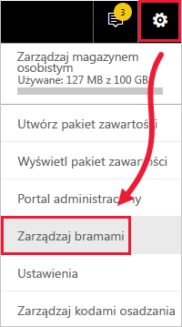

2. Wybierz pozycję **Dodaj źródło danych**, a następnie wprowadź ciąg „test-sql-source” w polu **Nazwa źródła danych**.

    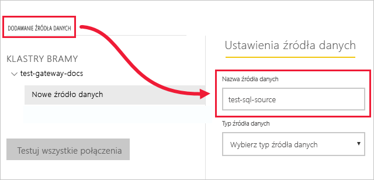

3. Wybierz w polu **Typ źródła danych** pozycję **SQL Server**, a następnie wprowadź inne wartości, tak jak pokazano.

    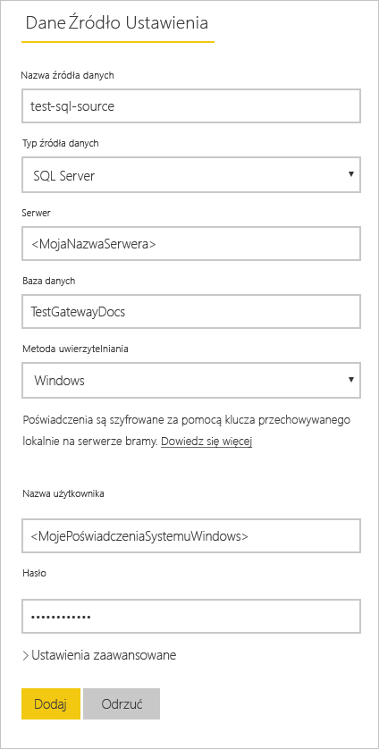

    | Opcja | Value |
    | ---    | ---   |
    | **Nazwa źródła danych**       | test-sql-source      |
    | **Typ źródła danych**       | SQL Server      |
    | **Serwer**       |  Nazwa wystąpienia programu SQL Server (musi być taka sama jak określona w programie Power BI Desktop)    |
    | **Baza danych**       | TestGatewayDocs      |
    | **Metoda uwierzytelniania**       | Windows      |
    | **Nazwa użytkownika**        |  Konto, takie jak michael@contoso.com, używane do łączenia z programem SQL Server     |
    | **Hasło**       |  Hasło konta używanego do łączenia z programem SQL Server    |

4. Wybierz pozycję **Dodaj**. W przypadku powodzenia procesu jest wyświetlany komunikat *Łączenie przebiegło pomyślnie*.

    

    Teraz możesz używać tego źródła danych, aby uwzględniać dane z programu SQL Server na pulpitach nawigacyjnych i w raportach usługi Power BI.


## <a name="configure-and-use-data-refresh"></a>Konfigurowanie odświeżania danych i korzystanie z niego

Masz raport opublikowany w usłudze Power BI i skonfigurowane źródło danych programu SQL Server. W tej sytuacji możesz teraz wprowadzić zmianę w tabeli Product (Produkt). Ta zmiana zostanie przeniesiona za pośrednictwem bramy do opublikowanego raportu. Możesz również skonfigurować zaplanowane odświeżanie, aby obsługiwać wszystkie przyszłe zmiany.

1. W programie SSMS zaktualizuj dane w tabeli Product (Produkt).

    ```sql
    UPDATE Product
    SET Sales = 32508, Quantity = 252
    WHERE Product='Compact Digital'     

    ```

2. W usłudze Power BI w lewym okienku nawigacji wybierz kolejno pozycję **Obszary robocze**.

3. W obszarze **Zestawy danych** dla zestawu danych **TestGatewayDocs** wybierz pozycję **więcej** (**. . .**) > **Odśwież teraz**.

    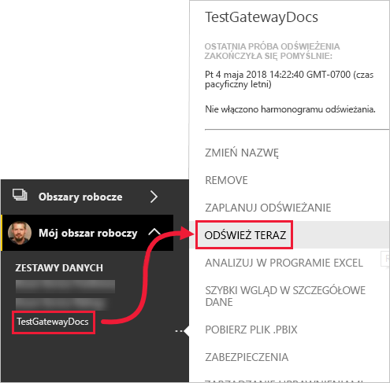

4. Wybierz kolejno pozycje **Mój obszar roboczy** > **Raporty** > **TestGatewayDocs**. Zauważ, że aktualizacja została przekazana, a nowy lider sprzedaży to teraz **Compact Digital**. 

    

5. Wybierz kolejno pozycje **Mój obszar roboczy** > **Raporty** > **TestGatewayDocs**. Wybierz kolejno pozycje **więcej** (**. . .**) > **Zaplanuj odświeżanie**.

6. W obszarze **Planowanie odświeżania** ustaw odświeżanie na **Wł.**, a następnie wybierz pozycję **Zastosuj**. Zestaw danych jest domyślnie odświeżany codziennie.

    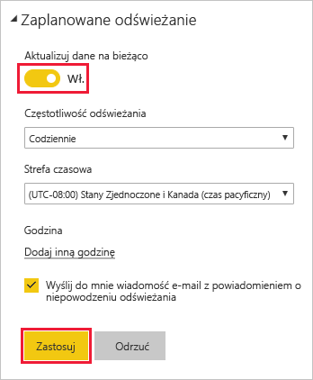

## <a name="clean-up-resources"></a>Czyszczenie zasobów
Jeśli nie chcesz już używać przykładowych danych, uruchom polecenie `DROP DATABASE TestGatewayDocs` w programie SSMS. Jeśli nie chcesz używać źródła danych programu SQL Server, [usuń źródło danych](service-gateway-manage.md#remove-a-data-source). 


## <a name="next-steps"></a>Następne kroki
W tym samouczku przedstawiono sposób wykonywania następujących czynności:
> [!div class="checklist"]
> * Tworzenie raportu na podstawie danych w programie SQL Server
> * Publikowanie raportu w usłudze Power BI
> * Dodawanie programu SQL Server jako źródła danych bramy
> * Odświeżanie danych w raporcie

Przejdź do następnego artykułu, aby dowiedzieć się więcej
> [!div class="nextstepaction"]
> [Zarządzanie bramą usługi Power BI](service-gateway-manage.md)

