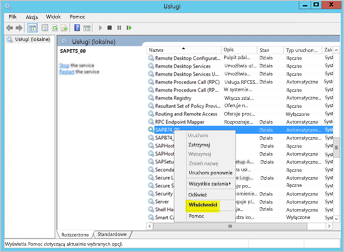

# <a name="use-kerberos-for-single-sign-on-sso-from-power-bi-to-on-premises-data-sources"></a>Używanie protokołu Kerberos na potrzeby logowania jednokrotnego (SSO) z usługi Power BI do lokalnych źródeł danych

Użyj [ograniczonego delegowania protokołu Kerberos](https://technet.microsoft.com/library/jj553400.aspx), aby umożliwić bezproblemową łączność za pomocą logowania jednokrotnego. Włączenie logowania jednokrotnego ułatwia odświeżanie danych ze źródeł lokalnych w raportach i pulpitach nawigacyjnych usługi Power BI.

## <a name="supported-data-sources"></a>Obsługiwane źródła danych

Obecnie obsługujemy następujące źródła danych:

* SQL Server
* SAP HANA
* Teradata
* Spark

Obsługujemy również platformę SAP HANA za pomocą protokołu [SAML (Security Assertion Markup Language)](service-gateway-sso-saml.md).

### <a name="sap-hana"></a>SAP HANA

Aby włączyć logowanie jednokrotne dla platformy SAP HANA, wykonaj najpierw następujące kroki:

* Upewnij się, że serwer SAP HANA jest uruchomiony w wymaganej wersji minimalnej, która zależy od poziomu platformy serwera SAP Hana:
  * [HANA 2 SPS 01 wer. 012.03](https://launchpad.support.sap.com/#/notes/2557386)
  * [HANA 2 SPS 02 wer. 22](https://launchpad.support.sap.com/#/notes/2547324)
  * [HANA 1 SP 12 wer. 122.13](https://launchpad.support.sap.com/#/notes/2528439)
* Na maszynie bramy zainstaluj najnowszy sterownik HANA ODBC firmy SAP.  Minimalna wymagana wersja to HANA ODBC 2.00.020.00 z sierpnia 2017 r.

Aby uzyskać więcej informacji na temat ustawiania i konfigurowania logowania jednokrotnego dla serwera SAP HANA przy użyciu protokołu Kerberos, zobacz temat [Single Sign-on Using Kerberos](https://help.sap.com/viewer/b3ee5778bc2e4a089d3299b82ec762a7/2.0.03/en-US/1885fad82df943c2a1974f5da0eed66d.html) (Logowanie jednokrotne przy użyciu protokołu Kerberos) w przewodniku dotyczącym bezpieczeństwa serwera SAP HANA oraz linki na tej stronie, w szczególności do uwagi SAP 1837331 – HOWTO HANA DBSSO Kerberos/Active Directory.

## <a name="preparing-for-kerberos-constrained-delegation"></a>Przygotowanie do ograniczonego delegowania protokołu Kerberos

Aby ograniczone delegowanie protokołu Kerberos działało poprawnie, należy skonfigurować kilka elementów, między innymi *główne nazwy usług* (nazwy SPN) oraz ustawienia delegowania na kontach usług.

### <a name="prerequisite-1-install--configure-the-on-premises-data-gateway"></a>Wymaganie wstępne 1: zainstalowanie i skonfigurowanie lokalnej bramy danych

Ta wersja lokalnej bramy danych obsługuje uaktualnienie w miejscu, a także przejmowanie ustawień istniejących bram.

### <a name="prerequisite-2-run-the-gateway-windows-service-as-a-domain-account"></a>Wymaganie wstępne 2: uruchomienie usługi bramy systemu Windows jako konta domeny

W standardowej instalacji brama działa jako konto usługi maszyny lokalnej (dokładnie: *NT Service\PBIEgwService*), jak pokazano na poniższej ilustracji:


Aby włączyć **ograniczone delegowanie protokołu Kerberos**, brama musi działać jako konto domeny, chyba że usługa Azure AD została już zsynchronizowana z lokalną usługą Active Directory przy użyciu narzędzia Azure AD DirSync/Connect. Jeśli zachodzi potrzeba przełączenia konta na konto domeny, zapoznaj się z sekcją [Przełączanie bramy na konto domeny](#switching-the-gateway-to-a-domain-account) w dalszej części tego artykułu.

> [!NOTE]
> Jeśli skonfigurowano narzędzie Azure AD DirSync/Connect, a konta użytkowników są synchronizowane, usługa bramy nie musi wykonywać wyszukiwania w lokalnej usłudze AD w czasie wykonywania i można użyć lokalnego identyfikatora SID usługi (zamiast wymagać konta domeny) na potrzeby usługi bramy. Czynności konfiguracji ograniczonego delegowania protokołu Kerberos opisane w tym artykule są takie same, jak w przypadku tej konfiguracji (z tą różnicą, że są stosowane względem obiektu komputera bramy w usłudze Active Directory, a nie w ramach konta domeny).

### <a name="prerequisite-3-have-domain-admin-rights-to-configure-spns-setspn-and-kerberos-constrained-delegation-settings"></a>Wymaganie wstępne 3: uprawnienia administratora domeny do konfigurowania ustawień ograniczonego delegowania protokołu Kerberos i nazw SPN (SetSPN)

Mimo że jest technicznie możliwe, aby administrator domeny tymczasowo lub trwale przypisał innej osobie uprawnienia do konfigurowania nazw SPN i delegowania protokołu Kerberos bez konieczności uzyskania przez tę osobę uprawnień administratora domeny, nie jest to zalecane rozwiązanie. W poniższej sekcji opisano czynności konfiguracyjne niezbędne do spełnienia **wymagania wstępnego 3**.

## <a name="configuring-kerberos-constrained-delegation-for-the-gateway-and-data-source"></a>Konfigurowanie ograniczonego delegowania protokołu Kerberos dla bramy i źródła danych

Aby poprawnie skonfigurować system, należy skonfigurować lub zweryfikować następujące dwa elementy:

1. W razie potrzeby skonfiguruj nazwę SPN w ramach konta domeny usługi bramy.

2. Skonfiguruj ustawienia delegowania na koncie domeny usługi bramy.

Należy pamiętać, że użytkownik musi być administratorem domeny, aby wykonać te dwie czynności konfiguracji.

W poniższych sekcjach opisano kolejno te kroki.

### <a name="configure-an-spn-for-the-gateway-service-account"></a>Konfigurowanie nazwy SPN dla konta usługi bramy

Po pierwsze należy ustalić, czy nazwa SPN została już utworzona dla konta domeny używanego jako konto usługi bramy, wykonując następujące kroki:

1. Jako administrator domeny uruchom narzędzie **Użytkownicy i komputery usługi Active Directory**.

2. Kliknij prawym przyciskiem myszy domenę, wybierz pozycję **Znajdź** i wpisz nazwę konta usługi bramy

3. W wynikach wyszukiwania kliknij prawym przyciskiem myszy konto usługi bramy, a następnie wybierz pozycję **Właściwości**.

4. Jeśli karta **Delegowanie** jest widoczna w oknie dialogowym **Właściwości**, oznacza to, że nazwa SPN została już utworzona i można przejść do kolejnej podsekcji dotyczącej konfigurowania ustawień delegowania.

    Jeśli karta **Delegowanie** nie jest widoczna w oknie dialogowym **Właściwości**, można ręcznie utworzyć nazwę SPN dla tego konta, co spowoduje dodanie karty **Delegowanie** (jest to najprostszy sposób konfigurowania ustawień delegowania). Nazwę SPN można utworzyć przy użyciu [narzędzia setspn](https://technet.microsoft.com/library/cc731241.aspx) w systemie Windows (aby utworzyć nazwę SPN, są wymagane uprawnienia administratora domeny).

    Załóżmy na przykład, że konto usługi bramy to „PBIEgwTest\GatewaySvc”, a nazwa maszyny, na której działa usługa bramy, to **Machine1**. Aby ustawić nazwę SPN konta usługi bramy dla maszyny w tym przykładzie, należy uruchomić następujące polecenie:

    

    Po wykonaniu tej czynności można przystąpić do konfigurowania ustawień delegowania.

### <a name="configure-delegation-settings-on-the-gateway-service-account"></a>Konfigurowanie ustawień delegowania na koncie domeny usługi bramy

Drugie wymaganie w procesie konfiguracji dotyczy ustawień delegowania na koncie domeny usługi bramy. Istnieje wiele narzędzi, których można użyć do wykonania tych kroków. W tym artykule użyjemy narzędzia**Użytkownicy i komputery usługi Active Directory**, które jest przystawką programu Microsoft Management Console (MMC) służącą do administrowania informacjami i publikowania ich w katalogu. Jest ono domyślnie dostępne w ramach kontrolerów domeny. Można również włączyć te ustawienia przy użyciu konfiguracji **funkcji systemu Windows** na innych maszynach.

Należy skonfigurować **ograniczone delegowanie protokołu Kerberos** z użyciem przejścia protokołu. W przypadku ograniczonego delegowania należy jawnie określić docelowe usługi delegowania. Na przykład tylko program SQL Server lub serwer SAP HANA będą akceptować wywołania delegowania z konta usługi bramy.

W tej sekcji założono, że nazwy SPN bazowych źródeł danych (takich jak SQL Server, SAP HANA, Teradata, Spark itd.) zostały już skonfigurowane. Aby dowiedzieć się, jak skonfigurować nazwy SPN serwera źródła danych, zapoznaj się z dokumentacją techniczną odpowiedniego serwera bazy danych. Możesz również zapoznać się z wpisem w blogu, który opisuje, [*jakich nazw SPN wymaga Twoja aplikacja*](https://blogs.msdn.microsoft.com/psssql/2010/06/23/my-kerberos-checklist/).

W poniższych krokach założono, że istnieje środowisko lokalne z dwoma maszynami: maszyną bramy i serwerem bazy danych opartym na programie SQL Server. Na potrzeby tego przykładu przyjmiemy również następujące ustawienia i nazwy:

* Nazwa maszyny bramy: **PBIEgwTestGW**
* Konto usługi bramy: **PBIEgwTest\GatewaySvc** (wyświetlana nazwa konta: Łącznik bramy)
* Nazwa maszyny źródła danych programu SQL Server: **PBIEgwTestSQL**
* Nazwa konta usługi źródła danych programu SQL Server: **PBIEgwTest\SQLService**

Biorąc pod uwagę te przykładowe nazwy i ustawienia, czynności konfiguracyjne są następujące:

1. Uruchom narzędzie **Użytkownicy i komputery usługi Active Directory** z uprawnieniami administratora domeny.

2. Kliknij prawym przyciskiem myszy konto usługi bramy (**PBIEgwTest\GatewaySvc**) i wybierz pozycję **Właściwości**.

3. Wybierz kartę **Delegowanie**.

4. Zaznacz opcję **Ufaj temu komputerowi w delegowaniu tylko do określonych usług.**

5. Wybierz opcję **Użyj dowolnego protokołu uwierzytelniania.**

6. W obszarze **Usługi, którym to konto może przedstawiać delegowane poświadczenia** wybierz pozycję **Dodaj**.

7. W nowym oknie dialogowym wybierz pozycję **Użytkownicy lub komputery**.

8. Wprowadź nazwę konta usługi bazy danych programu SQL Server (**PBIEgwTest\SQLService**) i wybierz przycisk **OK**.

9. Wybierz nazwę SPN utworzoną dla serwera bazy danych. W naszym przykładzie ta nazwa SPN rozpoczyna się od **MSSQLSvc**. Jeśli dodano dla usługi bazy danych zarówno nazwę FQDN, jak i nazwę SPN NetBIOS, wybierz obie. Może być widoczna tylko jedna.

10. Wybierz przycisk **OK**. Teraz nazwa SPN powinna być widoczna na liście.

11. Opcjonalnie możesz zaznaczyć pole wyboru **Rozwinięte**, aby wyświetlać zarówno nazwę FQDN, jak i nazwę SPN NetBIOS.

12. Jeśli zaznaczono pole wyboru **Rozwinięte**, okno dialogowe będzie wyglądać podobnie do poniższego. Wybierz przycisk **OK**.

    

Na koniec na maszynie z uruchomioną usługą bramy (**PBIEgwTestGW** w naszym przykładzie) należy przydzielić zasady lokalne „Personifikuj klienta po uwierzytelnieniu” do konta usługi bramy. Można to zrobić lub sprawdzić za pomocą Edytora lokalnych zasad grupy (**gpedit**).

1. Na maszynie bramy uruchom polecenie *gpedit.msc*.

1. Wybierz kolejno pozycje **Lokalne zasady komputera > Konfiguracja komputera > Ustawienia systemu Windows > Ustawienia zabezpieczeń > Zasady lokalne > Przypisywanie praw użytkownika**, jak pokazano na poniższej ilustracji.

    

1. Na liście zasad w obszarze **Przypisywanie praw użytkownika** wybierz pozycję **Personifikuj klienta po uwierzytelnieniu**.

    

    Kliknij prawym przyciskiem myszy pozycję **Personifikuj klienta po uwierzytelnieniu**, otwórz okno **Właściwości** i sprawdź listę kont. Musi zawierać konto usługi bramy (**PBIEgwTest\GatewaySvc**).

1. Na liście zasad w obszarze **Przypisywanie praw użytkownika** wybierz pozycję **Działanie jako część systemu operacyjnego (SeTcbPrivilege)**. Upewnij się, że konto usługi bramy również znajduje się na liście kont.

18. Uruchom ponownie proces usługi **lokalnej bramy danych**.

Jeśli używasz platformy SAP HANA, zalecamy wykonanie tych dodatkowych czynności, które mogą spowodować niewielkie zwiększenie wydajności.

1. W katalogu instalacyjnym bramy znajdź i otwórz następujący plik konfiguracji: *Microsoft.PowerBI.DataMovement.Pipeline.GatewayCore.dll.config*.

1. Znajdź właściwość *FullDomainResolutionEnabled* i zmień jej wartość na *True*.

    ```xml
    <setting name=" FullDomainResolutionEnabled " serializeAs="String">
          <value>True</value>
    </setting>
    ```

## <a name="running-a-power-bi-report"></a>Uruchamianie raportu usługi Power BI

Po zakończeniu wszystkich czynności konfiguracyjnych opisanych w tym artykule możesz skonfigurować źródło danych na stronie **Zarządzanie bramą** w usłudze Power BI. Następnie w obszarze **Ustawienia zaawansowane** włącz logowanie jednokrotne i publikuj raporty oraz zestawy danych powiązane z tym źródłem danych.


Ta konfiguracja będzie działać w większości przypadków. Jednak w przypadku użycia protokołu Kerberos możliwe są inne konfiguracje w zależności od środowiska. Jeśli nadal nie można załadować raportu, należy skontaktować się z administratorem domeny, aby dokładniej zbadał problem.

## <a name="switching-the-gateway-to-a-domain-account"></a>Przełączanie bramy na konto domeny

Wcześniej w tym artykule omówiono przełączanie bramy z konta usługi lokalnej na uruchamianie jako konto domeny przy użyciu interfejsu użytkownika **lokalnej bramy danych** . Oto czynności, które należy wykonać.

1. Uruchom narzędzie konfiguracji **lokalnej bramy danych**.

   

2. Wybierz przycisk **Zaloguj** na stronie głównej i zaloguj się przy użyciu konta usługi Power BI.

3. Po zalogowaniu wybierz kartę **Ustawienia usługi**.

4. Wybierz pozycję **Zmień konto**, aby rozpocząć proces zmiany konta z instrukcjami, jak pokazano na poniższym obrazie.

   

## <a name="configuring-sap-bw-for-sso"></a>Konfigurowanie programu SAP BW pod kątem logowania jednokrotnego

Teraz, gdy rozumiesz już w jaki sposób protokół Kerberos współpracuje z bramą, możesz skonfigurować logowanie jednokrotnego na potrzeby programu SAP Business Warehouse (SAP BW). W następujących krokach założono, że [przygotowania do korzystania z ograniczonego delegowania protokołu Kerberos](#preparing-for-kerberos-constrained-delegation) zostały już wykonane zgodnie z opisem we wcześniejszej części tego artykułu.

### <a name="install-sap-bw-components"></a>Instalowanie składników programu SAP BW

Jeśli nie skonfigurowano bibliotek gsskrb5 i gx64krb5 oprogramowania SAP na maszynie klienckiej ani na serwerze aplikacji SAP BW, wykonaj kroki z poniższej sekcji. Jeśli przeprowadzono już czynności konfiguracyjne (utworzono użytkownika usługi na potrzeby serwera BW i zamapowano na niego nazwę SPN), możesz pominąć niektóre części tej sekcji.

1. Pobierz bibliotekę gsskrb5/gx64krb5 z rozwiązania [SAP Note 2115486](https://launchpad.support.sap.com/) (wymagany jest użytkownik s-user oprogramowania SAP). Upewnij się, że biblioteki gsskrb5.dll i gx64krb5.dll są co najmniej w wersji 1.0.11.x.

1. Umieść bibliotekę w lokalizacji na maszynie bramy, która jest dostępna dla wystąpienia bramy (oraz interfejsu wiersza polecenia oprogramowania SAP, jeśli chcesz testować połączenie korzystające z logowania jednokrotnego przy użyciu programu SAP GUI lub SAP Login).

1. Umieść kolejną kopię na maszynie serwera BW w lokalizacji dostępnej dla serwera BW.

1. Na maszynie klienckiej i maszynie serwera ustaw zmienne środowiskowe SNC\_LIB i SNC\_LIB\_64 w taki sposób, aby wskazywały odpowiednio na lokalizację bibliotek gsskrb5.dll i gx64krb5.dll.

### <a name="complete-the-gateway-configuration-for-sap-bw"></a>Przeprowadzanie konfiguracji bramy na potrzeby programu SAP BW

Oprócz czynności związanych z konfigurowaniem bramy, które zostały już wykonane, istnieje kilka dodatkowych kroków specyficznych dla programu SAP BW. W sekcji [**Konfigurowanie ustawień delegowania na koncie domeny usługi bramy**](#configure-delegation-settings-on-the-gateway-service-account) w dokumentacji założono, że nazwy SPN zostały już skonfigurowane na potrzeby bazowych źródeł danych. Aby wykonać te czynności konfiguracyjne dla programu SAP BW:

1. W ramach kontrolera domeny usługi Active Directory utwórz użytkownika usługi (początkowo jest to zwykły użytkownik usługi Active Directory) na potrzeby serwera aplikacji BW w środowisku usługi Active Directory. Następnie przypisz do niego nazwę SPN.

    Przypisana nazwa SPN **musi** rozpoczynać się od ciągu „SAP/”. To, co będzie znajdować się po tym ciągu, zależy od Ciebie; jednym z rozwiązań jest użycie nazwy użytkownika usługi serwera BW. Jeśli na przykład utworzysz użytkownika BWServiceUser@\<DOMENA\> jako użytkownika usługi, możesz użyć nazwy SPN SAP/BWServiceUser. Jednym ze sposobów ustawienia mapowania nazwy SPN jest użycie polecenia setspn. Aby na przykład ustawić nazwę SPN dla nowo utworzonego użytkownika usługi, w oknie poleceń na maszynie kontrolera domeny wykonaj następujące polecenie: `setspn -s SAP/ BWServiceUser DOMAIN\ BWServiceUser`.

1. Udziel użytkownikowi usługi dostępu do wystąpienia serwera aplikacji BW:

    1. Na maszynie serwera BW dodaj użytkownika usługi do grupy Administratorzy lokalni dla Twojego serwera BW: otwórz program Zarządzanie komputerem, a następnie kliknij dwukrotnie ikonę grupę Administratorzy lokalni dla Twojego serwera.

        

    1. Kliknij dwukrotnie grupę Administratorzy lokalni, a następnie wybierz pozycję **Dodaj**, aby dodać użytkownika usługi BW do grupy. Użyj przycisku **Sprawdź nazwy**, aby upewnić się, że nazwa została wpisana poprawnie. Wybierz przycisk **OK**.

1. Ustaw użytkownika usługi serwera BW jako użytkownika, który uruchamia usługę serwera BW na maszynie serwera BW.

    1. Otwórz program „Uruchom” i wpisz polecenie „Services.msc”. Wyszukaj usługę odpowiadającą wystąpieniu serwera aplikacji BW. Kliknij ją prawym przyciskiem myszy i wybierz polecenie **Właściwości**.

        

    1. Przełącz się na kartę **Logowanie** i zmień użytkownika na użytkownika usługi programu BW, jak określono powyżej. Wprowadź hasło użytkownika, a następnie wybierz pozycję **OK**.

1. Zaloguj się do serwera za pomocą programu SAP GUI lub SAP Logon, a następnie ustaw następujące parametry profilu przy użyciu transakcji RZ10:

    1. Ustaw parametr profilu snc/identity/as na wartość p:\<utworzony użytkownik usługi programu BW\>, na przykład p:BWServiceUser@MYDOMAIN.COM. Pamiętaj, że ciąg „p:” poprzedza nazwę UPN użytkownika usługi.

    1. Ustaw parametr profilu snc/gssapi\_lib na \<ścieżkę do biblioteki gsskrb5.dll/gx64krb5.dll na maszynie serwera (użyta biblioteka będzie zależeć od liczby bitów systemu operacyjnego)\>. Pamiętaj, aby umieścić bibliotekę w lokalizacji, która będzie dostępna dla serwera aplikacji BW.

    1. Ustaw również następujące dodatkowe parametry profilu, zmieniając wartości zgodnie z własnymi potrzebami. Pamiętaj, że ostatnie pięć opcji umożliwia klientom nawiązywania połączenia z serwerem BW za pomocą programu SAP Logon lub SAP GUI bez skonfigurowanej biblioteki SNC.

        | **Ustawienie** | **Wartość** |
        | --- | --- |
        | snc/data\_protection/max | 3 |
        | snc/data\_protection/min | 1 |
        | snc/data\_protection/use | 9 |
        | snc/accept\_insecure\_cpic | 1 |
        | snc/accept\_insecure\_gui | 1 |
        | snc/accept\_insecure\_r3int\_rfc | 1 |
        | snc/accept\_insecure\_rfc | 1 |
        | snc/permit\_insecure\_start | 1 |

    1. Ustaw właściwość snc/enable na wartość 1.

1. Po ustawieniu tych parametrów profilu otwórz konsolę SAP Management Console na maszynie serwera, a następnie ponownie uruchom wystąpienie serwera BW. Jeśli serwer nie zostanie uruchomiony, upewnij się, że poprawnie ustawiono parametry profilu. Więcej informacji dotyczących ustawień parametrów profilu zawiera [dokumentacja oprogramowania SAP](https://help.sap.com/saphelp_nw70ehp1/helpdata/en/e6/56f466e99a11d1a5b00000e835363f/frameset.htm). Jeśli napotkasz problemy, możesz również zapoznać się z informacjami dotyczącymi rozwiązywania problemów znajdującymi się w dalszej części tej sekcji.

### <a name="map-azure-ad-users-to-sap-bw-users"></a>Mapowanie użytkowników usługi Azure AD na użytkowników programu SAP BW

Możesz przeprowadzić mapowanie użytkownika usługi Active Directory na użytkownika serwera aplikacji SAP BW i przetestować połączenie korzystające z logowania jednokrotnego w programie SAP GUI lub SAP Logon.

1. Zaloguj się do serwera BW przy użyciu programu SAP GUI lub SAP Logon. Wykonaj transakcję SU01.

1. W polu **User** (Użytkownik) wprowadź nazwę użytkownika programu BW, dla którego chcesz włączyć połączenia korzystające z logowania jednokrotnego (na powyższym zrzucie ekranu uprawnienia ustawiane są dla użytkownika BIUSER). Wybierz ikonę **Edit** (Edytuj) w lewej górnej okna programu SAP Logon (obraz pióra).

    

1. Wybierz kartę **SNC**. W polu wejściowym nazwy SNC wprowadź wartość p:\<użytkownik usługi Active Directory\>@\<Domena\>. Należy pamiętać o obowiązkowym ciągu „p:”, który musi poprzedzać nazwę UPN użytkownika usługi Active Directory. Określony użytkownik usługi Active Directory powinien należeć do osoby lub organizacji, dla której chcesz włączyć dostęp za pomocą logowania jednokrotnego do serwera aplikacji BW. Jeśli na przykład chcesz włączyć dostęp za pomocą logowania jednokrotnego dla użytkownika [testuser@TESTDOMAIN.COM](mailto:testuser@TESTDOMAIN.COM), wprowadź wartość p:testuser@TESTDOMAIN.COM.

    

1. Wybierz ikonę zapisywania (obraz dyskietki w lewym górnym rogu ekranu).

### <a name="verify-sign-in-using-sso"></a>Sprawdzanie logowania za pomocą funkcji logowania jednokrotnego

Sprawdź, czy możesz zalogować się do serwera przy użyciu programu SAP Logon lub SAP GUI za pośrednictwem logowania jednokrotnego jako użytkownik usługi Active Directory, dla którego właśnie włączono dostęp za pomocą logowania jednokrotnego.

1. Zaloguj się do maszyny z zainstalowanym programem SAP Logon *jako użytkownik usługi Active Directory, dla którego właśnie włączono dostęp za pomocą logowania jednokrotnego*, a następnie uruchom program SAP GUI lub SAP Logon. Utwórz nowe połączenie.

1. W oknie **Create New System Entry** (Tworzenie nowego wpisu systemowego) wybierz pozycję **User Specified System** (System określony przez użytkownika), a następnie wybierz pozycję **Next** (Dalej).

    

1. Na następnej stronie podaj odpowiednie szczegóły, w tym serwer aplikacji, numer wystąpienia i identyfikator systemu, a następnie wybierz pozycję **Finish** (Zakończ).

1. Kliknij prawym przyciskiem myszy nowe połączenie, a następnie wybierz pozycję **Properties** (Właściwości). Wybierz kartę **Network** (Sieć). W oknie **SNC Name** (Nazwa SNC) wprowadź wartość p:\<nazwa UPN użytkownika usługi BW\>, na przykład p:BWServiceUser@MYDOMAIN.COM.

    

1. Wybierz przycisk **OK**. Następnie kliknij dwukrotnie nowo utworzone połączenie, aby podjąć próbę nawiązania połączenia z usługą za pomocą logowania jednokrotnego. Jeśli to połączenie zakończy się pomyślnie, przejdź do następnego kroku. Jeśli nie, przejrzyj wcześniejsze kroki w tym dokumencie, aby upewnić się, że zostały one poprawnie wykonane, lub zapoznaj się z sekcją rozwiązywania problemów znajdującą się poniżej. Pamiętaj, że jeśli w tym kontekście nie możesz nawiązać połączenia z serwerem BW za pomocą logowania jednokrotnego, nie będzie możliwe nawiązanie połączenia z serwerem BW przy użyciu logowania jednokrotnego w kontekście bramy.

### <a name="troubleshoot-installation-and-connections"></a>Rozwiązywanie problemów dotyczących instalacji i połączeń

Jeśli napotkasz jakiekolwiek problemy, wykonaj następujące kroki w celu rozwiązywania problemów z instalacją biblioteki gsskrb5 i połączeniami korzystającymi z logowania jednokrotnego z poziomu programu SAP GUI lub SAP Logon.

1. Podczas rozwiązywania jakichkolwiek problemów dotyczących kroków konfiguracji biblioteki gsskrb5 może być pomocne wyświetlenie dzienników serwera (znajdujących się w katalogu ...work\dev\_w0 na maszynie serwera), szczególnie w przypadku, gdy nie można uruchomić serwera BW po zmianie parametrów profilu.

1. Jeśli nie można uruchomić usługi BW i wyświetlony zostanie komunikat „logon failure” (błąd logowania), może to być spowodowane podaniem nieprawidłowego hasła podczas ustawiania użytkownika „start-as” programu BW. Sprawdź hasło, logując się do maszyny w środowisku usługi Active Directory jako użytkownik usługi BW.

1. Jeśli występują błędy związane z poświadczeniami SQL uniemożliwiającymi uruchomienie serwera, sprawdź, czy użytkownikowi usługi udzielono dostępu do bazy danych BW.

1. „(GSS-API) specified target is unknown or unreachable” (GSS-API: określony element docelowy jest nieznany lub niedostępny): zazwyczaj oznacza to, że określono nieprawidłową nazwę SNC. Upewnij się, że w aplikacji klienckiej używasz tylko ciągu „p:”, a nie ciągu „p:CN=” lub innego, który nie jest nazwą UPN użytkownika usługi.

1. „(GSS-API) An invalid name was supplied” (GSS-API: podano nieprawidłową nazwę): upewnij się, że ciąg ”p:” znajduje się w ramach wartości parametru profilu tożsamości nazwy SNC serwera.

1. „(SNC error) the specified module could not be found” (Błąd SNC: nie można odnaleźć określonego modułu): jest to zazwyczaj spowodowane przez umieszczenie biblioteki gsskrb5.dll/gx64krb5.dll w lokalizacji, która jest dostępna tylko z podniesionymi uprawnieniami (administracyjnymi).

### <a name="add-registry-entries"></a>Dodawanie wpisów rejestru

Dodaj wymagane wpisy do rejestru na maszynie, na której zainstalowana jest brama. Następnie ustaw wymagane parametry konfiguracji bramy.

1. Wykonaj następujące polecenia w oknie poleceń:

    1. REG ADD HKLM\SOFTWARE\Wow6432Node\SAP\gsskrb5 /v ForceIniCredOK /t REG\_DWORD /d 1 /f

    1. REG ADD HKLM\SOFTWARE\SAP\gsskrb5 /v ForceIniCredOK /t REG\_DWORD /d 1 /f

1. Otwórz plik konfiguracyjny głównej bramy: Microsoft.PowerBI.DataMovement.Pipeline.GatewayCore.dll. Domyślna lokalizacja tego pliku to C:\Program Files\On-premises data gateway.

1. Ustaw właściwość **ADUserNameLookupProperty** na wartość cloudExtensionAttribute1, a właściwość **ADUserNameReplacementProperty** na wartość SAMAccountName. Zapisz plik konfiguracji.

1. Ponownie uruchom usługę bramy za pośrednictwem karty **Usługi** Menedżera zadań (kliknij prawym przyciskiem myszy i wybierz pozycję **Uruchom ponownie**).

    

### <a name="set-azure-ad-properties"></a>Ustawianie właściwości usługi Azure AD

Ustaw właściwość msDS-cloudExtensionAttribute1 użytkownika usługi Active Directory, który został zamapowany na użytkownika programu BW (w kroku „Mapowanie użytkowników usługi Azure AD na użytkowników programu SAP BW”), na użytkownika usługi Power BI, dla którego chcesz włączyć logowanie jednokrotne protokołu Kerberos. Jednym ze sposobów na ustawienie właściwości msDS-cloudExtensionAttribute1 jest użycie przystawki programu MMC Użytkownicy i komputery usługi Active Directory. Można również użyć innych metod.

1. Zaloguj się do maszyny kontrolera domeny jako administrator.

1. Otwórz folder **Users** w oknie przystawki, a następnie kliknij dwukrotnie użytkownika usługi Active Directory zamapowanego na użytkownika programu BW.

1. Wybierz kartę **Edytor atrybutów**. Jeśli ta karta nie jest widoczna, należy wyszukać wskazówki dotyczące sposobu jej włączania lub użyć innej metody do ustawiania właściwości msDS-cloudExtensionAttribute1. Wybierz jeden z atrybutów, a następnie naciśnij klawisz „m”, aby przejść do właściwości usługi Active Directory rozpoczynających się od litery „m”. Znajdź właściwość msDS-cloudExtensionAttribute1 i kliknij ją dwukrotnie. Ustaw wartość na nazwę użytkownika, którego używasz do logowania się do usługi Power BI. Wybierz przycisk **OK**.

    

1. Wybierz pozycję **Zastosuj**. Sprawdź, czy ustawiono prawidłową wartość w kolumnie Wartość.

### <a name="add-a-new-bw-application-server-data-source-to-the-power-bi-service"></a>Dodawanie nowego źródła danych serwera aplikacji BW do usługi Power BI

Dodaj źródło danych programu BW do bramy: postępuj zgodnie z instrukcjami znajdującymi się we wcześniejszej części tego artykułu dotyczącymi [uruchamiania raportu](#running-a-power-bi-report).

1. W oknie konfiguracji źródła danych wprowadź takie wartości w polach **Nazwa hosta**, **Numer systemu** i **Identyfikator klienta**, jakie zostałyby użyte podczas logowania się do serwera BW z programu Power BI Desktop. W polu **Metoda uwierzytelniania** wybierz wartość **Windows**.

1. W polu **Nazwa partnera SNC** wprowadź wartość przechowywaną w parametrze profilu snc/identity/as serwera *z ciągiem „SAP/” dodanym między ciąg „p:” a pozostałą część tożsamości*. Jeśli na przykład tożsamość SNC serwera to p:BWServiceUser@MYDOMAIN.COM, należy wprowadzić wartość p:SAP/BWServiceUser@MYDOMAIN.COM. w polu wejściowym Nazwa partnera SNC.

1. W polu Biblioteka SNC wybierz wartość SNC\_LIB lub SNC\_LIB\_64.

1. W polach **Nazwa użytkownika** i **Hasło** należy wprowadzić nazwę użytkownika i hasło użytkownika usługi Active Directory z uprawnieniami do logowania się do serwera BW przy użyciu logowania jednokrotnego (jest to użytkownik usługi Active Directory, który został zmapowany na użytkownika programu BW za pośrednictwem transakcji SU01). Te poświadczenia będą używane tylko wtedy, gdy pole **Używaj logowania jednokrotnego przez połączenie Kerberos w przypadku zapytań DirectQuery** *nie jest* zaznaczone.

1. Zaznacz pole wyboru **Używaj logowania jednokrotnego przez połączenie Kerberos w przypadku zapytań DirectQuery**, a następnie wybierz pozycję **Zastosuj**. Jeśli test połączenia zakończy się niepowodzeniem, sprawdź, czy poprzednie czynności konfiguracyjne zostały wykonane poprawnie.

### <a name="test-your-setup"></a>Testowanie konfiguracji

Opublikuj raport zapytania bezpośredniego z poziomu programu Power BI Desktop do usługi Power BI, aby przetestować konfigurację. Upewnij się, że jesteś zalogowany do usługi Power BI jako użytkownik, na którego ustawiono wartość właściwości msDS-cloudExtensionAttribute1. Jeśli konfiguracja została pomyślnie ukończona, powinno być możliwe utworzenie raportu na podstawie opublikowanego zestawu danych w usłudze Power BI i wypchnięcie danych za pomocą wizualizacji w raporcie.

### <a name="troubleshooting-gateway-connectivity-issues"></a>Rozwiązywanie problemów z łącznością bramy

1. Sprawdź dzienniki bramy. Otwórz aplikację konfiguracji bramy, wybierz pozycję **Diagnostyka**, a następnie wybierz pozycję **Eksportuj dzienniki**. Najbardziej aktualne błędy będą znajdować się w dolnej części każdego badanego pliku dziennika.

    

1. Włącz śledzenie programu BW i przejrzyj wygenerowane pliki dziennika. Dostępnych jest kilka różnych typów śledzenia programu BW. Więcej informacji można znaleźć w dokumentacji oprogramowania SAP.

## <a name="errors-from-an-insufficient-kerberos-configuration"></a>Błędy wynikające z niewłaściwej konfiguracji protokołu Kerberos

Jeśli podstawowy serwer bazy danych oraz brama nie zostały skonfigurowane poprawnie na potrzeby **ograniczonego delegowania protokołu Kerberos**, może zostać wyświetlony następujący komunikat o błędzie:


Szczegóły techniczne związane z komunikatem o błędzie (DM_GWPipeline_Gateway_ServerUnreachable) mogą wyglądać następująco:


Wynik jest następujący: brama nie mogła poprawnie spersonifikować użytkownika źródłowego i próba połączenia z bazą danych nie powiodła się.

## <a name="next-steps"></a>Następne kroki

Aby uzyskać więcej informacji na temat **lokalnej bramy danych** i **zapytania bezpośredniego**, zapoznaj się z następującymi zasobami:

* [Lokalna brama danych](service-gateway-onprem.md)
* [Zapytanie bezpośrednie w usłudze Power BI](desktop-directquery-about.md)
* [Źródła danych obsługiwane przez zapytanie bezpośrednie](desktop-directquery-data-sources.md)
* [Zapytanie bezpośrednie i system SAP BW](desktop-directquery-sap-bw.md)
* [Zapytanie bezpośrednie i platforma SAP HANA](desktop-directquery-sap-hana.md)