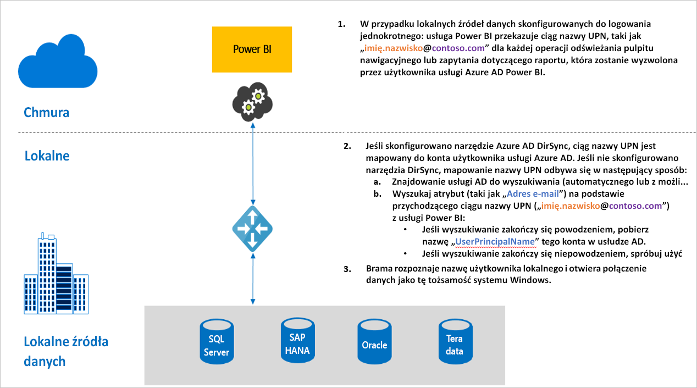

# Omówienie logowania jednokrotnego dla bram w usłudze Power BI

Możesz uzyskać bezproblemową łączność przy użyciu funkcji logowania jednokrotnego, aby umożliwić aktualizowanie raportów i pulpitów nawigacyjnych usługi Power BI na podstawie lokalnych danych, konfigurując lokalną bramę danych przy użyciu ograniczonego delegowania w protokole Kerberos lub języka SAML (Security Assertion Markup Language). Lokalna brama danych ułatwia logowanie jednokrotne przez użycie trybu DirectQuery do połączenia z lokalnymi źródłami danych.

Obecnie obsługujemy następujące źródła danych:

* SQL Server ([Kerberos](service-gateway-sso-kerberos.md))
* SAP HANA ([Kerberos](service-gateway-sso-kerberos.md) i [SAML](service-gateway-sso-saml.md))
* Teradata ([Kerberos](service-gateway-sso-kerberos.md))
* Spark ([Kerberos](service-gateway-sso-kerberos.md))

Gdy użytkownik korzysta z raportu zapytania bezpośredniego w usłudze Power BI, każda operacja filtrowania krzyżowego, wycinania, sortowania i edytowania raportu może spowodować dynamiczne wykonywanie zapytań kierowanych do lokalnego źródła danych.  W przypadku skonfigurowania logowania jednokrotnego dla źródła danych zapytania są wykonywane przy użyciu tożsamości użytkownika korzystającego z usługi Power BI, czyli za pośrednictwem środowiska internetowego lub aplikacji mobilnych usługi Power BI. Dzięki temu każdy użytkownik będzie widział te dane, do których ma uprawnienia w bazowym źródle danych — skonfigurowanie logowania jednokrotnego oznacza, że dane są buforowane osobno dla każdego użytkownika.

## Kroki zapytania w przypadku uruchamiania logowania jednokrotnego

Uruchamianie zapytania przy użyciu logowania jednokrotnego obejmuje trzy kroki, jak pokazano na poniższym diagramie.

> [!NOTE]
> Logowanie jednokrotne dla bazy danych Oracle nie jest jeszcze dostępne, ale jest opracowywane i zostanie wkrótce udostępnione.

Dodatkowe informacje dotyczące omawianych kroków:

1. W przypadku każdego zapytania **usługa Power BI** dołącza *główną nazwę użytkownika* (nazwę UPN) podczas wysyłania żądania zapytania do skonfigurowanej bramy.

2. Brama mapuje nazwę UPN z usługi Azure Active Directory na lokalną tożsamość usługi Active Directory.

   a.  Jeśli skonfigurowano narzędzie Azure AD DirSync (znane także jako *Azure AD Connect*), mapowanie odbywa się automatycznie w bramie.

   b.  Jeśli nie, brama może wyszukać nazwę UPN z usługi Azure AD i mapować ją na użytkownika lokalnego, wykonując wyszukiwanie w domenie lokalnej usługi Active Directory.

3. Proces usługi bramy personifikuje mapowanego użytkownika lokalnego, otwiera połączenie z podstawową bazą danych i wysyła zapytanie. Brama nie musi być zainstalowana na tej samej maszynie co baza danych.

## Następne kroki

Teraz, gdy już znasz podstawy logowania jednokrotnego, zapoznaj się z bardziej szczegółowymi informacjami na temat protokołu Kerberos i języka SAML:

* [Single sign-on (SSO) — Kerberos (Logowanie jednokrotne — Kerberos)](service-gateway-sso-kerberos.md)
* [Single sign-on (SSO) — SAML (Logowanie jednokrotne — SAML)](service-gateway-sso-saml.md)
