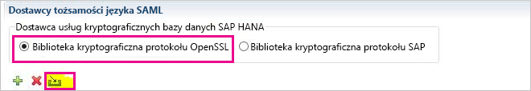
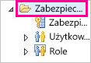
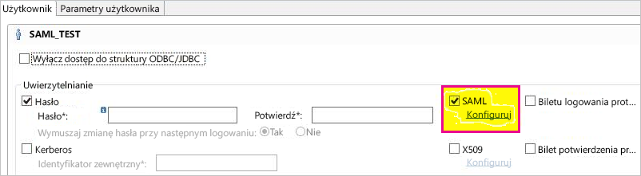
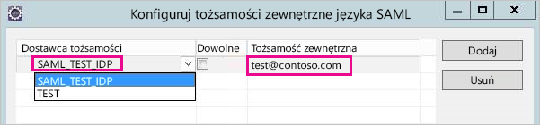
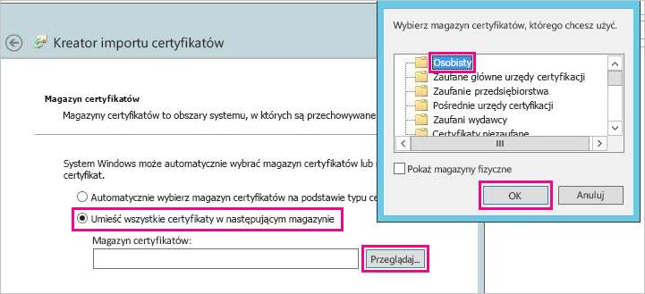
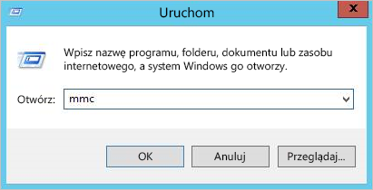
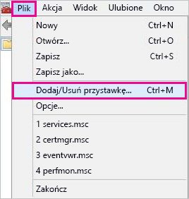
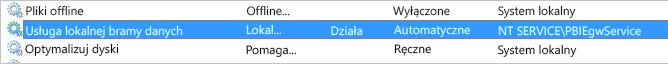
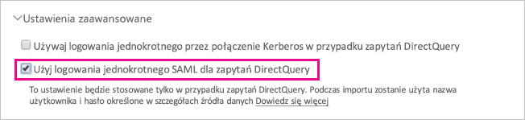

# <a name="use-security-assertion-markup-language-saml-for-single-sign-on-sso-from-power-bi-to-on-premises-data-sources"></a>Używanie języka SAML (Security Assertion Markup Language) na potrzeby logowania jednokrotnego z usługi Power BI do lokalnych źródeł danych

Język [SAML (Security Assertion Markup Language)](https://www.onelogin.com/pages/saml) umożliwia bezproblemową łączność na potrzeby logowania jednokrotnego. Włączenie logowania jednokrotnego ułatwia odświeżanie danych ze źródeł lokalnych w raportach i pulpitach nawigacyjnych usługi Power BI.

## <a name="supported-data-sources"></a>Obsługiwane źródła danych

Obecnie obsługujemy platformę SAP HANA z językiem SAML. Aby uzyskać więcej informacji na temat ustawiania i konfigurowania logowania jednokrotnego dla platformy SAP HANA z językiem SAML, zobacz [SAML SSO for BI Platform to HANA (Logowanie jednokrotne przy użyciu języka SAML dla platformy analizy biznesowej do oprogramowania HANA)](https://wiki.scn.sap.com/wiki/display/SAPHANA/SAML+SSO+for+BI+Platform+to+HANA) w dokumentacji platformy SAP HANA.

Obsługujemy również dodatkowe źródła danych za pomocą protokołu [Kerberos](service-gateway-sso-kerberos.md).

## <a name="configuring-the-gateway-and-data-source"></a>Konfigurowanie bramy i źródła danych

Aby używać języka SAML, należy najpierw wygenerować certyfikat dla dostawcy tożsamości SAML, a następnie mapować użytkownika usługi Power BI na tożsamość.

1. Wygeneruj certyfikat. Upewnij się, że do wypełnienia *nazwy pospolitej* jest używana nazwa FQDN serwera SAP HANA. Certyfikat wygaśnie za 365 dni.

    ```
    openssl req -newkey rsa:2048 -nodes -keyout samltest.key -x509 -days 365 -out samltest.crt
    ```

1. W programie SAP HANA Studio kliknij prawym przyciskiem myszy serwer platformy SAP HANA, a następnie przejdź do pozycji **Security** > **Open Security Console** > **SAML Identity Provider** > **OpenSSL Cryptographic Library** (Zabezpieczenia, Otwórz konsolę zabezpieczeń, Dostawca tożsamości języka SAML, Biblioteka kryptograficzna OpenSSL).

1. Wybierz pozycję **Import** (Importuj), przejdź do pliku samltest.crt i zaimportuj go.

    

1. W programie SAP HANA Studio wybierz folder **Security** (Zabezpieczenia).

    

1. Rozwiń węzeł **Users** (Użytkownicy), a następnie wybierz użytkownika, do którego będziesz mapować użytkownika usługi Power BI.

1. Wybierz kolejno pozycje **SAML** i **Configure** (Konfiguruj).

    

1. Wybierz dostawcę tożsamości utworzonego w kroku 2. W polu **External Identity** (Tożsamość zewnętrzna) wprowadź nazwę UPN użytkownika usługi Power BI, a następnie wybierz pozycję **Add** (Dodaj).

    

Następnie zweryfikuj instalację za pomocą *potwierdzenia SAML*, używając [narzędzia xmlsec1](http://sgros.blogspot.com/2013/01/signing-xml-document-using-xmlsec1.html).

1. Zapisz potwierdzenie poniżej jako assertion-template.xml. Zastąp wartość \<MyUserId\> nazwą UPN użytkownika usługi Power BI wprowadzoną w kroku 7.

    ```xml
    <?xml version="1.0" encoding="UTF-8" ?>
    <saml2:Assertion ID="Assertion12345789" IssueInstant="2015-07-16T04:47:49.858Z" Version="2.0" xmlns:saml2="urn:oasis:names:tc:SAML:2.0:assertion">
      <saml2:Issuer></saml2:Issuer> 
      <Signature xmlns="http://www.w3.org/2000/09/xmldsig#">
        <SignedInfo>
          <CanonicalizationMethod Algorithm="http://www.w3.org/TR/2001/REC-xml-c14n-20010315"/>
          <SignatureMethod Algorithm="http://www.w3.org/2000/09/xmldsig#rsa-sha1"/>
          <Reference URI="">
            <Transforms>
              <Transform Algorithm="http://www.w3.org/2000/09/xmldsig#enveloped-signature"/>
              <Transform Algorithm="http://www.w3.org/2001/10/xml-exc-c14n#"/>
            </Transforms>
            <DigestMethod Algorithm="http://www.w3.org/2000/09/xmldsig#sha1"/>
            <DigestValue />
          </Reference>
        </SignedInfo>
        <SignatureValue />
        <KeyInfo>
          <X509Data />
        </KeyInfo>
      </Signature>
      <saml2:Subject>
        <saml2:NameID Format="urn:oasis:names:tc:SAML:1.1:nameid-format:unspecified"><MyUserId></saml2:NameID>
      </saml2:Subject>
      <saml2:Conditions NotBefore="2010-01-01T00:00:00Z" NotOnOrAfter="2050-01-01T00:00:00Z"/>
    </saml2:Assertion>
    ```

1. Uruchom następujące polecenie. Pliki saltest.key i samltest.crt to klucz i certyfikat, które zostały wygenerowane w kroku 1.

    ```
    xmlsec1 --sign --privkey-pem samltest.key, samltest.crt --output signed.xml assertion-template.xml
    ```

1. W programie SAP HANA Studio otwórz okno konsoli SQL, a następnie uruchom poniższe polecenie. Zastąp wartość \<SAMLAssertion\> zawartością kodu XML z poprzedniego kroku.

    ```SQL
    CONNECT WITH SAML ASSERTION '<SAMLAssertion>'
    ```

Jeśli zapytanie zakończy się powodzeniem, oznacza to, że konfiguracja logowania jednokrotnego z użyciem języka SAML na platformie SAP HANA przebiegła pomyślnie.

Teraz, po pomyślnym skonfigurowaniu certyfikatu i tożsamości, przekonwertuj certyfikat na format PFX i skonfiguruj maszynę bramy do używania certyfikatu.

1. Przekonwertuj certyfikat na format PFX, uruchamiając poniższe polecenie.

    ```
    openssl pkcs12 -inkey samltest.key -in samltest.crt -export -out samltest.pfx
    ```

1. Skopiuj plik PFX na maszynę bramy:

    1. Kliknij dwukrotnie plik samltest.pfx, a następnie wybierz kolejno pozycje **Komputer lokalny** > **Dalej**.

    1. Wprowadź hasło, a następnie wybierz pozycję **Dalej**.

    1. Wybierz pozycję **Umieść wszystkie certyfikaty w następującym magazynie**, a następnie **Przeglądaj** > **Osobiste** > **OK**.

    1. Wybierz pozycję **Dalej**, a następnie pozycję **Zakończ**.

    

1. Udziel dostępu konta usługi bramy do klucza prywatnego certyfikatu:

    1. Na maszynie bramy uruchom program Microsoft Management Console (MMC).

        

    1. W obszarze **Plik** wybierz pozycję **Dodaj/Usuń przystawkę**.

        

    1. Wybierz pozycję **Certyfikaty** > **Dodaj**, a następnie wybierz pozycję **Konto komputera** > **Dalej**.

    1. Wybierz kolejno pozycje **Komputer lokalny** > **Zakończ** > **OK**.

    1. Rozwiń węzeł **Certyfikaty** > **Osobiste** > **Certyfikaty** i znajdź certyfikat.

    1. Kliknij prawym przyciskiem myszy certyfikat, a następnie przejdź do pozycji **Wszystkie zadania** > **Zarządzaj kluczami prywatnymi**.

        

    1. Dodaj konto usługi bramy do listy. Domyślnie jest to konto **NT SERVICE\PBIEgwService.** Aby dowiedzieć się, na którym koncie działa usługa bramy, uruchom plik **services.msc** i znajdź pozycję **Usługa bramy danych lokalnych**.

        

Na koniec wykonaj poniższe kroki, aby dodać odcisk palca certyfikatu do konfiguracji bramy.

1. Uruchom poniższe polecenie programu PowerShell, aby wyświetlić listę certyfikatów na maszynie.

    ```powershell
    Get-ChildItem -path cert:\LocalMachine\My
    ```
1. Skopiuj utworzony odcisk palca certyfikatu.

1. Przejdź do katalogu bramy, którego ustawienie domyślne to C:\Program Files\On-premises data gateway.

1. Otwórz plik PowerBI.DataMovement.Pipeline.GatewayCore.dll.config i znajdź sekcję \*SapHanaSAMLCertThumbprint\*. Wklej skopiowany odcisk palca.

1. Uruchom ponownie usługę bramy.

## <a name="running-a-power-bi-report"></a>Uruchamianie raportu usługi Power BI

Teraz możesz używać strony **Zarządzanie bramą** w usłudze Power BI, aby skonfigurować źródło danych, a w jej obszarze **Ustawienia zaawansowane** włączyć logowanie jednokrotne. Następnie możesz opublikować raporty i zestawy danych powiązane ze źródłem danych.



## <a name="next-steps"></a>Następne kroki

Aby uzyskać więcej informacji na temat **lokalnej bramy danych** i **zapytania bezpośredniego**, zapoznaj się z następującymi zasobami:

* [Lokalna brama danych](service-gateway-onprem.md)
* [Zapytanie bezpośrednie w usłudze Power BI](desktop-directquery-about.md)
* [Źródła danych obsługiwane przez zapytanie bezpośrednie](desktop-directquery-data-sources.md)
* [Zapytanie bezpośrednie i system SAP BW](desktop-directquery-sap-bw.md)
* [Zapytanie bezpośrednie i platforma SAP HANA](desktop-directquery-sap-hana.md)