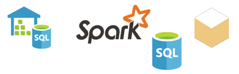

# Źródła danych dla usługi Power BI
Dane są kluczowe dla usługi Power BI. Każde eksplorowanie danych, tworzenie wykresów i pulpitów nawigacyjnych oraz zadawanie pytań za pomocą aparatu Pytania i odpowiedzi wiąże się z wyświetlaniem wizualizacji i odpowiedzi, które pobierają swoje dane źródłowe z zestawu danych. Ale skąd ten zestaw danych pochodzi? Ze źródła danych.

W tym artykule przedstawiono różne typy źródeł danych, z którymi można nawiązać połączenie za pomocą usługi Power BI. Należy pamiętać, że istnieje wiele innych typów źródeł danych, które również służą do pobierania danych. Mogą one jednak wymagać najpierw użycia zaawansowanych funkcji zapytań o dane i modelowania programu Power BI Desktop lub Excel. Bardziej szczegółowo omówimy ten temat później. Na razie przyjrzymy się różnym typom źródeł danych, z którymi można nawiązać połączenie bezpośrednio z witryny usługi Power BI.

Aby pobrać dane z któregokolwiek źródła danych usługi Power BI, wystarczy kliknąć kolejno pozycje **Mój obszar roboczy** > **Pobierz dane**.

## Pliki

**Excel** (xlsx, xlxm) Program Excel jest unikatowy, ponieważ skoroszyt może nie tylko zawierać dane wprowadzone do arkuszy przez samego użytkownika, ale i umożliwiać tworzenie zapytań i ładowanie danych z zewnętrznych źródeł danych za pomocą dodatku Power Query (funkcja Pobierz i przekształć w programie Excel 2016) lub Power Pivot. Możliwe jest też importowanie danych w postaci tabel umieszczonych w arkuszach kalkulacyjnych (dane *muszą* znajdować się w tabeli) oraz importowanie danych, które zostały załadowane do modelu danych. Aby dowiedzieć się więcej, zobacz [Pobieranie danych z programu Excel](service-get-data-from-files.md).

**Power BI Desktop** (pbix) — Program Power BI Desktop umożliwia tworzenie zapytań i ładowanie danych z zewnętrznych źródeł danych, rozszerzanie modelu danych za pomocą miar i relacji oraz tworzenie raportów. Plik programu Power BI Desktop można zaimportować do witryny usługi Power BI. Program Power BI Desktop jest najlepszym rozwiązaniem dla bardziej zaawansowanych użytkowników, którzy dobrze się orientują w kwestiach źródeł danych, tworzenia zapytań i przekształcania danych oraz ich modelowania. Aby uzyskać więcej informacji, zobacz [Łączenie się z danymi w programie Power BI Desktop](desktop-connect-to-data.md).

**Pliki z wartościami rozdzielanymi przecinkami** (csv) — Proste pliki tekstowe zawierające wiersze danych. Każdy wiersz może zawierać co najmniej jedną wartość, z których każda jest oddzielona przecinkiem. Na przykład plik csv zawierający dane określające imiona i nazwiska oraz adresy może składać się z wielu wierszy, z których każdy zawiera wartości imienia, nazwiska, ulicy, miejscowości, województwa i tak dalej. Nie można importować danych do pliku csv, ale wiele aplikacji, takich jak Excel, ma możliwość zapisywania prostych danych tabeli w postaci pliku csv.

W przypadku innych typów plików, takich jak tabele XML (xml) lub pliki tekstowe (txt), można użyć funkcji Pobierz i przekształć, aby rozpocząć od tworzenia zapytań, przekształcania i ładowania danych do pliku programu Excel lub Power BI Desktop. Następnie można zaimportować plik programu Excel lub Power BI Desktop do usługi Power BI.

Miejsce przechowywania plików jest równie ważne. Usługa OneDrive dla Firm zapewnia największą elastyczność i integrację z usługą Power BI. Przechowywanie plików na dysku lokalnym jest dobrym rozwiązaniem, ale odświeżanie danych wiąże się w takim przypadku z wykonaniem kilku dodatkowych czynności. Bardziej szczegółowe informacje zawierają artykuły, do których prowadzą zamieszczone linki.

## Pakiety zawartości

Pakiety zawartości zawierają wszystkie niezbędne dane i raporty gotowe do użycia. W usłudze Power BI występują dwa rodzaje pakietów zawartości: pochodzące z usług takich jak Google Analytics, Marketo i Salesforce oraz utworzone i udostępnione przez innych użytkowników w organizacji.

**Usługi** — pakiety zawartości dla usługi Power BI można znaleźć w niezliczonej liczbie usług, a kolejne są cały czas dodawane. Większość usług wymaga posiadania konta. Aby dowiedzieć się więcej, zobacz [Łączenie się z usługami](service-connect-to-services.md).

**Organizacyjne** — jeśli użytkownicy w organizacji mają konta usługi Power BI Pro, możliwe jest tworzenie, udostępnianie i używanie pakietów zawartości. Aby dowiedzieć się więcej, zobacz [Organizacyjne pakiety zawartości](service-organizational-content-pack-introduction.md).

## Bazy danych

**Bazy danych w chmurze** — usługa Power BI pozwala nawiązać połączenie na żywo z usługami Azure SQL Database, Azure SQL Data Warehouse, Spark on Azure HDInsight i SQL Server Analysis Services przy użyciu zapytań bezpośrednich. Połączenia między usługą Power BI a tymi bazami danych są dynamiczne. Oznacza to, że po połączeniu się z usługą Azure SQL Database i rozpoczęciu eksplorowania danych przez tworzenie raportów w usłudze Power BI, za każdym razem, gdy dane są dzielone lub dodawane jest kolejne pole do wizualizacji, zapytania są tworzone bezpośrednio do bazy danych. Aby dowiedzieć się więcej, zobacz [Platforma Azure i usługa Power BI](service-azure-and-power-bi.md).

**Lokalne bazy danych** — z poziomu usługi Power BI można połączyć się bezpośrednio z bazami danych modelu tabelarycznego usług SQL Server Analysis Services. W tym celu wymagana jest brama Power BI Enterprise. W razie wątpliwości co do sposobu łączenia się z bazą danych modelu tabelarycznego organizacji należy skontaktować się z administratorem lub działem informatycznym. Aby dowiedzieć się więcej, zobacz [Dane tabelaryczne usług SQL Server Analysis w usłudze Power BI](sql-server-analysis-services-tabular-data.md).

W przypadku innych typów baz danych w organizacji najpierw należy użyć programu Power BI Desktop lub Excel, aby nawiązać połączenie, wykonać zapytania i załadować dane do modelu danych. Następnie można zaimportować plik do usługi Power BI, w której został utworzony zestaw danych. W razie skonfigurowania harmonogramu odświeżania usługa Power BI użyje informacji o połączeniu dostępnych w pliku oraz skonfigurowanych ustawień odświeżania w celu nawiązania bezpośredniego połączenia ze źródłem danych i wykonywania zapytań o aktualizacje. Te aktualizacje są następnie ładowane do zestawu danych usługi Power BI. Aby uzyskać więcej informacji, zobacz [Łączenie się z danymi w programie Power BI Desktop](desktop-connect-to-data.md).

## Co zrobić, jeśli dane pochodzą z innego źródła?
Źródeł danych, których można używać z usługą Power BI, jest wręcz niezliczona liczba. Jednak niezależnie od tego, skąd pochodzą dane, muszą one być w formacie, który umożliwia usłudze Power BI między innymi tworzenie raportów i pulpitów nawigacyjnych oraz odpowiadanie na pytania przy użyciu aparatu Pytania i odpowiedzi.

Niektóre źródła danych zawierają dane w formacie przystosowanym do usługi Power BI, na przykład pakiety zawartości od dostawców usług, takich jak Google Analytics i Twilio. Bazy danych modelu tabelarycznego usług SQL Server Analysis Services są również gotowe do użycia. Można również łączyć się na żywo z bazami danych w chmurze, takimi jak Azure SQL Database i Spark w usłudze HDInsight.

W innych przypadkach może być konieczne wykonanie zapytania i załadowanie danych do pliku. Załóżmy, że dane logistyczne znajdują się w bazie danych magazynu danych na serwerze organizacji. W usłudze Power BI nie można połączyć się bezpośrednio z tą bazą danych i rozpocząć eksploracji jej danych (chyba że jest to baza danych modelu tabelarycznego). Możliwe jest jednak użycie programu Power BI Desktop lub Excel w celu wykonania zapytań i załadowania tych danych logistycznych do modelu danych, który następnie jest zapisywany w postaci pliku. Następnie można zaimportować ten plik do usługi Power BI, w której został utworzony zestaw danych.

Pewnie niejedna osoba myśli sobie: „Przecież dane logistyczne w tej bazie danych codziennie się zmieniają. Jak mogę zapewnić, że mój zestaw danych w usłudze Power BI będzie odświeżany?”. Informacje o połączeniu z pliku programu Excel lub Power BI Desktop są importowane do zestawu danych wraz z danymi. Jeśli harmonogram odświeżania zostanie skonfigurowany lub odświeżanie zestawu danych będzie wykonywane ręcznie, usługa Power BI użyje informacji o połączeniu z zestawu danych wraz z innymi ustawieniami w celu nawiązania bezpośredniego połączenia z bazą danych, wykonywania zapytań o aktualizacje i ładowania tych aktualizacji do zestawu danych. Brama usługi Power BI będzie prawdopodobnie potrzebna do zabezpieczenia wszelkich transferów danych między serwerem lokalnym a usługą Power BI. Wszelkie wizualizacje w raportach i pulpity nawigacyjne są odświeżane automatycznie.

Oznacza to, że nawet jeśli nie można połączyć się ze źródłem danych bezpośrednio z poziomu usługi Power BI, i tak można przekazać dane do usługi Power BI. Może to jedynie wymagać wykonania kilku dodatkowych czynności i zwrócenia się o pomoc do działu informatycznego. Aby dowiedzieć się więcej, zobacz [Źródła danych w programie Power BI Desktop](desktop-data-sources.md).

## Więcej szczegółów
Terminy „zestaw danych” i „źródło danych” bardzo często pojawiają się w kontekście usługi Power BI. Często używa się ich jako synonimów i choć są ze sobą powiązane, tak naprawdę każdy z nich oznacza coś innego.

***Zestaw danych*** jest tworzony automatycznie w usłudze Power BI, gdy używana jest funkcja pobierania danych w celu nawiązania połączenia oraz zaimportowania danych z pakietu zawartości lub pliku bądź gdy nawiązywane jest połączenie z dynamicznym źródłem danych. Zestaw danych zawiera informacje o źródle danych, poświadczeniach źródła danych i w wielu przypadkach także podzbiory danych skopiowanych ze źródła danych. W większości przypadków tworzenie wizualizacji w raportach i pulpitów nawigacyjnych wiąże się z wyświetlaniem danych z zestawu danych.

W ***źródle danych*** przechowywane są dane, z których korzysta zestaw danych. Przykładem takiego źródła danych może być usługa online, taka jak Google Analytics lub QuickBooks, baza danych w chmurze, taka jak Azure SQL Database, a także baza danych lub plik na lokalnym komputerze lub serwerze w danej organizacji.

### Odświeżanie danych
W razie zapisania plików na dysku lokalnym lub na dysku w organizacji może być wymagana brama usługi Power BI, aby umożliwić odświeżenie zestawu danych w usłudze Power BI. Komputer, na którym jest zapisany plik, musi być włączony w momencie odświeżania. Można również ponownie zaimportować plik lub użyć funkcji publikowania z poziomu programu Excel lub Power BI Desktop, ale nie są to procesy zautomatyzowane.

Zapisanie plików w usłudze OneDrive dla Firm lub SharePoint — witryny zespołu, a następnie nawiązanie połączenia z usługą Power BI lub zaimportowanie do niej tych plików powoduje, że zestaw danych, raporty i pulpit nawigacyjny będą zawsze aktualne. Ponieważ zarówno usługa OneDrive, jak i Power BI znajdują się w chmurze, usługa Power BI może łączyć się bezpośrednio z zapisanym plikiem, mniej więcej raz na godzinę, i sprawdzać dostępność aktualizacji. Jeśli jakaś zostanie znaleziona, odświeżanie zestawu danych i wszelkich wizualizacji nastąpi automatycznie.

Pakiety zawartości usług są automatycznie aktualizowane. W większości przypadków odbywa się to raz dziennie. Ręczne odświeżanie jest możliwe, ale ewentualne wyświetlenie zaktualizowanych danych zależy od dostawcy usługi. Pakiety zawartości pochodzące od innych użytkowników w organizacji będą zależeć od użytych źródeł danych oraz od tego, jak został skonfigurowany harmonogram odświeżania.

Usługi Azure SQL Database i Azure SQL Data Warehouse oraz platforma Spark w usłudze Azure HDInsight są unikatowe, ponieważ są źródłami danych w chmurze. Ponieważ usługa Power BI jest również w chmurze, może ona łączyć się z nimi na żywo za pomocą zapytań bezpośrednich. Informacje wyświetlane w usłudze Power BI są zawsze zsynchronizowane, więc konfigurowanie procesu odświeżania nie jest konieczne.

Usługi SQL Server Analysis Services są unikatowe, ponieważ nawiązywanie z nimi połączenia za pomocą usługi Power BI odbywa się na żywo, podobnie jak w przypadku bazy danych platformy Azure w chmurze, jednak sama baza danych znajduje się na serwerze organizacji. Ten typ połączenia wymaga bramy usługi Power BI, która jest zwykle konfigurowana przez dział informatyczny.

Odświeżanie danych jest zagadnieniem bardzo istotnym w kontekście usługi Power BI, ale ze względu na jego złożoność proces ten zostanie omówiony w innym artykule. Aby uzyskać wyczerpujące informacje, zobacz [Odświeżanie danych w usłudze Power BI](refresh-data.md).

## Zalecenia i ograniczenia
Do wszystkich źródeł danych używanych w usłudze Power BI mają zastosowanie następujące zalecenia i ograniczenia. Poszczególne funkcje charakteryzują się innymi ograniczeniami, ale poniższa lista dotyczy w szczególności zagadnień usługi Power BI:

* **Limit rozmiaru zestawu danych** — Limit 1 GB dla każdego zestawu danych w ramach usługi Power BI.
* **Limit wierszy** — Maksymalna liczba wierszy w zestawie danych (gdy zapytania bezpośrednie nie są używane) wynosi 2 miliardy, spośród których trzy wiersze są zarezerwowane (co pozwala korzystać z maksymalnie 1 999 999 997 wierszy), natomiast maksymalna liczba wierszy w przypadku używania zapytań bezpośrednich wynosi 1 milion.
* **Limit kolumn** — Maksymalna liczba kolumn dozwolona w zestawie danych, po uwzględnieniu jego wszystkich tabel, wynosi 16 000 kolumn. Dotyczy to usługi Power BI i zestawów danych używanych w programie Power BI Desktop. Usługa Power BI używa wewnętrznej kolumny numeru wiersza na jedną tabelę zawartą w zestawie danych, co oznacza, że maksymalna liczba kolumn to 16 000 minus jeden dla każdej tabeli użytej w zestawie danych.

