# Samouczek: wprowadzenie do usługi Power BI (app.powerbi.com)
Ten samouczek ułatwia rozpoczęcie pracy z ***usługą Power BI***. Jeśli chcesz dowiedzieć się, jakie miejsce zajmuje usługa Power BI w ofercie innych produktów Power BI, zdecydowanie zalecamy zapoznanie się z tematem [Co to jest Power BI](power-bi-overview.md).

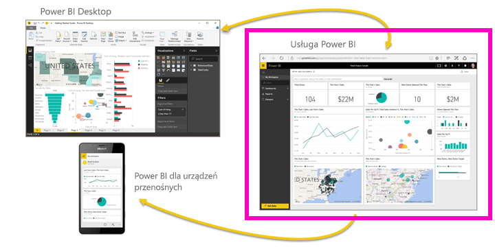

Ten samouczek obejmuje następujące kroki:

> [!div class="checklist"]
> * Wyszukiwanie innej zawartości dotyczącej wprowadzenia do usługi Power BI
> * Logowanie do konta usługi Power BI w trybie online lub tworzenie konta, jeśli jeszcze go nie masz
> * Otwieranie usługi Power BI
> * Pobieranie danych i otwieranie ich w widoku raportu
> * Używanie tych danych do tworzenia wizualizacji i zapisywanie jej jako raportu
> * Tworzenie pulpitu nawigacyjnego przez przypinanie kafelków z raportu
> * Dodawanie kolejnej wizualizacji do pulpitu nawigacyjnego za pomocą narzędzia języka naturalnym dla pytań i odpowiedzi
> * Oczyszczanie zasobów przez usuwanie zestawu danych, raportu i pulpitu nawigacyjnego

## Tworzenie konta w usłudze Power BI
Jeśli nie masz konta usługi Power BI Pro, na początku [utwórz konto bezpłatnej wersji próbnej usługi Power BI](https://app.powerbi.com/signupredirect?pbi_source=web).

Jeśli masz już konto, otwórz przeglądarkę i wpisz adres app.powerbi.com, aby otworzyć usługę Power BI. 

Jeśli potrzebujesz pomocy dotyczącej programu Power BI Desktop, zobacz [Wprowadzenie do programu Desktop](desktop-getting-started.md). Jeśli potrzebujesz pomocy dotyczącej aplikacji Power BI dla urządzeń przenośnych, zobacz [Aplikacje Power BI dla urządzeń przenośnych](consumer/mobile/mobile-apps-for-mobile-devices.md).

> [!TIP]
> Wolisz skorzystać z darmowego kursu szkoleniowego, realizowanego samodzielnie? [Zapisz się na nasz kurs Analizowanie i wizualizowanie danych, dostępny w witrynie EdX](http://aka.ms/edxpbi).

Zapoznaj się z naszą [listą odtwarzania w serwisie YouTube](https://www.youtube.com/playlist?list=PL1N57mwBHtN0JFoKSR0n-tBkUJHeMP2cP). Warto zacząć od obejrzenia klipu wideo Wprowadzenie do usługi Power BI:
> 
> <iframe width="560" height="315" src="https://www.youtube.com/embed/B2vd4MQrz4M" frameborder="0" allowfullscreen></iframe>
> 

## Co to jest usługa Power BI?
Usługa Microsoft Power BI jest czasami nazywana usługą Power BI w trybie online lub app.powerbi.com. Usługa Power BI pomaga na bieżąco śledzić ważne informacje.  ***Pulpity nawigacyjne*** usługi Power BI umożliwiają monitorowanie najważniejszych aspektów działalności biznesowej.  Pulpity nawigacyjne zawierają ***kafelki***, które można kliknąć, aby otworzyć ***raporty*** umożliwiające uzyskiwanie dodatkowych informacji.  Połączenie z wieloma ***zestawami danych*** pozwala wyświetlać wszystkie istotne dane w jednym miejscu. Potrzebujesz pomocy dotyczącej bloków konstrukcyjnych tworzących usługę Power BI?  Zobacz [Power BI — podstawowe pojęcia](consumer/end-user-basic-concepts.md).

Jeśli przechowujesz ważne dane w plikach programu Excel lub plikach CSV, możesz utworzyć pulpit nawigacyjny usługi Power BI, aby mieć dostęp do informacji w dowolnym miejscu i dzielić się spostrzeżeniami z innymi osobami.  Czy masz subskrypcję aplikacji SaaS, takiej jak Salesforce?  Od razu połącz się z usługą Salesforce, aby automatycznie utworzyć pulpit nawigacyjny z tych danych, lub [zapoznaj się z innymi aplikacjami SaaS](service-get-data.md), z którymi możesz nawiązać połączenie. Jeśli należysz do organizacji, sprawdź, czy możesz korzystać z opublikowanych [aplikacji](consumer/end-user-create-apps.md).

Zapoznaj się z wszystkimi innymi sposobami [pobierania danych dla usługi Power BI](service-get-data.md).

## Krok 1. Pobieranie danych
Oto przykład przedstawiający pobieranie danych z pliku CSV. Chcesz kontynuować pracę z tym samouczkiem? [Pobierz przykładowy plik CSV](http://go.microsoft.com/fwlink/?LinkID=521962).

1. [Zaloguj się do usługi Power BI](http://www.powerbi.com/). Nie masz konta? Nie martw się — możesz utworzyć konto bezpłatnej wersji próbnej.
2. Usługa Power BI zostanie otwarta w przeglądarce. Wybierz pozycję **Pobierz dane** w dolnej części paska nawigacyjnego po lewej stronie.
   
   
3. Wybierz pozycję **Pliki**. 
   
   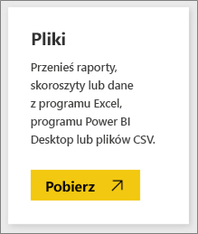
4. Przejdź do pliku na komputerze i wybierz pozycję **Otwórz**. Jeśli plik został zapisany w usłudze OneDrive dla Firm, wybierz tę opcję. Jeśli plik został zapisany lokalnie, wybierz opcję **Plik lokalny**. 
   
   
5. W tym samouczku wybierzemy pozycję **Importuj**, aby dodać plik programu Excel jako zestaw danych, na podstawie którego utworzymy raporty i pulpity nawigacyjne. W przypadku wybrania pozycji **Przekaż** cały skoroszyt programu Excel jest przekazywany do usługi Power BI, gdzie można go otworzyć i edytować w aplikacji Excel Online.
   
   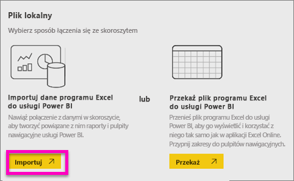
6. Po przygotowaniu zestawu danych wybierz pozycję **Wyświetl zestaw danych**, aby go otworzyć w edytorze raportów. 

    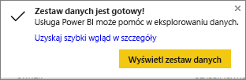

    Ponieważ jeszcze nie utworzyliśmy żadnej wizualizacji, kanwa raportu będzie pusta.

    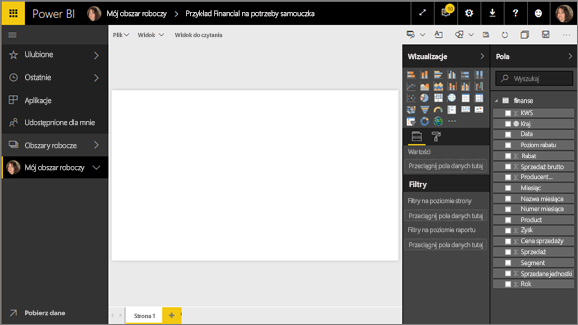

6. Spójrz na górny pasek menu i zauważ, że jest dostępna opcja **Widok do czytania**. Ponieważ opcja widoku do czytania jest dostępna, oznacza to, że jesteś obecnie w **widoku do edycji**. 

    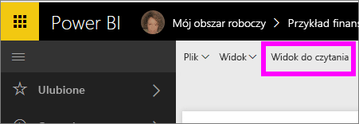

    W widoku do edycji możesz tworzyć i modyfikować raporty, ponieważ jesteś *właścicielem* raportu — jesteś *twórcą*. Po udostępnieniu raportu współpracownikom będą oni mogli wchodzić z nim w interakcje jedynie w widoku do czytania — są to *użytkownicy*. Dowiedz się więcej na temat [widoku do czytania oraz widoku do edycji](consumer/end-user-reading-view.md).
    
    Doskonałym sposobem na zapoznanie się z edytorem raportów jest skorzystanie z tego [krótkiego przewodnika](service-the-report-editor-take-a-tour.md).
   > 
 

## Krok 2. Rozpoczynanie eksplorowania zestawu danych
Teraz, po nawiązaniu połączenia z danymi, rozpocznij eksplorowanie.  Po znalezieniu interesujących danych możesz utworzyć pulpit nawigacyjny w celu monitorowania ich zmian w czasie. Zobaczmy, jak to działa.
    
1. Aby utworzyć wizualizację, w edytorze raportu użyjemy okienka **Pola** w prawej części strony.  Zaznacz pola wyboru obok pozycji **Gross Sales** i **Date**.
   
   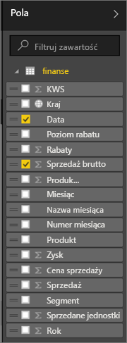

2. Usługa Power BI przeanalizuje dane i utworzy wizualizację.  Jeśli najpierw wybrano pole **Date**, pojawi się tabela.  Jeśli najpierw wybrano pole **Gross Sales**, pojawi się wykres. Wybierz inny sposób wyświetlania danych. Zobaczmy te dane w postaci wykresu liniowego. Wybierz ikonę wykresu liniowego (znanego także jako szablon) w **okienku Wizualizacje**.
   
   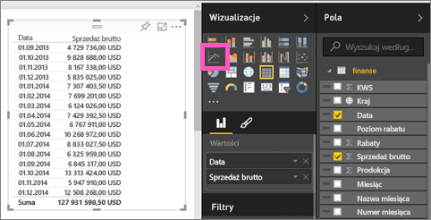

3. Wykres wygląda ciekawie, więc *przypnijmy* go do pulpitu nawigacyjnego. Umieść kursor na wizualizacji i wybierz ikonę **Przypnij**.  Po przypięciu wizualizacji zostanie ona zapisana na pulpicie nawigacyjnym i będzie na bieżąco aktualizowana. Dzięki temu będzie można błyskawicznie sprawdzić najnowsze wartości.
   
   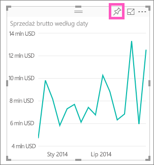

4. Ponieważ to jest nowy raport, zostanie wyświetlony monit o jego zapisanie, zanim będzie można przypiąć wizualizację do pulpitu nawigacyjnego. Nadaj raportowi nazwę (np. *Sales over time* — Sprzedaż w czasie) i wybierz pozycję **Zapisz i kontynuuj**. 
   
   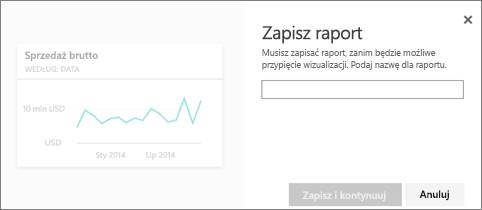
   
5. Przypnijmy wykres liniowy do nowego pulpitu nawigacyjnego i nadajmy mu nazwę „Financial sample for tutorial” (Przykład finansowy na potrzeby samouczka). 
   
   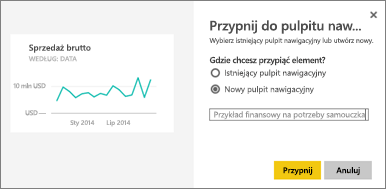
   
1. Wybierz pozycję **Przypnij**.
   
    Komunikat o powodzeniu (w prawym górnym rogu) informuje o tym, że wizualizacja została dodana do pulpitu nawigacyjnego jako kafelek.
   
    

6. Wybierz pozycję **Przejdź do pulpitu nawigacyjnego**, aby wyświetlić wykres liniowy przypięty jako kafelek do całkowicie nowego pulpitu nawigacyjnego. Aby usprawnić pulpit nawigacyjny, możesz dodawać kolejne kafelki wizualizacji, a także [łączyć kafelki oraz zmieniać ich nazwy, rozmiary i położenie](service-dashboard-edit-tile.md).
   
   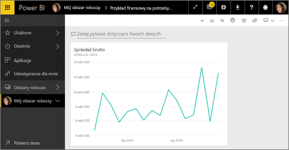
   
   W dowolnym momencie możesz powrócić do raportu, wybierając nowy kafelek na pulpicie nawigacyjnym. Usługa Power BI przeniesie Cię do widoku do czytania w edytorze raportu. Aby powrócić do widoku do edycji, wybierz pozycję **Edytuj raport** z górnego paska menu. Po przejściu do widoku do edycji, kontynuuj eksplorowanie i przypinanie kafelków. 

## Krok 3. Kontynuowanie eksplorowania za pomocą funkcji Pytania i odpowiedzi (zapytania w języku naturalnym)
1. Aby przeprowadzić szybką eksplorację danych, spróbuj zadać pytanie w polu Pytania i odpowiedzi. Pole funkcji Pytania i odpowiedzi znajduje się w górnej części pulpitu nawigacyjnego (**Zadaj pytanie dotyczące Twoich danych**) i w górnym pasku menu raportu (**Zadaj pytanie**). Wpisz na przykład pytanie „what segment had the most revenue” (w jakim segmencie przychody były największe).
   
   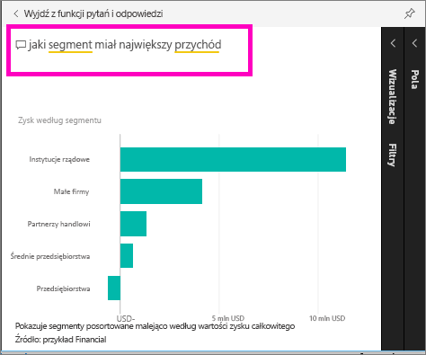

2. Funkcja Pytania i odpowiedzi wyszuka odpowiedź, a następnie wyświetli ją w formie wizualizacji. Wybierz ikonę przypinania  w celu wyświetlenia na pulpicie nawigacyjnym również tej wizualizacji.
3. Przypnij wizualizację do pulpitu nawigacyjnego „Financial Sample for tutorial”.
   
    

4. Wróć do pulpitu nawigacyjnego, w którym zostanie wyświetlony nowy kafelek.

   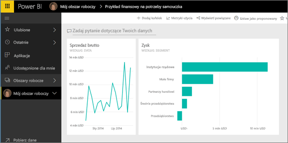

## Czyszczenie zasobów
Teraz, po zakończeniu tego samouczka, możesz usunąć zestaw danych, raport i pulpit nawigacyjny. 

1. Wybierz pozycję **Mój obszar roboczy** na lewym pasku nawigacyjnym.
2. Wybierz kartę **Zestawy danych** i znajdź zestaw danych zaimportowany na potrzeby tego samouczka.  
3. Wybierz wielokropek (...) > **Usuń**.

    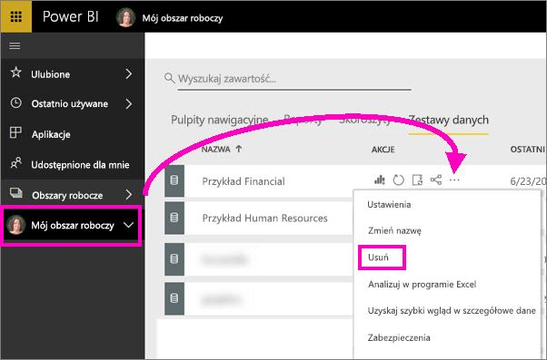

    Usunięcie zestawu danych spowoduje również usunięcie raportu i pulpitu nawigacyjnego. 

## Następne kroki
Chcesz szybko skorzystać z innych samouczków?  Poniżej przedstawiono kilka przydatnych tematów, które pozwalają zapoznać się z usługą Power BI.

> [!div class="nextstepaction"]
> [Łączenie się z używanymi usługami online](consumer/end-user-connect-to-services.md)

