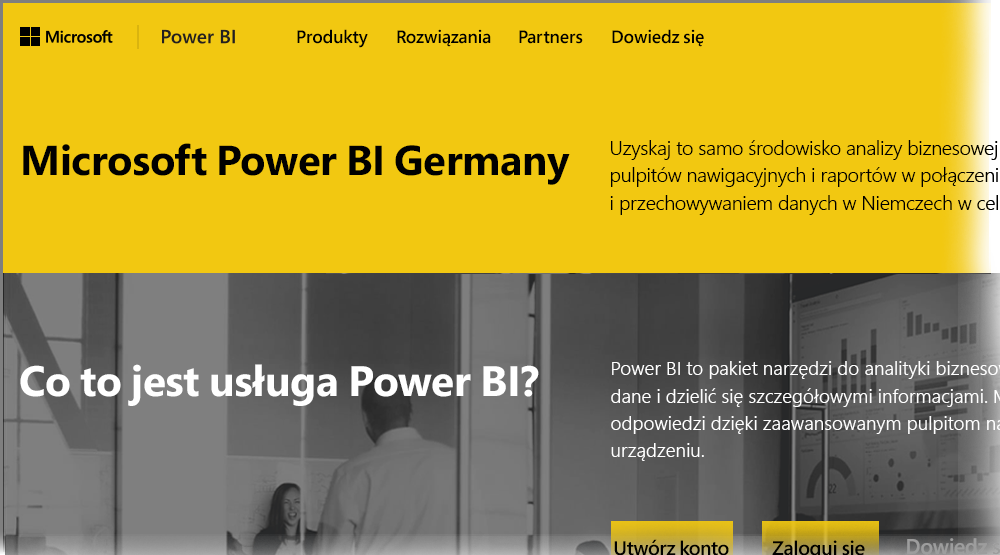

# Często zadawane pytania dotyczące usługi Power BI dla klientów usługi Germany Cloud
**Usługa Power BI** jest dostępna w wersji przeznaczonej dla klientów z obszaru Unii Europejskiej/Europejskiego Porozumienia o Wolnym Handlu (EFTA). Wersja ta jest często nazywana Microsoft Cloud Deutschland (MCD). Wersja **usługi Power BI** omówiona w tym artykule jest przeznaczona dla klientów z obszaru Unii Europejskiej/EFTA. Jest to osobna usługa, inna od komercyjnej wersji **usługi Power BI** oraz od usług Power BI przeznaczonych dla jednostek administracji państwowej.

## Pytania i odpowiedzi

Zestaw poniższych pytań i odpowiedzi zawiera ważne informacje dotyczące usługi Power BI Pro udostępnianej w ramach oferty Microsoft Cloud Deutschland (MCD) — usługi Power BI w chmurze przeznaczonej specjalnie dla klientów z obszaru Unii Europejskiej/EFTA.

1. **Co to jest usługa Power BI for Germany Cloud?**
   
   Usługa Power BI przeznaczona dla klientów z obszaru Unii Europejskiej/EFTA, znana również jako Microsoft Cloud Deutschland (MCD), to usługa Power BI w chmurze, która jest zgodna z wymaganiami Unii Europejskiej/EFTA i obsługiwana za pomocą niemieckich centrów danych. Wszystkie dane klientów usługi Power BI w chmurze przeznaczonej dla Unii Europejskiej/EFTA są przechowywane w Niemczech i administrowane przez niezależnego niemieckiego zarządcę danych — firmę T-Systems. Dostęp do tych danych na poziomie fizycznym i logicznym odbywa się zgodnie z przepisami niemieckiego prawa. Usługa Power BI w chmurze dla Unii Europejskiej/EFTA wymaga odrębnego konta, innego niż konto używane do korzystania z komercyjnej wersji usługi Power BI. Więcej informacji o usłudze Microsoft Cloud Deutschland znajdziesz [tutaj](https://www.microsoft.com/trustcenter/cloudservices/nationalcloud).
2. **Gdzie można znaleźć cennik usługi Power BI Germany Cloud oraz informacje o tworzeniu konta?**
   
   [Strona główna usługi Power BI Germany Cloud](https://powerbi.microsoft.com/power-bi-germany/) zawiera mnóstwo informacji, w tym cennik. Ponadto można tam znaleźć link umożliwiający rejestrację w 30-dniowej wersji próbnej **usługi Power BI Pro** z 25 licencjami użytkowników. W ramach tworzenia konta w wersji próbnej dostępna jest opcja zakupu usługi lub dodania kolejnych licencji. Oferujemy również umowy Enterprise Agreement (EA) oraz wersje dla instytucji państwowych i niedochodowych. Aby uzyskać więcej informacji, skontaktuj się z przedstawicielem firmy Microsoft ds. klientów.
3. **Korzystam z dzierżawy usługi Germany Cloud w ramach subskrypcji platformy Azure (Niemcy) i/lub usługi Office 365 Germany. Czy mogę utworzyć konto w usłudze Power BI Germany za pomocą istniejącej dzierżawy?**
   
   Tak. W ramach procesu tworzenia konta dostępna jest opcja zalogowania się przy użyciu istniejącego konta administratora dzierżawy usługi Germany Cloud i dodania licencji usługi Power BI Pro do istniejącej dzierżawy w usłudze Germany Cloud. Pamiętaj o tym, że dzierżawy i konta użytkowników usługi Germany Cloud są inne niż konta użytkowników usługi Power BI for Germany Cloud.
4. **Czy dostępna jest bezpłatna wersja usługi Power BI for Germany Cloud?**
   
   Nie. Nie oferujemy wersji usługi Power BI for Germany Cloud z bezpłatnymi licencjami. Zachęcamy jednak do skorzystania z [bezpłatnej usługi Power BI w naszej chmurze publicznej](https://powerbi.microsoft.com/get-started/), jeśli może ona zaspokoić Twoje potrzeby biznesowe.
5. **Czy można używać aplikacji Power BI Desktop, Power BI — urządzenia przenośne, lokalnej bramy danych i dodatku Publisher dla programu Excel razem z usługą Power BI dla chmury w Niemczech?**
   
   Tak. Zaktualizowaliśmy produkty klienckie usługi Power BI, aby zapewnić ich bezproblemowe współdziałanie z usługą Power BI for Germany Cloud. Aby korzystać z tych samych produktów klienckich razem z usługą Power BI for Germany Cloud, zaloguj się przy użyciu konta usługi Power BI for Germany Cloud. Najnowsze wersje produktów klienckich można pobrać z następujących lokalizacji:
   
   * [Power BI Desktop](https://powerbi.microsoft.com/desktop/)
   * [Power BI dla urządzeń przenośnych](https://powerbi.microsoft.com/mobile/)
   * [Lokalna brama danych](https://powerbi.microsoft.com/gateway/)
   * [Power BI Publisher dla programu Excel](https://powerbi.microsoft.com/excel-dashboard-publisher/)
6. **Czy występują ograniczenia funkcji usługi Power BI for Germany Cloud?**
   
   Następujące funkcje nie są obecnie dostępne w usłudze Power BI for Germany Cloud:
   
   * Publikowanie w Internecie
   * Mapy ArcGIS firmy Esri
   * Power BI Embedded — oddzielne, mierzone licencje niezależnych dostawców oprogramowania będą dostępna na platformie [Microsoft Azure (Niemcy)](https://azure.microsoft.com/overview/clouds/germany/) w przyszłości.
7. **Gdzie można znaleźć informacje o konfiguracji usługi Power BI for Germany Cloud, umożliwiające jej używanie i integrację we własnych aplikacjach?**
   
   Zaktualizowaliśmy nasze [przykłady dla deweloperów dotyczące osadzania SaaS](https://github.com/Microsoft/PowerBI-Developer-Samples) o informacje o konfiguracji usługi Power BI for Germany Cloud i innych usług w chmurze. Folder **Cloud Configs** w przykładach zawiera informacje o punktach końcowych konfiguracji pod kątem chmury. W poniższej tabeli wymieniono różne punkty końcowe konfiguracji dla usługi Power BI for Germany Cloud (oraz dla chmury publicznej — w celu porównania).

| **Nazwa i/lub użycie punktu końcowego** | **Adres URL usługi Power BI for Germany Cloud** | **Odpowiadający adres URL w chmurze publicznej (dla porównania)** |
| --- | --- | --- |
| Strona główna, rejestracja i logowanie |[https://powerbi.microsoft.com/power-bi-germany/](https://powerbi.microsoft.com/power-bi-germany/) |[https://powerbi.microsoft.com/](https://powerbi.microsoft.com/) |
| Bezpośrednie logowanie w usłudze Power BI |[https://app.powerbi.de/?noSignUpCheck=1](https://app.powerbi.de/?noSignUpCheck=1) |[https://app.powerbi.com/?noSignUpCheck=1](https://app.powerbi.com/?noSignUpCheck=1) |
| Interfejs API usługi |[https://api.powerbi.de/](https://api.powerbi.de/) |[https://api.powerbi.com/](https://api.powerbi.com/) |
| Portal usługi Office umożliwiający zarządzanie licencjami użytkowników, monitorowanie stanu kondycji usługi i obsługę żądań pomocy technicznej przez administratorów |[https://portal.office.de/](https://portal.office.de/) |[https://portal.office.com/](https://portal.office.com/) |
| Identyfikator Uri urzędu usługi AAD |[https://login.microsoftonline.de/common/oauth2/authorize/](https://login.microsoftonline.de/common/oauth2/authorize/) |[https://login.microsoftonline.com/common/oauth2/authorize/](https://login.microsoftonline.com/common/oauth2/authorize/) |
| Identyfikator Uri zasobów usługi Power BI |[https://analysis.cloudapi.de/powerbi/api](https://analysis.cloudapi.de/powerbi/api) |[https://analysis.windows.net/powerbi/api](https://analysis.windows.net/powerbi/api) |
| Biblioteka wizualizacji niestandardowych |[https://app.powerbi.de/visuals/](https://app.powerbi.de/visuals/) |[https://app.powerbi.com/visuals/](https://app.powerbi.com/visuals/) |
| Rejestrowanie aplikacji korzystającej z usługi Power BI (dla wersji Embedded) |[https://app.powerbi.de/apps](https://app.powerbi.de/apps) |[https://app.powerbi.com/apps](https://app.powerbi.com/apps) |
| Azure Portal (dla wersji Embedded) |[https://portal.microsoftazure.de/](https://portal.microsoftazure.de/) |[https://portal.azure.com/](https://portal.azure.com/) |
| Społeczność |[https://community.powerbi.com/](https://community.powerbi.com/) |[https://community.powerbi.com/](https://community.powerbi.com/) |

## Następne kroki
Przy użyciu usługi Power BI można wykonywać różnorodne zadania. Aby uzyskać więcej informacji i instrukcji, w tym na temat rejestrowania się w usłudze, zobacz następujące zasoby:

* [Power BI — nauka krok po kroku](guided-learning/gettingstarted.yml?tutorial-step=1)
* [[Wprowadzenie do usługi Power BI](service-get-started.md)](service-get-started.md)
* [Co to jest Power BI Desktop?](desktop-what-is-desktop.md)

