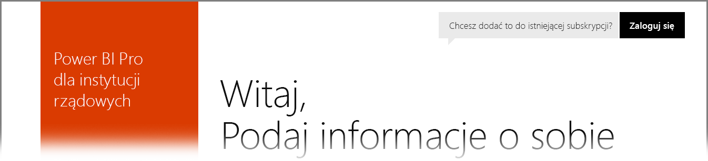

# Usługa Power BI dla klientów rządowych w Stanach Zjednoczonych
**Usługa Power BI** oferuje wersję dostępną dla klientów rządowych w Stanach Zjednoczonych w ramach subskrypcji **Office 365 US Government Community**. Wersja **usługi Power BI** omówiona w tym artykule jest przeznaczona wyłącznie dla klientów rządowych USA — jest to osobna usługa, która jest inna niż komercyjna wersja **usługi Power BI**.

Poniższa sekcja zawiera opis *funkcji* dostępnych w ramach wersji US Government **usługi Power BI**, omówienie niektórych *ograniczeń*, listę często zadawanych pytań (**FAQ**) i odpowiedzi (np. dotyczących rejestracji), a także linki do dodatkowych informacji.

## Funkcje w usłudze Power BI US Government
Należy zauważyć, że **usługa Power BI US Government** jest dostępna tylko w ramach **licencji Pro** i nie jest dostępna w postaci bezpłatnej licencji. Niektóre funkcje usługi Power BI są dostępne w wersji **Power BI US Government**.

Następujące funkcje są dostępne dla klientów **usługi Power BI US Government**, ponieważ zostały zawarte w ramach licencji **Pro**:

* Tworzenie i wyświetlanie pulpitów nawigacyjnych i raportów
* [Limity miejsca na dane](service-admin-manage-your-data-storage-in-power-bi.md)
* [Odświeżanie danych według harmonogramu](refresh-data.md)
* Pulpity nawigacyjne zespołu z możliwością odświeżania
* Grupy usługi Active Directory na potrzeby udostępniania i zarządzania kontrolą dostępu
* [Importowanie danych](service-get-data.md) i raportów z plików CSV oraz plików programu Excel i Power BI Desktop
* Brama zarządzania danymi
* Szyfrowanie wszystkich danych w usługach Azure SQL i Blob Storage na potrzeby usługi Power BI
* Nawiązywanie połączenia z usługami za pomocą [pakietów zawartości](service-connect-to-services.md)

## Łączność między rządowymi i publicznymi usługami Azure Cloud Services 

Platforma Azure jest rozproszona w ramach wielu chmur. Domyślnie dzierżawy mogą otwierać reguły zapory na potrzeby wystąpienia specyficznego dla chmury, ale połączenia sieciowe między chmurami są inne i wymagają otwarcia określonych reguł zapory na potrzeby komunikacji między usługami. Jeśli jesteś klientem usługi Power BI i w chmurze publicznej masz istniejące wystąpienia SQL, do których chcesz uzyskiwać dostęp, musisz otworzyć określone reguły zapory w bazie danych SQL dla przestrzeni adresów IP chmury platformy Azure Government w przypadku następujących centrów danych:

* USGov Iowa
* USGov Wirginia
* USGov Teksas
* USGov Arizona

W chmurze publicznej przestrzenie adresów IP są dostępne, ale w przypadku chmury dla instytucji rządowych należy otworzyć bilet pomocy technicznej platformy Azure i poprosić o podanie zakresów adresów IP dla powyższych centrów danych. 

## Ograniczenia dotyczące usługi Power BI US Government
Niektóre funkcje dostępne w komercyjnej wersji **usługi Power BI** *nie* są dostępne w **usłudze Power BI** w wersji US Government. Zespół usługi Power BI stale pracuje nad udostępnieniem tych funkcji klientom rządowym w Stanach Zjednoczonych, a niniejszy artykuł zostanie zaktualizowany, gdy funkcje zostaną udostępnione.

* **Osadź w usłudze SharePoint Online** — nie można osadzić zawartości w usłudze SharePoint Online przy użyciu składnika Web Part usługi Power BI.
* **Usługa Power BI US Government** jest dostępna tylko w ramach licencji **Pro**. Wszelkie odwołania do licencji usługi Power BI (bezpłatnej) w portalu administratora (lub jako użytkownika) są uruchamiane w chmurze komercyjnej usługi Power BI.
* **Inspekcja** — funkcja inspekcji nie jest dostępna za pośrednictwem portalu zabezpieczeń i zgodności usługi Office 365.
* **Zawartość usługi Power BI w Cortanie** — wyniki usługi Power BI nie będą widoczne w wynikach wyszukiwania Cortany. Obejmuje to wyniki dla zawartości usługi Power BI (pulpity nawigacyjne, raporty, aplikacje) oraz wyniki, które zawierają zoptymalizowane pod kątem Cortany strony raportów dla określonych słów kluczowych.
* **Udostępnianie użytkownikom zewnętrznym** — udostępnianie jest dozwolone tylko w ramach dzierżawy usługi Power BI. Nie można udostępniać użytkownikom spoza dzierżawy usługi Power BI.

Jeśli do kont zostaną przypisane bezpłatne licencje **usługi Power BI**, takie konta działają w wersji komercyjnej **usługi Power BI** i nie są częścią oferty **usługi Power BI US Government**. W przypadku bezpłatnych kont mogą wystąpić następujące problemy:

* W bramie Power BI Gateway, aplikacji mobilnej usługi Power BI oraz w programie Power BI Desktop nie można przeprowadzić uwierzytelniania.
* Nie można uzyskiwać dostępu do komercyjnych źródeł danych platformy Azure.
* Pliki PBIX należy ręcznie przekazywać z wersji komercyjnej.
* Aplikacje mobilne Power BI są niedostępne.

Aby rozwiązać problemy, skontaktuj się z przedstawicielem konta.

## Często zadawane pytania dotyczące usługi Power BI w wersji US Government
Poniższe pytania i odpowiedzi pomagają szybko uzyskać potrzebne informacje o usłudze.

**Pytanie:** Jak przeprowadzić migrację komercyjnych danych **usługi Power BI** do **usługi Power BI** w wersji US Government?

**Odpowiedź:** Administrator musi utworzyć nowe wystąpienie **usługi Power BI** w oddzielnej subskrypcji przeznaczonej dla wersji US Government. Następnie możesz replikować komercyjne dane w **usłudze Power BI** w wersji US Government, usunąć komercyjną licencję i przypisać istniejącą domenę do nowej usługi w wersji US Government.

**Pytanie:** Dlaczego nie mogę połączyć się z określonym pakietem zawartości?

**Odpowiedź:** Przed nawiązaniem połączenia z pakietem zawartości należy upewnić się, że subskrypcja jest włączona.

**Pytanie:** Chcę uzyskać **usługę Power BI** dla mojej organizacji rządowej Stanów Zjednoczonych. Od czego zacząć?

**Odpowiedź:** Proces rejestracji (często nazywany *dołączaniem*) może się różnić w zależności od istniejącej licencji i subskrypcji. Aby uzyskać więcej informacji, zobacz artykuł [Tworzenie konta w usłudze Power BI US Government](service-govus-signup.md).

**Pytanie:** Czy adres URL umożliwiający nawiązanie połączenia z **usługą Power BI** w wersji US Government różni się od adresu URL **usługi Power BI** w wersji komercyjnej?

**Odpowiedź:** Tak, adresy URL różnią się. W poniższej tabeli przedstawiono każdy z adresów URL:

| Adres URL wersji komercyjnej | Adres URL wersji US Government |
| --- | --- |
| https://app.powerbi.com/ |[https://app.powerbigov.us](https://app.powerbigov.us) |

## Następne kroki
Przy użyciu usługi Power BI można wykonywać różnorodne zadania. Aby uzyskać więcej informacji i instrukcji, w tym na temat rejestrowania się w usłudze, zobacz następujące zasoby:

* [Tworzenie konta w usłudze Power BI w wersji US Government](service-govus-signup.md)
* <a href="https://channel9.msdn.com/Blogs/Azure/Cognitive-Services-HDInsight-and-Power-BI-on-Azure-Government">Usługa Power BI US Government — demonstracja</a>
* [Power BI — nauka krok po kroku](guided-learning/gettingstarted.yml?tutorial-step=1)
* [[Wprowadzenie do usługi Power BI](service-get-started.md)](service-get-started.md)
* [Wprowadzenie do programu Power BI Desktop](desktop-getting-started.md)

