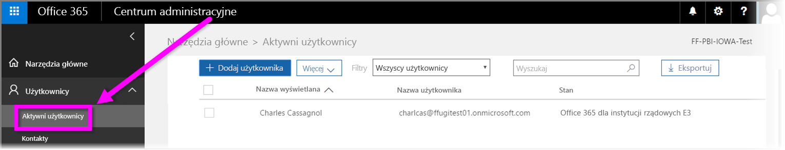

# Rejestrowanie organizacji rządowej USA w usłudze Power BI
**Usługa Power BI** oferuje wersję dostępną dla klientów rządowych w Stanach Zjednoczonych w ramach subskrypcji **Office 365 US Government Community**. Wersja **usługi Power BI** omówiona w tym artykule jest przeznaczona wyłącznie dla klientów rządowych USA — jest to osobna usługa, która jest inna niż komercyjna wersja **usługi Power BI**.

Aby uzyskać więcej informacji na temat **usługi Power BI** dla instytucji rządowych USA, łącznie z jej funkcjami i ograniczeniami, zobacz [Usługa Power BI dla klientów rządowych USA — omówienie](service-govus-overview.md).

> [!NOTE]
> Ten artykuł jest przeznaczony dla administratorów, którzy mają uprawnienia do rejestrowania swojej organizacji rządowej USA w usłudze Power BI. Jeśli jesteś użytkownikiem końcowym, skontaktuj się z administratorem w sprawie uzyskania subskrypcji usługi Power BI dla instytucji rządowych USA.
> 
> 

## Wybieranie odpowiedniego procesu rejestracji dla organizacji rządowej USA
Twoja organizacja rządowa USA może nie korzystać jeszcze z usługi **Office Government Cloud** lub może mieć już subskrypcję. W poniższych sekcjach opisano procedurę rejestracji w zależności od stanu usług Office Government Cloud i Power BI w organizacjach — jest ona różna dla różnych subskrypcji.

Po przeprowadzeniu rejestracji w usłudze Power BI US Government niektóre funkcje mogą nie działać dopóki przedstawiciel działu sprzedaży lub pomocy technicznej nie zakończy procesu wdrażania. Aby uzyskać informacje o tych funkcjach, zobacz [Usługa Power BI dla klientów rządowych USA — omówienie](service-govus-overview.md). Aby ukończyć proces wdrażania w celu włączenia tych funkcji, skontaktuj się z przedstawicielem działu sprzedaży lub obsługi technicznej.

### Organizacje rządowe USA będące nowymi klientami chmury pakietu Office
Jeśli Twoja organizacja jest nowym klientem usługi **Office Government Cloud**, wykonaj poniższe czynności:

> [!NOTE]
> Te czynności powinien wykonywać administrator portalu.
>

1. Przejdź do [https://products.office.com/en-us/government/office-365-web-services-for-government](https://products.office.com/en-us/government/office-365-web-services-for-government).

>[!NOTE]
>Jeśli nie chcesz w tej chwili rejestrować się w usłudze Office Government Cloud, skontaktuj się ze swoim przedstawicielem działu sprzedaży.
>

2. Wybierz pakiet Office G3 i wypełnij formularz wersji próbnej pakietu Office.
3. Gdy zostaniesz już klientem chmury pakietu Office, wykonaj czynności opisane poniżej w sekcji „Istniejący klienci usługi Office Government Cloud”.

### Istniejący klienci usługi Office Government Cloud
Jeśli Twoja organizacja jest już klientem usługi **Office Government Cloud**, ale nie masz subskrypcji usługi **Power BI** (bezpłatnej lub innej), wykonaj następujące czynności:

> [!NOTE]
> Te czynności powinien wykonywać administrator portalu.
> 
> 

1. Zaloguj się na swoje konto usługi Office Government Cloud i przejdź do portalu administratora.
2. Wybierz pozycję **Rozliczenia**.
3. Wybierz pozycję **Zakup usługi**.
4. Wybierz opcję Power BI Pro Government i wybierz pozycję **Wypróbuj** lub pozycję **Kup teraz**.
5. Dokończ zamówienie.
6. Przypisz użytkowników do konta.
   
   
7. Zaloguj się do **usługi Power BI** dla klientów rządowych USA na stronie [https://app.powerbigov.us](https://app.powerbigov.us)

## Dodatkowe informacje o rejestracji
Poniżej zamieszczono dodatkowe informacje dotyczące rejestracji w usłudze **Power BI US Government** w różnych przypadkach migracji licencji.

### Bezpośrednie wdrożenie klienta z wersji próbnej usługi Power BI do wersji Pro
* Kliknij kolejno pozycje Rozliczenia > Zakup usługi > Power BI Pro Gov i wybierz opcję zakupu, a nie wersji próbnej.
* Wypełnij niezbędne pola i uzyskaj licencje.
* Usuń wersję próbną usługi Power BI Pro lub usuń stare licencje i przypisz nowe licencje użytkownikom.
* Zaloguj się do [https://app.powerbigov.us](https://app.powerbigov.us)

### Odsprzedażowe wdrożenie klienta z wersji próbnej usługi Power BI do wersji Pro
Wybierz pozycję **Rozliczenia > Subskrypcje** i wybierz subskrypcję usługi **Power BI Pro for Government**. Zobaczysz następujące linki:

* Dostępne
* Przypisane
* Przypisz do użytkowników
* Jeśli nadal masz przypisaną wersję próbną:
  * Kliknij pozycję **Przypisane** w obszarze subskrypcji wersji próbnej i usuń użytkowników, których chcesz dodać do wersji płatnej.
  * Przejdź do subskrypcji płatnej i przypisz tych użytkowników.

### Instrukcje dotyczące umieszczania na białej liście
*Umieszczanie na białej liście* jest procesem, którego używa zespół inżynierów usługi Power BI, aby przenieść klientów ze środowiska chmury komercyjnej do bezpiecznego środowiska chmury dla instytucji rządowych. Dzięki temu można mieć pewność, że funkcje dostępne w chmurze dla Rządu Stanów Zjednoczonych będą działać zgodnie z oczekiwaniami. Wszyscy istniejący (lub nowi) klienci rządowi USA, którzy po raz pierwszy kupią usługi US Government **Power BI** *muszą* zainicjować poniższy proces umieszczania na białej liście. Ten proces należy wykonać przed konfiguracją lub migracją do usług US Government **Power BI**. 

Aby dzierżawa *została umieszczona na liście dozwolonych* dla chmury instytucji rządowych Stanów Zjednoczonych, skontaktuj się z zespołem ds. kont Microsoft, aby uzyskać pomoc dotyczącą umieszczania na liście dozwolonych. Należy pamiętać, że tylko administratorzy mogą przesłać to żądanie. Proces *umieszczania na białej liście* trwa około trzy tygodnie, podczas których zespół inżynierów usługi Power BI wprowadza odpowiednie zmiany, aby zapewnić poprawne działanie Twojej dzierżawy w chmurze dla instytucji rządowych USA.

Klienci migrujący z **bezpłatnych** licencji usługi Power BI do usługi **Power BI US Government** (i z definicji migrujący do powiązanych funkcji licencji **Pro**, opisanych wcześniej w tym artykule) będą napotykać problemy omówione w poniższej sekcji, dopóki ich dzierżawa nie zostanie *umieszczona na białej liście* przez zespół inżynierów usługi Power BI.

### Mieszane licencje wersji bezpłatnej i wersji Pro w dzierżawach instytucji rządowych USA
Jeśli dzierżawa zawiera zarówno licencje wersji próbnej, jak i licencje US Government Pro, obydwie te wersje będą obecne, ale jedna lub druga nie będzie działać poprawnie. Jeśli dzierżawa pomyślnie przejdzie proces *umieszczania na białej liście*, będzie miała miejsce następująca sytuacja:

* Wszyscy użytkownicy licencji bezpłatnej nie będą już mogli logować się do usługi Power BI za pomocą programu **Power BI Desktop** i będą napotykać problemy z działaniem opisane w poniższej sekcji.
* Wszyscy klienci przypisani do licencji US Government Pro będą działać zgodnie z oczekiwaniami, włączając w to używanie bram, program Power BI Desktop i aplikacje mobilne.

Podczas używania mieszanych licencji bezpłatnych i wersji Pro w dzierżawie dla instytucji rządowych Stanów Zjednoczonych w trakcie procesu *umieszczania na białej liście*, można oczekiwać następujących sytuacji:

**Przed _umieszczeniem na białej liście_**:

* Użytkownicy z bezpłatnymi licencjami korzystają z chmury komercyjnej.
* Licencje Pro US Government są widoczne w portalu i administrator może przypisywać te licencje do użytkowników. Użytkownicy wersji Pro US Government nie utracą danych z licencji bezpłatnych po przypisaniu licencji US Government Pro przez administratora. Przypisani użytkownicy mają dostęp do funkcji usługi Power BI Pro dla klientów rządowych USA, ale dopóki dzierżawa nie zostanie *umieszczona na białej liście*, będą istnieć luki w funkcjonowaniu wymienione na poniższej liście punktowanej:
  
  * W bramie Power BI Gateway, aplikacji mobilnej usługi Power BI oraz w programie Power BI Desktop nie można przeprowadzić uwierzytelniania.
  * Nie można uzyskiwać dostępu do komercyjnych źródeł danych platformy Azure.
  * Trzeba ręcznie przekazywać pliki PBIX z komercyjnej usługi Power BI.
  * Aplikacje mobilne Power BI są niedostępne.

**Po _umieszczeniu na białej liście_**:

* Użytkownicy wersji bezpłatnej działający w komercyjnej usłudze Power BI mogą nadal działać, ale nie będą już uwierzytelniani zgodnie z oczekiwaniami.
* Użytkownicy wersji Pro działającej w chmurze dla instytucji rządowych USA mogą korzystać z usługi **Power BI dla klientów rządowych USA** zgodnie z oczekiwaniami.

Aby zidentyfikować użytkowników w swojej dzierżawie, którzy korzystają z bezpłatnej licencji usługi Power BI, administratorzy mogą uruchomić raport dotyczący licencjonowania, w którym użytkownicy z bezpłatną licencją będą wyświetlani z etykietą **Power BI Standard**.

## Następne kroki
Przy użyciu usługi Power BI można wykonywać różnorodne zadania. Aby uzyskać więcej informacji i instrukcji, w tym na temat rejestrowania się w usłudze, zobacz następujące zasoby:

* [Usługa Power BI dla instytucji rządowych USA — omówienie](service-govus-overview.md)
* [Power BI — nauka krok po kroku](guided-learning/gettingstarted.yml?tutorial-step=1)
* [[Wprowadzenie do usługi Power BI](service-get-started.md)](service-get-started.md)
* [Co to jest Power BI Desktop?](desktop-what-is-desktop.md)

