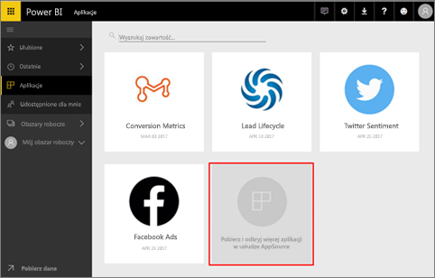
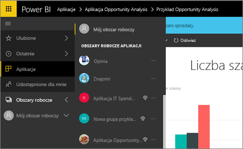
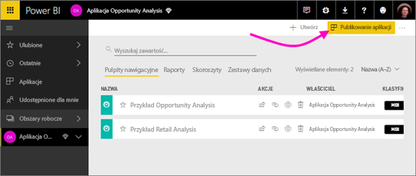
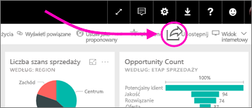
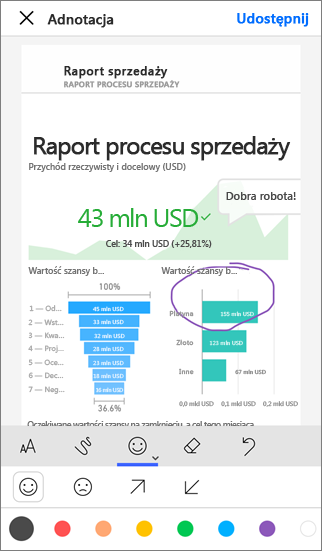

# Jak można współpracować i udostępniać w usłudze Power BI?

Tworzysz pulpity nawigacyjne i raporty. Być może pracujesz również nad nimi ze swoimi współpracownikami. A potem chcesz, aby inni mieli do nich dostęp. Jaki jest najlepszy sposób, aby je rozpowszechnić?

W tym artykule porównamy następujące opcje współpracy i udostępniania w usłudze Power BI: 

* Współpracowanie z innymi osobami nad tworzeniem istotnych raportów i pulpitów nawigacyjnych w *obszarach roboczych aplikacji*.
* Grupowanie tych pulpitów nawigacyjnych i raportów w *aplikacje* i publikowanie ich dla większej grupy lub całej organizacji.
* Udostępnianie pulpitów nawigacyjnych lub raportów kilku osobom z poziomu usługi lub aplikacji mobilnych usługi Power BI.
* Publikowanie w Internecie, gdzie każda osoba może je wyświetlać i z nich korzystać.
* Drukowanie. 

Niezależnie od wybranej opcji, aby udostępnić pulpit nawigacyjny, trzeba mieć [licencję usługi Power BI Pro](service-free-vs-pro.md) lub zawartość musi znajdować się w [pojemności Premium](service-premium.md). Wymagania licencyjne różnią się dla współpracowników, którzy wyświetlają Twoje pulpity nawigacyjne, w zależności od wybranej opcji. Poniższe sekcje zawierają bardziej szczegółowe informacje. 

*Aplikacje w usłudze Power BI*

## Współpraca w celu utworzenia aplikacji
Załóżmy, że wraz z członkami swojego zespołu chcecie opublikować szczegółowe dane usługi Power BI w swojej organizacji. Najlepszym na to sposobem jest utworzenie *aplikacji*. Aplikacja to kolekcja pulpitów nawigacyjnych i raportów utworzona w celu udostępnienia najważniejszych metryk dla organizacji. 

Do utworzenia aplikacji potrzebny jest *obszar roboczy aplikacji*, którego członkami są Twoi współpracownicy. Możesz sobie wyobrazić, że obszar roboczy aplikacji to taki obszar przygotowawczy, gdzie Ty i członkowie Twojego zespołu możecie współpracować nad pulpitami nawigacyjnymi i raportami usługi Power BI. Wszyscy możecie tworzyć raporty w programie Power BI Desktop i publikować je w obszarze roboczym aplikacji i wszyscy potrzebujecie licencji usługi Power BI Pro.

**Jeśli chcesz tylko udostępnić gotowy pulpit nawigacyjny współpracownikom, nie dodawaj ich do obszaru roboczego aplikacji.** Zamiast tego [utwórz pulpit nawigacyjny w obszarze roboczym aplikacji](service-create-distribute-apps.md) i opublikuj aplikację dla współpracowników. 

## Publikowanie aplikacji dla szerokiego grona odbiorców
Załóżmy, że chcesz rozpowszechnić swój pulpit nawigacyjny wśród szerokiego grona odbiorców. Wraz ze współpracownikami utworzyliście *obszar roboczy aplikacji*, a następnie szczegółowo opracowaliście pulpity nawigacyjne, raporty i zestawy danych w tym obszarze roboczym aplikacji. Teraz możesz wybrać odpowiednie pulpity nawigacyjne i raporty i opublikować je jako aplikację &#151; dla członków grupy zabezpieczeń, listy dystrybucyjnej lub dla całej organizacji. 

W usłudze Power BI ([https://powerbi.com](https://powerbi.com)) aplikacje można łatwo znaleźć i zainstalować. Możesz wysłać swoim użytkownikom biznesowym bezpośredni link do aplikacji lub mogą oni ją wyszukać w usłudze AppSource. Jeśli administrator usługi Power BI nada Ci odpowiednie uprawnienia, możesz automatycznie zainstalować aplikację na kontach usługi Power BI swoich współpracowników. Przeczytaj więcej na temat [publikowania aplikacji](service-create-distribute-apps.md#publish-your-app). 

Po zainstalowaniu aplikacji użytkownicy mogą wyświetlać ją w przeglądarce lub na urządzeniach przenośnych.

Aby użytkownicy mogli wyświetlić aplikację, także muszą mieć licencję usługi Power BI Pro lub aplikacja musi być przechowywana w pojemności usługi Power BI Premium. Przeczytaj temat [Co to jest usługa Power BI Premium?](service-premium.md), aby zapoznać się ze szczegółami.

## Udostępnianie pulpitów nawigacyjnych i raportów
Załóżmy, że w obszarze Mój obszar roboczy lub w obszarze roboczym aplikacji masz ukończony pulpit nawigacyjny i raport i chcesz, żeby inne osoby miały do nich dostęp. Jednym ze sposobów przekazania tych plików jest ich *udostępnienie*. 

Aby udostępnić swoją zawartość, potrzebujesz licencji usługi Power BI Pro, tak samo jak użytkownicy, którym chcesz ją udostępnić. Zawartość może też zostać zapisana w [pojemności Premium](service-premium.md). Osoby, którym udostępniasz pulpit nawigacyjny lub raport, mogą go wyświetlać i korzystać z niego, ale nie mogą go edytować. O ile do bazowego zestawu danych nie zastosowano zabezpieczeń na poziomie wiersza, osoby te widzą na pulpicie nawigacyjnym i w raportach te same dane, co Ty. Współpracownicy, którym udostępniono zawartość, mogą udostępnić ją swoim współpracownikom, jeśli mają na to zezwolenie. 

Możesz także udostępniać osobom spoza organizacji. Te osoby mogą wyświetlać pulpit nawigacyjny oraz korzystać z niego, ale nie mogą go udostępniać. 

Więcej informacji o [udostępnianiu pulpitów nawigacyjnych i raportów](service-share-dashboards.md) z usługi Power BI. Możesz również dodać filtr do linku i [udostępnić widok filtrowany raportu](service-share-reports.md).

## Dodawanie adnotacji i udostępnianie z aplikacji mobilnych usługi Power BI
W aplikacjach mobilnych usługi Power BI dla systemów iOS i Android można dodawać adnotacje do kafelków, raportów i wizualizacji, a następnie udostępniać je innym osobom za pośrednictwem poczty e-mail. 

Udostępniana jest migawka kafelka, raportu lub wizualizacji i adresaci widzą ją dokładnie w takiej postaci, jaką miała w chwili wysyłania wiadomości e-mail. Wiadomość e-mail zawiera również link do odpowiedniego pulpitu nawigacyjnego lub raportu. Jeśli adresaci mają licencję usługi Power BI Pro lub zawartość znajduje się w [pojemności Premium](service-premium.md) i obiekt był im już udostępniany, mogą go otworzyć. Migawki kafelków możesz wysyłać do wszystkich &#151; nie tylko do współpracowników w tej samej domenie poczty e-mail.

Więcej informacji o [dodawaniu adnotacji i udostępnianiu kafelków, raportów i wizualizacji](mobile-annotate-and-share-a-tile-from-the-mobile-apps.md) z aplikacji mobilnych dla systemów iOS i Android.

Możesz również [udostępnić migawkę kafelka](mobile-share-tile-windows-10-phone-app.md) z aplikacji mobilnej usługi Power BI dla urządzeń z systemem Windows 10.

## Publikowanie w Internecie
Raporty usługi Power BI można publikować dla wszystkich użytkowników Internetu, osadzając interaktywne wizualizacje we wpisach w blogu, w witrynach internetowych, mediach społecznościowych i innych narzędziach komunikacji online na dowolnym urządzeniu. Wszyscy użytkownicy Internetu mogą wyświetlać Twoje raporty i nie masz żadnej kontroli nad tym, kto może wyświetlać to, co zostało opublikowane. Ci użytkownicy nie potrzebują licencji usługi Power BI. Publikowanie w Internecie jest dostępne tylko dla raportów, które możesz edytować. Nie możesz publikować raportów w Internecie, jeśli zostały one Tobie udostępnione lub znajdują się w aplikacji. Więcej informacji o [publikowaniu w Internecie](service-publish-to-web.md).

## Drukowanie i zapisywanie w formacie PDF lub w innym formacie pliku statycznego
Z poziomu usługi Power BI możesz wydrukować lub zapisać w formacie PDF (lub w innym formacie pliku statycznego) cały pulpit nawigacyjny, kafelek pulpitu nawigacyjnego, stronę raportu lub wizualizację. Raporty można drukować tylko po jednej stronie naraz — nie można wydrukować od razu całego raportu. Więcej informacji o [drukowaniu lub zapisywaniu w formacie pliku statycznego](service-print.md).

## Następne kroki
* Chcesz przesłać opinię? Jeśli masz sugestie, przejdź do [witryny społeczności usługi Power BI](https://community.powerbi.com/).
* [Udostępnianie pulpitów nawigacyjnych współpracownikom i innym osobom](service-share-dashboards.md)
* [Tworzenie i publikowanie aplikacji w usłudze Power BI](service-create-distribute-apps.md)
* Masz więcej pytań? [Odwiedź Społeczność usługi Power BI](http://community.powerbi.com/).

