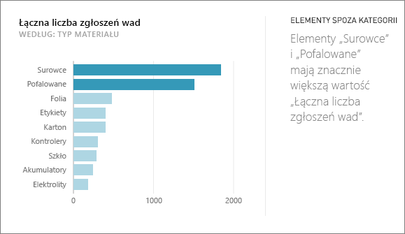
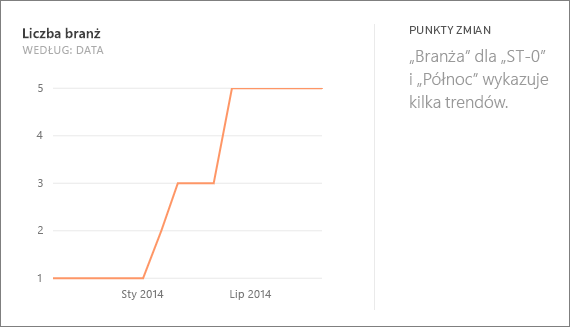
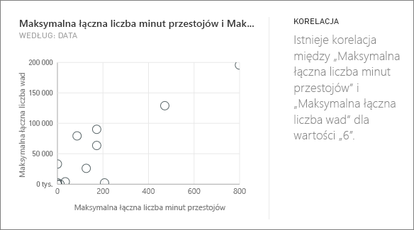
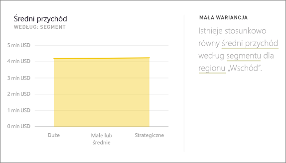
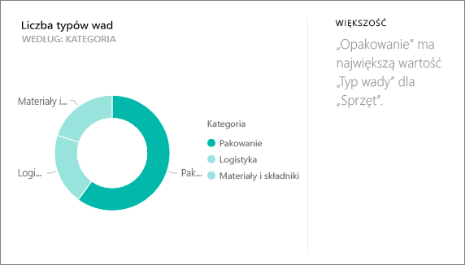
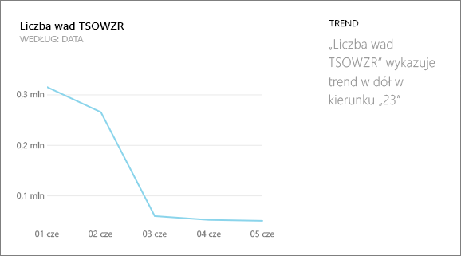
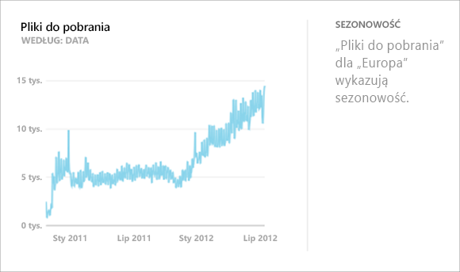
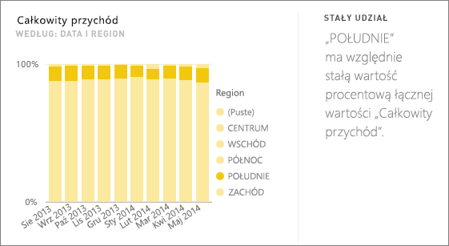
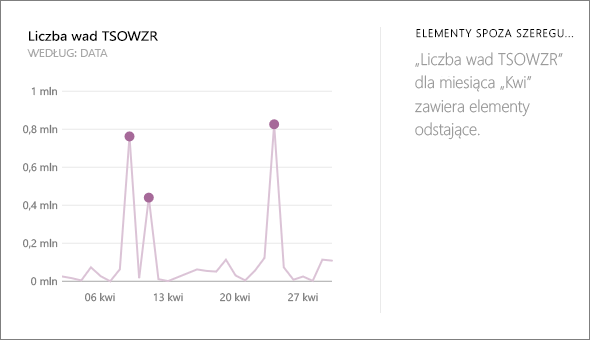

# Typy wglądu w szczegółowe dane obsługiwane przez usługę Power BI
## Jak działa wgląd w szczegółowe dane?
Usługa Power BI szybko wyszukuje różne podzbiory zestawu danych, stosując zestaw zaawansowanych algorytmów w celu odnajdywania potencjalnie interesujących szczegółowych informacji. Usługa Power BI skanuje zestaw danych jak najszerzej w wyznaczonym czasie.

Wgląd w szczegółowe dane można uruchomić dla kafelka pulpitu nawigacyjnego lub zestawu danych.   

## Jakie rodzaje wglądu w szczegółowe dane możemy znaleźć?
Oto niektóre z używanych przez nas algorytmów:

## Elementy spoza kategorii (odstające w górę/w dół)
Wyróżnia przypadki, w których dla miary w modelu jeden lub dwa elementy członkowskie wymiaru mają znacznie większe wartości niż pozostałe elementy członkowskie wymiaru.  

## Punkty zmian w szeregach czasowych
Wyróżnia punkty znaczących zmian trendów w szeregach czasowych danych.

## Korelacja
Wykrywa przypadki, w których wiele miar pokazuje korelację między sobą po wykreśleniu względem wymiaru w zestawie danych.

## Mała wariancja
Wykrywa przypadki, w których punkty danych nie są dalekie od wartości średniej.

## Większość (główne współczynniki)
Umożliwia znalezienie przypadków, w którym większość całkowitej wartości można przypisać do pojedynczego współczynnika przy rozbiciu według innego wymiaru.  

## Ogólne trendy w szeregach czasowych
Wykrywa trendy rosnące i malejące w danych szeregów czasowych.

## Sezonowość w szeregach czasowych
Znajduje okresowe wzorce w danych szeregu czasowego, takie jak tygodniowa, miesięczna lub roczna sezonowość.

## Stały udział
Wyróżnia przypadki, gdy istnieje korelacja między udziałem wartości podrzędnej w stosunku do całkowitej wartości elementu nadrzędnego w zmiennej ciągłej.

## Elementy spoza szeregu czasowego
Dla danych w szeregu czasowym wykrywa określone daty lub godziny z wartościami znacząco różnymi od innych wartości dat/godzin.

## Następne kroki
[Wgląd w szczegółowe dane w usłudze Power BI](service-insights.md)

Jeśli jesteś właścicielem zestawu danych, [zoptymalizuj go pod kątem wglądu w szczegółowe dane](service-insights-optimize.md)

Masz więcej pytań? [Odwiedź społeczność usługi Power BI](http://community.powerbi.com/)

