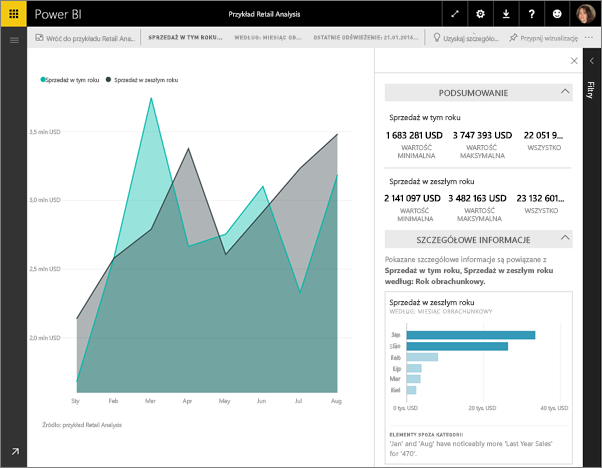

# Szybki wgląd w szczegółowe dane przy użyciu usługi Power BI
Masz nowy zestaw danych i nie bardzo wiesz, gdzie zacząć?  Musisz szybko utworzyć pulpit nawigacyjny?  Chcesz szybko wyszukać szczegółowe informacje, które mogły zostać pominięte?

Uruchom szybki wgląd w szczegółowe dane, aby generować interesujące, interaktywne wizualizacje na podstawie danych. Szybki wgląd w szczegółowe dane można uruchamiać na całym zestawie danych (szybki wgląd w szczegółowe dane) lub na konkretnym kafelku pulpitu nawigacyjnego (wgląd w szczegółowe informacje dla zakresu). Możesz nawet uruchamiać szybki wgląd w szczegółowe dane wewnątrz wglądu (szczegółowych informacji)!

> **Uwaga**: szybki wgląd w szczegółowe dane nie działa w przypadku zapytania bezpośredniego — działa tylko z danymi przekazanymi do usługi Power BI.
> 
> 

Funkcja Szybki wgląd w szczegółowe dane działa w oparciu o rosnący [zestaw zaawansowanych algorytmów analitycznych](service-insight-types.md), opracowywany we współpracy z działem badań firmy Microsoft. Będziemy z niego nadal korzystać, aby umożliwić większej liczbie użytkowników uzyskiwanie przydatnego wglądu w dane na nowe i intuicyjne sposoby.

## Uruchamianie szybkiego wglądu w szczegółowe dane dla zestawu danych
Obejrzyj, jak Amanda uruchamia szybki wgląd na zestawie danych, otwiera wgląd w trybie koncentracji uwagi, przypina jeden z szybkich wglądów jako kafelek na swoim pulpicie nawigacyjnym, a następnie pobiera szybki wgląd w szczegółowe dane dla wizualizacji.

<iframe width="560" height="315" src="https://www.youtube.com/embed/et_MLSL2sA8" frameborder="0" allowfullscreen></iframe>

Teraz Twoja kolej. Poznaj funkcję Szybki wgląd w szczegółowe dane za pomocą [próbki danych do analizy jakości dostawców](sample-supplier-quality.md).

1. Na karcie **Zestawy danych** wybierz wielokropek (...) i wybierz pozycję **Uzyskaj szczegółowe dane**.
   
    
   
    
2. Usługa Power BI wykorzystuje [wiele zaawansowanych algorytmów](service-insight-types.md) do wyszukiwania trendów w zestawie danych.
   
    
3. W ciągu kilku szczegółowe informacje będą gotowe.  Wybierz pozycję **Wyświetl szczegółowe dane**, aby wyświetlić wizualizacje.
   
    
   
   > **Uwaga**: niektóre zestawy danych nie mogą wygenerować szybkiego wglądu w szczegółowe dane, ponieważ dane nie są statystycznie istotne.  Aby dowiedzieć się więcej, zobacz [Optymalizacja danych na potrzeby szybkiego wglądu w szczegółowe dane](service-insights-optimize.md).
   > 
   > 
4. Wizualizacje są wyświetlane w specjalnej kanwie **Szybki wgląd w szczegółowe dane**, z maksymalnie 32 oddzielnymi kartami wglądów. Każda karta zawiera wykres lub wykres i krótki opis.
   
    

## Praca z kartami szybkiego wglądu w szczegółowe dane
  

1. Umieść kursor nad kartą i wybierz ikonę pinezki, aby dodać wizualizację do pulpitu nawigacyjnego.
2. Umieść kursor nad kartą i wybierz ikonę trybu koncentracji uwagi, aby wyświetlić pełny ekran karty.
   
    
3. W trybie koncentracji uwagi możesz wykonywać następujące czynności:
   
   * [filtrować](service-interact-with-a-report-in-reading-view.md) wizualizacje.  Aby wyświetlić filtry, w prawym górnym rogu wybierz strzałkę, aby rozwinąć okienko Filtry.
     
        
   * Przypnij kartę wglądu do pulpitu nawigacyjnego, wybierając ikonę pinezki  lub pozycję **Przypnij wizualizację**.
   * Uruchom szybki wgląd w szczegółowe dane na samej karcie. To działanie jest określane jako **Szybki wgląd w szczegółowe dane w zakresie**. W prawym górnym rogu wybierz ikonę żarówki  lub pozycję **Uzyskaj szczegółowe dane**.
     
       
     
     Szybki wgląd w szczegółowe dane jest wyświetlany po lewej stronie i na nowych kartach, wyłącznie na podstawie danych w tym pojedynczym szybkim wglądzie w szczegółowe dane, wyświetlanym wzdłuż prawej strony.
     
       
4. Aby wrócić do oryginalnej kanwy szybkiego wglądu w szczegółowe dane, w lewym górnym rogu wybierz pozycję **Wyjdź z trybu koncentracji uwagi**.

## Uruchamianie szybkiego wglądu w szczegółowe dane dla kafelka pulpitu nawigacyjnego
Zamiast wyszukiwać szczegółowe informacje dla całego zestawu danych, możesz zawęzić kryteria wyszukiwania do danych używanych do utworzenia pojedynczego kafelka pulpitu nawigacyjnego. To działanie jest określane jako **Szybki wgląd w szczegółowe dane w zakresie**.

1. Otwórz pulpit nawigacyjny.
2. Wybierz kafelek i [otwórz kafelek w trybie koncentracji uwagi](service-focus-mode.md).
3. W prawym górnym rogu wybierz pozycję **Uzyskaj szczegółowe dane**.
   
    
4. Usługa Power BI wyświetla karty wglądu po prawej stronie kafelka.
   
    
5. Czy jeden z wglądów przykuł Twoje zainteresowanie? Wybierz kartę tego wglądu, aby dokładniej go zbadać. Wybrany szybki wgląd w szczegółowe dane jest wyświetlany po lewej stronie i na nowych kartach wglądu, wyłącznie na podstawie danych w tym pojedynczym szybkim wglądzie w szczegółowe dane, wyświetlanym wzdłuż prawej strony.
6. Możesz dalej przeszukiwać dane, a po znalezieniu interesującego szybkiego wglądu przypiąć jego wizualizację do pulpitu nawigacyjnego, wybierając pozycję **Przypnij wizualizację** w prawym górnym rogu. Ponadto możesz wysłać opinię, aby powiadomić właściciela zestawu danych, czy określony szybki wgląd w szczegółowe dane był pomocny, czy nie.
   
    

## Następne kroki
Jeśli jesteś właścicielem zestawu danych, [zoptymalizuj go pod kątem szybkiego wglądu w szczegółowe dane](service-insights-optimize.md)

Dowiedz się więcej na temat [dostępnych typów szybkiego wglądu w szczegółowe dane](service-insight-types.md)

Masz więcej pytań? [Odwiedź społeczność usługi Power BI](http://community.powerbi.com/)

