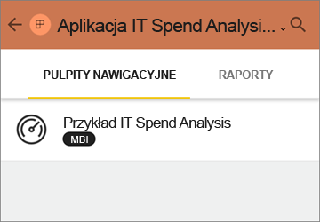

# Instalowanie i używanie aplikacji z pulpitami nawigacyjnymi i raportami w usłudze Power BI
W usłudze Power BI *aplikacje* łączą ze sobą w jednym miejscu wszystkie powiązane pulpity nawigacyjne i raporty. Osoby w organizacji mogą tworzyć i rozpowszechniać aplikacje z kluczowymi informacjami biznesowymi. [Usługi zewnętrzne](service-connect-to-services.md), których być może już używasz, takie jak Google Analytics i Microsoft Dynamics CRM, także oferują aplikacje usługi Power BI. 

Aplikacje można łatwo znaleźć i zainstalować w usłudze Power BI ([https://powerbi.com](https://powerbi.com)) i na urządzeniu przenośnym. Gdy zainstalujesz aplikację, nie musisz pamiętać nazw wielu różnych pulpitów nawigacyjnych, ponieważ są one wszystkie razem w aplikacji, w przeglądarce lub na urządzeniu przenośnym.

Kiedy autor aplikacji udostępnia aktualizację, zmiany są automatycznie widoczne w aplikacji. Autor ustala również harmonogram odświeżania danych, dzięki czemu nie musisz się martwić o zachowywanie ich aktualności. 

Chcesz utworzyć aplikację? Aby uzyskać więcej informacji, zobacz temat [Tworzenie i publikowanie aplikacji w usłudze Power BI](service-create-distribute-apps.md).

## Pobieranie nowej aplikacji
Aplikacje można uzyskać na kilka różnych sposobów. Autor aplikacji może automatycznie zainstalować aplikację na Twoim koncie usługi Power BI lub może wysłać Ci bezpośredni link do aplikacji. Możesz też wyszukać aplikację w usłudze AppSource, gdzie są widoczne wszystkie aplikacje, do których masz dostęp. W usłudze Power BI na urządzeniu przenośnym aplikacje można instalować tylko za pomocą linku bezpośredniego, a nie z usługi AppSource. Jeśli autor aplikacji zainstaluje ją automatycznie, zobaczysz ją na swojej liście aplikacji.

### Instalowanie aplikacji z linku bezpośredniego
Najprostszym sposobem samodzielnego zainstalowania nowej aplikacji jest otrzymanie linku bezpośredniego od autora aplikacji. Usługa Power BI tworzy link instalacyjny, który autor może wysłać użytkownikom.

**Na komputerze** 

Po kliknięciu linku w wiadomości e-mail usługa Power BI ([https://powerbi.com](https://powerbi.com)) zostanie otwarta w przeglądarce. Potwierdź, że chcesz zainstalować aplikację. Zostanie otwarta strona docelowa aplikacji.

**Na urządzeniu przenośnym z systemem Android lub iOS** 

Po kliknięciu linku w wiadomości e-mail na urządzeniu przenośnym aplikacja zostanie zainstalowana automatycznie i zostanie otworzona lista zawartości aplikacji. 

### Pobieranie aplikacji z usługi Microsoft AppSource
Możesz także znajdować i instalować aplikacje, do których masz dostęp, za pomocą usługi Microsoft AppSource. 

1. Wybierz pozycję **Aplikacje**  > **Pobierz aplikacje**. 
   
     
2. W usłudze AppSource w obszarze **Moja organizacja** możesz przeprowadzić wyszukiwanie, aby zawęzić wyniki i znaleźć odpowiednią aplikację.
   
     
3. Wybierz pozycję **Pobierz teraz**, aby dodać wybraną aplikację do swojej strony Aplikacje. 

## Korzystanie z pulpitów nawigacyjnych i raportów w aplikacji
Teraz możesz eksplorować dane w pulpitach nawigacyjnych i raportach w aplikacji. Masz dostęp do wszystkich standardowych interakcji usługi Power BI, takich jak filtrowanie, wyróżnianie, sortowanie i przechodzenie do szczegółów. Przeczytaj informacje o [interakcjach z raportami w usłudze Power BI](service-reading-view-and-editing-view.md). 

Nie możesz zapisywać wprowadzonych zmian, ale zawsze możesz [wyeksportować dane do programu Excel ](power-bi-visualization-export-data.md) z tabeli lub innego elementu wizualnego w raporcie.

## Następne kroki
* [Tworzenie i publikowanie aplikacji w usłudze Power BI](service-create-distribute-apps.md)
* [Aplikacje usługi Power BI dla usług zewnętrznych](service-connect-to-services.md)
* Masz pytania? [Zadaj pytanie społeczności usługi Power BI](http://community.powerbi.com/)

