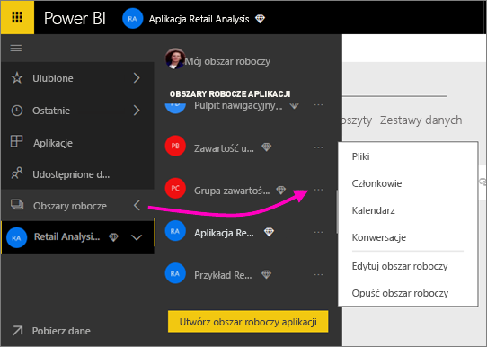
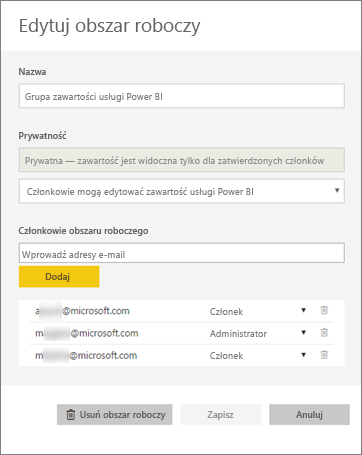
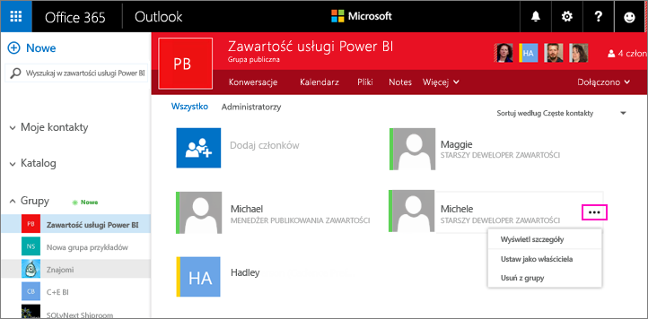
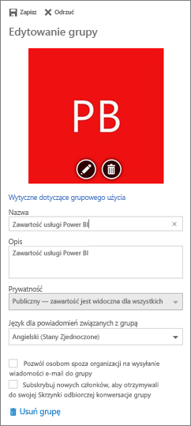

# Zarządzanie obszarem roboczym aplikacji w usługach Power BI i Office 365
Jako twórca lub administrator [obszaru roboczego aplikacji w usłudze Power BI](service-install-use-apps.md) lub Office 365 zarządzasz pewnymi aspektami obszaru roboczego w usłudze Power BI. Innymi aspektami zarządzasz w usłudze Office 365. 

**W usłudze Power BI** możesz:

* Dodać lub usunąć członków obszaru roboczego aplikacji, a w tym nadać członkowi obszaru roboczego uprawnienia administratora.
* Edytować nazwę obszaru roboczego aplikacji.
* Usunąć obszar roboczy aplikacji.

**W usłudze Office 365** możesz:

* Dodać lub usunąć członków grupy obszaru roboczego aplikacji, a w tym nadać członkowi uprawnienia administratora.
* Edytować nazwę grupy, obraz, opis i inne ustawienia.
* Zobaczyć adres e-mail grupy.
* Usunąć grupę.

Aby być administratorem lub członkiem obszaru roboczego aplikacji, musisz mieć licencję usługi [Power BI Pro](service-free-vs-pro.md). Użytkownicy Twojej aplikacji również potrzebują licencji usługi Power BI Pro, chyba że obszar roboczy aplikacji ma uprawnienia usługi Power BI Premium. Następnie użytkownicy biznesowi mogą zamiast tego uzyskać dostęp do Twojej aplikacji za pomocą bezpłatnej licencji usługi Power BI. Przeczytaj temat [Co to jest usługa Power BI Premium?](service-premium.md), aby zapoznać się ze szczegółami.

## Edytowanie obszaru roboczego aplikacji w usłudze Power BI
1. W usłudze Power BI wybierz strzałkę obok pozycji **Obszary robocze** > wybierz wielokropek (**...**) obok nazwy swojego obszaru roboczego > **Edytuj obszar roboczy**. 
   
   
   
   > [!NOTE]
   > Pozycja **Edytuj obszar roboczy** jest wyświetlana tylko, gdy jesteś administratorem obszaru roboczego aplikacji.
   > 
   > 
2. W tym miejscu możesz zmienić nazwy, dodać lub usunąć członków lub usunąć obszar roboczy aplikacji. 
   
   
3. Wybierz pozycję **Zapisz** lub **Anuluj**.

## Edytowanie właściwości obszaru roboczego aplikacji usługi Power BI w usłudze Office 365
1. W usłudze Power BI wybierz strzałkę obok pozycji **Obszary robocze** > wybierz wielokropek (**...**) obok nazwy swojego obszaru roboczego > **Członkowie**. 
   
   
   
   Spowoduje to otwarcie widoku grupy programu Outlook dla usługi Office 365 dla Twojego obszaru roboczego aplikacji.
   
   Może być konieczne zalogowanie na koncie firmowym.
2. Naciśnij przycisk wielokropka (**...** ) obok nazwy członka, aby ustawić go jako administratora lub usunąć członka z obszaru roboczego aplikacji. 
   
   

## Dodawanie obrazu i ustawianie innych właściwości obszaru roboczego w grupie usługi Office 365
Podczas dystrybucji swojej aplikacji z obszaru roboczego aplikacji dodawany tutaj obraz będzie obrazem dla aplikacji. Zobacz sekcję [Dodawanie obrazu do aplikacji](service-create-distribute-apps.md#add-an-image-to-your-app-optional) w artykule [Tworzenie i rozpowszechnianie aplikacji w usłudze Power BI](service-create-distribute-apps.md).

1. W programie Outlook dla usługi Office 365 w widoku obszaru roboczego aplikacji wybierz obraz grupy, aby edytować właściwości obszaru roboczego grupy.
   
   
2. Tutaj możesz edytować nazwę, opis i język, dodać obraz i ustawić inne właściwości.
   
   
3. Wybierz pozycję **Zapisz** lub **Odrzuć**.

## Następne kroki
* [Czym są aplikacje w usłudze Power BI?](service-install-use-apps.md)
* [Tworzenie aplikacji i obszarów roboczych aplikacji w usłudze Power BI](service-create-distribute-apps.md)
* Masz więcej pytań? [Odwiedź społeczność usługi Power BI](http://community.powerbi.com/)

