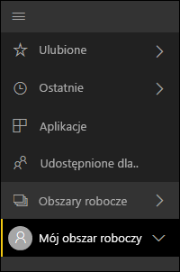
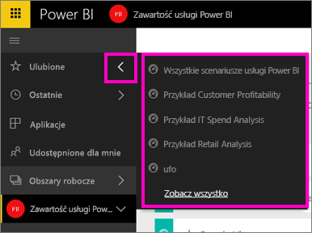
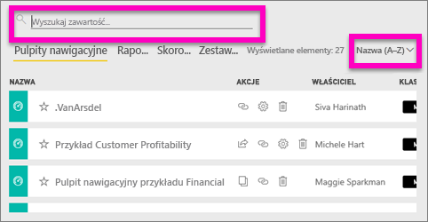
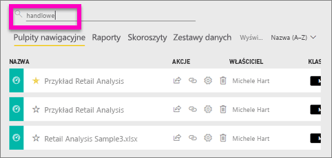
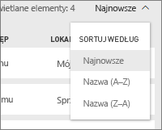

# Wyszukiwanie i sortowanie treści w usłudze Power BI
Kombinacja zautomatyzowanej organizacji usługi Power BI, znakowania użytkowników, wyszukiwania i sortowania pozwala na szybkie odnalezienie potrzebnych informacji w usłudze Power BI.

## Jak usługa Power BI wspiera nawigację w treści
Usługa Power BI organizuje Twoje treści na kilka sposobów.  Po pierwsze rozdziela Twoje treści do pulpitów nawigacyjnych, raportów, skoroszytów i zestawów danych. Zobaczysz taką organizację na wielu ekranach usługi Power BI. Następnie usługa Power BI klasyfikuje Twoje treści w sposób, który jeszcze bardziej ułatwia szybkie odnajdowanie potrzebnych informacji. Zapoznaj się z lewym okienkiem nawigacji.

Treści, które tworzysz na własny użytek, są dostępne w obszarze **Mój obszar roboczy**, treści, które tworzysz i udostępniasz w grupie, są dostępne w obszarze **Obszar roboczy aplikacji**, treści, do których chcesz mieć szybki dostęp, są zapisywane w obszarze **Ulubione**, treści, które są udostępniane Tobie, są dostępne w obszarze **Udostępnione dla mnie**, a ostatnio wyświetlane treści są również dostępne w pozycji **Ostatnio używane**.

Aby uzyskać więcej informacji, zobacz [Organizowanie zawartości w usłudze Power BI](service-basic-concepts.md)

> **UWAGA**: Jednym dodatkowym sposobem organizowania własnych treści jest wybranie jednego pulpitu nawigacyjnego, który powinien być najczęściej oglądany, i ustawienie go jako swojego *polecanego* pulpitu nawigacyjnego. Po każdym otwarciu usługi Power BI ten pulpit nawigacyjny będzie wyświetlany jako pierwszy. Aby dowiedzieć się więcej, zobacz [Polecany pulpit nawigacyjny](service-dashboard-featured.md).
> 
> 

## Ulubione pulpity nawigacyjne i aplikacje
Czy masz pewną liczbę pulpitów nawigacyjnych i aplikacji, które często odwiedzasz? [Ustawiając je jako *ulubione*](service-dashboard-favorite.md), powodujesz, że będą zawsze dostępne na lewym pasku nawigacyjnym.

.

Praca z ulubionymi została opisana bardziej szczegółowo w artykule [Ulubione w usłudze Power BI](service-dashboard-favorite.md).

## Wyszukiwanie i sortowanie w obszarach roboczych
Obszar roboczy zawiera cztery karty zawartości: pulpity nawigacyjne, raporty, skoroszyty i zestawy danych.  Każda z tych kart zawiera pole wyszukiwania i przycisk sortowania.  Jeśli zaczynasz z usługą Power BI, może nie być to przydatne, ponieważ będziesz mieć tylko jeden lub dwa elementy na karcie.  Jednak wraz z upływem czasu możesz skończyć z długim spisem treści.  Użyj wyszukiwania i sortowania, aby łatwo znaleźć to, czego potrzebujesz.

* Wprowadź wyszukiwany termin w celu odnalezienia dopasowania na bieżącym ekranie
  
   
* Wybierz przycisk sortowania, aby wyświetlić opcje dla bieżącej strony. Opcje dotyczą sortowania według nazwy lub właściciela.
  
   

## Zagadnienia i rozwiązywanie problemów
* W przypadku zestawów danych pozycja **Sortuj według** nie jest dostępna dla wartości według właściciela.

## Następne kroki
[Power BI — podstawowe pojęcia](service-basic-concepts.md)

Masz więcej pytań? [Odwiedź społeczność usługi Power BI](http://community.powerbi.com/)

