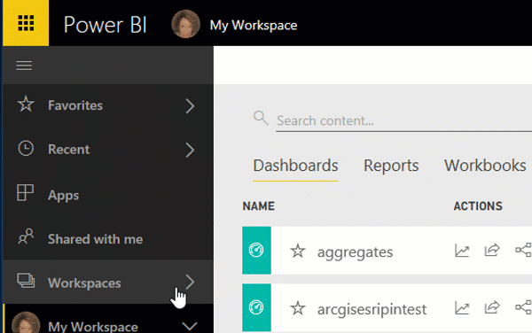

# Nawigacja: wyszukiwanie, znajdowanie i sortowanie treści w usłudze Power BI
Istnieje wiele sposobów nawigowania po zawartości w usłudze Power BI. Zawartość jest posortowana w obszarach roboczych według typów: pulpity nawigacyjne, raporty, skoroszyty i zestawy danych.  Ponadto zawartość jest posortowana według użycia: ulubione, ostatnio używane, aplikacje, udostępnione dla mnie i polecane. Te różne sposoby uzyskiwania dostępu do zawartości pozwalają na szybkie znajdowanie potrzebnych informacji w usłudze Power BI.  

>[!NOTE] 
>Ten artykuł dotyczy usługi Power BI (app.powerbi.com), a nie programu Power BI Desktop.

## Nawigowanie w obszarach roboczych

Usługa Power BI dzieli zawartość obszaru roboczego według typu: pulpity nawigacyjne, raporty, skoroszyty i zestawy danych. Ten podział jest widoczny po wybraniu obszaru roboczego. W tym przykładzie obszar roboczy aplikacji ma nazwę „Sales and marketing app sample” i zawiera 2 pulpity nawigacyjne, 6 raportów, 1 skoroszyt i 5 zestawów danych.

________________________________________

## Wyszukiwanie i sortowanie w obszarach roboczych
Obszar roboczy zawiera cztery karty zawartości: pulpity nawigacyjne, raporty, skoroszyty i zestawy danych.  Każda z tych kart zawiera pole wyszukiwania i przycisk sortowania.  Jeśli zaczynasz z usługą Power BI, może nie być to przydatne, ponieważ będziesz mieć tylko jeden lub dwa elementy na karcie.  Jednak wraz z upływem czasu możesz skończyć z długim spisem treści.  Użyj wyszukiwania i sortowania, aby łatwo znaleźć to, czego potrzebujesz.

* Wprowadź wyszukiwany termin w celu odnalezienia dopasowania na bieżącym ekranie
  
   
* Wybierz przycisk sortowania, aby wyświetlić opcje dla bieżącej strony. Opcje dotyczą sortowania według nazwy lub właściciela.
  
   

## Nawigowanie przy użyciu lewego paska nawigacyjnego
Lewe okienko nawigacji klasyfikuje zawartość w sposób, który jeszcze bardziej ułatwia szybkie odnajdowanie potrzebnych informacji.  

Zawartość, którą tworzysz na własny użytek, jest dostępna w obszarze **Mój obszar roboczy**, zawartość, którą tworzysz i udostępniasz w grupie, jest dostępna w obszarze roboczym **Aplikacje**, zawartość, która jest udostępniana Tobie, jest dostępna w obszarze **Udostępnione dla mnie**, a ostatnio wyświetlana zawartość jest również dostępna w obszarze **Ostatnio używane**.

Ponadto możesz tagować zawartość jako [ulubioną](service-dashboard-favorite.md) i [polecaną](service-dashboard-featured.md). Wybierz jeden pulpit nawigacyjny, który powinien być najczęściej oglądany, i ustaw go jako swój *polecany* pulpit nawigacyjny. Po każdym otwarciu usługi Power BI ten pulpit nawigacyjny będzie wyświetlany jako pierwszy. Czy masz pewną liczbę pulpitów nawigacyjnych i aplikacji, które często odwiedzasz? Jeśli ustawisz je jako ulubione, będą zawsze dostępne na lewym pasku nawigacyjnym.

.

## Istotne zagadnienia i rozwiązywanie problemów
* W przypadku zestawów danych pozycja **Sortuj według** nie jest dostępna dla wartości według właściciela.

## Następne kroki
[Power BI — podstawowe pojęcia](service-basic-concepts.md)

Masz więcej pytań? [Odwiedź społeczność usługi Power BI](http://community.powerbi.com/)