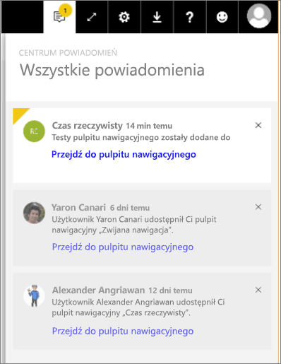

# Powiadomienia usługi Power BI
Centrum powiadomień jest sekwencyjnym źródłem informacji dotyczących środowiska usługi Power BI. Otwórz je, aby wyświetlić komunikaty o nowych pulpitach nawigacyjnych, które zostały Ci udostępnione, zmianach obszaru grupy, informacjach na temat zdarzeń i spotkaniach związanych z usługą Power BI, ustawionych przez Ciebie alertach i innych. Możesz [ustawić alerty w usłudze Power BI](service-set-data-alerts.md), jak również w aplikacjach mobilnych usługi Power BI.

Obejrzyj powiadomienie o sprawdzeniu, które otrzymała Amanda, zarządzaj jej powiadomieniami i reaguj na nie. Następnie postępuj zgodnie z instrukcjami poniżej wideo, aby wypróbować to samodzielnie.

<iframe width="560" height="315" src="https://www.youtube.com/embed/bZMSv5KAlcE" frameborder="0" allowfullscreen></iframe>

1. Po zalogowaniu się do usługi Power BI wszelkie nowe powiadomienia wysłane do Ciebie podczas pracy w trybie offline są dodawane do Twojego kanału informacyjnego. Jeśli masz nowe powiadomienia, usługa Power BI wyświetli żółte kółko z liczbą nowych elementów.
   
   
2. Na pasku menu usługi Power BI wybierz ikonę Powiadomienia.
   
   
3. Powiadomienia są wyświetlane od najnowszego na górze, a nieprzeczytane wiadomości są wyróżnione. Powiadomienia są przechowywane przez 90 dni, chyba że usuniesz je wcześniej lub osiągną maksymalną granicę równą 100.
   
   
4. Aby odrzucić powiadomienie, wybierz ikonę X.

### Następne kroki
* [Alerty dotyczące danych w usłudze Power BI](service-set-data-alerts.md)
* [Tworzenie usługi Microsoft Flow wyzwalanej przez alert danych usługi Power BI](service-flow-integration.md)
* [Ustawianie alertów danych w aplikacji iPhone (Power BI dla systemu iOS)](mobile-set-data-alerts-in-the-mobile-apps.md)
* [Ustawianie alertów dotyczących danych w aplikacji Power BI dla urządzeń przenośnych w systemie Windows 10](mobile-set-data-alerts-in-the-mobile-apps.md)
* Masz więcej pytań? [Odwiedź społeczność usługi Power BI](http://community.powerbi.com/)

