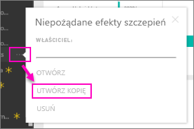

# Organizacyjne pakiety zawartości: kopiowanie, odświeżanie i uzyskiwanie dostępu
> [!NOTE]
> Czy wiesz już o nowych *aplikacjach*? Aplikacje to nowy sposób dystrybucji zawartości do dużej liczby odbiorców w usłudze Power BI. Tworzenie aplikacji odbywa się w *obszarach roboczych aplikacji*, które zastępują grupy i obszary robocze grup. Zalecamy używanie aplikacji zamiast organizacyjnych pakietów zawartości i obszarów roboczych tylko do odczytu. Dowiedz się [więcej o aplikacjach](service-install-use-apps.md).
> 
> 

Po opublikowaniu organizacyjnego pakietu zawartości wszyscy odbiorcy zobaczą ten sam pulpit nawigacyjny, te same raporty, skoroszyty programu Excel, zestawy danych i dane, chyba że jest to źródło danych usług SQL Server Analysis Services (SSAS).  [Tylko twórca pakietu zawartości może edytować i ponownie publikować](service-organizational-content-pack-manage-update-delete.md) pakiet zawartości.  Jednak wszyscy odbiorcy mogą zapisać kopię pakietu zawartości, która może istnieć jednocześnie z oryginalnym pakietem.

Tworzenie pakietów zawartości różni się od udostępniania pulpitów nawigacyjnych lub współpracy przy nich w grupie. Zapoznaj się z tematem [Jak współpracować nad pulpitami nawigacyjnymi i raportami oraz je udostępniać?](service-how-to-collaborate-distribute-dashboards-reports.md), aby podjąć decyzję o najlepszym rozwiązaniu w danej sytuacji.

## Tworzenie kopii organizacyjnego pakietu zawartości
Utwórz własną kopię pakietu zawartości, niewidoczną dla innych użytkowników.

1. Wybierz wielokropek (...) obok pulpitu nawigacyjnego pakietu zawartości i wybierz polecenie Utwórz kopię.
   
    
2. Wybierz pozycję **Zapisz**.  

Masz teraz kopię, którą możesz zmieniać. Nikt inny nie będzie widzieć wprowadzanych zmian.

## Pomocy!  Nie mam już dostępu do pakietu zawartości
Może się to zdarzyć z kilku powodów:

* **Zmiany członkostwa**: pakiety zawartości są publikowane w grupach dystrybucyjnych poczty e-mail, grupach zabezpieczeń oraz [grupach usługi Power BI opartych na usłudze Office 365](https://support.office.com/article/Create-a-group-in-Office-365-7124dc4c-1de9-40d4-b096-e8add19209e9).  W przypadku usunięcia z takiej grupy utracisz dostęp do pakietu zawartości.
* **Zmiany w zakresie dystrybucji**: twórca pakietu zawartości dokonuje zmian dystrybucji. Jeśli na przykład pakiet zawartości został pierwotnie opublikowany dla całej organizacji, ale twórca opublikował go ponownie dla mniejszej liczby odbiorców, możesz nie znajdować się wśród nich.
* **Zmiany ustawień zabezpieczeń**: jeśli pulpit nawigacyjny i raporty łączą się z lokalnymi źródłami danych SSAS i dokonano zmian w ustawieniach zabezpieczeń, Twoje uprawnienia do tego serwera mogły zostać cofnięte.

## W jaki sposób są odświeżane organizacyjne pakiety zawartości?
Podczas tworzenia pakietu zawartości ustawienia odświeżania są dziedziczone wraz z zestawem danych.  Kiedy tworzysz kopię pakietu zawartości, nowa wersja zachowuje połączenie z oryginalnym zestawem danych i jego harmonogram odświeżania. 

Zobacz [Aktualizowanie i usuwanie organizacyjnych pakietów zawartości oraz zarządzanie nimi](service-organizational-content-pack-manage-update-delete.md).

## Następne kroki
* [Wprowadzenie do organizacyjnych pakietów zawartości](service-organizational-content-pack-introduction.md)
* [Tworzenie grupy w usłudze Power BI](service-create-distribute-apps.md)
* Masz więcej pytań? [Odwiedź społeczność usługi Power BI](http://community.powerbi.com/)

