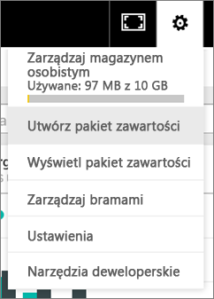
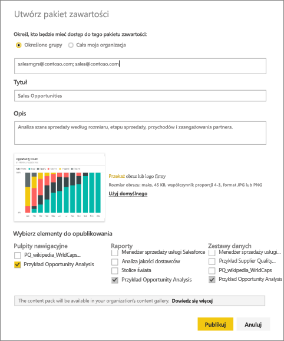
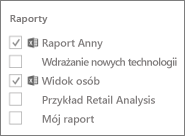
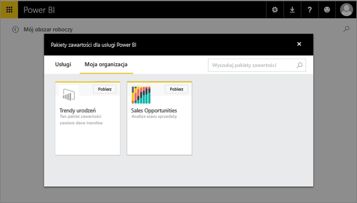

# Tworzenie i publikowanie organizacyjnego pakietu zawartości w usłudze Power BI (samouczek)
> [!NOTE]
> Czy wiesz już o nowych *aplikacjach*? Aplikacje to nowy sposób dystrybucji zawartości do dużej liczby odbiorców w usłudze Power BI. Zalecamy używanie aplikacji zamiast organizacyjnych pakietów zawartości i obszarów roboczych tylko do odczytu. Dowiedz się [więcej o aplikacjach](service-install-use-apps.md).
> 
> 

W tym samouczku utworzysz organizacyjny pakiet zawartości, udzielisz dostępu konkretnej grupie i opublikujesz go w bibliotece pakietów zawartości organizacji w usłudze Power BI.

Tworzenie pakietów zawartości różni się od udostępniania pulpitów nawigacyjnych lub współpracy przy nich w grupie. Zapoznaj się z tematem [Jak współpracować nad pulpitami nawigacyjnymi i raportami oraz je udostępniać?](service-how-to-collaborate-distribute-dashboards-reports.md), aby podjąć decyzję o najlepszym rozwiązaniu w danej sytuacji.

> [!NOTE]
> Tworzenie organizacyjnego pakietu zawartości wymaga [konta usługi Power BI Pro](https://powerbi.microsoft.com/pricing) dla użytkownika i jego współpracowników.
> 
> 

Wyobraź sobie, że pracujesz na stanowisku menedżera ds. wprowadzania produktów w firmie Contoso i przygotowujesz się do wdrożenia nowego produktu.  Masz utworzony pulpit nawigacyjny z raportami, który chcesz udostępnić innym współpracownikom odpowiedzialnym za zarządzanie wdrożeniem. Potrzebujesz sposobu na spakowanie pulpitu nawigacyjnego i raportów w formie rozwiązania, z którego będą mogli korzystać współpracownicy. 

Chcesz z niego skorzystać? W [usłudze Power BI](https://powerbi.com) przejdź do pozycji **Pobierz dane > Przykłady > Przykład Opportunity Analysis >**  > **Połącz**, aby uzyskać własną kopię. 

1. W lewym okienku nawigacyjnym wybierz pulpit nawigacyjny **Przykład Opportunity Analysis**.
2. W górnym pasku nawigacyjnym wybierz ikonę koła zębatego  > **Utwórz pakiet zawartości**.    
   
3. W oknie **Tworzenie pakietu zawartości** wprowadź następujące informacje.  
   
   Pamiętaj, że biblioteka pakietów zawartości w organizacji może zawierać setki pakietów zawartości publikowanych dla organizacji lub grup. Poświęć czas, aby nadać pakietowi zawartości znaczącą nazwę, dodać dobry opis i wybrać odpowiednich odbiorców.  Użyj słów, dzięki którym odnalezienie pakietu zawartości przy użyciu funkcji wyszukiwania będzie proste.
   
   1.  Wybierz **Określone grupy** i wprowadź pełne adresy e-mail użytkowników indywidualnych, [grup usługi Office 365](https://support.office.com/article/Create-a-group-in-Office-365-7124dc4c-1de9-40d4-b096-e8add19209e9), grup dystrybucyjnych lub grup zabezpieczeń. Na przykład:
      
         salesmgrs@contoso.com; sales@contoso.com
      
      Na potrzeby tego samouczka spróbuj użyć własnego adresu e-mail lub adresu e-mail swojej grupy.
   
   2.  Nazwij pakiet zawartości **Możliwości sprzedaży**.
   
      > [!TIP]
      > Rozważ dołączenie nazwy pulpitu nawigacyjnego w nazwie pakietu zawartości. W ten sposób współpracownicy będą mogli łatwiej znaleźć pulpit nawigacyjny po nawiązaniu połączenia z pakietem zawartości.
      > 
      > 
   
   3.  Zalecenie: dodaj **opis**. Dzięki temu współpracownicy będą mogli łatwiej znaleźć pakiety zawartości, których potrzebują. Poza opisem dodaj słowa kluczowe, których współpracownicy mogą używać do wyszukiwania tego pakietu zawartości. Dołącz informacje kontaktowe, które są przydatne, jeśli współpracownicy mają pytania lub potrzebują pomocy.
   
   4.  **Przekaż obraz lub logo**, aby członkowie grupy mogli łatwiej znaleźć pakiet zawartości &#151; szybciej szuka się obrazu niż treści tekstowej. Na poniższym zrzucie ekranu użyliśmy obrazu kafelka wykresu kolumnowego Opportunity Count 100%.
   
   5.  Wybierz pulpit nawigacyjny **Przykład Opportunity Analysis**, aby dodać go do pakietu zawartości.  Usługa Power BI automatycznie dodaje skojarzony raport i zestaw danych. Możesz dodać inne, jeśli chcesz.
   
      > [!NOTE]
      >  Na liście wymieniane są tylko pulpity nawigacyjne, raporty, zestawy danych i skoroszyty, które możesz edytować. Dlatego na liście nie ma elementów udostępnionych przez inne osoby.
      > 
      > 
   
       
   
   6. Jeśli masz skoroszyty programu Excel, zobaczysz je w sekcji Raporty z ikoną programu Excel. Również możesz je dodać do pakietu zawartości.
   
     
   
      > [!NOTE]
      > Jeśli członek grupy nie może wyświetlić skoroszytu programu Excel, może być konieczne [udostępnienie skoroszytu w usłudze OneDrive dla Firm](https://support.office.com/en-us/article/Share-documents-or-folders-in-Office-365-1fe37332-0f9a-4719-970e-d2578da4941c).
      > 
      > 
4. Wybierz opcję **Publikuj**, aby dodać pakiet zawartości do organizacyjnego pakietu zawartości grupy.  
   
   Zobaczysz komunikat o powodzeniu po pomyślnym opublikowaniu. 
5. Jeśli członkowie grupy przejdą do pozycji **Pobierz dane > Moja organizacja**, mogą nacisnąć pole wyszukiwania i wpisać „Możliwości sprzedaży”.
   
    
6. Zobaczą teraz Twój pakiet zawartości.  
    
   
   > [!TIP]
   > Adres URL wyświetlany w przeglądarce jest unikatowym adresem tego pakietu zawartości.  Chcesz poinformować swoich współpracowników o tym nowym pakiecie zawartości?  Wklej adres URL do wiadomości e-mail.
   > 
   > 
7. Użytkownicy mogą wybrać opcję **Połącz**, aby [wyświetlić pakiet zawartości i rozpocząć pracę z tym pakietem](service-organizational-content-pack-copy-refresh-access.md). 

### Następne kroki
* [Wprowadzenie do organizacyjnych pakietów zawartości](service-organizational-content-pack-introduction.md)  
* [Aktualizowanie i usuwanie organizacyjnych pakietów zawartości oraz zarządzanie nimi](service-organizational-content-pack-manage-update-delete.md)  
* [Tworzenie grupy w usłudze Power BI](service-create-distribute-apps.md)  
* [Czym jest usługa OneDrive dla Firm?](https://support.office.com/en-us/article/What-is-OneDrive-for-Business-187f90af-056f-47c0-9656-cc0ddca7fdc2)
* Masz więcej pytań? [Odwiedź społeczność usługi Power BI](http://community.powerbi.com/)

