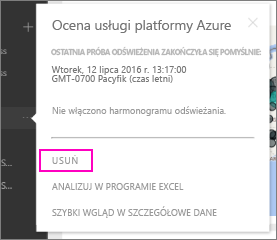

# Usuwanie połączenia z organizacyjnym pakietem zawartości usługi Power BI
Współpracownik utworzył pakiet zawartości. Udało Ci się go odnaleźć w usłudze AppSource i dodać go do swojego obszaru roboczego usługi Power BI. Teraz nie będzie już potrzebny.  Jak możesz go usunąć?

Aby usunąć pakiet zawartości, musisz usunąć jego zestaw danych.  

* W lewym okienku nawigacji wybierz przycisk wielokropka z prawej strony zestawu danych i wybierz pozycje **Usuń \> Tak**.  
  
  

Usunięcie zestawu danych powoduje również usunięcie wszystkich skojarzonych raportów i pulpitów nawigacyjnych. Jednak usunięcie połączenia z pakietem zawartości nie powoduje usunięcia zawartości pakietu z usługi AppSource Twojej organizacji.  Zawsze możesz wrócić do usługi AppSource i dodać pakiet zawartości z powrotem do swojego obszaru roboczego. Tylko twórca pakietu zawartości może go [usunąć z usługi AppSource](service-organizational-content-pack-manage-update-delete.md).

## Następne kroki
* [Wprowadzenie do pakietów zawartości organizacji](service-organizational-content-pack-introduction.md) 
* [Tworzenie i rozpowszechnianie aplikacji w usłudze Power BI](service-create-distribute-apps.md) 
* [Power BI — podstawowe pojęcia](service-basic-concepts.md)  
* Masz więcej pytań? [Odwiedź społeczność usługi Power BI](http://community.powerbi.com/)

