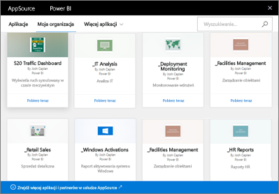

# Wprowadzenie do organizacyjnych pakietów zawartości w usłudze Power BI
> [!NOTE]
> Czy wiesz już o nowych *aplikacjach*? Aplikacje to nowy sposób dystrybucji zawartości do dużej liczby odbiorców w usłudze Power BI. Planujemy wkrótce zastąpić pakiety zawartości organizacji, a więc zalecamy używanie zamiast nich aplikacji. Dowiedz się [więcej o aplikacjach](service-install-use-apps.md).
> 
> 

Czy regularnie dystrybuujesz raporty do swojego zespołu za pośrednictwem poczty e-mail? Zamiast tego spróbuj: zapakuj swoje pulpity nawigacyjne, raporty, skoroszyty programu Excel i zestawy danych oraz opublikuj je dla swojego zespołu jako *organizacyjny pakiet zawartości*. Utworzone pakiety zawartości są łatwe do znalezienia przez Twój zespół &#151; znajdują się one w usłudze AppSource. Ponieważ są one częścią usługi Power BI, wykorzystują one wszystkie funkcje usługi Power BI, łącznie z interaktywną eksploracją danych, nowymi elementami wizualnymi, funkcją pytań i odpowiedzi, integracją z innymi źródłami danych, odświeżaniem danych itd.

Tworzenie pakietów zawartości różni się od udostępniania pulpitów nawigacyjnych lub współpracy przy nich w obszarze roboczym aplikacji. Zapoznaj się z tematem [Jak współpracować nad pulpitami nawigacyjnymi i raportami oraz je udostępniać?](service-how-to-collaborate-distribute-dashboards-reports.md), aby podjąć decyzję o najlepszym rozwiązaniu w danej sytuacji. 

W usłudze AppSource możesz przeglądać lub wyszukiwać pakiety zawartości opublikowane w całej organizacji dla grup dystrybucyjnych lub zabezpieczeń oraz dla [grup usługi Office 365, do których należysz](https://support.office.com/article/Create-a-group-in-Office-365-7124dc4c-1de9-40d4-b096-e8add19209e9). Jeśli nie jesteś członkiem określonej grupy, nie zobaczysz pakietów zawartości udostępnionych tej grupie. Wszyscy członkowie grupy mają taki sam dostęp tylko do odczytu do danych pakietu zawartości, raportów, skoroszytów i pulpitów nawigacyjnych (chyba że jest to źródło danych usług SQL Server Analysis Services (SSAS), w którym to przypadku Twoje uprawnienia są dziedziczone wraz ze źródłem danych).

Pulpity nawigacyjne, raporty i skoroszyty programu Excel są tylko do odczytu, ale możesz kopiować i używać pulpitów nawigacyjnych i raportów jako punktu wyjściowego do tworzenia własnych spersonalizowanych wersji pakietu zawartości.

> [!NOTE]
> Organizacyjne pakiety zawartości są dostępne tylko, gdy Ty i Twoi współpracownicy macie usługę [Power BI Pro](service-free-vs-pro.md).
> 
> 

## Co to jest usługa *AppSource*?
Opublikowanie organizacyjnego pakietu zawartości dodaje go do usługi AppSource.  To scentralizowane repozytorium ułatwia członkom przeglądanie i odnajdywanie publikowanych dla nich pulpitów nawigacyjnych, raportów i zestawów danych.  

* Aby wyświetlić usługę AppSource, wybierz pozycje **Pobierz dane** > **Moja organizacja** > **Pobierz**.

Przeczytaj więcej na temat [odnajdowania i otwierania organizacyjnych pakietów zawartości](service-organizational-content-pack-find-and-open.md).

## Cykl życia organizacyjnego pakietu zawartości
Dowolny użytkownik usługi Power BI Pro może tworzyć, publikować i uzyskiwać dostęp do organizacyjnych pakietów zawartości. Tylko twórca pakietu zawartości może modyfikować skoroszyt i zestaw danych, harmonogram odświeżania i usuwać go.

Cykl życia wygląda następująco:

1. W usłudze Power BI Pro Nate tworzy pakiet zawartości i publikuje go dla grupy dystrybucyjnej Marketing. Ustawienia odświeżania są dziedziczone wraz z zestawem danych i mogą zostać zmienione tylko przez Nate’a.
   
   > [!NOTE]
   > Jeśli Nate tworzy pakiet zawartości z poziomu [obszaru roboczego aplikacji usługi Power BI](service-create-distribute-apps.md), do którego on należy, to nawet jeśli opuści obszar roboczy, inne osoby w obszarze roboczym usługi Power BI mogą przejąć własność.
   > 
   > 
2. Nate wysyła wiadomość do grupy dystrybucyjnej z informacją o nowym pakiecie zawartości.
3. W usłudze Power BI Pro Jane, członek grupy dystrybucyjnej Marketing, wyszukuje i łączy się z tym pakietem zawartości w usłudze AppSource. Ma ona teraz kopię tylko do odczytu.  Wie ona, że jest on tylko do odczytu, ponieważ w lewym okienku nawigacji jest ikona udostępniania na lewo od nazwy pulpitu nawigacyjnego i nazwy raportu. A gdy wybierze ona pulpit nawigacyjny, ikoną kłódki informuje Jane, że patrzy na pakiet zawartości pulpitu nawigacyjnego. 
4. Powiedzmy, że postanawia go dostosować. Teraz ma ona własną kopię pulpitu nawigacyjnego i raportów. Jej praca nie wpływa na źródło, oryginalny pakiet zawartości, ani na innych członków grupy dystrybucyjnej. Pracuje ona teraz na swojej własnej kopii pulpitu nawigacyjnego i raportu.
5. Nate tworzy aktualizacje do pulpitu nawigacyjnego, a gdy skończy opublikuje nową wersję pakietu zawartości.
   
   * Julio, inny członek grupy dystrybucyjnej, nie dostosował oryginalnego pakietu zawartości. Nowe zmiany są automatycznie stosowane do jego wersji pakietu zawartości.  
   * Jane dostosowała pakiet zawartości. Otrzyma ona powiadomienie, że jest nowa wersja.  Może ona przejść do usługi AppSource i pobrać zaktualizowany pakiet zawartości bez utraty własnej spersonalizowanej wersji. Teraz będzie miała dwie wersje: swoją wersję spersonalizowaną i zaktualizowany pakiet zawartości.
6. Powiedzmy, że Nate zmieni ustawienia zabezpieczeń. Julio i Jane nie mają już dostępu do zawartości. Lub powiedzmy, że zostali oni usunięci z grupy dystrybucyjnej Marketing.
   
   * Julio nie dostosował oryginalnego pakietu zawartości, więc zawartość zostanie automatycznie usunięta. 
   * Jane dostosowała pakiet zawartości. Następnym razem, gdy otworzy ona pulpit nawigacyjny wszystkie kafelki z oryginalnego pakietu zawartości znikną, ale wciąż będą wyświetlane kafelki, które przypięła z innych raportów (do których nadal ma uprawnienia do używania). Skojarzone raporty i zestaw danych nie będą już dostępne (i nie są wyświetlane w jej okienku nawigacji po lewej stronie).
7. Lub Nate usuwa pakiet zawartości.
   
   * Julio nie dostosował oryginalnego pakietu zawartości, więc zawartość zostanie automatycznie usunięta. 
   * Jane dostosowała pakiet zawartości. Następnym razem, gdy otworzy ona pulpit nawigacyjny wszystkie kafelki z oryginalnego pakietu zawartości znikną, ale wciąż będą wyświetlane kafelki, które przypięła z innych raportów. Skojarzone raporty i zestaw danych nie będą już dostępne (i nie są wyświetlane w jej okienku nawigacji po lewej stronie).

## Bezpieczeństwo danych
Wszyscy członkowie grupy dystrybucyjnej mają te same uprawnienia do danych, jak twórca pakietu zawartości. Jedynym wyjątkiem są usługi SQL Server Analysis Services (SSAS) dla lokalnych zestawów danych tabelarycznych. Ponieważ raporty i pulpity nawigacyjne są łączone na żywo z lokalnym modelem usług SSAS, poświadczenia każdego oddzielnego członka grupy dystrybucyjnej są używane do ustalenia danych, do których każdy z nich może uzyskać dostęp.

## Następne kroki
* [Tworzenie i publikowanie organizacyjnego pakietu zawartości](service-organizational-content-pack-create-and-publish.md)
* [Tworzenie i rozpowszechnianie aplikacji w usłudze Power BI](service-create-distribute-apps.md) 
* [Power BI — podstawowe pojęcia](service-basic-concepts.md)
* Masz więcej pytań? [Odwiedź społeczność usługi Power BI](http://community.powerbi.com/)

