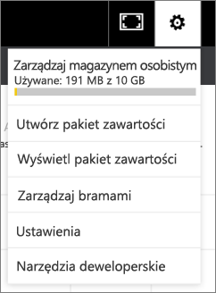

# Aktualizowanie i usuwanie organizacyjnych pakietów zawartości oraz zarządzanie nimi
> [!NOTE]
> Czy wiesz już o nowych *aplikacjach*? Aplikacje to nowy sposób dystrybucji zawartości do dużej liczby odbiorców w usłudze Power BI. Planujemy wkrótce zastąpić pakiety zawartości organizacji, a więc zalecamy używanie zamiast nich aplikacji. Dowiedz się [więcej o aplikacjach](service-install-use-apps.md).
> 
> 

Możesz pakować oraz udostępniać współpracownikom pulpity nawigacyjne, raporty, skoroszyty programu Excel i zestawy danych w formie [organizacyjnych pakietów zawartości](service-organizational-content-pack-introduction.md). Współpracownicy mogą ich używać w otrzymanej postaci lub tworzyć własne kopie.

Tworzenie pakietów zawartości różni się od udostępniania pulpitów nawigacyjnych lub współpracy przy nich w grupie. Zapoznaj się z tematem [Jak współpracować nad pulpitami nawigacyjnymi i raportami oraz je udostępniać?](service-how-to-collaborate-distribute-dashboards-reports.md), aby podjąć decyzję o najlepszym rozwiązaniu w danej sytuacji.

Niektóre zadania dotyczące organizacyjnego pakietu zawartości możesz wykonać tylko, jeśli jesteś twórcą tego pakietu zawartości:

* Ponowne publikowanie.
* Ograniczanie lub rozszerzanie dostępu do pakietu zawartości.
* Ustawianie i zmiana zaplanowanego odświeżania.
* Usuwanie pakietu zawartości.

## Modyfikowanie i ponowne publikowanie organizacyjnego pakietu zawartości
W przypadku wprowadzenia zmian w pulpicie nawigacyjnym, raporcie lub skoroszycie programu Excel oryginalnego pakietu zawartości usługa Power BI wyświetli monit o ponownie opublikowanie. Ponadto jako twórca pakietu zawartości możesz zaktualizować opcje wybrane w oknie Tworzenie pakietu zawartości podczas tworzenia oryginalnego pakietu zawartości. 

## Ponowne publikowanie z nową zawartością
W przypadku dokonania i zapisania zmiany pulpitu nawigacyjnego, który został dodany do pakietu zawartości, usługa Power BI przypomina, aby go zaktualizować i umożliwić innym osobom wyświetlenie zmian. Jeśli na przykład numer przypniesz nowy kafelek lub po prostu zmienisz nazwę pulpitu nawigacyjnego.

1. Wybierz pozycję **Wyświetl pakiety zawartości** w komunikacie.
   
   
2. Lub wybierz ikonę koła zębatego w prawym górnym rogu  i wybierz pozycję **Wyświetl pakiet zawartości**.
   
   
   
   Zwróć uwagę na ikonę ostrzeżenia .  Informuje ona o tym, że pakiet zawartości został zmodyfikowany i nie jest już zgodny z opublikowaną wersją.
3. Wybierz pozycję **Edytuj**.  
4. Wprowadź niezbędne zmiany w oknie **Aktualizowanie pakietu zawartości** i wybierz pozycję **Aktualizuj**. Zostanie wyświetlony komunikat **Powodzenie**.
   
   * W przypadku członków grupy, którzy nie dostosowali pakietu zawartości, aktualizacja zostanie zastosowana automatycznie.
   * Członkowie grupy, którzy dostosowali pakiet zawartości, otrzymają powiadomienie o dostępności nowej wersji.  Mogą oni przejść do usługi AppSource i pobrać zaktualizowany pakiet zawartości bez utraty posiadanej spersonalizowanej wersji.  Będą mieć teraz 2 wersje: wersję spersonalizowaną i zaktualizowany pakiet zawartości.  W wersji spersonalizowanej nie będą już dostępne żadne kafelki z oryginalnego pakietu zawartości.  Nadal wyświetlane będą jednak kafelki przypięte z innych raportów. Jeśli jednak właściciel pakietu zawartości usunie zestaw danych, na którym opiera się pakiet zawartości, cały raport zostanie usunięty.  

## Aktualizowanie odbiorców: rozszerzanie lub ograniczanie dostępu
Kolejną operacją modyfikowania dostępną dla twórców pakietów zawartości jest rozszerzanie i ograniczanie dostępu do pakietu zawartości.  Załóżmy, że po opublikowaniu pakietu zawartości do szerokiej grupy odbiorców decydujesz się ograniczyć dostęp do niego do mniejszej grupy.  

1. Wybierz ikonę koła zębatego  i pozycję **Wyświetl pakiety zawartości**.
2. Wybierz pozycję **Edytuj**. 
3. Wprowadź niezbędne zmiany w oknie **Aktualizowanie pakietu zawartości** i wybierz pozycję **Aktualizuj**. Na przykład usuń oryginalną grupę dystrybucyjną w polu **Określone grupy** i zastąp ją inną grupą dystrybucyjną (o mniejszej liczbie członków).
   
   Zostanie wyświetlony komunikat Powodzenie.
   
   W przypadku współpracowników, którzy nie są częścią nowego aliasu:
   
   * Członkowie grupy, którzy nie dostosowali pakietu zawartości, nie będą mieć już dostępu do pulpitu nawigacyjnego oraz raportów skojarzonych z tym pakietem zawartości, a pakiet zawartości nie będzie wyświetlany w okienku nawigacji.
   * Członkowie grupy, którzy dostosowali pakiet zawartości, przy następnym otwarciu dostosowanego pulpitu nawigacyjnego nie zobaczą już żadnego kafelka z oryginalnego pakietu zawartości.  Nadal wyświetlane będą jednak kafelki przypięte z innych raportów. Raporty i zestaw danych oryginalnego pakietu zawartości nie będą już dostępne, a pakiet zawartości nie będzie wyświetlany w okienku nawigacji.   

## Odświeżanie organizacyjnego pakietu zawartości
Twórca pakietu zawartości może [zaplanować odświeżanie zestawów danych](refresh-data.md).  Podczas tworzenia i przekazywania pakietu zawartości harmonogram odświeżania jest przekazywany razem z zestawami danych. W przypadku zmiany harmonogramu odświeżania należy ponownie opublikować pakiet zawartości (zobacz powyżej).

## Usuwanie organizacyjnego pakietu zawartości z usługi AppSource
Tylko twórca pakietu zawartości może go usunąć z usługi AppSource. Jeśli utworzono organizacyjny pakiet zawartości w obszarze roboczym aplikacji, a następnie zdecydowano o usunięciu tego obszaru, należy najpierw usunąć pakiet zawartości. Usunięcie obszaru roboczego bez uprzedniego usunięcia pakietu zawartości spowoduje całkowitą utratę dostępu do tych pakietów zawartości i konieczność skontaktowania się z pomocą techniczną firmy Microsoft, aby uzyskać pomoc. 

> [!TIP]
> Można [usunąć połączenie z pakietem zawartości](service-organizational-content-pack-disconnect.md), który został utworzony przez innego użytkownika. Nie spowoduje to jednak usunięcia pakietu zawartości z usługi AppSource.
> 
> 

1. Aby usunąć pakiet zawartości z usługi AppSource, przejdź do obszaru roboczego aplikacji, w której utworzono pakiet zawartości, wybierz ikonę koła zębatego  i pozycję **Wyświetl pakiety zawartości**.
2. Wybierz pozycję **Usuwanie \> Usuń**. 
   
   * W przypadku członków grupy, którzy nie dostosowali pakietu zawartości, pulpit nawigacyjny i raporty skojarzone z tym pakietem zawartości zostaną automatycznie usunięte. Nie będą one już dostępne, a pakiet zawartości nie będzie wyświetlany w okienku nawigacji.
   * Członkowie grupy, którzy dostosowali pakiet zawartości, przy następnym otwarciu dostosowanego pulpitu nawigacyjnego nie zobaczą już żadnego kafelka z oryginalnego pakietu zawartości.  Nadal wyświetlane będą jednak kafelki przypięte z innych raportów. Raporty i zestaw danych oryginalnego pakietu zawartości nie będą już dostępne, a pakiet zawartości nie będzie wyświetlany w okienku nawigacji.   

## Następne kroki
* [Wprowadzenie do pakietów zawartości organizacji](service-organizational-content-pack-introduction.md)
* [Tworzenie i rozpowszechnianie aplikacji w usłudze Power BI](service-create-distribute-apps.md) 
* Masz więcej pytań? [Odwiedź społeczność usługi Power BI](http://community.powerbi.com/)

