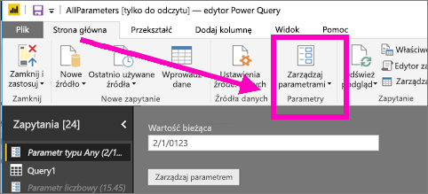
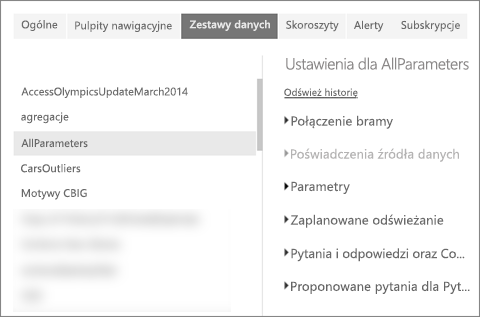
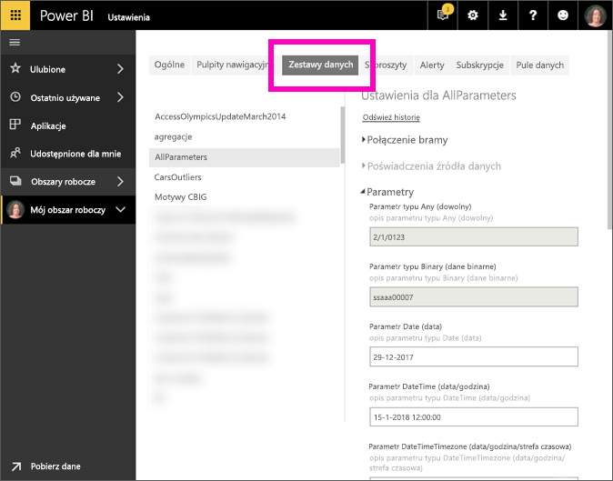

# Edytowanie ustawień parametrów w usłudze Power BI
Twórcy raportów dodają parametry zapytania do raportów w programie Power BI Desktop. Parametry pozwalają na tworzenie części raportów w zależności od co najmniej jednej *wartości* parametru. Na przykład twórca raportu może utworzyć parametr, który ogranicza możliwość użycia danych do pojedynczego kraju/regionu, lub parametr, który definiuje dopuszczalne formaty pól, takie jak daty, godzina i tekst.

## Przeglądanie i edytowanie parametrów w usłudze Power BI

Twórca raportu definiuje parametry w programie Desktop. Gdy [opublikujesz raport w usłudze Power BI](desktop-upload-desktop-files.md), ustawienia parametrów i wybrane opcje zostaną opublikowane razem z nim. Niektóre ustawienia parametrów można przeglądać i edytować w usłudze Power BI — nie parametry, które ograniczają dostępne dane, ale parametry, które zdefiniują i opisują dopuszczalne wartości.

1. W usłudze Power BI wybierz ikonę koła zębatego , aby otworzyć obszar **Ustawienia**.

2. Wybierz kartę **Zestawy danych** i wyróżnij zestaw danych na liście. 
    
    

3. Rozwiń pozycję **Parametry**.  Jeśli wybrany zestaw danych nie ma parametrów, zobaczysz komunikat z linkiem do sekcji Dowiedz się więcej dotyczącej parametrów zapytania. Ale jeśli zestaw danych ma parametry, rozwinięcie nagłówka **Parametry** spowoduje wyświetlenie tych parametrów. 

    

    Przejrzyj ustawienia parametrów i w razie potrzeby wprowadź zmiany. Szarych pól nie można edytować. 

## Następne kroki
Doraźnym sposobem dodawania prostych parametrów jest [modyfikowanie adresu URL](service-url-filters.md).