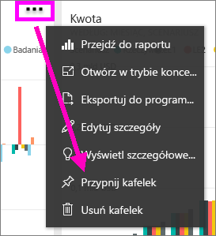
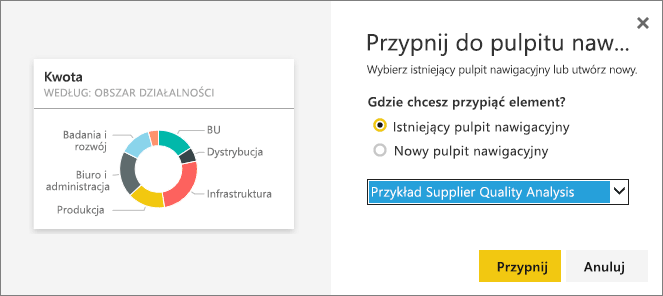
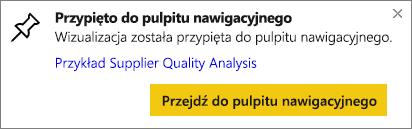

# Przypinanie kafelka z jednego pulpitu nawigacyjnego do innego
Jednym sposobem dodania nowego [kafelka pulpitu nawigacyjnego](service-dashboard-tiles.md) jest skopiowanie go z innego pulpitu nawigacyjnego. Każdy z tych kafelków, po kliknięciu, jest linkiem z powrotem do miejsca, gdzie został utworzony — zarówno w funkcji pytań i odpowiedzi, jak i raporcie. 

> [!NOTE]
> Nie można przypiąć kafelka z udostępnionych pulpitów nawigacyjnych.

## Przypinanie kafelka do innego pulpitu nawigacyjnego
1. [Pobierz dane](service-get-data.md). W tym przykładzie jest używany [IT Spend Analysis sample](sample-it-spend.md) (Przykład analizy wydatków IT).
2. Otwórz [pulpit nawigacyjny](service-dashboards.md).
3. Ustaw kursor myszy na kafelku, który chcesz przypiąć, wybierz wielokropek (...), a następnie wybierz pozycję **Przypnij kafelek**.  
   
   
4. Przypnij kafelek do istniejącego lub nowego pulpitu nawigacyjnego. 
   
   * **Istniejący pulpit nawigacyjny**: z listy rozwijanej wybierz nazwę pulpitu nawigacyjnego.
   * **Nowy pulpit nawigacyjny**: wpisz nazwę nowego pulpitu nawigacyjnego.
   
   
5. Wybierz pozycję **Przypnij**.
   Komunikat o powodzeniu (w prawym górnym rogu) informuje o tym, że wizualizacja została dodana do wybranego pulpitu nawigacyjnego jako kafelek.
   
   
6. Wybierz pozycję **Przejdź do pulpitu nawigacyjnego**, aby wyświetlić nowy kafelek. W tym miejscu możesz [zmienić nazwę, rozmiar, link i przenieść](service-dashboard-edit-tile.md) przypiętą wizualizację.

## Następne kroki
[Kafelki w usłudze Power BI](service-dashboard-tiles.md)  
[Pulpity nawigacyjne w usłudze Power BI](service-dashboards.md)  
Masz więcej pytań? [Odwiedź społeczność usługi Power BI](http://community.powerbi.com/)

