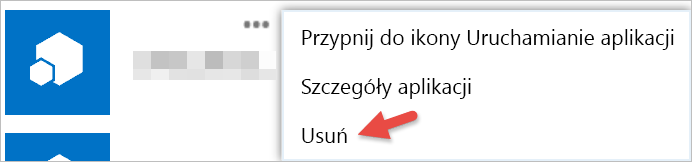

# Rozpoczynanie pracy z aplikacjami innych producentów
Przy użyciu usługi Power BI możesz skorzystać z aplikacji utworzonej przez osobę lub firmę inną niż Microsoft. Na przykład możesz użyć aplikacji innej firmy, która integruje kafelki usługi Power BI z niestandardową aplikacją internetową. Jeśli korzystasz z aplikacji innych firm, zostanie wyświetlona prośba o udzielenie tej aplikacji pewnych uprawnień do zasobów i Twojego konta usługi Power BI. Ważne jest, aby udzielać uprawnień tylko tym aplikacjom, które znasz i którym ufasz. W dowolnym momencie możesz odwołać uprawnienia aplikacji. Zobacz [Odwoływanie uprawnień aplikacji innej firmy](#revoke).

Poniżej przedstawiono typy dostępu, których może zażądać aplikacja.

## Uprawnienia aplikacji usługi Power BI
* **Wyświetlanie wszystkich pulpitów nawigacyjnych**
  
  * To uprawnienie umożliwia aplikacji wyświetlanie wszystkich pulpitów nawigacyjnych, do których masz dostęp. Obejmuje to pulpity nawigacyjne, które należą do Ciebie, zostały uzyskane z pakietów zawartości i zostały Ci udostępnione oraz znajdują się w grupach, do których należysz. Aplikacja nie może wprowadzać żadnych zmian w pulpicie nawigacyjnym. To uprawnienie może być, między innymi, używane przez aplikację do osadzania Twojej zawartości pulpitu nawigacyjnego w jej środowiskach.
* **Wyświetlanie wszystkich raportów**
  
  * To uprawnienie umożliwia aplikacji wyświetlanie wszystkich raportów, do których masz dostęp. Obejmuje to raporty, które należą do Ciebie, zostały uzyskane z pakietów zawartości i znajdują się w grupach, do których należysz. Wyświetlanie raportu oznacza, że aplikacja może również widzieć zawarte w nim dane. Aplikacja nie może wprowadzać żadnych zmian w samych raportach. To uprawnienie może być, między innymi, używane przez aplikację do osadzania Twojej zawartości raportu w jej środowiskach.
* **Wyświetlanie wszystkich zestawów danych**
  
  * To uprawnienie umożliwia aplikacji wyświetlanie wszystkich zestawów danych, do których masz dostęp. Obejmuje to zestawy danych, które należą do Ciebie, zostały uzyskane z pakietów zawartości i znajdują się w grupach, do których należysz. Aplikacja może zobaczyć nazwy wszystkich zestawów danych oraz ich struktury, a w tym nazwy tabel i kolumn. To uprawnienie nadaje prawo do odczytu danych w zestawie danych. Uprawnienie nie nadaje aplikacji prawa do dodawania lub zmieniania zestawu danych.
* **Odczytywanie i zapisywanie wszystkich zestawów danych**
  
  * To uprawnienie umożliwia aplikacji wyświetlanie wszystkich zestawów danych, do których masz dostęp. Obejmuje to zestawy danych, które należą do Ciebie, zostały uzyskane z pakietów zawartości i znajdują się w grupach, do których należysz. Aplikacja może zobaczyć nazwy wszystkich zestawów danych oraz ich struktury, a w tym nazwy tabel i kolumn. To uprawnienie daje prawo do odczytu i zapisu danych w zestawie danych. Aplikacja może również tworzyć nowe zestawy danych lub wprowadzać modyfikacje do istniejących. Jest to często używane przez aplikację do przesyłania danych bezpośrednio do usługi Power BI.
* **Wyświetlanie grup użytkowników**
  
  * To uprawnienie umożliwia aplikacji wyświetlanie wszystkich grup, do których należysz. Może ono użyć tego uprawnienia oraz niektórych innych wymienionych uprawnień, aby wyświetlić lub zaktualizować zawartość dla określonej grupy na liście. Aplikacja nie może wprowadzać żadnych zmian w samej grupie.

<a name="revoke"/>

## Odwoływanie uprawnień aplikacji innej firmy
Uprawnienia aplikacji innej firmy możesz wycofać, przechodząc do witryny Moje aplikacje usługi Office 365.

W witrynie **Moje aplikacje usługi Office 365** możesz w następujący sposób odwołać uprawnienia innej firmy:

1. Przejdź do [witryny Moje aplikacje usługi Office 365](https://portal.office.com/myapps).
2. Na stronie **Moje aplikacje** odszukaj aplikację innej firmy.
3. Umieść kursor nad kafelkiem aplikacji, kliknij przycisk **(...)**, a następnie kliknij przycisk **Usuń**.
   
   

