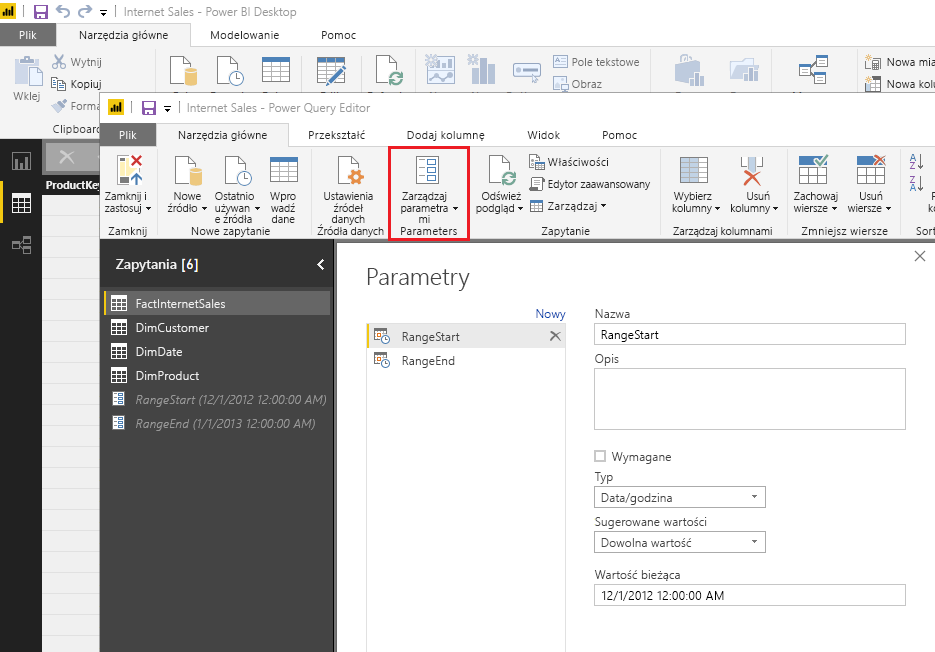
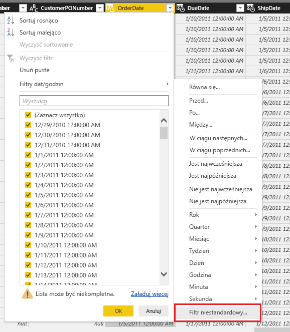
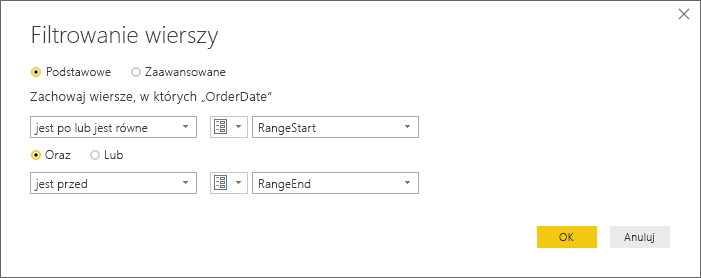
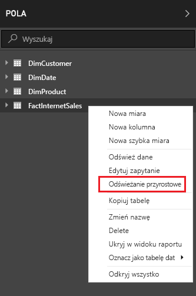
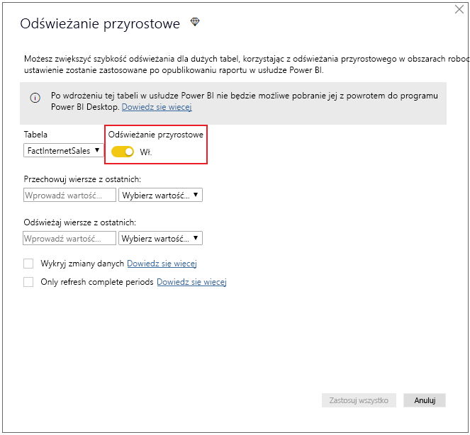
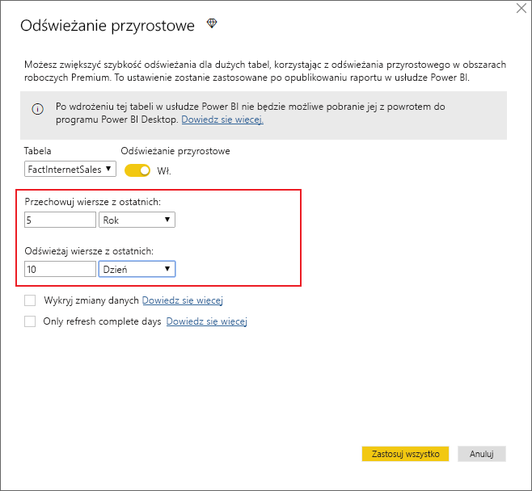
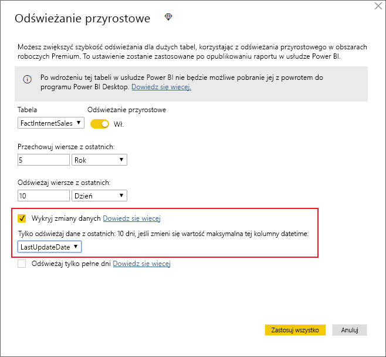
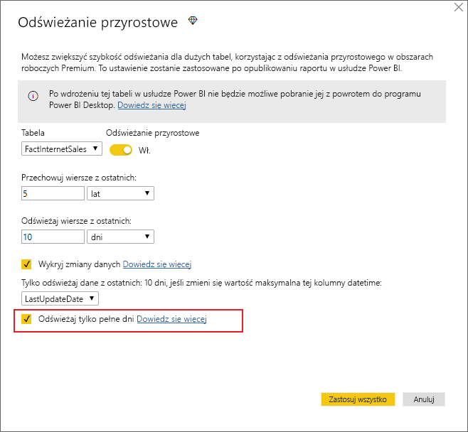
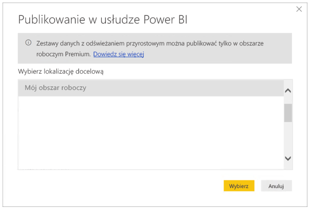

# <a name="incremental-refresh-in-power-bi-premium"></a>Odświeżanie przyrostowe w usłudze Power BI Premium

Odświeżanie przyrostowe umożliwia korzystanie z bardzo dużych zestawów danych w usłudze Power BI Premium, co przynosi następujące korzyści:

- **Odświeżanie jest szybsze** i obejmuje tylko zmienione dane. Na przykład można odświeżyć tylko dane z ostatnich pięciu dni, znajdujące się w zestawie danych obejmującym okres 10 lat.

- **Odświeżanie danych jest bardziej niezawodne.** Nie trzeba utrzymywać długotrwałych połączeń z nietrwałymi systemami źródłowymi.

- **Zużycie zasobów jest mniejsze.** Mniejsza ilość danych do odświeżenia ogranicza ogólne zużycie pamięci i innych zasobów.

## <a name="how-to-use-incremental-refresh"></a>Jak używać odświeżania przyrostowego

Zasady odświeżania przyrostowego są definiowane w programie Power BI Desktop i stosowane po opublikowaniu danych w usłudze Power BI.

Rozpoczniemy od włączenia odświeżania przyrostowego w funkcjach w wersji zapoznawczej.


### <a name="filter-large-datasets-in-power-bi-desktop"></a>Filtrowanie dużych zestawów danych w programie Power BI Desktop

Duże zestawy danych, które mogą zawierać miliardy wierszy, mogą nie mieścić się w programie Power BI Desktop, ponieważ zwykle jest on ograniczony zasobami dostępnymi na komputerze użytkownika. W związku z tym takie zestawy danych są często filtrowane przed ich zaimportowaniem do programu Power BI Desktop. Dzieje się tak niezależnie od tego, czy jest używane odświeżanie przyrostowe.

#### <a name="rangestart-and-rangeend-parameters"></a>Parametry RangeStart i RangeEnd

Aby użyć odświeżania przyrostowego w usłudze Power BI, należy odfiltrować dane przy użyciu parametrów daty/godziny dodatku Power Query korzystających z zarezerwowanych nazw **RangeStart** i **RangeEnd**, w których jest uwzględniana wielkość liter.

Po opublikowaniu danych wartości parametrów są automatycznie zastępowane przez usługę Power BI. Nie trzeba ich konfigurować w ustawieniach w usłudze.

Ważne jest, aby filtr został wypchnięty do systemu źródłowego, gdy zapytania będą przesyłane do operacji odświeżania. Wypchnięcie filtru w dół oznacza, że źródło danych powinno obsługiwać „składanie zapytań”. Większość źródeł danych, które obsługują zapytania SQL, obsługuje składanie zapytań. Ta funkcja nie jest zwykle obsługiwana w przypadku źródeł danych, takich jak pliki proste, obiekty blob, Internet i źródła danych OData. Biorąc pod uwagę różne poziomy obsługi składania zapytań dla poszczególnych źródeł danych, zaleca się sprawdzenie, czy logika filtru została uwzględniona w zapytaniach źródłowych. W przypadkach, w których filtr nie jest obsługiwany przez zaplecze bazy danych, nie można go wypchnąć w dół. W takich przypadkach aparat mashupów przeprowadza kompensację i stosuje filtr lokalnie, co może wymagać pobrania pełnego zestawu danych ze źródła danych. Może to spowodować znaczne spowolnienie odświeżania przyrostowego, a dla procesu może zabraknąć zasobów w usłudze Power BI lub w lokalnej bramie danych, jeśli jest używana.

Filtr zostanie użyty do partycjonowania danych na zakresy w usłudze Power BI. Nie jest on przeznaczony do obsługi aktualizacji filtrowanej kolumny dat. Aktualizacja będzie interpretowana jako wstawienie i usunięcie (nie aktualizacja). Usunięcie w zakresie historycznym, a nie zakresie przyrostowym, nie zostanie zidentyfikowane. Może to powodować niepowodzenia odświeżania danych wynikłych z konfliktów kluczy partycji.

W Edytorze Power Query wybierz pozycję **Zarządzaj parametrami**, aby zdefiniować parametry przy użyciu wartości domyślnych.



Po zdefiniowaniu parametrów możesz zastosować filtr, wybierając opcję menu **Filtr niestandardowy** dla kolumny.



Odfiltruj wiersze, w których wartość kolumny *jest po lub jest równa* wartości parametru **RangeStart** i *jest przed* wartością parametru **RangeEnd**.



> [!TIP]
> Dane parametrów muszą być typu Data/godzina, ale można je przekonwertować zgodnie z wymaganiami źródła danych. Na przykład następująca funkcja dodatku Power Query konwertuje wartość daty/godziny na klucz zastępczy typu całkowitego w postaci *rrrrmmdd*, typowy dla magazynów danych. Funkcja może być wywoływana w kroku filtru.
>
> `(x as datetime) => Date.Year(x)*10000 + Date.Month(x)*100 + Date.Day(x)`

Wybierz pozycję **Zamknij i zastosuj** w Edytorze Power Query. W programie Power BI Desktop powinien zostać zwrócony podzestaw danych.

### <a name="define-the-refresh-policy"></a>Definiowanie zasad odświeżania

Odświeżanie przyrostowe jest dostępne w menu kontekstowym tabel z wyjątkiem modeli połączenia na żywo.



#### <a name="incremental-refresh-dialog"></a>Okno dialogowe odświeżania przyrostowego

Zostanie wyświetlone okno dialogowe odświeżania przyrostowego. Okno dialogowe możesz włączyć za pomocą przełącznika.



> [!NOTE]
> Jeśli wyrażenie dotyczące tabeli, użyte w dodatku Power Query, nie odwołuje się do parametrów z zastrzeżonymi nazwami, przełącznik jest wyłączony.

Tekst nagłówka zawiera następujące informacje:

- Odświeżanie przyrostowe jest obsługiwane tylko w obszarach roboczych w pojemności Premium. Zasady odświeżania są definiowane w programie Power BI Desktop i stosowane w operacjach odświeżania w usłudze.

- Jeśli z usługi Power BI pobierzesz plik PBIX zawierający zasady odświeżania przyrostowego, nie zostanie on otwarty w programie Power BI Desktop. Możliwość pobierania tego pliku zostanie wkrótce zablokowana. Być może przywrócimy ją w przyszłości, ale należy pamiętać, że ze względu na rozmiary tych zestawów danych ich pobieranie i otwieranie na typowym komputerze PC może okazać się niepraktyczne.

#### <a name="refresh-ranges"></a>Odświeżanie zakresów

W poniższym przykładzie zdefiniowano zasady odświeżania umożliwiające przechowywanie danych przez pełne pięć lat kalendarzowych oraz danych z bieżącego roku aż do bieżącej daty, a także odświeżanie przyrostowe obejmujące dane z 10 dni. Pierwsza operacja odświeżania załaduje dane historyczne. Kolejne odświeżania będą przyrostowe i (jeśli zostaną zaplanowane do uruchamiania codziennie) będą obejmować następujące operacje.

- Dodanie danych z nowego dnia.

- Odświeżenie danych z 10 dni poprzedzających bieżącą datę.

- Usunięcie danych starszych niż pięć lat. Na przykład jeśli bieżąca data to 1 stycznia 2019 r., zostają usunięte dane z 2013 roku.

Pierwsze odświeżanie danych w usłudze Power BI może trwać dłużej ze względu na konieczność zaimportowania danych z pełnych pięciu lat kalendarzowych. Kolejne operacje odświeżania mogą zajmować tylko niewielką część tego czasu.



**Czasami wystarczy tylko zdefiniować te zakresy, po czym można przejść bezpośrednio do kroku publikowania opisanego poniżej. Listy rozwijane umożliwiają korzystanie z zaawansowanych funkcji.**

### <a name="advanced-policy-options"></a>Zaawansowane opcje zasad

#### <a name="detect-data-changes"></a>Wykryj zmiany danych

Odświeżanie przyrostowe danych z 10 dni jest oczywiście o wiele bardziej efektywne niż pełne odświeżanie danych z pięciu lat. Możemy jednak i tak usprawnić ten proces. Zaznaczenie pola wyboru **Wykryj zmiany danych** pozwala wybrać kolumnę daty/godziny używaną do identyfikacji i odświeżać tylko te dni, w których dane zmieniły się. Taka kolumna musi istnieć w systemie źródłowym. Działanie to wykonuje się zazwyczaj na potrzeby inspekcji. **Nie powinna być to kolumna użyta do partycjonowania danych przy użyciu parametrów RangeStart/RangeEnd.** Dla każdego okresu w zakresie przyrostowym jest wyznaczana maksymalna wartość w tej kolumnie. Jeśli ta wartość nie zmieniła się od czasu ostatniej operacji odświeżania, nie trzeba odświeżać okresu. W tym przykładzie można dodatkowo ograniczyć liczbę dni odświeżanych przyrostowo — prawdopodobnie z 10 do 2.



> [!TIP]
> Bieżący projekt wymaga, aby dane z kolumny służącej do wykrywania zmian były utrwalone i buforowane w pamięci. Aby zmniejszyć kardynalność i zużycie pamięci, warto skorzystać z jednej z poniższych metod.
>
> Podczas odświeżania utrwalaj tylko maksymalną wartość tej kolumny, na przykład przy użyciu funkcji dodatku Power Query.
>
> Zmniejsz dokładność do akceptowalnego poziomu, zgodnego z wymaganiami częstotliwości odświeżania.
>
> W przyszłości zamierzamy udostępnić możliwość definiowania zapytań niestandardowych umożliwiających wykrywanie zmian danych. Pozwoli to całkowicie wyeliminować konieczność utrwalania wartości kolumny.

#### <a name="only-refresh-complete-periods"></a>Odświeżanie tylko pełnych okresów

Załóżmy, że odświeżanie danych odbywa się codziennie o godzinie 4:00. Prawdopodobnie nie chcesz uwzględniać danych, które pojawiły się w systemie źródłowym w ciągu tych 4 godzin. Niektóre metryki biznesowe — takie jak dzienna liczba baryłek w przemyśle naftowo-gazowym — są nieprzydatne, jeśli obejmują tylko część doby.

Innym przykładem jest odświeżanie danych z systemu finansowego, w którym dane z poprzedniego miesiąca są zatwierdzane 12 dnia bieżącego miesiąca. Możesz ustawić zakres przyrostowy na jeden miesiąc i zaplanować uruchamianie odświeżania na 12 dzień miesiąca. Po zaznaczeniu tej opcji na przykład odświeżanie danych ze stycznia będzie się odbywać 12 lutego.



> [!NOTE]
> Operacje odświeżania w usłudze korzystają z czasu UTC. Może to mieć wpływ na datę wprowadzenia i pełne okresy. Planujemy dodać możliwość zastępowania daty wprowadzenia operacji odświeżania.

## <a name="publish-to-the-service"></a>Publikowanie w usłudze

Ponieważ odświeżanie przyrostowe jest dostępne tylko w wersji Premium, okno dialogowe publikowania umożliwia tylko wybór obszaru roboczego w ramach pojemności Premium.



Możesz teraz odświeżyć model. Pierwsze odświeżanie może trwać dłużej ze względu na konieczność zaimportowania danych historycznych. Kolejne operacje będą znacznie szybsze dzięki odświeżaniu przyrostowemu.

## <a name="query-timeouts"></a>Limity czasu zapytań

Jak wyjaśniono w artykule [Rozwiązywanie problemów ze scenariuszami odświeżania](https://docs.microsoft.com/power-bi/refresh-troubleshooting-refresh-scenarios), operacje odświeżania w usłudze Power BI podlegają limitom czasu. Zapytania mogą również być ograniczane domyślnym limitem czasu źródła danych. Większość źródeł relacyjnych zezwala na zastępowanie limitów czasu w wyrażeniu M. Na przykład poniższe wyrażenie korzysta z [funkcji dostępu do danych programu SQL Server](https://msdn.microsoft.com/query-bi/m/sql-database), umożliwiającej ustawienie dwugodzinnego limitu czasu. W każdym okresie zdefiniowanym za pomocą zakresów zasad jest przesyłane zapytanie, które uwzględnia ustawienie limitu czasu polecenia.

```
let
    Source = Sql.Database("myserver.database.windows.net", "AdventureWorks", [CommandTimeout=#duration(0, 2, 0, 0)]),
    dbo_Fact = Source{[Schema="dbo",Item="FactInternetSales"]}[Data],
    #"Filtered Rows" = Table.SelectRows(dbo_Fact, each [OrderDate] >= RangeStart and [OrderDate] < RangeEnd)
in
    #"Filtered Rows"
```
