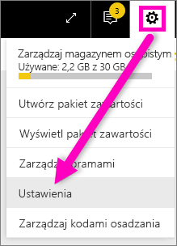

# Włączanie wersji zapoznawczej funkcji usługi Power BI
## Co to są *funkcje w wersji zapoznawczej*?
W miarę wprowadzania ulepszeń do usługi Power BI udostępnimy nową funkcjonalność w postaci *funkcji w wersji zapoznawczej*. Funkcje w wersji zapoznawczej można włączać i wyłączać, co umożliwia ich wypróbowanie.

> [!TIP]
> Masz pytania lub opinię? [Odwiedź forum społeczności usługi Power BI](http://community.powerbi.com/t5/Navigation-Preview-Forum/bd-p/NavigationPreview).
> 
> 

## Obecnie dostępne wersje zapoznawcze
**Mapy ArcGIS dla usługi Power BI (wersja zapoznawcza)** Kombinacja map ArcGIS i usługi Power BI przenosi tworzenie map na zupełnie nowy poziom wykraczający poza prezentację punktów na mapie.
[Zapoznaj się z mapami ArcGIS firmy Esri w usłudze Power BI i programie Power BI Desktop](power-bi-visualization-arcgis.md).

## Włączanie (i wyłączanie) wersji zapoznawczej funkcji ArcGIS
1. Otwórz menu Ustawienia, wybierając ikonę koła zębatego w prawym górnym rogu ekranu usługi Power BI i wybierając opcję **Ustawienia**.
   
   .
2. Wybierz kartę **Ogólne** i wybierz pozycję **Funkcje w wersji zapoznawczej**.
   
   
3. Wybierz przycisk radiowy **Włącz**, aby wypróbować nowe środowisko. Kliknij przycisk **Zastosuj**.
4. Aby wyłączyć funkcje w wersji zapoznawczej, wykonaj powyższe kroki 1 i 2, natomiast w kroku 3 wybierz pozycję **Wyłącz** > **Zastosuj**.

## Następne kroki
[Nowe środowisko nawigacji usługi Power BI](service-the-new-power-bi-experience.md)

Masz pytania lub opinię? [Odwiedź forum społeczności usługi Power BI](http://community.powerbi.com/t5/Navigation-Preview-Forum/bd-p/NavigationPreview).

